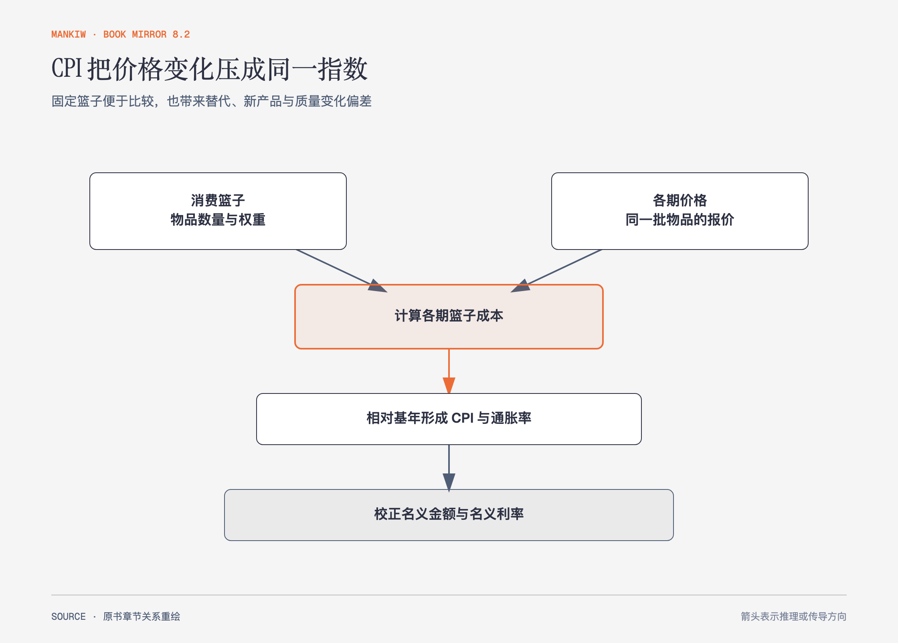

# 《曼昆〈经济学原理〉》第23章｜生活费用的衡量 · 原书回顾与主题讲解（书镜 V8.2）

消费物价指数试图回答：维持代表性生活方式的成本比过去提高了多少。固定篮子带来可比性，也带来替代、新产品和质量变化偏差。

**本章要回答：** CPI 怎样编制，为什么名义金额、实际购买力与实际利率必须分开？

图23-1｜依据本章 CPI 编制步骤重绘。箭头表示从代表性篮子到指数，再用于校正名义金额；每一步都可能引入测量边界。

## 一、原书回顾：作者怎样展开

### 消费物价指数

统计机构先确定代表性消费篮子，收集各期价格，计算篮子成本，选择基年并形成指数，再计算百分比变化作为通货膨胀率。不同支出项目按家庭预算中的重要性加权。

CPI 有三类主要问题。替代倾向意味着消费者会从涨价较多的物品转向替代品，固定篮子高估维持效用的成本；新产品扩大选择，相当于降低达到同等生活水平所需支出，却难及时进入篮子；无法衡量的质量提高会把一部分价值增长误记为纯涨价。GDP 平减指数覆盖国内生产的全部最终品，CPI 更贴近消费者购买并包含进口品，两者权重更新方式也不同；**生产物价指数**则衡量企业购买的一篮子物品与劳务成本。

### 根据通货膨胀的影响校正经济变量

物价指数可以把不同时期美元换成可比购买力。合同、税制和社会保障按指数调整称为指数化。名义利率表示账户余额增长，实际利率约等于名义利率减通货膨胀率，衡量购买力增长。预期与实际通胀不同还会在借贷双方之间重新分配财富。

### 结论

价格指数是有用近似，不是个人生活成本的精确读数。不同家庭消费篮子不同，官方平均指数与个人体验可能偏离。

## 二、主题讲解：同一笔加薪要先过价格指数这一关

### 名义上涨不等于购买力提高

工资上涨5%，生活成本上涨4%，实际工资大约只提高1%。若只比较账户数字，会把普遍涨价误当成收入改善。

### 固定篮子会忽略人们换买法

牛肉涨价、鸡肉不变时，消费者可能少买牛肉。固定篮子继续假设原数量，会高估维持实际满足的成本；但替代也可能意味着被迫放弃偏好，不能简单说消费者没有受损。

### 个人指数取决于自己的权重

租房者与自有住房者、老人和年轻人的支出结构不同，同一物价变化影响不同。官方 CPI 服务总体合同和宏观比较，个人预算需要自己的篮子。

## 检验理解：存款利息为何越存越穷

存款名义利率3%，同期通胀率5%。账户余额增加，实际购买力怎样变化？

核对思路：实际利率约为-2%，购买力下降。名义正收益不能证明实际变富。

## 来源、范围与阅读连接

原书范围：下册 PDF 119–138页，合并 PDF 512–531页；CPI步骤、测量问题、GDP平减指数、指数化与实际利率均保留。百分比为讲解用假设。源文件 SHA-256：`8cd3def98b1ea31ca9e0c248dd2199004f093fc86a3472b3b33b6e6bc0e66692`。下一篇研究长期生产率、储蓄投资和失业。
