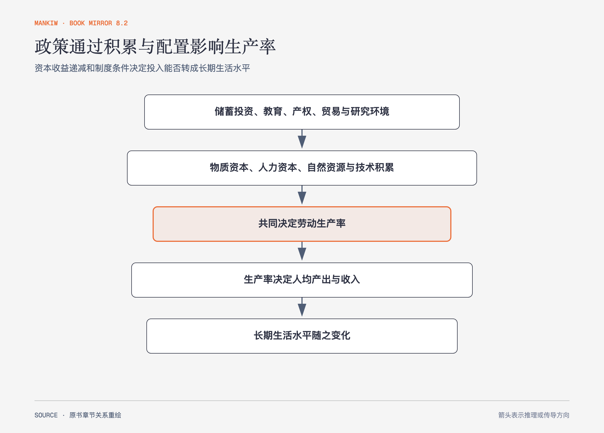

# 《曼昆〈经济学原理〉》第24章｜生产与增长 · 原书回顾与主题讲解（书镜 V8.2）

长期生活水平差异最终要回到生产率：同样一小时劳动能生产多少物品与劳务。资本、人力资本、自然资源和技术知识共同决定这个能力。

**本章要回答：** 为什么有些国家增长更快，哪些政策能提高生产率，又有哪些收益递减与制度边界？

图24-1｜依据本章生产率决定因素重绘。政策环境先影响资本、知识与技术的积累和配置，再经生产率传到人均产出与生活水平。

## 一、原书回顾：作者怎样展开

### 世界各国的经济增长

各国人均实际 GDP 与增长率差异巨大，富国地位并不永久固定。微小增长率差异经复利会积累成巨大生活水平差距；70规则用70除以增长率近似翻倍年数，帮助看见长期累积。

### 生产率：作用及决定因素

生产率是每单位劳动投入的产出。物质资本提供工具与设备，人力资本来自教育、培训和经验，自然资源提供土地与原料，技术知识说明生产物品与劳务的最佳方法。资本本身也是过去生产的结果。

生产函数可表示投入与产出的关系；**规模收益不变**时，投入同比增加会带来同比产出。单独增加资本则体现资本收益递减：其他条件不变时，资本较少的国家增加同样资本，产出增量往往更大。追赶效应让穷国有较快增长的可能，却不保证一定实现；制度、技术与人力资本会限制转化。

### 经济增长和公共政策

政策可影响储蓄投资、国外投资、教育、产权与政治稳定、自由贸易、研究开发和人口增长。把本国接入世界市场的**外向型政策**与封闭保护的内向型政策形成对照。投资提高未来生产能力，却要求减少当前消费；国外资本带来设备与知识，收益也有一部分支付给外国所有者；教育有正外部性，却面临人才外流；产权不稳会阻止交易和积累。作者用饥荒说明资源总量之外，分配制度和政治稳定也会决定结果。

人口增长有两条相反路径：更多人口会把既有资本摊薄，也可能带来更多科学家、工程师和思想，促进技术进步。研究开发同样存在知识溢出，私人企业无法取得全部社会收益；政府可用研究资助和**专利制度**提高创新激励，但专利的暂时垄断也会提高价格。政策需要在知识生产与垄断代价之间取舍。

### 结论：长期增长的重要性

增长率的细小变化长期影响巨大，但没有一种政策单独保证增长。收益递减、制度质量与政策代价都要进入判断。

## 二、主题讲解：增长政策要追踪“投入怎样变成生产率”

### 多买设备不等于自动多产出

新机器需要电力、维护、技能和市场。缺少互补条件时，资本账面增加，利用率和产出可能没有同步提高。政策应检查完整生产链。

### 追赶效应是一种机会，不是承诺

资本稀缺使新增设备的边际收益可能较高，模仿成熟技术也比从零发明容易。但产权不稳、教育不足或基础设施缺失会阻断追赶。

### 长期收益要与当前机会成本同算

提高储蓄意味着减少当前消费；教育要求时间和公共资源；研究有不确定性。增长政策的价值来自未来产出增加超过当前放弃，而不是“投资”这个名称本身。

## 检验理解：为什么设备闲置

一家公司采购先进设备后产量没有提高。这个结果是否推翻“物质资本提高生产率”？

核对思路：不一定。应检查技能、流程、维护、原料和需求等互补条件；资本效应依赖实际投入生产而非购买动作。

## 来源、范围与阅读连接

原书范围：下册 PDF 141–167页，合并 PDF 534–560页；跨国增长、生产率因素、收益递减与公共政策均保留。设备案例为讲解用假设。源文件 SHA-256：`8cd3def98b1ea31ca9e0c248dd2199004f093fc86a3472b3b33b6e6bc0e66692`。下一章说明金融体系怎样把储蓄导向投资。
