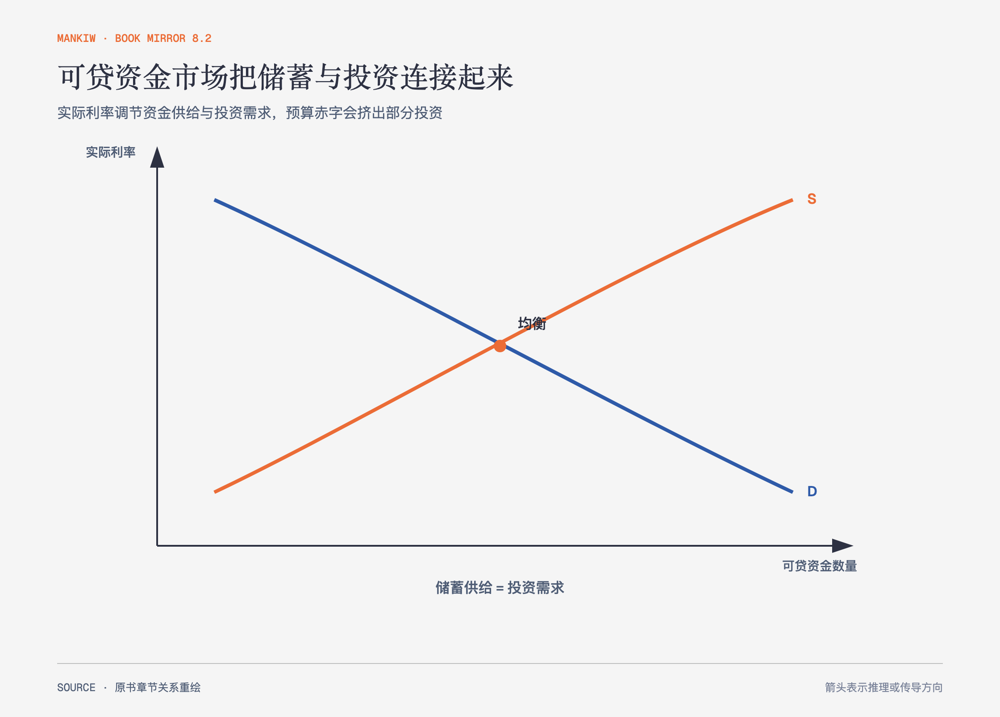

# 《曼昆〈经济学原理〉》第25章｜储蓄、投资和金融体系 · 原书回顾与主题讲解（书镜 V8.2）

金融体系把愿意推迟消费的人与需要资金进行投资的人连接起来。可贷资金模型用实际利率协调储蓄供给与投资需求。

**本章要回答：** 国民储蓄、投资、利率和政府预算赤字怎样连成同一套宏观关系？

图25-1｜依据本章可贷资金模型重绘。储蓄形成供给，投资形成需求，实际利率调整两者；政府预算会移动国民储蓄。

## 一、原书回顾：作者怎样展开

### 美国经济中的金融机构

金融市场让储蓄者直接向借款者提供资金，债券市场处理债务融资，股票市场处理所有权融资。债券期限、信用风险与税收待遇影响利率；股票价格反映对企业未来盈利的供求判断。金融中介让资金间接流动，银行和共同基金分别通过存贷与资产组合发挥作用。

### 国民收入账户中的储蓄与投资

封闭经济中 Y=C+I+G，可改写为 Y−C−G=I，所以国民储蓄 S 等于投资 I。原书把 `T` 定义为税收减政府转移支付；私人储蓄是 `Y−T−C`，公共储蓄是 `T−G`，两者相加为国民储蓄。福利转移增加会降低 `T` 与公共储蓄，即使名义税收和政府购买不变。预算盈余增加公共储蓄，赤字形成负公共储蓄。这里的投资指新资本品，不是个人买股票这种资产换手。

### 可贷资金市场

储蓄是资金供给，投资是资金需求，实际利率是价格。储蓄税收优惠使供给右移，利率下降、投资增加；投资抵免使需求右移，利率和储蓄提高；政府赤字减少公共储蓄，使供给左移，利率上升并挤出部分私人投资。

李嘉图等价提出另一种可能：家庭预期未来为债务加税，于是提高私人储蓄，抵消公共储蓄下降。作者把它作为争论观点，并用美国债务与平衡预算修正案讨论预算规则的成本和例外。

### 结论

金融体系决定稀缺储蓄怎样分配。利率不仅是贷款成本，也是推迟消费的回报；政策通过供给或需求移动改变均衡。

## 二、主题讲解：预算赤字怎样一路传到投资

### 赤字先减少国民储蓄

政府支出超过税收时，公共储蓄下降。若私人储蓄没有完全增加，国民储蓄和可贷资金供给减少。

### 利率承担配给作用

供给减少推高实际利率，一些边际投资项目不再值得进行，私人投资被挤出。并非政府“拿走了某一笔指定贷款”，而是市场价格改变了所有借贷选择。

### 李嘉图等价要求强假设

家庭必须预见未来税收、能自由借贷，并把后代税负纳入当前决策。若这些条件不成立，私人储蓄不会一比一抵消赤字。把理论可能性写成必然结果会越过边界。

## 检验理解：投资补贴为何提高利率

政府给企业投资抵免后，投资需求增加。为什么实际利率可能上升，而投资量仍增加？

核对思路：需求曲线右移，新均衡同时有更高利率和更多资金；利率上升是储蓄者提供更多资金、部分低收益项目退出的协调结果。

## 来源、范围与阅读连接

原书范围：下册 PDF 168–191页，合并 PDF 561–584页；金融机构、储蓄恒等式、可贷资金政策与李嘉图等价均保留。源文件 SHA-256：`8cd3def98b1ea31ca9e0c248dd2199004f093fc86a3472b3b33b6e6bc0e66692`。下一章研究长期存在的自然失业率。
