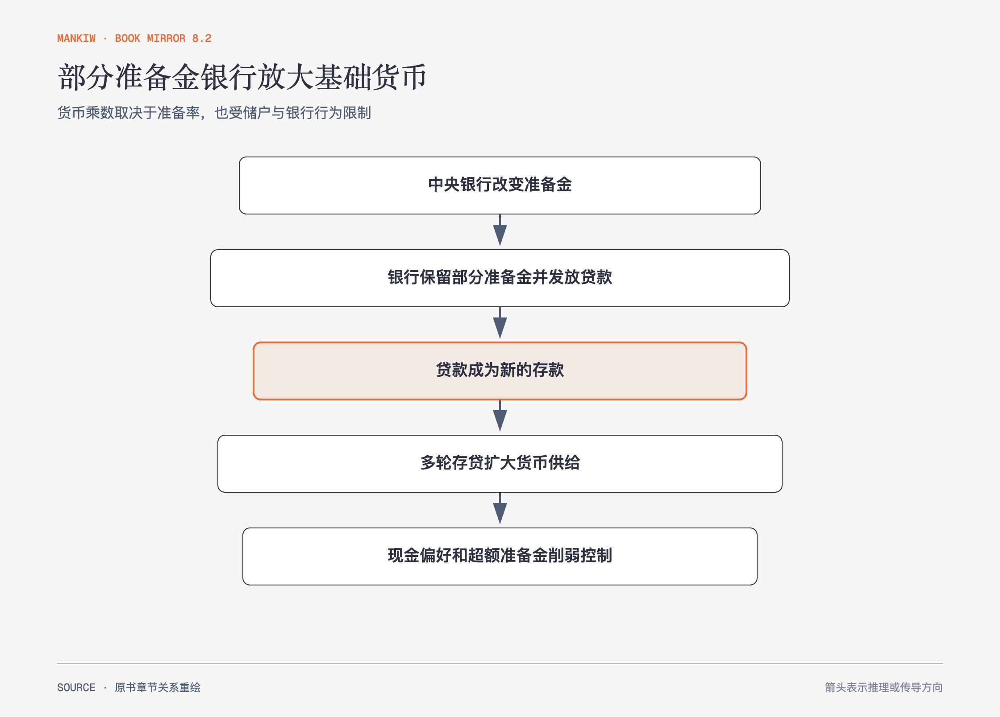

# 《曼昆〈经济学原理〉》第27章｜货币制度 · 原书回顾与主题讲解（书镜 V8.2）

货币让交易摆脱“双方恰好都想要对方物品”的限制。现代货币供给还取决于中央银行、商业银行、储户和借款人的共同作用。

**本章要回答：** 货币有哪些职能，部分准备金银行怎样创造货币，中央银行为什么不能精确控制总量？

图27-1｜依据本章部分准备金体系重绘。箭头表示贷款成为新存款并继续扩张；现金持有与超额准备金会截断乘数过程。

## 一、原书回顾：作者怎样展开

### 货币的含义

货币是买者经常用于购买物品与劳务的资产，具有交换媒介、计价单位和价值储藏三种职能。资产变成交换媒介的容易程度是**流动性**。商品货币有内在价值，法定货币主要因制度与接受习惯而流通。通货与活期存款构成常用货币衡量；信用卡是延迟付款工具，不是新增货币，结算账户余额才进入货币存量。

### 联邦储备

美联储是美国中央银行，负责银行体系与货币政策。公开市场委员会决定通过买卖政府债券影响货币供给。书中制度描述属于当时美国背景，本章用它说明中央银行功能，不作为当前操作指南。

### 银行与货币供给

百分之百准备金银行只保管存款，不改变货币供给。**部分准备金银行体系**把部分存款贷出，贷款支出又成为其他账户存款，银行体系创造更多存款货币。货币乘数在简单模型中等于准备率倒数；它描述整个体系的上限机制，不是单家银行凭空获得财富。

### 美联储控制货币的工具

美联储用公开市场活动、法定准备金和贴现率影响准备金与乘数。它不能完全控制家庭愿持有多少现金，也不能决定银行是否持有超额准备金、发放多少贷款。银行挤兑同时减少存款和银行放贷，能使货币供给收缩；存款保险与最后贷款人试图降低这种风险。

### 结论

货币供给是制度与行为共同形成的结果。中央银行控制基础条件，银行和公众的响应决定传导强弱。

## 二、主题讲解：乘数是链条，不是一键倍增

### 每轮扩张都需要真实贷款和存款

中央银行增加准备金后，银行只有愿意放贷、借款人愿借、收款人把资金存回体系，后续扩张才发生。任一环节停下，实际乘数就低于简单倒数。

### 贷款创造存款，不创造真实资源

货币余额增加让交易更方便，却没有让机器、住房和技能同时增加。长期物价结果要看货币相对真实产出的变化。

### 控制工具与目标之间存在行为层

降低准备要求可能扩大可贷能力，若银行担心违约而不放贷，货币供给和支出反应仍弱。政策动作不能直接当成最终经济结果。

## 检验理解：准备金增加为何贷款没增加

央行向银行体系注入准备金，但银行选择全部作为超额准备金。简单货币乘数预测会怎样失效？

核对思路：新增准备金没有进入贷款—存款循环，实际存款货币扩张很小；准备率倒数是假定银行充分放贷的模型结果。

## 来源、范围与阅读连接

原书范围：下册 PDF 221–240页，合并 PDF 614–633页；货币职能、联储、银行创造货币、工具与控制边界均保留。源文件 SHA-256：`8cd3def98b1ea31ca9e0c248dd2199004f093fc86a3472b3b33b6e6bc0e66692`。下一章分析货币增长、物价与通胀成本。
