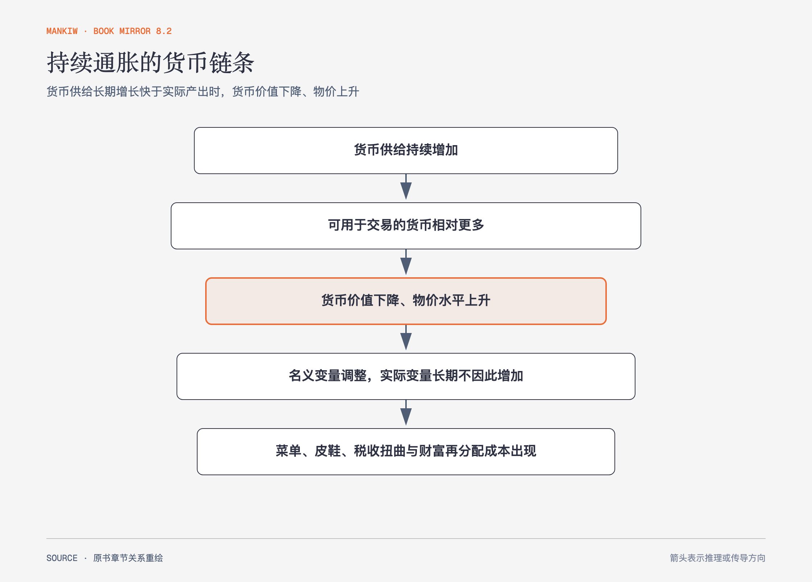

# 《曼昆〈经济学原理〉》第28章｜通货膨胀：原因与成本 · 原书回顾与主题讲解（书镜 V8.2）

长期持续通胀不是每种相对价格变化的总称。作者用货币供求解释物价总水平，再区分名义变量调整与真实社会成本。

**本章要回答：** 为什么货币持续增长会推高物价，通胀既不等于人人购买力同比下降，又为何仍有真实成本？

图28-1｜依据数量论与通胀成本重绘。箭头表示长期传导；实际产出不变是古典分析前提，短期波动留到后文。

## 一、原书回顾：作者怎样展开

### 通货膨胀的原因

货币供给与货币需求决定货币价值，物价水平是货币价值的倒数。中央银行增加货币供给时，按原价值持有的货币超过需求，人们增加支出，物价上升，直至实际货币余额恢复均衡。**货币数量论**把长期物价与货币数量相连。

古典二分法把名义变量与实际变量分开，货币中性主张货币供给长期影响名义价格而不改变实际产出和相对价格。**货币数量方程** `MV=PY` 用货币流通速度提供另一种表述。原书比较四次超速通货膨胀，货币量与物价都以极高速度增长；塞尔维亚巧克力价格案例让货币失去计价和储值功能的过程可见。政府用发行货币弥补财政缺口，相当于通货膨胀税；费雪效应说明预期通胀会一对一进入名义利率，实际利率不因此机械上升。

### 通货膨胀的成本

通胀使工资与价格普遍上升，不是把所有人实际收入按同一比例减少。真实成本包括减少现金持有引起的**皮鞋成本**、改价的菜单成本、相对价格扭曲、未指数化税制扭曲、计价单位混乱，以及未预期通胀在债权人与债务人之间任意再分配财富。可预期且稳定的通胀与突发通胀成本不同。

### 结论

长期高通胀与货币持续快速增长密切相关，但降低通胀需要财政与货币制度共同调整。短期反通胀可能影响产出与失业，第33章再处理。

## 二、主题讲解：把“价格涨了”拆成三件事

### 相对价格变化不是总水平通胀

咖啡歉收使咖啡价格上涨、其他价格不变，这是相对价格变化，传递稀缺信号。通胀是广泛物价总水平持续上升。两者政策含义不同。

### 名义收入同步上涨时，购买力未必同比下降

工资和价格都上涨10%，实际工资可能近似不变。真正损失来自调整、税制、合同和预期错误，而不只是价格标签数字变大。

### 未预期通胀改变既定债务

固定利率贷款按名义金额偿还。通胀高于预期时，偿还金额实际价值下降，债务人获益、债权人受损；低于预期则相反。

## 检验理解：一种商品涨价是不是通胀

极端天气使蔬菜价格翻倍，其他多数物价稳定。能否仅凭蔬菜断定经济发生高通胀？

核对思路：不能。需要观察广泛价格指数与持续时间；单一商品相对价格上涨可能来自供给冲击。

## 来源、范围与阅读连接

原书范围：下册 PDF 241–267页，合并 PDF 634–660页；货币供求、数量论、古典二分法、通胀税、费雪效应与成本均保留。蔬菜和比例为讲解情形。源文件 SHA-256：`8cd3def98b1ea31ca9e0c248dd2199004f093fc86a3472b3b33b6e6bc0e66692`。下一篇进入开放经济的实物与资本流动。
