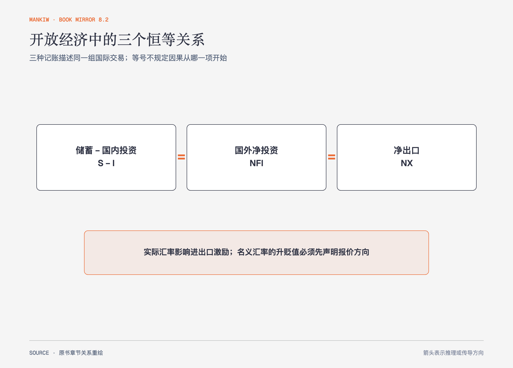

# 《曼昆〈经济学原理〉》第29章｜开放经济宏观经济学：基本概念 · 原书回顾与主题讲解（书镜 V8.2）

开放经济同时发生物品流动和资本流动。国民账户把它们连接成一个恒等关系：净出口等于国外净投资，也等于储蓄减国内投资。

**本章要回答：** 净出口、资本流动、储蓄投资与名义和实际汇率怎样属于同一套交易？

图29-1｜依据本章开放经济恒等式重绘。等号关系来自每笔国际交易的会计对应，实际汇率再影响交易激励。

## 一、原书回顾：作者怎样展开

### 物品与劳务的国际流动

出口是在国内生产、国外销售，进口是在国外生产、国内购买，净出口等于出口减进口，也称**贸易余额**。净出口受消费者偏好、国内外价格、汇率、收入、运输成本和贸易政策影响。美国经济开放程度随运输与通信改善而提高。

资本流动用**国外净投资**衡量，即本国居民购买外国资产减外国居民购买本国资产。直接投资取得企业控制，资产组合投资购买证券。资本会寻找收益与风险组合，政治和制度变化会影响流向。

### 储蓄、投资，及其与国际流动的关系

一国净出口必然等于国外净投资，因为外国人获得本国物品必须用资产、货币或对本国的债权支付。把 GDP 恒等式改写，得到 S=I+NFI，因此 S−I=NFI=NX。贸易盈余对应资本净流出，贸易赤字对应资本净流入。

### 国际交易的价格：名义与实际汇率

名义汇率是一国货币兑换另一国货币的比率。本章公式按“1单位本币可兑换多少外币”报价；反向报价时，升值、贬值的数字方向和公式写法也要反向。实际汇率比较两国物品的相对价格，在上述报价下可写为名义汇率乘国内价格再除以国外价格。实际升值使本国产品相对更贵，通常减少出口、增加进口；实际贬值方向相反。

### 第一种汇率决定理论：购买力平价

购买力平价建立在单一价格规律上：套利推动同一可贸易物品以共同货币计价后价格趋同。它对长期和高通胀比较有解释力，但运输成本、不可贸易品、产品差异和贸易壁垒使现实汇率偏离。

### 结论

恒等式描述账目必然相等，不说明因果方向。要解释政策怎样改变利率、资本流动和汇率，下一章建立两个市场模型。

## 二、主题讲解：贸易赤字的另一面是资本流入

### 每笔进口都要有支付对应

本国进口多于出口时，差额不能凭空消失。外国人最终持有本国资产、债券、存款或货币，形成资本净流入。因此贸易赤字与国外净投资为负是同一账目两面。

### 恒等式不等于“资本流入导致赤字”

会计关系只保证同时出现。因果可能从国内储蓄不足开始，也可能由高投资回报吸引资本，随后汇率和净出口调整。需要模型与事件识别。

### 实际汇率才连接货币与物品竞争力

名义汇率变化若被国内外物价完全抵消，实际相对价格不变，贸易激励也未必改变。只看货币报价容易误判。

## 检验理解：进口机器怎样记账

本国企业从国外购买机器，并由外国银行提供贷款。净出口和国外净投资怎样变化？

核对思路：进口增加使净出口下降；外国对本国债权增加，国外净投资下降。同一交易保持 NFI=NX。

## 来源、范围与阅读连接

原书范围：下册 PDF 271–293页，合并 PDF 664–686页；实物流、资本流、恒等式、汇率与购买力平价均保留。机器贷款是讲解用假设。源文件 SHA-256：`8cd3def98b1ea31ca9e0c248dd2199004f093fc86a3472b3b33b6e6bc0e66692`。下一章让可贷资金与外汇市场同时均衡。
