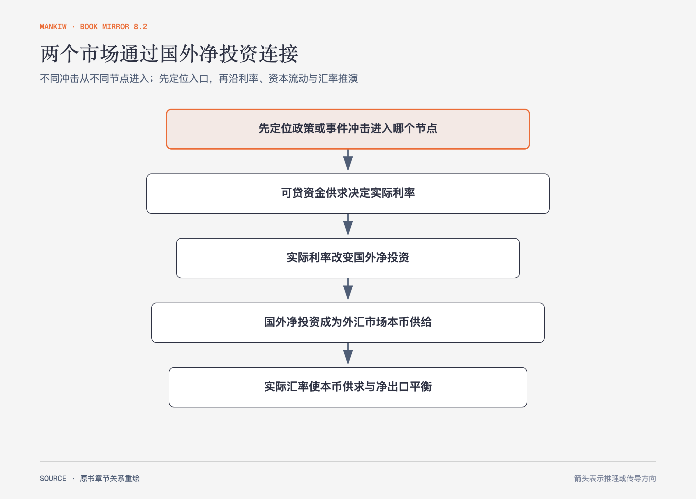

# 《曼昆〈经济学原理〉》第30章｜开放经济的宏观经济理论 · 原书回顾与主题讲解（书镜 V8.2）

本章用两个市场解释开放经济：可贷资金市场决定实际利率，外汇市场决定实际汇率，国外净投资把两者连接起来。

**本章要回答：** 预算赤字、贸易政策和资本外逃怎样沿实际利率、资本流动与汇率传导？

图30-1｜依据本章双市场模型重绘。不同政策从不同节点进入，图的第一步要求先定位冲击；随后实际利率影响国外净投资，后者成为外汇市场本币供给。

## 一、原书回顾：作者怎样展开

### 可贷资金市场与外汇市场的供给与需求

在可贷资金市场，国民储蓄提供资金，国内投资与国外净投资共同需求资金，实际利率使 S=I+NFI。实际利率上升会减少国内投资，也让持有本国资产更有吸引力，从而减少国外净投资。

在外汇市场，国外净投资形成用本币购买外国资产的本币供给，净出口形成外国人购买本国产品所需本币的需求。实际汇率使 NFI=NX。购买力平价可看作需求极有弹性时的特殊情况，而本章允许实际汇率变化。

### 开放经济的均衡

实际利率在可贷资金市场调整，决定国外净投资；国外净投资把给定数量的本币带到外汇市场，实际汇率再使净出口与之相等。两个价格分别协调资本和物品流动，不能把汇率只当货币现象。

### 政策和事件如何影响开放经济

政府预算赤字减少国民储蓄，推高实际利率、减少国外净投资；外汇市场本币供给减少，实际汇率升值，净出口下降，于是预算赤字与贸易赤字可能形成**双赤字**。进口限额直接减少某类进口需求，却使本币升值并挤压其他出口或扩大其他进口，总净出口在模型中不变。资本外逃造成**资本外流**，增加国外净投资需求，推高利率并使本币实际贬值。

### 结论

政策对某个行业的直接效果不等于宏观贸易余额效果。储蓄、投资、资本流动和汇率必须共同闭合。

## 二、主题讲解：任何冲击都要走完两个价格

### 预算赤字先改变利率，再改变汇率

国民储蓄减少时，实际利率上升。较高回报吸引资本留在国内，国外净投资下降；外汇市场本币供给减少，本币升值，净出口下降。

### 进口限额会把压力转到别处

限制某商品进口提高该商品净出口，却增加对本币需求、推动升值。升值使其他出口减少或其他进口增加，抵消总净出口变化。受保护行业获益不等于贸易余额改善。

### 资本外逃同时影响金融和贸易

居民急于购买国外资产，提高可贷资金需求与国外净投资，国内利率上升；外汇市场本币供给增加，引起贬值与净出口上升。贬值不是单独政策动作，而是资本冲击的一部分。

## 检验理解：关税为何未必减少贸易赤字

一国对汽车征收高关税。若国民储蓄与国内投资决定的国外净投资没有变化，总净出口会怎样调整？

核对思路：模型中 NX=NFI，净出口总量不变；汇率升值会减少其他出口或增加其他进口，行业结构改变但余额未必改善。

## 来源、范围与阅读连接

原书范围：下册 PDF 294–312页，合并 PDF 687–705页；两个市场、同时均衡、预算赤字、贸易政策和资本外逃均保留。源文件 SHA-256：`8cd3def98b1ea31ca9e0c248dd2199004f093fc86a3472b3b33b6e6bc0e66692`。下一篇转向短期总需求与总供给。
