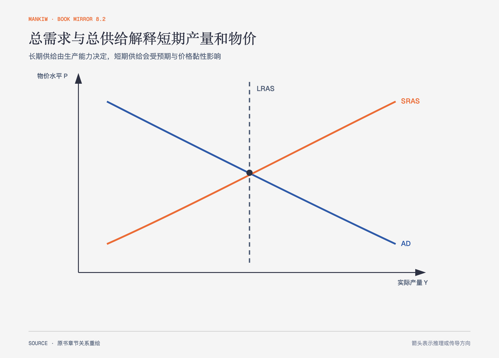

# 《曼昆〈经济学原理〉》第31章｜总需求与总供给 · 原书回顾与主题讲解（书镜 V8.2）

长期模型把实际产出与货币价格分开，短期波动却显示产量、就业和物价会一起变化。总需求—总供给模型用两条曲线解释这种暂时偏离。

**本章要回答：** 总需求或总供给移动时，短期产量与物价怎样变化，经济为什么最终回到自然产量？

图31-1｜依据本章 AD–AS 模型重绘。蓝线是总需求，橙线是短期总供给，虚线是长期总供给；长期产量由生产能力决定。

## 一、原书回顾：作者怎样展开

### 关于经济波动的三个关键事实

经济波动无规律且难预测，多数宏观数量会一起变化，产量下降时失业上升。奥肯定理描述失业与实际 GDP 变动的经验关系，但它不是不随时期和制度变化的自然常数。

### 解释短期经济波动

古典理论在长期中较适用，实际与名义变量相对分离；短期中价格与预期调整不完全，货币和支出会影响实际产量，严重而持久的衰退可称为**萧条**。总需求—总供给模型用物价水平和实际产量描述整个经济的均衡，不是把单个市场供求简单放大。

### 总需求曲线

总需求等于 C+I+G+NX。物价下降提高实际财富、压低利率并可能使本币贬值，从消费、投资和净出口三条路径增加总需求，所以曲线向右下方倾斜。消费信心、投资预期、财政与货币政策会移动曲线。

### 总供给曲线

长期总供给在**自然产量率**处垂直，由劳动、资本、自然资源和技术决定。短期总供给向右上方倾斜，作者介绍**粘性工资、粘性价格**和错觉三种解释：实际物价偏离预期时，企业或工人会暂时改变产量。预期物价、投入成本和生产能力变化会移动短期曲线。

### 衰退的两个原因

总需求下降在短期同时降低物价与产量，失业上升；随着工资、价格和预期向下调整，短期总供给右移，产量回到自然水平，长期物价更低。欧佩克限制石油供给的案例展示另一条路径：能源成本上升使短期总供给左移，同时带来产量下降和物价上升，即滞胀。政策若扩张总需求可恢复产量，却会接受更高物价。

### 结论

短期波动可能来自需求或供给，二者对物价方向不同。诊断冲击来源是政策判断的第一步。

## 二、主题讲解：先看物价与产量是否同向

### 产量和物价同向下降，优先检查总需求

家庭削减消费、企业推迟投资会使总需求左移，短期产量和物价都下降。政策扩大支出或货币供给可能抵消，但效果与时滞仍需评估。

### 产量下降、物价上升，优先检查总供给

能源成本突升或生产能力受损会使短期总供给左移，形成滞胀。只扩大需求能拉回产量，却进一步推高物价，政策取舍更明显。

### 回到自然产量不等于没有长期损失

模型中价格调整使产量回归，但长期失业、投资中断或企业退出可能影响资本与技能。原书的基准模型先隔离短期机制，现实应用要检查冲击是否改变长期供给。

## 检验理解：这是需求冲击还是供给冲击

居民突然悲观，消费下降，随后企业减产、失业上升、通胀放缓。哪条曲线更可能移动？

核对思路：总需求左移能同时解释产量下降和物价压力减弱；若通胀上升，则需考虑供给冲击或多重事件。

## 来源、范围与阅读连接

原书范围：下册 PDF 315–339页，合并 PDF 708–732页；波动事实、AD、长期与短期 AS、需求冲击和供给冲击均保留。源文件 SHA-256：`8cd3def98b1ea31ca9e0c248dd2199004f093fc86a3472b3b33b6e6bc0e66692`。下一章展开货币与财政政策怎样移动总需求。
