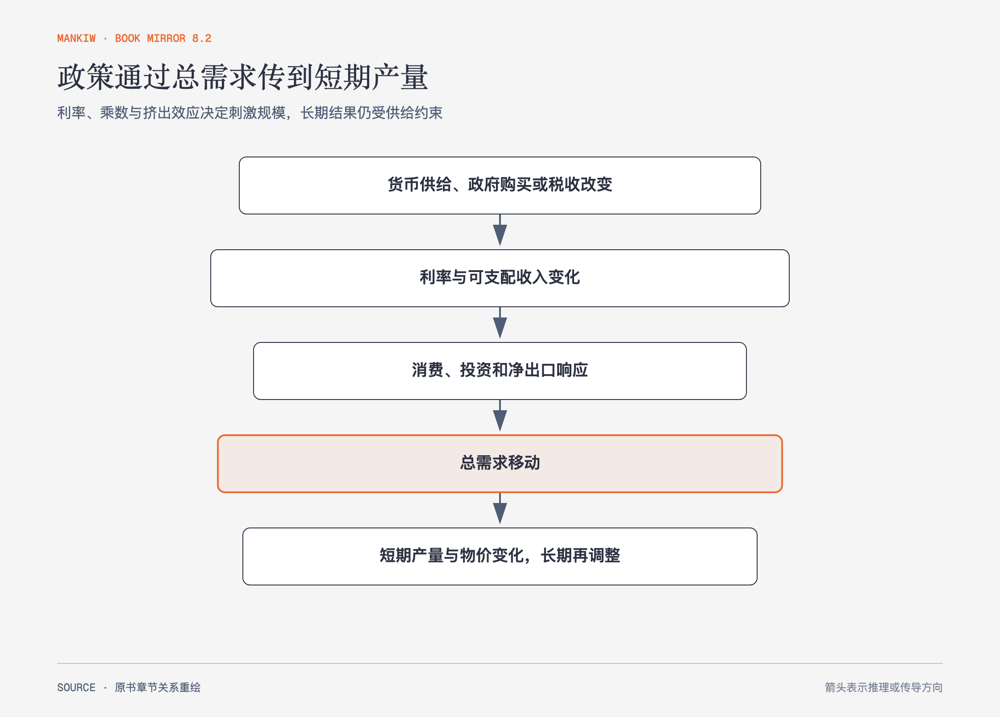

# 《曼昆〈经济学原理〉》第32章｜货币和财政政策对总需求的影响 · 原书回顾与主题讲解（书镜 V8.2）

政策不会从按钮直接跳到产量。货币供给、政府购买或税收先改变利率、财富与支出，再移动总需求，乘数和挤出效应决定幅度。

**本章要回答：** 货币与财政政策怎样传导，决策者为什么会在稳定作用、时滞和长期代价之间争论？

图32-1｜依据本章政策传导重绘。箭头表示作用环节，最后一节点区分短期产量效应与长期再调整。

## 一、原书回顾：作者怎样展开

### 货币政策如何影响总需求

流动偏好理论用货币供求决定短期利率。物价水平提高会增加交易所需货币，在货币供给既定时推高利率、压低投资，构成总需求曲线向下的一条原因。美联储增加货币供给会压低利率，促进投资与总需求；减少货币供给方向相反。现实中中央银行常以利率目标表达政策，但通过公开市场操作调整货币供给来实现。

### 财政政策如何影响总需求

政府购买直接进入总需求，还产生乘数效应：新增收入带来消费，消费又形成他人收入。边际消费倾向越高，简单乘数越大；投资随产量扩张而增加的反馈称为**投资加速数**。与此同时，政府支出提高收入和货币需求，推高利率并挤出部分私人投资。税收通过可支配收入与消费影响总需求，也可能改变劳动和投资激励，从供给侧产生长期影响。

### 运用政策来稳定经济

支持主动稳定者认为总需求会因凯恩斯所说的“**动物本能**”和投资波动而偏离，政策可减少衰退；反对者强调信息、决策和生效时滞，政策可能在经济自行恢复后才到达，反而扩大波动。自动稳定器如税收和失业保险会随经济变化自动改变总需求，减少另行决策时滞。肯尼迪时期减税案例用于说明凯恩斯主义者怎样用税收推动总需求，也提醒财政动作还会影响长期供给。原书把流动偏好与乘数分析对应到 IS–LM 框架，但本章正文主要沿总需求传导展开。

### 长期与短期中的经济

长期中利率使可贷资金平衡、物价使货币供求平衡，产量由要素与技术决定；短期中利率调节货币市场，产量响应总需求，物价与工资暂未完全调整。相同政策在两个时间尺度上回答不同问题。

### 结论

政策影响取决于传导强度、乘数、挤出和时滞。承认政策能移动总需求，不等于证明每次主动干预都及时而准确。

## 二、主题讲解：一笔政府支出有两条相反路径

### 乘数路径把初始支出向外扩散

政府购买形成企业收入，企业向员工和供应商支付，后者再消费一部分。每轮漏出储蓄和税收后，新增支出逐渐减弱。

### 挤出路径通过利率压低私人支出

收入上升增加货币需求，利率提高，使部分企业投资和家庭耐用品消费退出。实际总需求增量等于两条路径的净结果，不能直接把政府支出乘以理论最大乘数。

### 时滞决定好政策能否赶上问题

识别衰退、形成方案、执行项目和支出落地都需要时间。若经济已恢复，原本逆周期政策可能变成顺周期刺激。自动稳定器牺牲针对性，换取更快响应。

## 检验理解：支出100亿元为何总需求不一定增加100亿元

请指出使总需求增量大于、等于或小于初始支出的机制。

核对思路：乘数效应可使增量大于初始支出；利率上升挤出私人投资会缩小增量；两者恰好抵消一部分时可能接近或低于100亿元。

## 来源、范围与阅读连接

原书范围：下册 PDF 340–365页，合并 PDF 733–758页；流动偏好、货币传导、乘数、挤出、稳定争论与长短期均保留。金额为讲解用假设。源文件 SHA-256：`8cd3def98b1ea31ca9e0c248dd2199004f093fc86a3472b3b33b6e6bc0e66692`。下一章分析通胀与失业的短期权衡怎样移动和消失。
