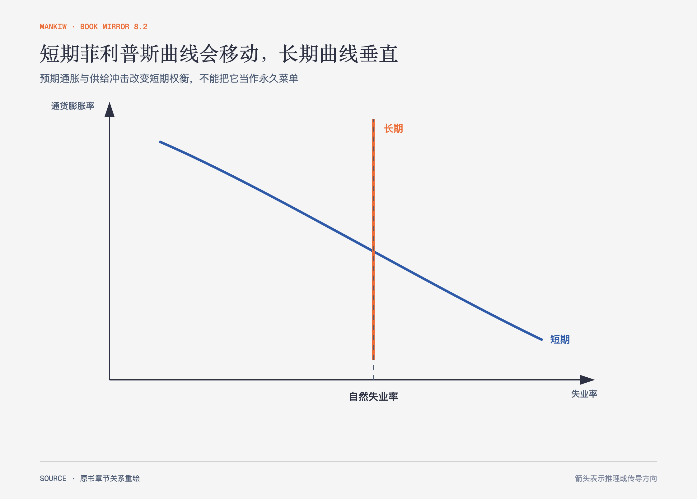

# 《曼昆〈经济学原理〉》第33章｜通货膨胀与失业之间的短期交替关系 · 原书回顾与主题讲解（书镜 V8.2）

菲利普斯曲线描述短期中通胀与失业的反向关系，但预期会调整，供给冲击会移动曲线。长期不存在可永久利用的通胀—失业菜单。

**本章要回答：** 短期权衡从哪里来，为什么长期曲线垂直，降低通胀的成本又受可信度影响？

图33-1｜依据本章预期扩展的菲利普斯曲线重绘。短期曲线向下，长期曲线位于自然失业率；预期和供给冲击会移动短期曲线。

## 一、原书回顾：作者怎样展开

### 菲利普斯曲线

历史数据曾显示工资或物价通胀与失业之间存在短期反向关系。决策者扩大总需求时，短期产量上升、失业下降、物价上涨；收缩需求则通胀下降、失业上升。菲利普斯曲线是 AD–AS 模型的另一种表达。

### 总需求、总供给和菲利普斯曲线

给定短期总供给曲线，总需求的不同位置对应不同通胀与失业组合。沿短期菲利普斯曲线移动来自总需求变化，而不是生产能力永久改变。低失业带来的工资与价格压力也可能改变后续预期。

### 菲利普斯曲线的移动：预期的作用

弗里德曼和费尔普斯提出**自然率假说**：长期中失业回到自然率，通胀由货币增长决定，所以长期菲利普斯曲线垂直。短期失业取决于实际通胀相对**预期通货膨胀**的偏离。持续提高通胀只能抬高预期，使短期曲线上移，不能永久维持低失业。70年代经验使稳定曲线破灭。

### 菲利普斯曲线的移动：供给冲击的作用

不利供给冲击同时提高通胀和失业，使短期曲线向右上方移动。决策者若扩张需求保就业，会接受更高通胀；若抑制通胀，会接受更高失业。权衡由冲击改变，不是固定不变。

### 降低通货膨胀的代价

**反通货膨胀**通常需要收缩总需求，暂时提高失业、减少产出，牺牲率衡量这种成本。理性预期观点认为，可信、迅速的政策改变可更快降低预期，减少代价；但可信度、工资合同和信息调整决定现实成本。沃尔克时期案例说明通胀下降伴随严重衰退，不能把“无代价”当成已普遍证明。

### 结论

短期交替关系真实但可移动，长期自然失业率不由持续通胀决定。政策要同时管理实际需求和公众预期。

## 二、主题讲解：短期曲线不是长期承诺

### 意外通胀能暂时影响实际活动

价格上涨快于工资合同与预期时，企业实际用工成本下降，产量和就业可能增加。等合同和预期调整后，这个优势消失。

### 重复制造意外会失效

公众把更高通胀写进工资、利率和价格，短期曲线向上移动。为了继续压低失业，政策需要不断加速通胀，结果不可持续。

### 可信度影响调整速度，不取消真实摩擦

明确规则能帮助预期下调，但合同期限、金融脆弱与信息不均仍会造成成本。可信声明不是现实无代价的充分条件。

## 检验理解：为什么同样失业率对应更高通胀

经历多年高通胀后，经济回到原失业率，但通胀更高。哪条机制解释这个变化？

核对思路：预期通胀上升使短期菲利普斯曲线上移；长期失业回到自然率，通胀水平却由货币与预期环境决定。

## 来源、范围与阅读连接

原书范围：下册 PDF 366–390页，合并 PDF 759–783页；短期曲线、AD–AS联系、预期、供给冲击和反通胀成本均保留。源文件 SHA-256：`8cd3def98b1ea31ca9e0c248dd2199004f093fc86a3472b3b33b6e6bc0e66692`。下一章把宏观政策的价值与制度争论放在一起。
