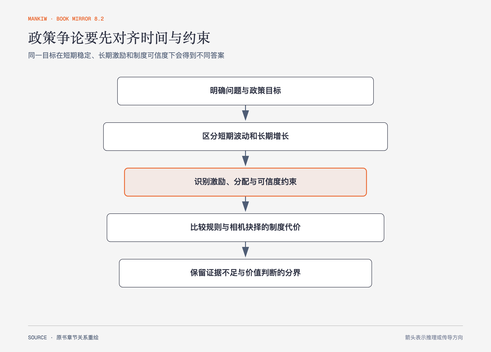

# 《曼昆〈经济学原理〉》第34章｜宏观经济政策的五个争论问题 · 原书回顾与主题讲解（书镜 V8.2）

全书最后一章没有给五个统一答案，而是把同一套模型交给正反双方。分歧往往来自时间尺度、制度可信度、分配价值与经验判断不同。

**本章要回答：** 面对稳定经济、货币规则、零通胀、平衡预算和储蓄税制争论，怎样辨认真正的分歧变量？

图34-1｜依据五组正反论证重绘。箭头表示形成政策判断前的检查顺序，不把五个问题压成同一答案。

## 一、原书回顾：作者怎样展开

### 请回答：货币与财政决策者应该努力稳定经济吗？

赞成者主张**积极稳定政策**：私人消费与投资波动会造成不必要的衰退，政策可移动总需求并减少失业。反对者强调预测不准和长而不确定的时滞，干预可能到得太晚；自动稳定器或规则可能比临时决策可靠。争论不在政策是否“有影响”，而在能否及时、准确地使用。

### 请回答：货币政策应该按规则还是相机抉择？

**货币政策规则**支持者担心政治性经济周期与**时间不一致性**：决策者承诺低通胀后仍有制造意外通胀的诱因，理性公众会预期这一点。相机抉择支持者认为经济冲击多样，固定规则可能无法应对大萧条、金融危机或制度变化；独立、可信的中央银行可能在保留灵活性的同时维持低通胀。

### 请回答：中央银行应该把零通货膨胀作为目标吗？

赞成者强调通胀扭曲计价、税制和长期合同，即使温和通胀也会累积成本。反对者指出把通胀降到零需要暂时失业与产出损失，温和且稳定的通胀成本可能有限。争论取决于长期收益与过渡成本比较。

### 请回答：政府应该平衡其预算吗？

赞成者认为赤字减少国民储蓄、挤出资本并把**政府债务**留给后代，平衡规则能约束政治激励；他们也承认战争和衰退可能需要例外。反对者认为年度平衡过于僵硬，债务应相对国民收入衡量，借款用于资本投资或代际受益项目可能合理。李嘉图等价还提醒，家庭若预期未来加税，可能提高私人储蓄；这需要强假设，不能自动消除代际负担。

### 请回答：应该为了鼓励储蓄而修改税法吗？

赞成者认为储蓄支撑资本与长期生产率，现行所得税对资本收益重复征税，消费税或优惠账户可改善激励。反对者强调收入效应可能抵消替代效应，优惠更多被高收入者使用，减税若扩大赤字会降低公共储蓄，私人储蓄增加未必超过公共储蓄下降。

### 结论

经济学提供因果链和边界，却不能消除所有价值分歧与经验不确定性。作者希望读者能识别双方最强论据，而不是只记住立场标签。

## 二、主题讲解：用同一张检查表拆政策争论

### 先对齐目标与时间

“稳定经济”可能指降低本季失业，也可能指十年物价可信度；“平衡预算”可能指每年、整个周期或债务占收入稳定。时间定义不同，结论会直接冲突。

### 再写出政策传导和失败条件

一项刺激要经过决策、执行、收入、消费和产量；任何环节时滞过长都会使结果改变。货币规则要说明遇到异常冲击怎么办，相机抉择则要说明怎样约束短期诱惑。

### 最后分开事实判断与价值判断

储蓄对税率反应多大是经验问题，代际公平和收入分配权重是价值问题。数据可以改变前者，却不能替社会隐含选择后者。

## 检验理解：双方到底在争什么

一方主张衰退期允许赤字、繁荣期偿还；另一方要求每年平衡。请指出至少两个决定结论的变量。

核对思路：自动稳定器与政策时滞、债务用途、债务占收入趋势、政治上能否在繁荣期实现盈余，以及代际分配都会改变判断。

## 来源、范围与阅读连接

原书范围：下册 PDF 393–415页，合并 PDF 786–808页；五组“请回答”及正反论证均保留。未把任一方扩写成作者最终立场。源文件 SHA-256：`8cd3def98b1ea31ca9e0c248dd2199004f093fc86a3472b3b33b6e6bc0e66692`。译后记从中文读者角度说明这本书的写作与翻译价值。
