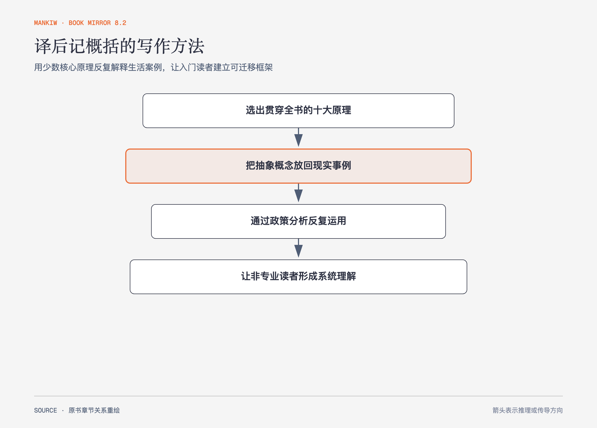

# 《曼昆〈经济学原理〉》译后记 · 原书回顾与主题讲解（书镜 V8.2）

译者梁小民在1999年8月15日的译后记中，说明这部教材为什么能让普通读者进入经济学：选择少数核心原理，用现实事例和政策分析反复运用。

**本章要回答：** 译者如何评价本书的取舍、读者范围和中文翻译意义？

图后记-1｜依据译后记的评价重绘。箭头表示教材先压缩核心原理，再用案例和政策分析反复练习，最后形成可迁移理解。

## 一、原书回顾：作者怎样展开

### 译后记

译者先介绍英文版在1998年出版后受到欢迎，并把原因从作者声望转向书本身。他认为，经济学数学化有价值，但对初学者而言，过多抽象推导会形成门槛；入门教材需要让非专业读者先看懂经济学怎样解释生活。他用“并没有用一点数学”赞扬本书的可读性，但正文仍有公式、斜率和图形，这句话应按译者的概括理解，不能扩写成全书字面上没有数学表达。

译后记特别肯定两项取舍。第一，本书的**简明性**来自对经济学十大原理的选择与贯穿，而不是篇幅短。第二，书中使用现实事例、案例分析、政策剖析与新闻摘录，强调经济学的现实运用。译者用“深入浅出”概括这种写法，认为通俗不等于浅薄。

最后，译者把读者范围扩展到财经学生之外，认为具备中学文化程度的普通读者也能进入，同时专业读者仍可获得启发。他说明翻译受到三联书店和梁晶工作室支持，并把普及经济学与当时中国市场经济发展联系起来。全书约80万字由他一人承担翻译，力求保持原书风格并达到“信、达、雅”；他也明确承认时间与能力有限，可能有错译，请读者批评指正。落款为“梁小民，1999.8.15”。

## 二、主题讲解：书镜怎样继承这套压缩方法

### 先保留少数可反复调用的生成器

十条原理之所以有价值，不在于条目短，而在于后续各章不断把机会成本、边际量、激励、贸易和市场失灵放入新情形。知识压缩应保留这种生成能力，不能只剩结论清单。

### 案例要展示推理，不只给结论

农民与牧牛人、租金控制、税收楔子和银行乘数各自让读者看到变量如何改变。若只写“案例说明比较优势”或“税收有无谓损失”，就丢掉了从情形到判断的中间桥梁。

### 通俗要能说回原书术语

读者先用熟悉情形理解，再能准确说出机会成本、比较优势、消费者剩余或货币中性，才既降低阅读成本，又保留后续检索与交流能力。

## 检验理解：压缩有没有压掉承重信息

如果一份摘要只列出十大原理，却没有案例、前提和反例，它是否实现了译者所说的“全面而系统的了解”？

核对思路：没有。条目只有名称，读者无法判断何时适用、怎样推出结论，也无法迁移到新情形。

## 来源、范围与阅读连接

原书范围：下册 PDF 436–437页，合并 PDF 829–830页；译者评价、读者范围、翻译背景与落款均保留。索引位于下册 PDF 416–435页，作为检索性后附材料登记，不另作章节卡。源文件 SHA-256：`8cd3def98b1ea31ca9e0c248dd2199004f093fc86a3472b3b33b6e6bc0e66692`。
