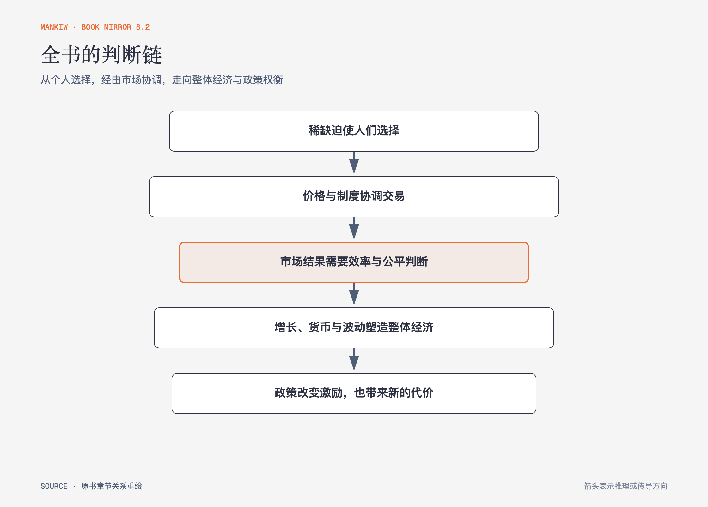

# 曼昆《经济学原理》｜全书导读（书镜 V8.2）

这套扫描分册包含上册第1—17章、下册第18—34章，以及译后记。全书没有从术语百科出发，而是从稀缺与选择一路推进到市场、企业、增长、货币、开放经济和短期波动。

**本书要回答：** 个人和社会怎样在稀缺下选择，市场如何协调这些选择，何时会失灵，宏观经济又怎样增长与波动？

图导读-1｜依据13篇结构重绘。箭头表示理解依赖：个人选择构成交易，市场结果进入福利与政策，长期增长、货币和短期波动再扩展到整体经济。

## 一、原书回顾：作者怎样展开

### 第1篇 导言

第1—3章建立十大原理、模型方法与比较优势。这里给出全书反复使用的判断语言：机会成本、边际量、激励、贸易、市场与宏观约束。

### 第2篇 供给与需求（Ⅰ）：市场如何运行

第4—6章从竞争市场供求进入弹性、价格控制和税收归宿，回答价格与数量如何形成，以及政策规则怎样改变行为。

### 第3篇 供给与需求（Ⅱ）：市场和福利

第7—9章用消费者剩余、生产者剩余和无谓损失评价市场、税收与国际贸易。

### 第4篇 公共部门经济学

第10—12章处理外部性、公共物品、共有资源和税制，说明市场价格漏掉第三方影响或无法排除使用者时，制度怎样介入。

### 第5篇 企业行为与产业组织

第13—17章从成本曲线走向竞争、垄断、寡头与垄断竞争，把企业的产量、进入、策略、广告和品牌放在不同市场结构中比较。

### 第6篇 劳动市场经济学

第18—20章把边际生产率连接到工资、收入差异、歧视、不平等与反贫困政策。

### 第7篇 高深的论题

第21章用预算约束和无差异曲线展开消费者选择，解释收入效应、替代效应及劳动、储蓄与转移支付。

### 第8篇 宏观经济学的数据

第22—23章建立 GDP、CPI、实际与名义变量，为后续增长、通胀和波动提供可比尺度。

### 第9篇 长期中的实际经济

第24—26章讨论生产率、储蓄投资、金融体系与自然失业率，说明长期生活水平和劳动力市场怎样形成。

### 第10篇 长期中的货币与物价

第27—28章从货币职能、银行创造货币进入数量论、货币中性和通胀成本。

### 第11篇 开放经济宏观经济学

第29—30章连接净出口、资本流动、实际汇率、可贷资金与外汇市场。

### 第12篇 短期经济波动

第31—33章用总需求—总供给和菲利普斯曲线解释衰退、政策传导、预期与反通胀成本。

### 第13篇 最后的思考

第34章把稳定政策、货币规则、零通胀、平衡预算和储蓄税制交给正反双方论证，要求读者自己辨认事实与价值分歧。

## 二、主题讲解：怎样读这套书镜

### 先读图，再走原书推理

每章开头图只呈现一条主关系，用来定位变量和方向；“原书回顾”保留作者章节顺序、案例作用与边界，避免主题重组吞掉原书。

### 再读主题讲解，把模型放进新情形

主题讲解用一个更熟悉的情形运行同一机制，并说明何时会失效。假设案例只承担解释，不冒充原书事实或现实测量。

### 最后做迁移题

理解检查要求区分相近概念、追踪传导或判断边界。能说出结论还不够，需要给出理由，并能说回原书术语。

## 检验理解：全书的四层关系

请用“选择—市场—整体经济—政策”四层解释，一项能源税怎样从个人激励传到价格、产量、通胀与分配判断。

核对思路：先写机会成本和行为反应，再走供求与弹性，接着区分相对价格与物价总水平，最后比较外部性、税负归宿、无谓损失和公平。

## 来源、范围与阅读连接

原书篇章页：上册 PDF 1、61、137、205、271页；下册 PDF 1、69、99、139、219、269、313、391页。正文覆盖34章与译后记；下册 PDF 416–435页为索引，登记但不另作正文。扫描分册缺少版权页，版次不作无证据补写；译后记落款为1999年8月15日。源文件 SHA-256：`8cd3def98b1ea31ca9e0c248dd2199004f093fc86a3472b3b33b6e6bc0e66692`。
