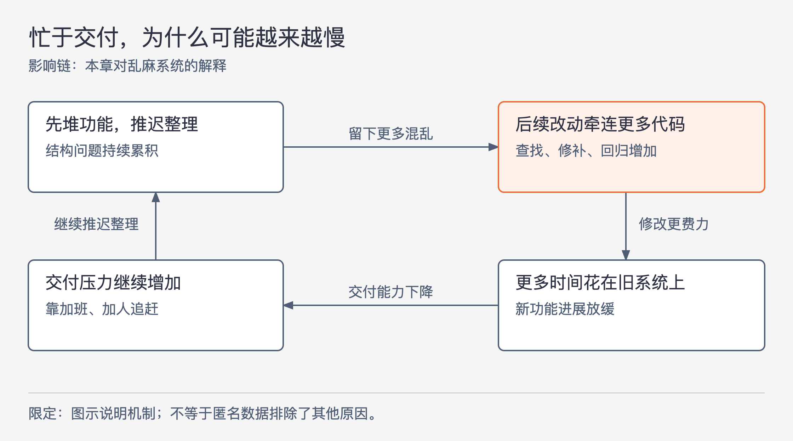

# 《架构整洁之道》第1章｜设计与架构究竟是什么 · 书镜8.2

一个团队招了更多人，大家也越来越忙，为什么每次上线的新东西反而越来越少？本章从这个问题解释架构的价值：设计决策会持续影响以后做事的成本，只看第一次交付速度，就看不到这笔账。

## 一、原书回顾：从设计决策看到整个生命周期的成本

原章开头先澄清“设计”和“架构”的关系，没有另设小节标题。作者反对把架构理解成高层方框，把设计理解成不值得架构师过问的底层细节。他用自家房屋的设计说明：房屋形状、房间布局、垂直高度，需要插座和开关的位置、灯与开关的连接、热水器和污水泵的安放，以及墙体、屋顶、地基的建造细节来实现。它们共同组成可建造的房子。

软件也由一连串互相影响的决策构成。高层安排与底层实现之间没有作者所认可的清晰分界。因此，他在本书中把设计与架构视为同一连续体。这是本书的用词立场；它并不意味着所有决策的影响范围都一样。

### 目标是什么

作者把目标落在人力成本上：满足构建和维护需求所花的人力，应在整个生命周期内尽可能少。判断设计好坏，要看系统是否能持续以较低成本满足需求。

这里的时间范围改变了判断方法。某次发布很快，如果它使以后每次修改都更费力，仍然可能是坏设计；初次构建多花一点时间，如果能让后面的维护保持便宜，就可能值得。作者尚未给出各种设计方案的计算公式，先确定的是评价尺度。

### 案例分析

作者引用一家匿名公司的数据，图1.1注明材料来自 Jason Gorman 的演示文稿。先看工程师人数：团队随八个主要版本迅速扩张，单独看这条曲线，很容易把它理解成公司成功。再看以代码行数表示的产出，增长逐步放缓；人数没有带来相应的增量。最后看平均每行代码的变更成本，曲线持续上升，作者据此追问为什么第8代产品的构建成本会达到第1代的约40倍。

这三个观察需要合起来读：人数回答投入了多少劳动，代码行数在此被用作产出的粗略指标，单位变更成本反映为获得产出付出的代价。原图没有给出可重算的完整数据表，代码行数也不能直接代表用户价值，所以本章不把图中的柱高另造为精确数据。案例支持的是对成本恶化的追问，尚不能单凭图表排除需求变复杂等其他解释。

### 乱麻系统的特点

作者对这个案例的解释是：系统最初匆忙构建，后续长期忽视结构与代码质量，团队试图持续加人来补速度。随着发布推进，工程师越来越多地修补旧系统，真正用于新功能的工作越来越少。

图1-1｜根据本章对乱麻系统的解释重绘。箭头表示作者描述的影响链；它说明一种恶化机制，不是由匿名数据单独证明的普遍因果规律。

图1.4从工程师角度描绘这一变化：开始时生产力接近100%，到第4版附近已经很低，之后继续趋近于零。原文的“趋近于零”是趋势描述，不能读成第4版完全没有产出。工程师没有停止努力，反而加班、救火；但是修改一处就要照顾另一处，修复消耗了本来可以实现需求的时间。努力程度与有效产出因此分离。

### 管理层视角

图1.5转向月工资支出。作者给出的端点是：首版上线时月总工资约10万美元，到第8版约2000万美元，而且仍在上升。将它与代码行数增长放缓放在一起看，管理层会发现新增投入越来越难换来新功能。

作者承认，营收如果增长得更快，公司仍可能继续运转；但这不会使开发成本的恶化自动消失。管理者不能只靠催促和责备来解决问题，因为开发者已经很忙了，接下来必须问：到底是什么让同样的劳动越来越难转成成果？

### 问题到底在哪里

作者借龟兔赛跑批评一种过度自信：相信自己可以先把结构做乱，等上线后再轻松收拾。工程师未必在工作时间上偷懒，却可能低估维护良好代码的重要性。产品上线以后，竞争压力和新需求不会消失，因此“以后再重构”没有自然到来的空档。新功能继续叠在混乱之上，修补工作也随之增加。

另一层过度自信是认定粗糙实现至少能保证短期更快。作者以 Jason Gorman 的六天小实验挑战这个判断：每天从头实现整数到罗马数字字符串的转换，预先规定的测试集全部通过才算完成，每天不超过30分钟。第1、3、5天使用测试驱动开发（TDD），其余三天不用。两种方式随练习都有提速；按作者对图1.6的说明，使用TDD约少用10%的时间，而且使用TDD最慢的一天，仍快于不用TDD最快的一天。

在这里，TDD指先用测试明确下一步应满足的行为，再实现并整理代码。这个实验让读者看到，及时检验与整理也可能减少当下返工，而非只能带来远期收益。但它是同一人在同一小任务上的六次练习，不足以证明所有项目采用TDD都会节省10%。作者由此提出“稳才能快”的强主张，学习时应同时保留他的判断与实验的范围。

最后，作者质疑“丢掉旧系统、重写就好了”。如果使旧系统恶化的开发习惯没有改变，新项目仍可能走回同一条路。重写能移除已有代码，却不能自动移除造成混乱的做事方式；本章也没有因此论证所有重写都不该做。

### 本章小结

作者要求研发团队为自己持续做出的设计决策负责。想减少构建与维护成本，就要理解结构怎样影响后续修改，而不能只凭投入人数和工作强度判断效率。本书后续各章将逐步解释这样的结构。

## 二、主题讲解：怎样看出一次交付正在增加下一次的成本

### 从一项后端需求开始看

以下是为讲解构造的订单系统案例，不是原书公司的项目。系统最初只有一个结算入口，开发者直接把优惠计算写进去。第二个入口到来时，把同一段计算复制过去，第三个入口再复制一次。每个入口单独验收都能算对，看起来交付没有问题。

随后优惠规则变了。现在团队要先找出所有副本，分辨哪段仍在使用，再逐一修改、测试。即使每次真正新增的规则都很简单，搜索和回归范围也会越来越大。第一次节约的是组织代码的时间，以后不断增加的是每次变更的时间；这就是本章生命周期视角能够看见、单次验收看不见的差别。

这里不能只凭“出现重复”就判定必须合并。若三个入口受不同业务规则约束，相似的代码将来可能需要分别变化。先确认它们确实实现同一项规则，才能把规则放在一个明确位置，让三个入口调用它。

### 好设计的收益如何进入当天的工作

假设三个入口确实执行同一优惠规则。将计算集中到一个不依赖入口格式的函数后，改规则时可以直接找到它，并用输入订单和预期金额验证。入口仍负责接收请求和返回结果，计算代码只负责金额计算。

增加这个边界本身有成本：需要设计输入输出，调整调用，确认原行为没有改变。它的收益来自后续步骤变少：不再搜索多份规则，不再猜副本是否漏改，也能更快发现计算错误。如果只是为了整齐而增加几个转发层，修改路径反而更长，就没有解决本章的问题。

同样，测试的价值需要进入完整工作过程衡量。只比较敲下实现代码的时间，会漏掉调试、手工试算、上线后的返工。原书小实验的完成条件是通过既定测试集，这比“写完代码”更接近可比较的终点。

### 用什么观察支持调整

对这个假设系统，可以选几次范围相近的优惠变更，记录从理解需求到完成验证的时间，并分别记下查找规则、修改、回归和修复遗漏所用的工作。这样的记录用于找出耗时来自哪里；不能把不同难度任务的总时间直接相除，宣称架构提升了多少倍。

如果规则集中以后，查找与重复修改减少，入口行为保持正确，新的规则也没有被迫绕过公共函数，那么有证据说明这次调整降低了当前这一类变更的成本。如果为了覆盖所有未来促销，提前建设一套难以理解的通用规则框架，初次成本和后续理解成本都可能变高。架构目标要求控制总成本，不能替任何“架构升级”自动辩护。

这也给“是否重写”提供了更具体的问题：现在的成本来自哪些结构？新方案如何改变它们？团队如何避免重新复制同一规则？没有这些回答，更换项目目录不会改变成本增长的机制。

## 用一个新情形检查理解

某团队通过删除重复代码和过期功能，使代码行数下降，但同类需求的实现与验证更快、故障也没有增加。另一团队增加了许多代码和人手，交付时间却越来越长。能依据本章案例，把第一支团队判为低产出吗？

核对思路：不能。代码行数只是作者案例采用的粗略指标，本章最终评价的是满足需求所需的人力成本。还要确认需求范围、完成质量和成本统计可比较；删代码本身既不自动证明高质量，也不能证明生产力下降。

## 来源、范围与阅读连接

依据《架构整洁之道》第1章，同版PDF第33—41页，书内页3—11。原章的六个有名小节及章首房屋案例均已保留；匿名公司与罗马数字实验属于作者材料，订单系统属于本文假设案例。已核对PDF第35、36、37、38、40页的图表、数字与标题。原始实验记录和公司数据集未在本章给出，因此不复算或扩大实验结论。下一章进一步区分系统现在能做什么，以及以后能否继续修改。

<!-- source_sha256: 64400d05a5e1fe23dedbc41526c9227f74b3647fce36eda738a11c325074f2c3 -->
