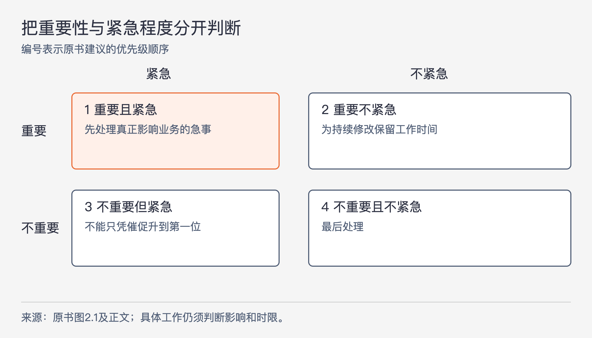

# 《架构整洁之道》第2章｜两个价值维度 · 书镜8.2

第1章把设计好坏放到长期成本中判断。本章继续追问：如果系统今天能用，以后却越来越难改，它还保住了多少价值？作者把软件的价值分成行为与架构两个维度，并要求研发人员同时对两者负责。

## 一、原书回顾：当前功能与持续改变的能力

### 行为价值

行为价值最容易观察：机器按约定工作，帮助使用者实现业务目标。研发人员协助整理需求，把需求写成代码；发生异常时，调试并修复错误。能否完成一次正确计算、生成预期结果，都属于这个维度。

作者批评的是把这些工作当成研发的全部职责。仅仅持续完成需求和修复Bug，还不足以保证软件在未来保持价值；下一个小节补上被漏掉的部分。

### 架构价值

作者借software中的“soft”解释软件应当具有的灵活性：需求变了，机器的工作行为也应能随之调整。这里的架构价值，表现为系统是否容易修改。

他进一步区分变更的“范畴”（scope）和“形状”（shape）。范畴可以理解为这次要改变多少行为、涉及多大的业务范围；形状指新需求的组织方式与现有代码结构是否吻合。理想情况下，工作难度主要随需求本身的范围变化，而不要因为需求恰好没有顺着现有结构长出来，就陡然增加。

原书用拼图来说明双方感受的差异。需求方觉得前后几次改变差不多大，成本也应相近；开发者却需要不断把不同形状的新拼块塞进已有拼图，越改越困难。问题在于架构过度偏向某种既定安排。作者希望好的架构尽量减少这种偏向，并没有给出能无成本适应所有变化的保证。

### 哪个价值维度更重要

作者用两个极端情形论证架构价值的重要性。一个程序现在正确，却无法修改；一旦需求变化，它就不能继续完成需要的工作，而且修不好。另一个程序现在不正确，却很容易修改；开发者可以先修正它，再随需求变化持续调整。后者保留了继续产生价值的可能。

“无法修改”在现实中常常是经济上的判断。程序当然可以改，但修改成本已经超过收益，于是实际选择等同于不能改。业务部门一方面希望先完成当前功能，另一方面又合理地期待未来变化仍能承受；研发人员不能等到成本高得无法接受时，才告诉他们软件已经失去灵活性。

这段推导依赖持续变化的需求，以及能把易改程序修到可用的前提。它是在说明可修改性如何支撑未来价值，没有证明正在正常运转的旧程序会在某一时刻无条件失去全部用途。

### 艾森豪威尔矩阵

本节借紧急与重要两个维度解释优先级为什么容易失衡。

图2-1｜根据原书图2.1及其优先级说明重绘。编号表示作者建议的处理次序；不能仅凭“架构”或“功能”的名称替一项工作自动归类。

原书给出的顺序是：重要且紧急、重要不紧急、不重要但紧急、不重要且不紧急。行为需求经常有明确截止日期，所以显得紧急，但并非每项都同样重要。架构问题影响系统继续发展的能力，通常很重要，却未必马上造成事故。

作者指出，团队容易把“不重要但紧急”的需求误排成第一位，使“重要不紧急”的结构工作长期没有位置。研发人员应协助判断真正紧急且重要的功能，同时说清结构问题的后果。作者认为业务部门通常缺乏评估架构的专业条件，这项责任不能全部推给需求方。

本节引用了一段署名艾森豪威尔的讲话，脚注定位为1954年在西北大学的演讲。这里保留原书的引文归属信息，不用这段话本身替具体需求的重要性作证；原书随后的四类排序，也明确容纳“既紧急又重要”的事项。

### 为好的软件架构而持续斗争

作者用“斗争”强调研发团队也是系统相关方之一。市场、销售、运营会争取各自目标，研发也应代表系统长期可维护的需要参与讨论，而不只是被动接收需求。保护可维护性是这份工作的组成部分。

架构师尤其需要关注整体结构，使功能实现、修改和扩展更容易。若任由结构持续恶化，最后连有价值的需求都改不起，研发团队就没有充分履行这项职责。作者的措辞强调专业责任；它没有提供一套仅靠争吵就能证明设计正确的方法。

## 二、主题讲解：把“以后好改”变成能讨论的具体工作

### 先把两种价值放在同一项功能上

以下沿用一个假设的订单报表系统。现在业务需要按月份查看订单金额，研发把金额计算与网页表格拼接写在一起，页面显示正确，这项行为价值已经实现。

后来业务要把相同数据发给另一个系统。需求只新增一种输出方式，却因为计算过程夹在页面字符串处理中，必须先拆开计算、梳理格式，再确认旧页面没有改变。新增工作的相当一部分来自现有代码安排。这里就能看见架构价值不足，而无需先争论系统是否“先进”。

如果计算过程能直接产生清楚的数据结果，网页和新输出各自使用它，那么第二项需求更容易加入。但是否值得调整，仍取决于边界能解决的具体问题和调整成本，不能仅凭“可能还有别的格式”就提前制造许多层。

### 范畴相近，形状为何让成本不同

在这个例子中，“给网页加一列”和“用同样数据增加一种输出”看起来都只多一点展示工作。前者顺着现有网页代码修改，后者跨过了计算与格式混在一起的地方。若只说“第二个更复杂”，需求方无法知道复杂来自业务要求，还是来自已有实现。

可以把估算拆开说明：增加输出本身要做什么；为了从现有实现取得结果，需要先拆开什么；旧功能又要验证哪些路径。需求方这时能看到，架构工作正在去除一项已出现的修改障碍。它与为未知未来建设一个通用报表平台，是不同规模的决策。

范围和形状也不能被用成推卸业务复杂性的借口。若新输出要求另一套税费定义，计算规则本身就变了，工作量上升不能全部归因于结构。判断时要把这两个来源分开。

### 优先级讨论需要把后果说出来

假设同一周出现三件事：报表金额算错、客户要求临时换标题、计算与网页混杂使已确认的新输出迟迟无法加入。金额错误如果正在影响业务判断，很可能同时紧急且重要；临时标题若影响很小，即使有人催得很急，也未必应压过结构问题；第三件事的重要性来自一项具体需求已经受阻。

研发可以提交一个范围明确的调整：先把金额计算提取成能独立验证的部分，保留网页现有输出，再接入新输出方式。讨论时同时说明所需时间、这次解除了什么障碍、哪些行为必须保持。这样的证据让业务方有条件比较，而不是要求他们相信“架构师说重要就重要”。

如果金额错误正在造成损失，应先控制损失。矩阵允许真正重要且紧急的功能先做；作者反对的是让所有催促都取得这个位置。反过来，长期把已经证实的结构问题往后推，也是在作一种选择：接受以后更大的实施成本。

### 架构价值仍要回到功能上验证

完成调整后，旧报表计算结果应保持正确，新输出应能使用同一结果，计算规则变化也应有明确的修改位置。若代码看起来分层很多，却仍要同时改网页、计算和存储代码，结构图并没有证明可修改性改善。

这个检查还保住了本章的双重责任：一边交付需要的行为，一边让后面的行为变更仍可承担。仅有整齐结构却迟迟不能提供可用结果，同样没有完成软件的工作。

## 用一个新情形检查理解

某程序只用于一次数据转换，输入和规则已冻结，正确完成后立即停用。团队是否还应为未来扩展大幅增加设计投入？

核对思路：先保住这次转换的正确性、可验证性，以及任务期间必要的修正能力。若确实不存在后续变化和复用，额外扩展结构的收益会很小。本章的极端比较依赖未来需求变化；将它套成任何任务都应优先建设扩展框架，会忽略前提。也应核实“一次性”是否真实，而非每个月都要再用的口头说法。

## 来源、范围与阅读连接

依据《架构整洁之道》第2章，同版PDF第42—48页，正文为第43—47页，书内页13—17；第48页为空白。五个原小节均按原顺序保留。已视觉核对第43、45、46页，确认“行为价值”标题、矩阵和引文脚注。报表排期与一次性转换均为本文假设情形；没有独立核查书中历史引文原稿。下一部分转向编程范式，解释约束代码的几种基本方式如何影响架构。

<!-- source_sha256: 64400d05a5e1fe23dedbc41526c9227f74b3647fce36eda738a11c325074f2c3 -->
