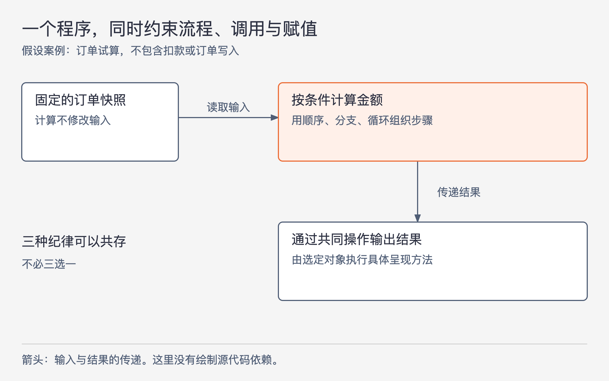

# 《架构整洁之道》第3章｜编程范式总览 · 书镜8.2

上一部分确定了架构要保护软件持续修改的能力。本章先提供一张理解后续内容的地图：结构化编程、面向对象编程、函数式编程分别约束控制怎样转移，以及数据怎样改变。它们可以同时出现在一个程序里。

## 一、原书回顾：三种范式分别限制了什么

### 结构化编程

作者把结构化编程列为最先普遍采用的一种范式，并把它的提出与Dijkstra在1968年的工作联系起来。这里“先被广泛采用”不等于“最早出现思想”。它针对的是不受限制的goto：程序可以突然跳到另一处，原本应当连在一起推理的步骤被打断。

使用顺序、条件分支和循环，可以明确地表达接下来执行哪段代码、何时重复、何时退出。作者把这种约束概括为对“程序控制权的直接转移”作限制和规范。所谓直接转移，就是代码直接规定下一处执行位置；本节还不展开正确性推导，下一章会说明为何限制跳转有利于拆分和验证程序。

### 面向对象编程

按本章叙述，Dahl和Nygaard在1966年总结的工作比结构化编程的提出更早。作者从ALGOL的调用栈帧讲起：一次函数调用所需的局部数据，通常跟着调用结束而结束；如果把保存这些数据的区域移到堆上，数据就能在函数返回后继续存在。原来的函数可被看作构造函数，留下来的局部变量成为成员变量，内部定义的函数成为成员方法。

这段历史线索解释了怎样得到有状态、能继续接收操作的对象。随后作者把架构上的注意力放到多态：调用者通过共同操作发出调用，具体执行哪个实现，由所用对象决定。与直接操作函数指针相比，语言可以提供更受约束的调用方式。

因此作者强调面向对象编程对“程序控制权的间接转移”作限制和规范。“间接”指调用点不直接写死最终实现地址，需要经对象或其他间接机制选定执行目标。本章把对象的形成与调用纪律连在一起，并未把堆内存这一实现线索当成所有面向对象语言的统一定义。

### 函数式编程

作者指出，尽管函数式编程在本书写作语境中较晚受到广泛关注，其思想基础更早：Church在1936年的λ演算，以及McCarthy在1958年以此为基础发展LISP的工作。

本书此处选择“不可变性”作为通往架构的重点。某个符号已经对应一个值，就不再把这个值覆盖成别的值；计算可以产生新值，但不依赖到处改写原值。作者因此把函数式编程概括为对赋值作限制和规范，也承认实际语言可能在严格条件下允许变量改变。

这个小节只建立方向，还没有说明一个要保存余额、订单等状态的系统如何做到这一点。第6章会把计算与状态修改分开讨论。

### 仅供思考

三个小节使用相同句式，是作者有意突出它们的共同点：范式使某些原本可以随意做的事情受到纪律约束。结构化编程限制无约束跳转，面向对象编程规范间接调用，函数式编程规范赋值。

“没有增加新能力”在这段讨论中，指这些范式的价值不依赖发明一种以前绝对算不出来的计算。它们改变了程序员组织已有计算能力的方式，使某些容易失控的写法不再那么自由。

作者进而猜测，若只讨论通过去除能力建立纪律的范式，这三种也许已经足够。他还以1958—1968年间的集中出现、此后未再出现同类范式作为支持。应保留“仅供思考”和这个分类范围：这是一项作者判断，不是本章证明了所有编程思想只能分成三类。前文1936年说的是数学基础，1958年说的是语言实现层面的时间线；不宜把两者压成同一个“诞生日期”。

### 本章小结

三种限制各自连接架构问题。结构化编程让模块中的算法能够按步骤拆解；多态为跨越架构边界提供手段；函数式编程帮助限制数据存放和访问方式。这分别关联功能性、组件独立性和数据管理。

作者在这里给出后续三章的入口，没有声称选用某一种语言就自动获得这些架构结果。需要继续看具体限制如何起作用。

## 二、主题讲解：在同一个小程序里看见三种限制

### 先把计算过程看清

以下是假设的订单试算程序：接收订单内容，判断是否满足优惠条件，算出应付金额，再把结果交给一种输出实现。为了隔离本章问题，先假定输入完整且计算规则固定，暂不处理下单扣款。

图3-1｜本文假设案例。箭头表示数据或计算结果的传递；图不表示源代码依赖，也没有声称一次试算已经保存订单。

输入是一份固定的订单快照；计算过程有明确的条件分支；输出通过一项共同操作交给所选实现。这三处安排可以同时存在，不需要把整个程序贴上唯一的范式标签。

### 直接控制转移关心下一步怎么走

假设订单金额达到门槛才减免运费。用条件分支表达后，读者能看到达到门槛和未达到门槛各做什么，之后两条路径又在哪里汇合。循环处理商品时，也能找到循环入口、每轮处理以及退出条件。

如果允许从任意位置跳进优惠计算中间，一段代码开始执行时是否已经算过总额，就不再容易判断。结构化编程限制这类自由，是为了让局部代码的前后条件能被跟踪。它没有替你保证门槛条件写对，只是让检查这件事更有着落。

### 间接控制转移关心由谁完成同一种操作

计算结果可能显示在页面，也可能输出到一份文件。调用者发出“呈现试算结果”的请求，由当前选定的对象执行对应实现。同一个调用动作可以到达不同方法，这就是这里需要理解的多态。

它带来的纪律是：通过约定的操作来调用，调用者不必手工保存、转换和使用任意函数地址。此时仍然要保证不同实现遵守相同输入输出约定。只有调用形式相同，却在一个实现中悄悄扣款，另一个实现只显示金额，就没有形成可靠的可替换行为。本章提供调用边界的出发点，第5章会进一步讨论依赖方向。

### 赋值限制关心旧值会不会被改掉

试算时可以读取订单快照，生成一个新的金额结果，而不把优惠后的价格写回输入订单。这样，再用同一份订单做另一种试算时，就不会因为上次计算留下的修改而得到不同结果。

这不是说结果没有变化。两次输入可以不同，因而结果不同；限制的是计算期间不任意改写原来共享的值。真正要持久化订单状态时，系统仍需要执行写入，因此还要为写入确定位置和规则。把这里的计算纪律与后续状态保存分开，才能理解函数式思路如何进入一个有业务状态的后端系统。

三种范式各解决一类问题：流程能否追踪、实现如何被调用、旧数据能否被改写。约束做法会减少一些写法选择，也使读者和工具更容易判断程序的行为；收益需要靠具体实现兑现。

## 用一个新情形检查理解

一个Java类中的方法使用清楚的循环，通过接口调用输出实现，却把所有请求都写入同一个可变金额列表。它遵循了几种纪律？

核对思路：它可能采用了结构化控制，也利用了面向对象的间接调用，但共享列表仍可随请求改变。是否妥善管理赋值与共享状态，需要单独检查。拥有类、接口或循环中的任意一种，都不能替其他方面的设计作担保。

## 来源、范围与阅读连接

依据《架构整洁之道》第3章，同版PDF第51—54页，书内页21—24。五个原小节按原顺序保留，已视觉核对第52—53页的标题、λ符号与时间线。历史年代和人物线索按本书转述，未进行编程语言史的外部研究；“只有三种”的说法保留为作者限定下的判断。订单试算为本文假设案例。第4—6章将依次展开三种范式，解释本章尚未给出的机制与限制。

<!-- source_sha256: 64400d05a5e1fe23dedbc41526c9227f74b3647fce36eda738a11c325074f2c3 -->
