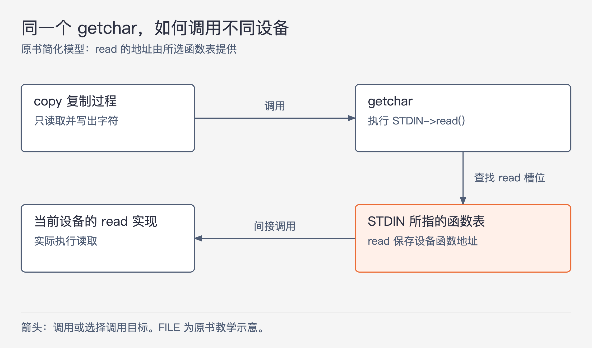
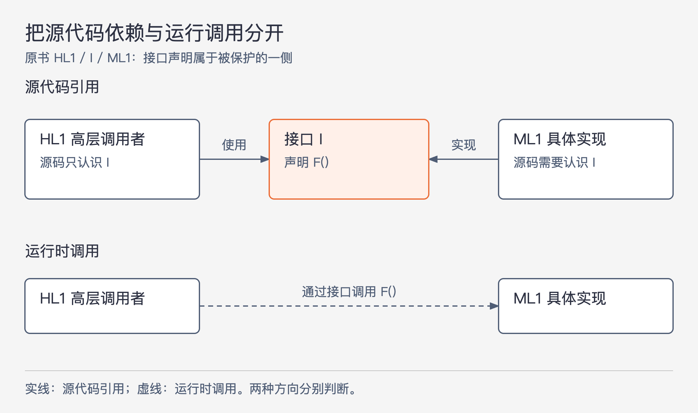

# 《架构整洁之道》第5章｜面向对象编程 · 书镜8.2

结构化编程帮助我们理解一个模块内部怎样运行。本章把视线移到模块之间：业务逻辑运行时要调用数据库，是否就必须在源代码里依赖数据库实现？作者通过封装、继承与多态，走到他最关心的答案——可以利用多态控制源代码依赖的方向。

## 一、原书回顾：从语言特性走到依赖反转

章首没有另设标题，先检查几种常见定义。“把数据和函数放在一起”不够，因为在对象出现之前，人们已经能把数据结构传给函数；仅比较`o.f()`与`f(o)`的写法，没有解释设计收益。“对真实世界建模”同样没有说明怎样建模、为什么更容易开发。作者于是逐项考察封装、继承、多态，分辨面向对象究竟提供了什么。

### 封装

封装让一组数据与操作形成边界，外部只能使用允许的操作，不需要直接接触内部数据。原书先用一个C语言Point程序展示：`point.h`只前置声明`struct Point`，提供`makePoint`和`distance`；结构体中的x、y，以及创建点、计算距离的实现，放在`point.c`。

调用者可以拿到Point指针，把两个点交给`distance`，但仅凭头文件看不到成员布局。距离计算内部才读取两点的x、y，分别求差，再计算√(dx²+dy²)。这个案例表明，即使没有类语法，也能让使用方式与数据实现分离。

接着作者把同一程序改写为C++。公开构造函数和`distance`，把x、y标成private，但类声明所在的头文件仍出现了这两个字段。脚注说明，此处编译器需要知道实例大小。编译器限制外部直接访问字段，却没有使字段的存在从头文件中消失；原文还指出修改字段名后`point.cc`需要重新编译。

作者据此区分了“限制访问”与“隐藏实现表示”，并批评把强封装说成面向对象独有的能力。他继续讨论Java、C#不再采用同样的头文件与实现文件分离形式，以及一些面向对象语言不强制封装的情况。这里是作者选择源码可见性这一角度作比较，不应读成private毫无作用，或非面向对象程序天然比任何面向对象程序封装得更好。

### 继承

原书继续扩展C程序，增加NamedPoint。Point包含x、y；NamedPoint在相同顺序的x、y之后多一个name，并提供创建、修改名字、读取名字的函数。

主程序创建原点`(0, 0, "origin")`和右上点`(1, 1, "upperRight")`，把NamedPoint指针显式转换为Point指针，交给原来的`distance`。作者借共同字段位于相同开头位置，说明如何让一种结构被另一种结构的操作使用。新结构保留坐标，再增加名字，原来的距离算法无需认识名字。

这种办法依赖程序员自己维持布局和转换约定；多重继承会更难处理。面向对象语言把许多约定交给语言机制，向上转换通常不再需要每次手写。作者承认这带来了明显便利，但认为它并未创造一种从前完全无法实现的能力。他用“封装0分、继承0.5分”的修辞，继续寻找更有架构意义的特性。

NamedPoint是原书的布局示意，不是本文建议直接采用的可移植C技巧。源页中的结构体转换、C++内部布局概括以及示例代码，都没有在这里接受完整语言标准或编译验证；保留它们要说明的复用关系，不把省略的实现约束补成保证。

### 多态

原书的`copy`循环不断调用`getchar`读取字符，只要不是EOF，就用`putchar`输出。程序不在循环里写死输入、输出设备。STDIN和STDOUT可以对应不同设备，同一个复制过程便能借具体实现完成不同设备上的操作。

图5-1｜根据原书PDF第69—70页的简化FILE示例重绘。箭头表示调用或选择调用目标；它不是所有UNIX系统的真实FILE布局说明。

为了解释间接调用，作者设想FILE结构体保存open、close、read、write、seek五个函数指针。控制台驱动提供对应函数，把地址装入一张表；STDIN指向这张表后，`getchar`调用`STDIN->read()`，最终执行控制台的读取函数。换一张遵守相同约定的表，就可以到达另一种设备实现。原书脚注明确说UNIX有很多变体，这只是一个例子。

作者用C++虚函数表vtable作类比：调用先经过保存实现地址的机制，再到达具体函数。它让读者理解多态为何不需要新增计算能力。本章没有给出每种编译器的对象布局规范，重点是这层间接性。

手工函数指针的问题，在于初始化地址、函数形式和调用方式都需要严格配合；有人破坏约定，错误会很难追踪。面向对象语言让多态更安全、更方便，减少手工维护这些约定的负担。作者因此把它连接回第3章：面向对象限制并规范了间接控制转移。“更安全”针对这类调用机制，并不意味着具体方法不会写错。

### 多态的强大性

现在给`copy`接入手写识别输入设备和语音合成输出设备，复制程序应改哪里？在原书设定下，只要设备实现同样的操作，`copy`源代码无需改变，也无需重新编译，因为它根本没有引用具体驱动代码。设备成为复制程序的插件。

作者随后解释这种需求的历史来源：早期程序直接绑定打孔卡输入输出，客户后来改用磁带，程序就要跟着重写。这里的打孔卡指当时常见的80列IBM Hollerith卡。需要在不同设备上完成同一功能，促使设备无关的安排出现；插件式架构使不变的程序行为与可替换的设备实现分开。

这段案例有实际前提：新设备要遵守原来约定，程序需要的读写能力也没有改变。若新设备不支持同一种交互，或业务本身要改变复制规则，就不能再只靠换插件解决。面向对象让这样的安排更容易进入普通应用，而非只停留在操作系统技巧中。

### 依赖反转

图5.1描绘直接调用的树：main调用高层函数，高层调用中层，中层调用底层。调用方在源码中要认识被调用的声明，所以在这个例子里，源码依赖与运行控制流一起向下。原文用C的include、Java的import和C#的using说明“源码要引用被调用者”；关键是引用关系，不是一定出现某个导入关键字。

图5-2｜根据原书图5.2分开画出两种关系。上半图是源代码引用，下半图是实际调用；ML1依赖接口的方向，与HL1调用ML1的方向并不相同。

引入接口I以后，高层模块HL1在源码中使用I声明的`F()`，低层模块ML1实现I。运行时，HL1仍然通过这次调用执行ML1的`F()`；源码上则是ML1需要认识I。这样，决定执行顺序与决定源码依赖方向可以分别考虑。

作者把这种关系称为依赖反转。图中的接口承担声明和约束的作用，真正完成工作的是具体实现。原书所说运行时“接口概念不存在”，这里按该例的调用含义理解，不延伸为所有运行时都不保留接口类型信息。

图5.3再把它应用到业务逻辑、用户界面和数据库：界面与数据库实现依赖业务逻辑所规定的边界，业务源码不必引用它们。它们便可以各自形成组件，例如jar、DLL或Gem。作者从这种分离继续推导独立部署能力，再推到不同团队独立开发的可能。

这里应分清方向与交付条件：依赖关系为组件独立创造条件，兼容的接口、数据含义以及合适的装配与发布方式，仍需落实。改变数据库实现但保留约定，与改变业务数据语义，是两种不同修改。依赖反转不会让后者自动对业务逻辑没有影响。

### 本章小结

作者承认面向对象有不同定义。他为架构师选择的重点是：用安全、便利的多态控制源码依赖，把高层策略与底层实现分开，使底层实现能够作为插件开发和部署。封装与继承的讨论是为了走到这个判断，并非要求读者放弃这些工具。

## 二、主题讲解：业务调用数据库，源码为何仍可不依赖数据库实现

### 先看依赖真正在哪里

下面是本文假设的订单查询功能。起初，查询用例直接创建`SqlOrderReader`，调用它读取订单。运行时用例调用SQL实现；源码里也出现了SQL实现类名及其返回类型。更换存储实现时，用例很可能跟着改。

现在用例只真正需要一件事：根据订单号取得它要展示的订单信息。可以把这项需要写成`OrderReader`操作，并让接口属于用例所规定的边界。SQL实现负责遵守这项操作，把数据库结果转换成用例认识的数据；用例只拿到一个已装配好的`OrderReader`。

改完后，运行顺序仍是用例请求读取、SQL实现执行、结果返回。改变的是源码：用例不再认识`SqlOrderReader`，SQL实现反而需要认识`OrderReader`。读图5-2时，可把HL1换成查询用例、I换成`OrderReader`、ML1换成SQL实现。

### 接口的存在还不够

假设`OrderReader`虽然叫通用名字，却要求返回SQL驱动自己的结果集对象。用例仍要知道驱动类型、列名和读取规则。以后替换驱动，这些知识会继续牵动用例。表面上的接口，没有完全切开要保护的依赖。

因此需要同时看接口的位置、参数与返回类型，以及错误的含义。如果用例必须处理“订单不存在”，接口就应能表达这个业务所需结果；至于数据库怎样发出查询、怎样把底层失败转换为用例能理解的结果，由实现边界负责。这里没有规定所有异常都应隐藏，关键是用例只依赖完成工作确实需要的含义。

对只有一个简单实现、没有具体隔离需要的内部方法，不必机械增加接口。接口会增加命名、装配和阅读成本。它的价值要能回答：保护哪段代码免受哪一类变化影响？

### 装配没有消失，只是位置改变

用例不创建SQL实现，并不表示程序凭空知道该用谁。启动或装配代码仍需选定实现，把它交给用例。这一处允许知道具体实现，因为它的职责就是连接部件。

测试查询规则时，可以给用例一个提供已知订单的简单替身；测试SQL实现时，再验证查询、数据映射和错误转换。替身让高层测试不依赖数据库，同时也提出要求：它必须遵守真实实现同样的约定，否则测试可能只验证了一个想象中的世界。

### 独立开发与独立部署要分别验收

两个团队可以围绕稳定的`OrderReader`约定并行工作，一个完成查询行为，一个完成存储读取。这体现独立开发。若更换实现的包以后，只需更新该包和必要装配，查询用例无需重新修改，那么又获得了某种独立部署能力。

但如果接口返回字段删了、错误含义改了，或数据迁移要求新旧代码协调，就仍可能需要共同发布。无论箭头画得多整齐，都要实测旧调用者能否与新实现合作。本章的依赖控制让可替换成为可设计的目标，不能用一张图替代兼容性验证。

## 用一个新情形检查理解

团队把所有类都改成“接口+实现”，却把接口放在数据库实现包中，而且接口返回驱动对象。业务包必须依赖这个包才能编译。这个改动是否已经实现了本章的依赖反转？

核对思路：调用经过接口，并不足以说明高层受到保护。应追踪业务源码和构建依赖仍认识哪些底层内容。若它仍必须知道驱动与实现包，目标依赖没有被有效隔离；应先确定业务需要的操作与数据，再决定接口归属及实现边界。

## 来源、范围与阅读连接

依据《架构整洁之道》第5章，同版PDF第62—74页，书内页32—44。保留章首定义辨析，以及封装、继承、多态、多态的强大性、依赖反转、本章小结六个原小节。已检查第64—70、72—74页的C/C++示例、脚注和图5.1—5.3。Point系列与copy属于原书案例；订单查询属于本文假设。原书代码存在大小写及排版差异，本文重述机制而未把其复制为已验证程序；FILE、继承内存布局与vtable均保留示意性质。下一章讨论数据被改写时产生的架构问题。

<!-- source_sha256: 64400d05a5e1fe23dedbc41526c9227f74b3647fce36eda738a11c325074f2c3 -->
