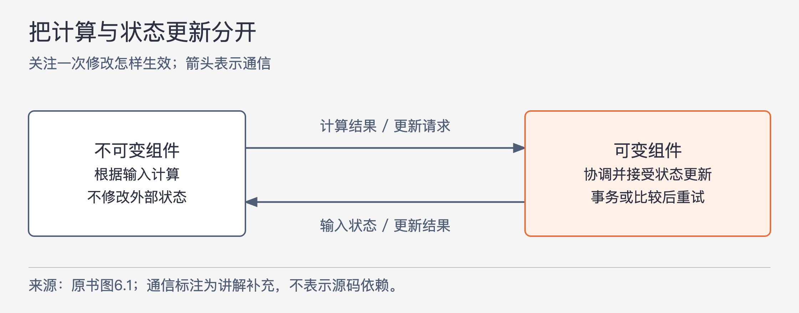
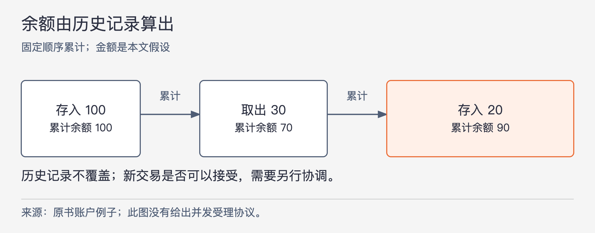

# 《架构整洁之道》第6章｜函数式编程 · 书镜8.2

前面的编程范式讨论怎样约束控制流程，本章转向另一个问题：程序执行时，哪些值允许改变？作者从整数平方讲到并发更新，再把问题扩大到整个系统如何保存状态。读完本章，应能区分不改状态的计算、受保护的状态修改，以及从历史记录重新算出状态这三件事。

## 一、原书回顾：从不修改变量到隔离状态变化

章首将函数式编程追溯到 Alonzo Church 在20世纪30年代提出的 λ 演算。这里的历史引入意在说明：这种编程思想的数学根源很早；本章并不展开 λ 演算，也不承担 Clojure 语言入门的任务。

### 整数平方

原例要输出从0开始的前25个整数的平方。Java 写法用循环控制变量 `i`，每轮输出 `i*i`，再执行 `i++`。同一个变量依次保存不同的值，程序靠它记录“现在走到哪一步”。

Clojure 写法把这个过程写成几个函数的组合：

```clojure
(println (take 25 (map (fn [x] (* x x)) (range))))
```

从里面向外读：`range` 提供从0开始的整数序列；`map` 对其中每个数应用匿名函数 `(fn [x] (* x x))`，得到平方值；`take` 只取前25项；`println` 输出结果。原书说序列可以是无穷的，又立即限定：元素在被需要时才生成，因此不要求先在内存里造出无穷多个数。

作者关注的是计算过程中如何使用变量。这里的 `x` 在一次函数求值中确定之后不再被改写；下一项计算收到的是另一个输入。Java 示例则反复改变 `i`。这是两段示例的差别，不宜直接读成“Java 无法组织不可变计算”，也不能把最后的输出操作当作纯计算本身。

### 不可变性与软件架构

一个线程读到旧值，另一个线程写入新值，前者再把依据旧值算出的结果覆盖回去，就可能丢失更新。作者用竞争、死锁和并发更新这些问题，说明共享可变状态为什么值得架构师关注：状态若根本不需要修改，就不必为争用这份状态安排修改次序。

原书把这一判断写得很强，认为没有可变变量就没有由它们引起的并发问题。理解时必须保留讨论范围：它解释的是共享状态的读写冲突；整套程序仍可能有输入输出、可变资源和计算能力限制。作者随即追问“完全不可变是否可行”，并给出条件——忽略存储和处理速度限制时可以设想，实际系统只能在资源允许的范围内采用。

### 可变性的隔离

既然现实应用仍需记录变化，下一步就是把两类工作分开。



图6-1｜依据原书图6.1重绘并补出通信含义。箭头表示传递数据或更新请求，不表示源码依赖；更新协调机制只放在可变组件一侧。

不可变组件用纯函数执行任务：根据输入算出结果，期间不改外部状态。需要保存变化时，它与可变组件通信，由后者执行修改。作者建议把大部分处理逻辑放在不可变组件里，把必须修改状态的部分尽量减小，再用合适的机制保护它。

原书以事务型内存类比数据库对数据的保护，随后用 Clojure 的一个 `atom` 计数器演示受控更新：

```clojure
(def counter (atom 0))
(swap! counter inc)
```

`counter` 初始为0。`swap!` 接收待更新的状态以及计算新值的函数 `inc`：读取旧值，计算旧值加1，在提交时比较状态是否仍与计算依据一致。一致才能接受结果；若已经被别人改过，就重新读取并重算。单次计算和接受这次计算结果，是两个不同步骤。

源页用“比较＋替换”并辅以锁的描述解释这个过程。本文保留比较、条件提交与重试的教学含义，不把这段描述扩写成当前 Clojure 的底层实现说明。作者还明确限定：单个计数器的办法不能直接解决多个相关变量必须一起改变的问题，更复杂的协调仍需其他机制。这里也不把 `atom` 与完整的多变量事务机制混为一谈。

### 事件溯源

作者进一步问：能不能减少需要覆盖写入的状态？银行账户是他的例子。通常每次存取款都修改余额；另一种做法只保存交易记录，查询余额时从头累计。用本文假设的金额来看：先存100，再取30，当前余额由这两条记录算成70，不必覆盖一个长期保存的“余额=70”字段。



图6-2｜沿用原书账户例子，金额100、−30、20为本文假设。箭头表示按记录顺序累计；图只解释余额重算，没有表示并发交易的受理规则。

这种把事务记录保存下来、需要时再计算具体状态的组织方式，在本章称为事件溯源。作者指出两个相连的代价：历史越长，存储越多；每次都从头算，处理开销也越大。要让它无期限成立，会需要无限资源，但实际程序的使用期限可能有限，资源也可能足以覆盖这个期限。可行性要落到预计记录量和查询成本上判断。

原书由此把 CRUD 中的更新、删除去掉，只保留创建和读取，并提出在足够资源下采用完全不可变的纯函数式计算。它最后以源代码管理程序作类比，并在脚注感谢 Greg Young 对事件溯源的指导。源码管理的类比帮助理解保留历史，不是本章对所有源码管理系统实现方式的验证。

原书“没有更新和删除，自然没有并发问题”的表述同样需要保留范围。历史记录不被覆盖，确实消除了覆盖这些记录造成的冲突；新记录如何接纳、排列，以及两笔支出能否同时成立，本章并未给出完整协议。下一部分用原例说明这个缺口，不能用“只追加”四个字代替它。

### 本章小结

作者把三种范式并排回看：结构化编程限制控制权的直接转移；面向对象编程限制控制权的间接转移；函数式编程限制赋值。它们通过放弃某些写法，让程序更容易组织和推理。

章末认为工具、硬件虽然不断变化，软件仍由顺序、分支、循环和间接转移这些基本行为组成，并以1946年图灵编程的历史表述强调这一连续性。这是作者对编程基本结构的总结，不应扩大成“软件工程几十年没有进步”的实证结论。

## 二、主题讲解：算出结果，与让结果生效分开

### 先把一次余额计算变成可重做的工作

下面沿用账户情形作假设推演。账户已有不可修改的记录“存入100、取出30”。计算函数接收这份记录，顺序累计，返回70。它不用知道调用者是谁，不覆盖原记录，也不直接写入新交易。相同记录交给它重算，仍得到70。

这样拆开后，可以单独检查累计规则：空记录是否为0、支出怎样影响结果、输入是否按约定顺序提供。测试计算时无需同时搭建账户写入流程。资源开销并没有消失，但“算得对不对”有了相对明确的边界。

如果只是把旧余额塞进不可重新赋值的引用，却仍允许其他代码修改它所指向的对象，原来的问题还在。判断不可变性要看计算依赖的数据能否被改变，不能只看变量声明的写法。

### 计算完成时，现实可能已经变了

现在有两笔各为50的支出，都读到余额70。分别计算时，两笔都认为余额足够；若都被接纳，最终余额为−30。即使两条支出记录创建后永不改写，重复依据同一份旧状态作决定的问题仍然存在。

因此，可变组件必须说明“依据哪一版状态作出的决定，什么时候允许生效”。可以先读取一版记录，交给纯计算判断，再在接受新交易时确认这版依据仍然有效；失效就重新判断。这里仅以本章的比较与重试思想推演，没有指定某个数据库或框架方案。若转账同时涉及两个账户，还需要保证两个相关变化满足共同约束，单个计数器的例子到这里就不够用了。

重试也解释了为什么计算应避免顺手产生外部效果。假设计算函数每运行一次就向外部发出“支付成功”的通知，发生重试时，通知可能重复，而交易尚未被接受。把通知安排到明确的生效流程中，才与“计算可以重做”的前提相容。

### 再判断是否值得保存全部历史

隔离可变性只要求把计算与更新分开，并不强迫账户必须使用事件溯源。仍保存当前余额，也能先计算再受控更新。采用事件溯源则进一步改变保存什么：长期保留记录，由记录还原余额。

若业务确实需要回看交易历史，而且记录数量和重算时间都可接受，这种方式能让状态来源清楚。若只需一个当前总数、历史极长而查询极频繁，每次从头累计就可能不合适。实际设计还会遇到加速重算等问题，本章没有展开其完整方案，不能因一个漂亮的累计例子就认定成本已经解决。

检验设计时，可以拿同一笔支出问三遍：计算能否在不写状态的情况下完成？它基于过期数据时如何拒绝或重做？保存的记录能否解释最终余额？三问分别检查计算、更新和历史来源，任何一个回答都不能替代另外两个。

## 自测：不可变交易记录能保证不超支吗

假设账户余额80，两笔60的支出同时到来。团队说：“我们只追加不可变记录，所以不会有并发问题。”仅凭这个条件能接受两笔支出吗？

核对思路：不能。记录写入后不改，不能保证两次判断没有共同使用旧余额。需要说明两笔请求的接受次序或冲突判定；后一笔必须基于仍有效的状态重新判断。重算余额能告诉你最终发生了什么，但不会自动阻止一个不应接受的交易。这个情形也说明，本章的不可变计算与事务协调是两项职责。

## 来源与范围

依据 Robert C. Martin《架构整洁之道》第6章，PDF物理第75—82页，正文书内第46—51页。原小节顺序完整保留；λ、Clojure表达式和 `atom` 示例已回看PDF第76、79页核对。金额推演为本文假设；并发交易的受理规则是从本章例子指出的适用边界，不是原书已给出的实现。未引入外部资料。下一章开始讨论模块应对谁的变更需求负责。

<!-- source_sha256: 64400d05a5e1fe23dedbc41526c9227f74b3647fce36eda738a11c325074f2c3 -->
