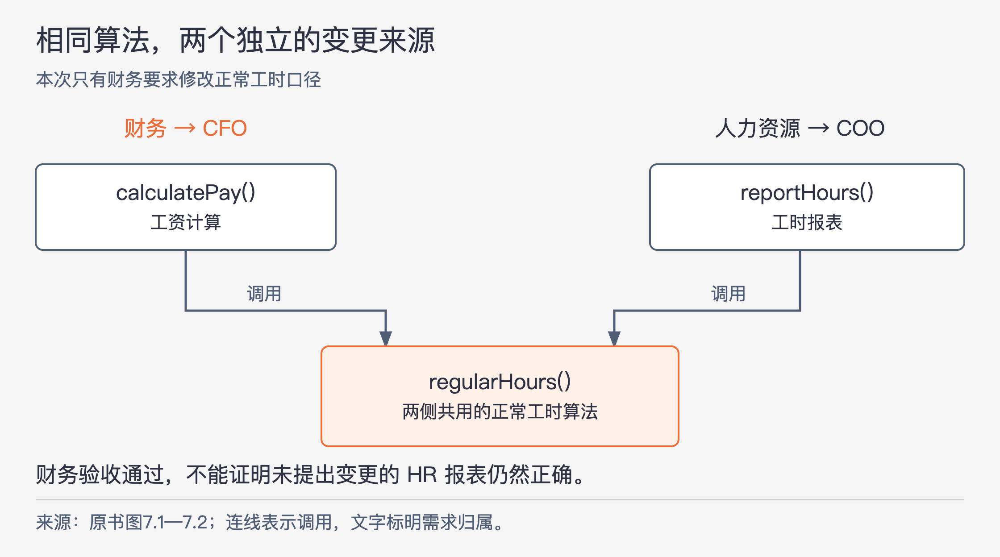

# 《架构整洁之道》第7章｜SRP：单一职责原则 · 书镜8.2

一个工资类可以只有几十行，却同时被财务、人力资源和数据库维护人员要求修改。它是否职责单一，光看类大小或方法数量很难判断。本章把“职责”放回提出变更的人及其需求上：哪些变化应该一起发生，哪些变化必须互不牵连？

## 一、原书回顾：从行为者识别应该分开的代码

章首先澄清一个常见误读。“一个函数只完成一个功能”是分解底层实现时有用的规则，但 SRP 所讨论的范围更大。它早期的表述是：一个软件模块有且仅有一个被修改的原因。作者继续追问原因来自哪里——系统为了满足用户或所有者的需要才会改变，因此模块应只对一类需求来源负责。

直接说“一个用户”仍然不够准确：多人可能提出相同方向的要求；同一组织里也可能存在不同方向的要求。作者把有共同需求的一组人称为**行为者**，最终将 SRP 表述为：一个软件模块只对某一类行为者负责。

模块通常可以是一个源代码文件；在不用文件组织代码的环境中，也可以是一组紧密相关的函数和数据结构。“相关”的依据是它们服务同一类行为者。这个定义不要求每个模块只容纳一次计算，也不能用一个宽泛名词把所有功能重新装到一起。

### 反面案例1：重复的假象

工资管理程序里的 `Employee` 类有三个方法。`calculatePay()` 由财务部门制定，对 CFO 负责；`reportHours()` 由人力资源部门制定并使用，对 COO 负责；`save()` 由 DBA 制定，对 CTO 负责。三类行为者都能因各自的需要要求修改这个类。

起初，计算工资与生成工时报表都要计算正常工作时数。程序员看见两段相同算法，就抽出 `regularHours()`，让两个方法共同调用。表面上消除了重复，实际也让财务和人力资源共享了一项可以被改动的计算规则。

图7-1｜依据原书图7.1、7.2展开。上半部标注需求归属，下半部箭头表示方法调用；橙色标出本次财务提出的变更。共用数据不等于应该共用规则。

后来 CFO 要求修改正常工时的计算方法，而 COO 团队不需要这项变化，因为两边使用工时数据的目的不同。负责修改的人看到了 `calculatePay()` 对 `regularHours()` 的调用，却没有发现报表也在调用它。财务验收通过，改动上线；HR 仍按原有含义使用报表，才发现报表数据已出错。

原书把后果写成给公司造成几百万美元损失。这是作者构造的反面情形，没有在本章提供事故来源或测量记录。它说明的机制是：一方有权要求的变化，经由共享代码影响了另一方；只验收提需求的一侧，无法证明另一侧仍符合原约定。

标题中的“重复的假象”因此很具体：两份实现眼下相同，并不足以证明背后是同一项规则。它们可能只是暂时算出同样结果，将来却由不同行为者分别修改。

### 反面案例2：代码合并

第二个例子不依赖共享算法。DBA 要改 Employee 数据库表结构，HR 同时要改工时报表格式。两名程序员为不同目的修改同一个 `Employee` 源文件，便需要协调和合并代码。

原书以冲突描述这个后果。具体修改是否一定产生文本冲突，要看改到的位置；更普遍的问题是，不同需求在同一修改范围相遇，合并或判断失误可能破坏保存、报表，甚至影响本来不需要改的工资功能。相同文件扩大了相互干扰的机会。

前一个例子是共享规则造成行为变化，后一个例子是共同修改范围造成开发协调。两者都支持把服务不同行为者的代码分开，但不能互相替代：把代码挪到不同文件却继续共用不该共用的算法，第一类问题仍然存在。

### 解决方案

作者给出三种组织方式，它们都把不同原因引起的变化放入不同类，区别在于调用方怎样接触这些类。

最直接的方案把数据和操作分开。`EmployeeData` 保存简单数据，不含处理函数；`PayCalculator`、`HourReporter`、`EmployeeSaver` 分别计算工资、生成报表、保存数据。三个操作类共同使用数据，但彼此看不到对方的私有计算过程，也不互相依赖。财务规则变化就可以留在工资计算一侧。

代价是调用者现在要处理三个类。为减轻这个负担，第二种方案增加 `EmployeeFacade`。它只负责初始化和转交调用，实际计算、报表和保存仍在各自的类中。一个统一入口可以继续存在；不能因此又把三套规则塞回入口类，否则只是换了名字。

第三种方案保留最重要的业务逻辑与数据的结合。原例把工资计算留在 `Employee`，把工时报表和保存委托给 `HourReporter` 与 `EmployeeSaver`。`Employee` 同时提供转交入口，另外两类的具体实现仍独立。这是原书展示的可选组织方式，不是要求所有程序都按“主业务加两个助手”布局。

图里每个类只展示一个主要方法，不代表类只能有一个方法。计算工资、生成报表、保存数据都可能需要很多私有函数。它们应围绕同一类行为者的需要协作，并把内部过程藏在自己的作用域里。SRP 允许这份复杂性，只要求它有一致的修改原因。

### 本章小结

本章主要在函数和类的关系上使用 SRP。同一种按变化来源分组的思路，到了组件层面表现为共同闭包原则；到了架构层面，则帮助识别划分边界的变更轴心。读到后面时，关注点会从“一个类装哪些方法”逐步扩展到“哪些组件应一起变、哪些边界应隔开变化”。

## 二、主题讲解：两段代码相同，先查规则是否相同

### 从一次工时变更开始判断

继续以工资程序作假设补充。起初，工资和 HR 报表都把一天工作8小时记为正常工时。现在财务决定：某类带薪培训时间计入工资中的正常工时；HR 仍希望报表反映实际工作的时间。两边使用同一批打卡与培训记录，却对“正常工时”提出了不同定义。

如果共同函数接到一个新参数 `forPayroll`，内部按财务或 HR 分支，程序暂时能算对。但下一次 HR 更改统计口径时，仍要进入这个共同函数；代码的修改原因仍有两类。分支越多，调用方越需要知道彼此的规则，原本独立的要求又被放在了一处。

更贴合本例的安排，是由工资计算和工时报表各自决定如何解释这些事实。这样可能保留部分相似代码，但两边可以分别测试培训时间的含义，也能明确谁应批准规则变化。区分依据是规则未来是否必须共同变化，不能仅凭当前算法长得像不像。

### 共用数据与共用决定可以分开

两边仍可以读取相同的原始考勤事实，例如某段工作开始与结束的时间。共享事实使输入一致，不等于所有用途必须共享同一解释。`EmployeeData` 的方案正是把这两件事拆开观察。

如果财务与 HR 明确采用一套共同批准的“正常工时”规则，而且每次修订都要求所有用途同步，那么提取共同实现可能合理。此时共享的是一项真正共同维护的决定。反过来，仅因两部门现在给出相同答案而抽成工具函数，就可能把暂时一致误当作长期约束。

因此，在删重复代码之前，可以拿一项可能变更作判断：“只修改工资的计算口径，报表要不要同时改变？”答案若是否定，就应让这项规则分别归属。共同读取数据的代码是否值得复用，则是另一个范围更小的问题。

### 拆分后继续检查实际影响

选择三个操作类或一个门面，要看调用方是否需要统一入口。门面可以替调用者转交请求，但不应偷偷决定财务与 HR 的具体计算口径。如果它开始累积这些规则，就要重新检查分工。

同时，拆文件不能保证完全独立。假设两个类都读取一个定义含糊的 `regularHours` 字段，且字段含义由财务随时改变，HR 即使换了文件也仍会受影响。应检查共享数据的含义是否稳定，并明确各自负责的解释。类图只显示容器，实际变化如何传播还要跟着调用和数据走一遍。

一次小范围验证可以采用前面的培训需求：工资结果按新规则变化，HR 报表仍保持旧口径，保存行为保持约定；再看实际需要改哪些规则与测试。若为了这一项工资调整，仍必须改动 HR 的判断过程，就说明分工尚未反映需求的独立性。这里检验的是分工效果，不以类数量增加作为成功标准。

### 行为者也不能照抄组织架构

原书用 CFO、COO、CTO 让三类需求来源容易辨认，并没有规定每个职位都必须对应一个软件类。多个团队共同遵守同一项规则时，可以算同一类行为者；同一负责人提出的两种互不相干要求，也可能需要不同的修改范围。

实践中先找谁定义规则、谁使用结果、谁能要求规则变化，再判断这些要求能否共同演进。组织会变化，规则也可能从共用变成分开，最初的划分仍需随着实际需求检查。SRP 提供的是判断边界的依据，不能预先替系统算出唯一的类结构。

## 自测：一个价格函数要不要拆

假设客户报价与内部成本报表都调用 `amount()`，当前实现相同。销售要求报价按新的客户优惠计算，财务要求成本报表保持原口径。团队准备给函数增加一个“调用部门”参数，认为每个方法仍只负责计算金额，因此符合 SRP。这个判断缺了什么？

核对思路：缺少对行为者和规则变化的区分。一次金额计算可以很短，却同时受两个独立要求影响。需要先确认报价和成本是否真是一项共同规则；按题设应分别归属，让共同的事实输入继续共享。不能因为都叫金额，就把两个决定合成一项职责；也不必因两个用途分开，就复制所有数据读取代码。

## 来源与范围

依据 Robert C. Martin《架构整洁之道》第7章，PDF物理第86—91页，正文书内第57—61页。保留未单列标题的定义引入，以及两个反面案例、三种解决方案和本章小结。已回看PDF第90—91页核对图7.3—7.5。带薪培训、共同数据字段与价格判断均为本文假设补充；损失情形属于原书案例，未作为真实事故验证。未使用外部资料。

<!-- source_sha256: 64400d05a5e1fe23dedbc41526c9227f74b3647fce36eda738a11c325074f2c3 -->
