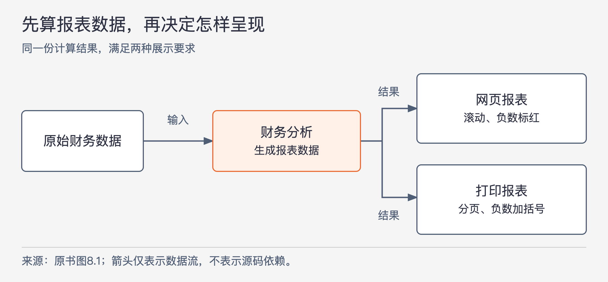
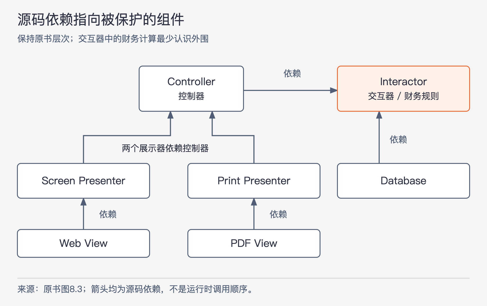

# 《架构整洁之道》第8章｜OCP：开闭原则 · 书镜8.2

上一章用行为者的变更需求划分职责。本章继续追问：职责分开之后，为什么增加打印报表仍可能迫使财务计算一起修改？作者用同一个报表系统说明，分组还需要配合依赖方向，才能把变化限制在相应组件里。

## 一、原书回顾：扩展报表时，保护不需要变化的计算

作者把开闭原则追溯到 Bertrand Meyer 1988年的《Object Oriented Software Construction》，脚注定位至该书第23页。原则要求软件容易扩展，同时限制对既有代码的修改。它在类和模块设计中有用，在架构层面则关系到一次需求延伸会牵动多少已有系统。

“抗拒修改”描述希望实现的保护效果。原书随后采用的衡量方式很实际：为了满足新增要求，需要修改多少旧代码？如果只是增加一种展示形式就要重写整个系统，原来的分工和依赖关系便值得检查。

### 思想实验

最初的需求是在网页上展示财务数据：内容可以滚动，负数显示为红色。接着所有者要求同一批数据能输出纸质报表：黑白打印、合理分页、每页带页头、页尾和栏目名，负数用括号表示。

新格式当然需要新代码。作者希望减少的是对原来财务计算的修改。他先用 SRP 分开生成财务报表数据和呈现报表，再用依赖反转原则调整分组之间的依赖。

图8-1｜依据原书图8.1重绘。箭头仅表示数据流；它没有说明源码应该依赖哪个组件。

计算阶段处理原始财务数据，形成报表所需的数据结构。呈现阶段则决定如何滚动、怎样标负数、在哪一页加标题。打印需求改变了后者，未必改变前者；这就是希望保护计算代码的原因。

原书随后把操作分成类，再把类放进组件。图8.2中，Controller 组件接收请求并组织后续工作；Interactor 组件包含财务报表计算与业务实体；Database 组件提供数据访问的具体实现；两种 Presenter 分别准备屏幕与打印展示数据；两个 View 分别实现网页和 PDF 输出。这里沿用图中英文名，并固定称 Controller 为控制器、Interactor 为交互器、Presenter 为展示器、View 为视图。

图里的 `<I>` 标记接口，`<DS>` 标记数据结构，使用箭头与继承或实现箭头有不同画法，但都属于源码依赖。A 指向 B，表示 A 的源代码需要知道 B 的声明；不能据此推断一次运行中数据只会从 A 流向 B。

图8-2｜依据原书图8.3重绘。所有箭头都表示源码依赖；这里保留原书的组件归属与保护层次，没有把运行调用画进同一张图。

图中，Web View 依赖 Screen Presenter，PDF View 依赖 Print Presenter；两个展示器依赖 Controller；Controller 与 Database 都依赖 Interactor。依赖跨越组件边界时保持单向，让变化较多的外围需要知道核心，而核心不必知道每一种外围实现。

作者据此形成不同的保护层次。交互器装着最高层次的应用策略，所以最需要保护；控制器相对交互器位于外侧，但相对展示器仍受保护；展示器又相对具体视图受保护。“高层”说的是本例中策略与细节的关系，不按窗口位置或调用发生的先后来判断。

如果财务计算规则没变，数据库实现、打印排版或网页样式的调整就应尽量不要求修改交互器。原书使用“不会影响”的强表述，理解时仍要保留前提：外围继续遵守既有接口与数据含义，变化没有改动核心业务要求。

### 依赖方向的控制

原书解释，图8.2看起来较复杂，是因为需要用接口控制边界。`FinancialReportGenerator` 负责报表计算，但不直接依赖数据库中的 `FinancialDataMapper`。它使用本组件里的 `FinancialDataGateway` 接口，而数据映射器实现这个接口。于是 Database 的源代码依赖 Interactor，交互器不必引用数据库实现。

调用时仍然可以从报表计算走到实际取数代码。改变的是编译时谁要认识谁：取数要求由计算侧声明，数据库侧提供实现。将接口单独写出来，才有机会让“需要数据”与“需要某种数据库实现”成为两件事。

同样，控制器所在组件中的 `FinancialReportPresenter` 接口，让两种具体展示器依赖控制器定义的约定。各展示器组件中的视图接口，又让具体 Web View、PDF View 依赖展示侧的要求。接口并不都是为了给类配一个同名外壳；每一个都承担一处依赖方向的调整。

### 信息隐藏

`FinancialReportRequester` 的用途不同。它留在交互器一侧，向控制器提供请求报表的入口，避免控制器直接依赖报表生成器的完整细节。原书指出，若控制器直接认识具体生成器，就会传递性地依赖它内部使用的 `FinancialEntities`。

这里的目标是减少控制器必须知道的信息：控制器提交请求、取得响应即可，不需要依赖财务实体如何参与计算。图8.2中的 `FinancialReportRequest` 与 `FinancialReportResponse` 是跨边界的数据结构；请求接口只暴露完成交互所需的能力。

因此，两个接口不能混为一谈：Gateway 用来改变计算与数据库之间的依赖方向；Requester 用来隐藏计算内部细节，限制控制器的知识范围。作者在此引出后续的接口隔离原则与共同复用原则：使用者不应因为使用一项能力，就连带依赖它不直接需要的部分。

### 本章小结

OCP 在架构层面的目标，是让新增行为尽量通过扩展相应组件实现，并限制修改传播。作者的方法包含两个连续步骤：按变更原因整理函数和组件，再把依赖组织成保护高层策略的方向。只有职责名称，没有实际依赖关系，保护就尚未成立。

## 二、主题讲解：用一项新增需求走过边界

### 先写清哪些内容确实没有变

继续用财务报表作假设推演。系统根据明细计算收入、支出和净额，网页目前把净额−20显示成红色。新增打印要求把它写成 `(20)`，并且每页重复栏目名。财务意义没有改变：净额仍是−20，变化发生在输出表达上。

如果计算函数直接拼接 HTML，负数格式和财务运算就在同一段代码里。增加打印时，要么复制整段计算后改格式，要么在计算代码里不断判断“当前是网页还是打印”。两种做法都会让一个格式需求触碰本来不必修改的计算。

先让计算产出不含 HTML 的报表数据，网页展示器与打印展示器分别解释这份数据。原书的数据流图解决的正是这一层分工。然后还需检查财务代码有没有引用某个打印类；如果存在，这条源码依赖仍可能把打印变化带回计算。

### 用接口调整一次具体依赖

假设计算需要“取得某期间的财务明细”。它可以依赖一个只表达这项需要的取数接口，由数据库组件实现。这样，数据库字段或查询组织发生改变时，实现侧负责把结果变成计算所需的输入，计算侧继续按相同含义使用这些数据。

如果接口参数要求传入某数据库连接对象，返回值又直接暴露数据库结果行，虽然新增了 `interface`，计算仍然知道具体取数方式。保护程度取决于声明中暴露了什么，不能只数接口数量。

相似地，展示接口可以接受已经算好的报表结果；它没有理由要求交互器去选择纸张宽度。把分页逻辑塞进高层接口，会使核心必须了解某种展示细节，削弱本来想保留的独立变化空间。接口的代价只有在对应真实的变化边界时才值得承担。

### 信息隐藏防止另一方向的牵连

现在数据库变化不容易牵动计算了，但控制器仍可能直接操作生成器内部的实体。假设计算内部为了组织规则调整了实体之间的关系，只要对外报表结果没变，控制器本来无需跟着改。若控制器遍历了这些实体，它就知道得太多。

Requester 把控制器需要的“生成一份报表”与生成器内部“具体怎样计算”隔开。这样同时满足两个方向的需要：交互器不依赖控制器的具体实现；控制器也只依赖交互器有意公开的入口和数据。依赖反转与信息隐藏在这里配合，但分别解决不同问题。

### 检查保护是否符合真实变更范围

如果明天新增 CSV 输出，且所需财务数据与计算含义完全相同，可以增加相应展示代码，再在程序组装处选择它。新增代码需要被接入运行，组装位置可能修改；OCP 不要求整套程序永远没有一行旧代码改变，它关注应该稳定的部分是否被无关变化牵动。

若新增的是“按一种新的会计口径重新计算净额”，变化已经进入高层规则本身，原先的展示边界无法替它隔离。此时应重新设计或扩展计算规则，不能为了追求零修改，把财务算法偷偷塞进打印器。

可以用两项需求检查同一设计：改变负数显示，应只触碰呈现与必要组装；改变净额定义，应能找到承担该定义的业务代码。若两项需求都落到同一大类，分工可能仍过粗；若改一个括号就要穿过很多纯转发层，也应检查是否付出了没有保护效果的间接调用成本。

## 自测：打印报表突然需要另一种总额

假设网页显示含某项调整的净额，打印报表新增要求排除该调整，并在末尾显示新的总额。团队把新的减法放入打印视图，理由是“扩展打印不能修改交互器”。这个决定是否符合本章思路？

核对思路：先区分排版与财务含义。括号、分页和页头属于呈现；哪些金额进入总额是业务规则。题设已经改变了计算需求，不能靠外移规则维持表面的零修改。应明确新增规则由谁制定，交给相应计算职责处理，展示侧只呈现结果。OCP 保护边界内的稳定规则，也允许边界面对真实业务变化时重新审视。

## 来源与范围

依据 Robert C. Martin《架构整洁之道》第8章，PDF物理第92—97页，正文书内第63—67页。保留思想实验、依赖方向的控制、信息隐藏和本章小结；章首定义与出处另保留。已回看PDF第95—97页，核对图8.2、8.3的组件归属、接口方向及两种接口用途。CSV、数据库接口参数和净额变化为本文假设推演。未引入外部资料，也未把该类图作为所有应用唯一的组织形式。

<!-- source_sha256: 64400d05a5e1fe23dedbc41526c9227f74b3647fce36eda738a11c325074f2c3 -->
