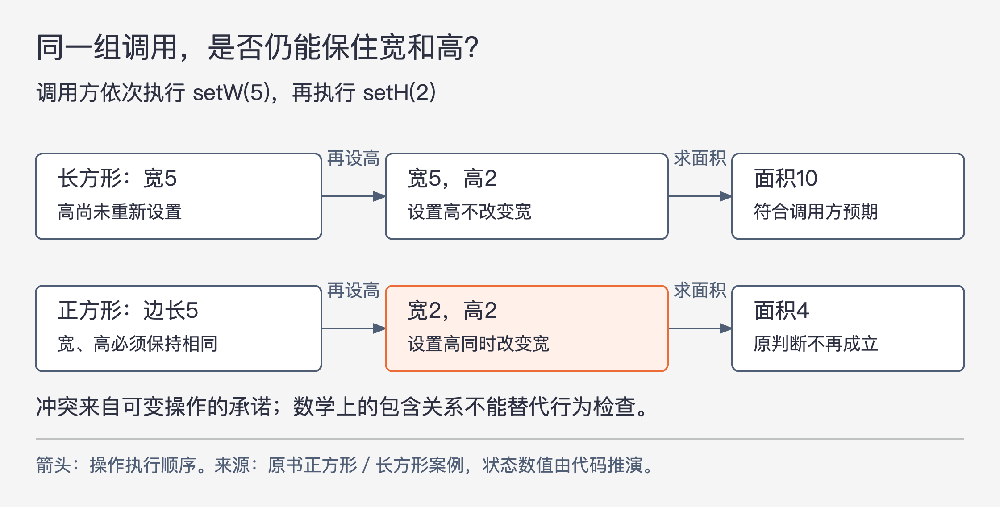

# 《架构整洁之道》第9章｜LSP：里氏替换原则 · 书镜8.2

把调用方写成依赖一个接口，还不能保证实现可以自由替换。新实现如果改变了调用方原本可以依靠的行为，调用方就得开始辨认“这次到底接入了谁”。本章从继承走到出租车服务，解释这种辨认为什么会逐渐变成架构负担。

## 一、原书回顾：从类型替换到服务替换

章首引用 Barbara Liskov 在1988年讨论子类型时提出的可替换性要求。结合本章后面的例子，可以把要求理解为：使用某个类型的程序，换用它的子类型对象后，原来成立的行为判断仍应成立。这里的“行为不变”不意味着各实现必须给出同一个数值；收费算法可以不同，但调用方依赖的规则不能被悄悄改变。原书脚注把这段定义定位到《Data Abstraction and Hierarchy》，发表于1988年5月的 SIGPLAN Notices。

### 继承的使用指导

原书先给出一个正常的继承关系。`Billing` 应用通过 `License.calcFee()` 计算授权费，`PersonalLicense` 和 `BusinessLicense` 分别采用个人授权与商业授权的收费算法。对于计费流程来说，任务都是“向授权对象询问费用，再完成计费”。

两个实现各自知道费用怎么算，`Billing` 不必先判断是个人授权还是商业授权，再亲自选择算法。新对象可以接替原对象承担同一个角色，调用方既有的处理方式仍然有效。因此，这个例子符合里氏替换原则，简称 LSP。判断依据在调用方是否还能按原来的约定工作，而不仅在类图上有没有画继承箭头。

### 正方形/长方形问题

几何学上正方形属于长方形，但原书讨论的是一组可修改对象所承诺的操作。`Rectangle` 允许独立设置宽与高；`Square` 必须保持两条边相等。下面按源页整理标点的示意代码暴露了冲突：

```java
Rectangle r = /* 某个实现 */;
r.setW(5);
r.setH(2);
assert r.area() == 10;
```

用户先设置宽为5，再设置高为2，期待面积等于10。这个推理暗含一个前提：`setH(2)` 不会重新修改先前设置的宽。若交给用户的是正方形对象，为保持正方形性质，第二次设置就必须连宽一起改；在这种实现下，面积会成为4。若坚持让宽保持5，又会破坏正方形自身的要求。两种操作承诺无法同时满足。



图9-1｜按原书图9.2及其代码展开状态变化；下行以“设置任一边时同步另一边”的实现说明矛盾。箭头表示执行顺序。

原书指出，保留这种类型关系又想让使用者工作，使用者就不得不加检测逻辑，分辨长方形和正方形，再分别处理。这样虽然可能补上眼前的结果，却让 `User` 依赖了具体种类，失去了可替换性。这个结论针对上述可变接口，并不是否认数学中的集合关系，也不是讨论所有可能的图形接口。

### LSP 与软件架构

作者把视线从父类与子类移向更广泛的接口。接口可以是 Java 中明确声明的方法集合，可以是 Ruby 中几个对象共同响应的方法，也可以是多家服务都承诺提供的 REST 接口。

这些形式有一个共同点：使用者掌握的是某种约定，并期待更换实现后仍能遵照约定工作。因此，即使两个服务没有共同的代码父类，也仍然有可替换性问题。架构层面的后果，往往表现为调用方越来越了解不同供应方的细节。

### 违反 LSP 的案例

原书假设有一个出租车调度网站，先帮乘客选车，再从司机记录中取出调度 URI，向相应服务发送调度请求。司机 Bob 的记录可以指向 `purplecab.com/driver/Bob`，系统再附加接车地址、接车时间和目的地。要让这条统一流程成立，各出租车公司必须用一致方式处理 `pickupAddress`、`pickupTime`、`destination`。

问题出在 Acme 公司把 `destination` 写成了 `dest`。这个差异虽小，统一请求却不能直接工作。原书还加入了商业与人情上的约束：Acme 是本地大公司，组织关系也让平台难以简单拒绝它。作者用带讽刺意味的情节提醒读者，真实架构常常要接纳一个不愿或不能改正接口的外部实现。

最直接的补救是检查司机 URI 是否以 `acme.com` 开头，命中后改用 `dest`。但是，这让“公司叫什么”和“请求怎样构造”绑在了一起。假如 Acme 收购 Purple，保留两个品牌，却把后台统一成同一系统，原来的公司名判断就不再足够，还得继续增加特殊分支。作者提及这种硬编码还可能带来隐蔽错误和安全问题，但本章没有展开具体攻击机制，不能把它当成已证明的漏洞。

作者提出的应对方式，是增加一个调度请求创建组件，由配置数据库保存不同 URI 对应的请求格式。例如 Acme 的模板使用 `dest`，通用模板使用 `destination`，其余字段仍一致。平台通过配置选择格式，把外部差异集中在请求构造处。

这个方案并没有让外部接口突然遵守统一约定。平台为不一致付出了一个额外组件、配置维护与选择规则的成本。正是这份本来可以不必承担的复杂性，说明 LSP 为什么会影响架构。

### 本章小结

作者主张把 LSP 用到架构层面。接口实现一旦不能替换，系统就需要补充识别、适配和配置机制。继承错误可能让一个类变复杂；服务接口不一致则可能把这份成本推到整个系统的组织方式上。

## 二、主题讲解：怎样判断“换一个实现”究竟换掉了什么

### 先写出调用方凭什么敢继续

下面是假设案例。一个订单系统接入两家运费服务，统一提供“按包裹和地址返回运费”的方法。甲返回12元，乙返回15元，差额本身不违反 LSP，因为选择不同承运商本来就可能得到不同报价。真正需要先问的是：订单系统凭返回值还能作出哪些判断？

假设双方约定金额单位为分，地址有效但不配送时返回明确的“不支持配送”结果，成功时金额可以用于展示和下单。若乙悄悄返回以元为单位的整数，或者把不配送伪装成0元，订单系统即使能够调用该方法，也会错误地展示金额或接受订单。方法名、参数类型相同，只覆盖了“能否调用”的一部分，尚未覆盖“调用以后能相信什么”。

长方形例子同理。使用者能相信的是设置高不会改宽，正方形实现改变的恰好是这个前提。先把前提说清楚，类型关系的争论就有了可检验的对象。

### 接口承诺需要足够具体，也应避免许诺过头

可以用同一份情形集合检查运费实现：同一金额单位、有效和无效地址、不配送、正常成功。检查的是每家都遵守的规则，而不是强求它们报价相等。若服务还承诺重复查询不创建订单，这也属于调用方可以依靠的行为；若没有作出时延承诺，就不能仅凭某一家更慢，直接判为违反本接口的 LSP。

这些检查是对本章思想的应用，不是原书提供的测试规范。它们的价值在于把“实现看起来差不多”变成“哪些共同约定成立”。同样，也不要把所有可想到的性质都写成约定。承诺越多，替换实现要满足的条件越多，维护共同接口的成本就越高。

### 无法改变供应方时，把差异放在一处承担

现在假设乙坚持使用元，订单系统又必须接入它。可以在乙的接入组件里完成单位转换，让订单系统始终接收分。如此一来，乙的原接口仍与甲不同，但接入组件对订单系统暴露的接口可以恢复可替换性。

这和原书的出租车请求创建组件承担的是同一种工作：明确识别差异，在一个受控位置转换，避免每个使用者都重复判断供应方。代价也必须算进去：转换规则要有人维护，配置必须正确，失败结果要能表达，供应方变更后还要重新检查。增加适配有时是必要选择，但不应据此宣称最初的不一致没有成本。

若两家服务根本不能承担同一种任务，例如一家只报价，另一家同时自动购买运单，那么先拆清任务，比用统一方法掩盖副作用更合适。共同接口应来自调用方确实需要的共同能力。

## 自测：结果相同就可以替换吗

假设两个折扣实现对普通订单都返回相同金额。第一个只计算价格，第二个计算后会立即消耗优惠券。它们能否放进同一个“试算”接口，任意替换？

核对思路：看试算接口是否承诺不改变订单和优惠券状态。如果承诺了，第二个实现破坏了调用方赖以安全重试、反复展示的条件，金额相同也不能弥补。可以把消耗优惠券放到明确的确认操作里，或改变接口表达，使调用方清楚操作的效果；仅靠增加一个供应方判断，会继续扩大调用方对具体实现的了解。

## 来源与范围

本章依据 Robert C. Martin《架构整洁之道》第9章，PDF物理第98—103页（正文书内第69—73页），以所供原文单元和同版页图为源。原书小节按原顺序保留。已查看PDF第99、100、102页，核对图9.1、图9.2、代码与 URI 模板；源页引文的对象替换表述存在方向歧义，本文依据同章案例解释，不照抄符号次序。运费与折扣案例均为本文构造。下一章将继续追问：即使接口行为可靠，调用方是否仍依赖了它用不上的部分？

<!-- source_sha256: 64400d05a5e1fe23dedbc41526c9227f74b3647fce36eda738a11c325074f2c3 -->
