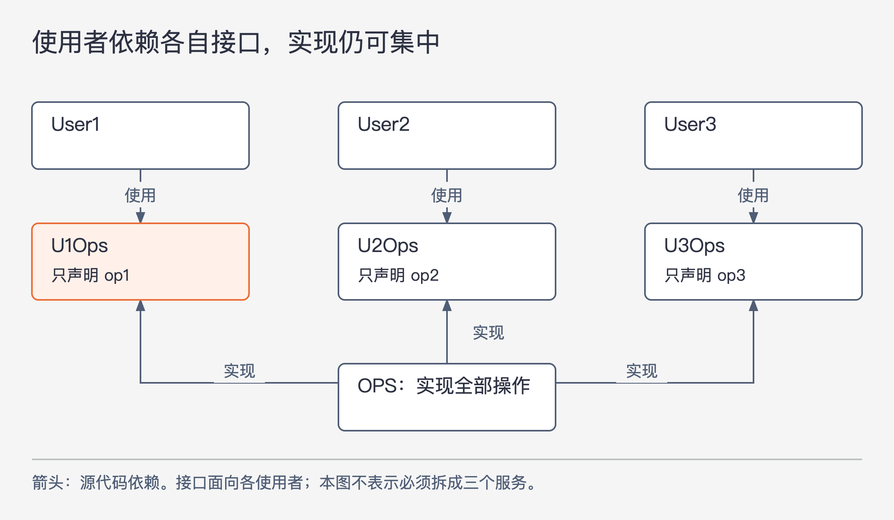

# 《架构整洁之道》第10章｜ISP：接口隔离原则 · 书镜8.2

调用方只用一个方法，为什么还可能被另外两个方法的修改牵连？第9章检查“换实现后行为是否可靠”，本章检查“为了使用某项能力，究竟依赖了多少东西”。作者先从类接口讲起，再追到框架和数据库的依赖链。

## 一、原书回顾：不需要的功能如何带来依赖成本

原书开篇没有另设小节标题，直接用 `OPS` 的结构引出接口隔离原则，简称 ISP。`OPS` 提供 `op1`、`op2`、`op3`；`User1` 只用 `op1`，`User2` 只用 `op2`，`User3` 只用 `op3`。三个使用者却都直接依赖同一个类。

作者以 Java 为例指出，使用者虽然不调用全部方法，仍会在源代码层次依赖包含这些方法的类型。于是，`op2` 所属代码发生改变，也可能把不需要它的 `User1` 带进重新编译、重新部署的范围。问题的起点是使用范围窄，依赖范围却宽。

图10-1｜按原书图10.2重绘。所有箭头表示源代码依赖，带“实现”标注的箭头表示实现类依赖接口定义；不表示运行调用先后。

作者的改法是让 `OPS` 实现三个接口：`U1Ops` 只声明 `op1`，`U2Ops` 只声明 `op2`，`U3Ops` 只声明 `op3`。使用者依赖自己需要的接口，具体实现仍可以留在同一个 `OPS` 中。原书强调，只要后续 `OPS` 的修改不影响 `User1` 需要的功能，`User1` 就不再因为直接依赖 `OPS` 而承受同样的修改传播。

这个例子没有要求立即把 `OPS` 拆成三个运行服务。先被分开的，是不同使用者在源代码里看见的操作集合。编译、打包、部署是否也能分别完成，还要让实际工程结构支持这条边界；原书此处用简化的语言与构建模型说明原理。

### ISP 与编程语言

作者随后审视上述结论对语言的依赖。在静态类型语言中，源代码要引用相关类型声明，编译工具据此检查调用，这也建立了源文件或模块之间的依赖。书中用 `import`、`use`、`include` 概括这类引用方式。

作者把 Ruby、Python 的动态类型使用方式作为对照：调用处不必像前例那样，先绑定到包含全部方法的显式类型声明，对象能响应哪些操作可以在运行时确定。因此，前例中由静态声明产生的某些强制重编译关系并不以相同方式存在。作者据此讨论了动态类型在这一方面的灵活性。

这段比较服务于一个限定：ISP 的具体症状会受语言机制影响。不能由此推断动态语言没有模块依赖、没有导入、没有部署成本，更不能把 ISP 简化成“换一种语言就不需要考虑”。原书接着转向架构，正是为了说明问题超出了类型声明。

### ISP 与软件架构

原书设想系统 `S` 引入框架 `F`，框架又绑定数据库 `D`，形成 `S → F → D` 的依赖链。假设 `D` 带有一些 `F` 根本不用的功能，那么 `S` 也不需要这些功能；但“我不使用”不代表“我不会受影响”。

如果这些功能与数据库其他部分一起发布，修改它们可能迫使框架重新部署，再连带系统重新部署。更严重时，一个无关功能的错误也可能使框架和系统运行出错。这里讨论的成本已经不只是编译，而是整条依赖链中的发布与运行风险。

作者把两组例子接在一起，是要读者看到同一件事：依赖一个范围过大的东西，可能被迫承担自己根本用不到的部分所带来的变化。接口隔离在架构层面的意义，是缩小这种被迫承担的范围。

### 本章小结

任何层次的设计，如果依赖了它不需要的内容，都可能引入额外麻烦。作者在本章先建立这个判断，第13章会用共同复用原则继续讨论组件的边界：把不该一起依赖的类装在一个组件里，也会产生类似问题。

## 二、主题讲解：从“只调用一个方法”走到“只承担必要依赖”

### 按使用者需要的工作划接口

下面用一个假设的订单后台继续解释。收银页面需要查询订单金额，客服页面需要取消订单，财务导出需要读取对账数据。如果三者都依赖一个包含几十个操作的 `OrderOperations`，它们会共享一个很宽的变更入口。财务字段和取消规则经常由不同需求推动，这种变化不必全部传给收银页面。

第一步可以让收银页面只依赖“查询订单金额”的接口。这里不必先争论接口最多有几个方法；如果查询金额总是需要一起取得币种，两项操作也可能合理地属于同一个接口。划分依据是使用者共同需要什么，以及这些需要是否会一起变化。

原书 `U1Ops` 只有一个方法，是为了让问题显眼。把它机械理解为“每个接口只能有一个方法”，会使调用方为一个完整任务同时拼接许多细碎接口，增加理解和组装成本。真正要避免的是无关操作进入调用方必须依赖的范围。

### 类型边界只是开始，还要检查包里装了什么

现在假设团队为收银页面新建了一个小接口，但把它放在同时包含财务导出实现、报表模板和数据库适配的同一个发布包里。收银源码确实更清楚了；然而只要发布包仍作为整体更新，收银模块还是可能被迫跟着升级。

因此应分别检查三个问题：源码引用的是哪种类型，构建时必须引入哪个包，运行时必须启动或安装哪些东西。这三者可能一致，也可能完全不同。原书 `S → F → D` 的例子正是提醒我们，接口上没出现的功能，仍可能通过框架的整体依赖被带进系统。

对这个假设系统，可先把调用方需要的接口与数据定义放进较小的依赖单元，把重型实现留在组装和运行处。是否需要再拆发布包，要根据实际变更和构建关系判断。仅仅多声明几个接口，不能证明构建与部署已经独立。

### 判断隔离是否值得，要看变化传播到哪里

可以拿一次真实或预设变更做检查：财务新增导出字段后，收银页面是否需要改源码？是否必须更新依赖包？是否要重新验证金额查询？若其中某项仍被牵连，就继续追查它依赖了什么，而不是只看接口方法数变少了多少。

同样需要保留一个边界：把功能拆开并不自动消除共享资源造成的影响。即使两个小接口分别声明，底层仍可能使用同一个失败的数据库。ISP 能帮助发现不必要的依赖，不能凭一个接口声明隔离所有运行故障。若共同依赖确实不可避免，也应把成本说明白，不用图上的分框假装它已经消失。

## 自测：小接口为何仍随大包发布

假设一个图片预览功能只需要文档组件中的“读取标题”，接口也确实只有这个方法。但每次排版引擎更新，预览程序都得重新发布。这是否说明 ISP 没有用？

核对思路：先检查“读取标题”的声明、实现、发布包分别放在哪里。如果它们和排版引擎绑在同一个必须整体更新的包中，类级接口隔离只完成了一层工作；组件依赖还没有隔离。反过来，若两者共享一个必要且稳定的数据格式，不能因为存在任何联系就认定设计失败。要找到这次无关修改为何沿依赖链传播，再决定是否拆包。

## 来源与范围

依据 Robert C. Martin《架构整洁之道》第10章，PDF物理第104—107页（正文书内第75—77页）。开篇 `OPS` 案例原本没有独立小标题；随后三个原小节按顺序保留。已查看PDF第105—106页，核对图10.1—10.3和语言比较。本文保留作者关于编译、部署的论证，并明确其简化语境，不把它扩大为所有语言与构建系统的无条件规则。订单后台与图片预览案例为本文假设；没有引入外部技术版本事实。

<!-- source_sha256: 64400d05a5e1fe23dedbc41526c9227f74b3647fce36eda738a11c325074f2c3 -->
