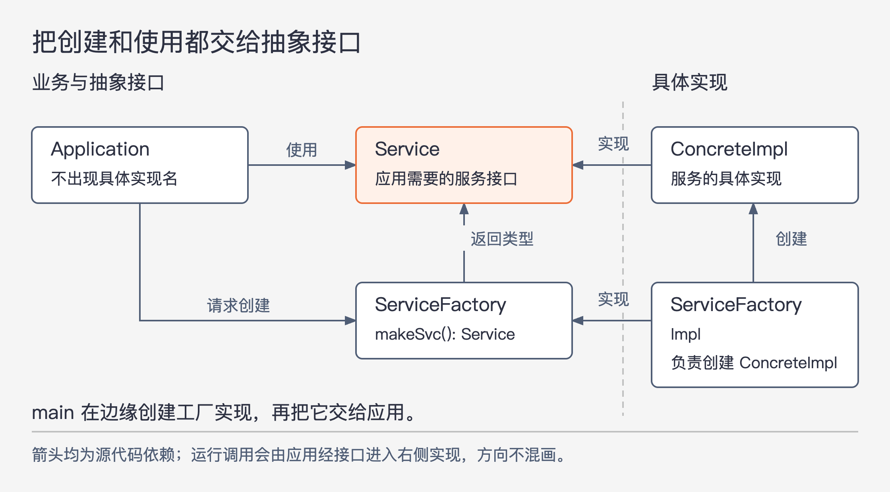

# 《架构整洁之道》第11章｜DIP：依赖反转原则 · 书镜8.2

当高层业务要调用数据库、文件或某种服务实现时，源码是否必须跟着依赖这些实现？本章回答：可以把业务需要的操作声明成接口，让具体实现来依赖接口。调用仍然发生，容易变化的细节却不必进入业务代码。难点还剩一个：谁负责创建那些具体对象？

## 一、原书回顾：把易变实现的名字移出高层代码

章首没有单独小标题。作者先提出依赖反转原则，简称 DIP：希望系统具有灵活性，源码引用就应更多指向抽象类型，而不是具体实现。在静态类型语言里，这体现为引用接口、抽象类等声明；在动态类型语言里，也要注意不要直接依赖装有具体实现的模块，只是“抽象”与“具体”的分界不一定同样明确。

作者随即限制这条原则的适用范围。完全不引用任何具体实现并不现实。`String` 本身是具体类，但它十分稳定，修改受严格控制，没有必要为回避它再制造一层抽象。原书也把稳定的操作系统和平台设施列为不必一概回避的依赖。应优先处理的是系统内部不断开发、经常改变的具体实现；判断中不可丢掉“易变”这一条件。

### 稳定的抽象层

作者用接口与实现之间的不对称关系解释稳定性：修改接口，往往要调整对应实现；修改实现内部，却经常不需要修改接口。例如算法可以换一种写法，只要输入、输出及行为约定没变，使用者就不用跟着改。因此，设计者会努力让新增功能和内部调整在既有接口后面完成。

这里的稳定性依靠设计工作获得。仅仅声明一个接口，并不能保证它不会频繁变化。原书的目标是让依赖指向能够保持的操作约定，从而减少容易改变的实现向外传播。

作者把这一目标具体化为四条编码守则：

- 多使用抽象接口，避免直接使用易变的具体实现；对象创建也要受约束，抽象工厂是后文给出的办法。
- 不从具体实现类继续派生。继承把衍生类紧紧连到父类实现上，尤其在静态类型语言中不易改动；动态语言也应认真考虑这种联系。
- 不靠覆盖一个已经包含实现的方法来消除依赖。衍生类仍然继承原实现所在的关系。若需要多种行为，应先提供抽象操作，再分别实现。
- 避免在需要保持稳定的代码里写入易变具体实现或其他易变事物的名字。这是从源码引用角度再表达一次 DIP。

这些是本章作者的设计守则，应与前面的易变性限定一起理解。它们不是“所有具体类都不许使用”的禁令。

### 工厂模式

即使业务代码只通过 `Service` 接口调用对象，若它还写着创建 `ConcreteImpl` 的语句，就仍然知道具体实现的名字。接口隔离了“怎样使用”，创建却又把这条依赖接了回来。

图11-1｜按原书图11.1重新布局；所有箭头都是源代码依赖，“实现”“返回类型”“创建”说明依赖原因。虚线是架构边界，不是进程边界。

原书让 `Application` 改为调用 `ServiceFactory` 接口上的 `makeSvc()`。`ServiceFactoryImpl` 实现这个方法，负责创建 `ConcreteImpl`，并以 `Service` 类型返回。于是，应用只需要知道“怎样请求一个服务对象”和“怎样使用它”，不需要知道实际构造哪个类。

原图的边界把 `Application`、`Service`、`ServiceFactory` 与两个具体实现分开。抽象一侧包含高阶业务规则及其需要的接口；具体一侧包含完成这些规则所需的操作细节。跨界的源码依赖由具体一侧指向抽象一侧：服务实现依赖服务接口，工厂实现依赖工厂接口。

运行时，应用调用工厂，实际执行的是工厂实现；应用调用服务，实际执行的是服务实现。因此在这些跨边界调用上，控制流从业务走向具体操作，而源码依赖反向指向业务所依赖的抽象。这是本例“依赖反转”的含义。它描述的是这里经过接口的跨界关系，不应读成所有代码中的每一条依赖都必须与每一条调用相反。

### 具体实现组件

原书没有假装具体依赖可以消失。`ServiceFactoryImpl` 创建 `ConcreteImpl`，这条具体实现之间的引用依然存在。解决方式是把此类依赖集中到少量具体实现组件中，使系统其他部分不必知道它们。

此外，还需要创建工厂实现本身。作者把这项责任交给通常包含入口函数的 `main` 组件。原例中，`main` 创建 `ServiceFactoryImpl`，把它赋给类型为 `ServiceFactory` 的全局变量，供应用使用。脚注说明，这里的 `main` 指操作系统启动应用时进入的函数。

全局变量是原书在本例选用的组装方式，读者应保留它的案例身份。真正承担论证的是“具体对象的创建集中在边缘，业务通过抽象取得它”，并不是要求所有系统使用全局变量。

### 本章小结

DIP 会在后续架构章节中反复出现。原图里的分界将被称为架构边界，跨界源码依赖朝向抽象一侧的要求，将进一步成为依赖守则。本章把这个组织方式落实到了接口、创建对象和入口组装三件具体事情上。

## 二、主题讲解：业务可以使用细节，却不必认识细节

### 从一个退款用例追踪名字出现在哪里

下面是假设案例。退款业务先判断订单是否允许退款，再请支付方退款，最后记录结果。最直接的写法是在业务方法中创建 `VendorPaymentClient`，然后调用它。问题在于，退款规则与某一家支付接口的类名、初始化参数、返回格式出现在同一段代码里。供应方 SDK 改动时，即使“已发货订单不能直接退款”的规则没有变化，业务文件也可能需要调整。

可以先定义业务需要的 `RefundGateway`：接受本次退款所需的信息，返回业务能够解释的退款结果。业务用这个接口表达请求，供应方适配实现负责把请求转换成对方需要的形式，再把结果转换回来。这里“高层”指决定退款何时允许、结果怎样处理的规则；“细节”指某一家供应方要求的调用格式和连接方式。

两者都可以有复杂代码。高层与细节的区分不按代码行数，也不按谁先被调用，而按哪部分表达业务选择、哪部分完成具体手段。

### 接口放错位置，名字仍然会漏回来

假设 `RefundGateway` 返回的类型直接叫 `VendorRefundResponse`。业务必须认识供应方返回对象，才能判断是否成功，那么只把方法调用换成接口还不够。供应方类型仍然穿过边界，业务仍被它约束。

可以让接口返回业务自己的退款结果，例如明确区分完成、拒绝和结果尚不确定；这些分类在本假设中必须来自退款流程真正需要的判断，而不是盲目照抄供应方字段。适配实现承担解释供应方响应的工作。这样，接口较有机会随着退款任务保持稳定，细节也有空间独立变化。

代价是多了转换和命名工作。如果业务确实依赖供应方特有能力，就不能把这种差异塞进一个看似通用、实际什么也没说明的对象中。先承认需求有差异，再决定需要哪种接口，比把所有字段装进通用容器更容易检查。

### 创建对象的责任也要走出业务

下一步看组装。若退款用例启动时仍然创建 `VendorRefundGateway`，它还是直接引用了具体类。一个更简单的假设实现，是让入口代码创建适配对象，再通过构造参数交给退款用例。用例只保存 `RefundGateway` 类型的引用。

若业务执行过程中必须按任务创建新对象，就可以像原书那样使用抽象工厂。选择工厂不是为了让每个对象都多经过一个接口，而是因为“运行中需要创建易变对象”是实际存在的需要。已有对象能够从入口直接传入时，未必还需要一套工厂。

无论采用哪种组装方式，总有一处代码知道具体类。DIP 要控制的是这份知识由谁掌握、会影响谁。入口或适配组件通常可以承担具体知识；稳定业务不必因此跟着认识供应商。

### 稳定来自约定，而不来自 interface 关键字

如果每天有新需求迫使 `RefundGateway` 加入某个供应方特有参数，说明接口可能仍围绕实现细节设计。应回到退款业务需要的动作与结果，检查能否把变化留在适配中。另一方面，如果业务规则本身真的变化，例如新增部分退款，接口发生相应变化也合理。DIP 不承诺业务永远不改代码。

判断收益时，拿一次具体变化走一遍：供应方换了认证参数，退款用例是否要改？仅内部重试方式改变，业务接口是否要改？业务新增一类退款结果，相关调用方是否确实需要知道？前两项若被隔离，后一项仍正常传播，就比“所有类前面都有接口”更接近本章追求的效果。

## 自测：用了接口，为何业务还要随供应方升级

假设订单业务只引用 `ShippingGateway`，但该接口扩展了某供应方的接口，返回值也是供应方的响应类。替换供应方时，订单业务仍需大量修改。最先检查什么？

核对思路：沿接口声明中的继承关系、参数和返回类型检查具体依赖。接口本身若依赖易变实现，业务只是隔着一层名字继续依赖它。应重新确定业务需要的操作与数据，把供应方格式的转换留在适配处；不必因为这次失败就替所有稳定平台类型再造包装。

## 来源与范围

依据 Robert C. Martin《架构整洁之道》第11章，PDF物理第108—112页（正文书内第79—82页）。章首论证与四个原小节完整保留。已查看PDF第110—111页，核对四条守则、图11.1的接口关系和 `makeSvc()` 拼写。原书的全局变量与 main 组装保留为原例，构造参数传入及退款、物流案例为本文讲解假设。本文没有把依赖反转等同于某个框架的依赖注入功能。

<!-- source_sha256: 64400d05a5e1fe23dedbc41526c9227f74b3647fce36eda738a11c325074f2c3 -->
