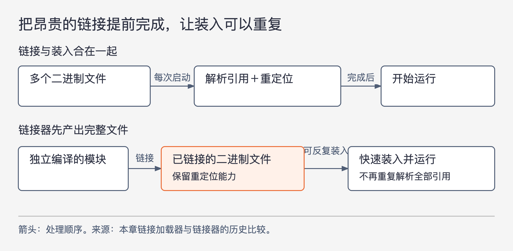

# 《架构整洁之道》第12章｜组件 · 书镜8.2

前几章讨论类与接口之间的关系。到了本章，单位变大了：一组代码怎样才能单独开发、组合和部署？作者用编译、内存和链接工具的历史说明，今天习以为常的组件，并不只是给目录换了一个名字。

## 一、原书回顾：从固定内存地址到可独立部署的单元

章首定义组件为软件的部署单元，即部署过程中能够独立处理的最小实体。原书列举 Java 的 JAR、Ruby 的 gem、.NET 的 DLL：编译运行的语言通常交付二进制集合，解释运行的语言可以交付源文件集合，但它们都要形成一个可识别的部署单位。

组件还可以再次组合。多个组件可以链接成可执行文件，汇集为 WAR 一类较大的部署单元，也可以用 JAR、DLL、EXE 等形式成为动态加载的插件。作者强调，最终组合方式不应夺走组件独立部署的能力；这种能力也意味着组件应能被单独开发。这里的“独立”允许通过约定好的接口使用其他组件，不等于不依赖任何东西。

### 组件发展史

早期程序员要自己决定程序在内存中的位置。原书用一段 PDP-8 程序举例：开头的 `*200` 是起源声明，告诉工具把生成的代码放到八进制地址200。程序包含 `GETSTR`，用于从键盘读字符串到缓冲区；测试部分先调用读取，再调用 `PUTSTR` 输出，并回到起点。代码的作用是展示程序、库函数和内存位置如何紧密绑在一起，而非教授完整的 PDP-8 指令集。

那时程序一般不能随意重定位。要使用库函数，程序员会把所需库函数的源代码接到自己的程序中，再整体编译。作者脚注回忆，第一份工作中的函数库以许多盒打孔卡存放，使用时从书架取下对应盒子，放到新程序后面。这是作者的亲历描述，说明“包含源代码”在当时甚至是一项物理操作。

整体编译之所以慢，还受硬件约束。内存昂贵且容量小，无法把全部源码一直放在内存中；编译器又要多次遍历源码，只能反复访问缓慢存储。函数库越大，重复读取越多，大程序一次编译可能需要数小时。

第一步改进是把库预先单独编译，安排到某个固定位置，例如八进制2000，并产生符号表供应用编译时使用。运行前装入二进制库，再装入应用，就不必每次重编译全部库源码。原书还说明，使用磁芯内存的旧机器关机后可保留内容，库代码有时能留在内存中好几天。

图12-1｜依据原书图12.1、12.2简化内存区域；地址均为八进制，区域高度只表达顺序，不按字节数比例绘制。

新问题随规模增长出现。应用原来能装进0000—1777，后来装不下了，固定在中间的库又不能随便搬走。于是应用被切成两段，前段放库之前，后段放库之后。接着库也增长，又要在更后面，例如7000附近，再找地方扩展。不断增长的程序和库把内存布局切得越来越碎。

预编译减少了重复工作，却没有解除地址绑定。接下来的改进必须让一段编好的代码可以搬家，而不必让程序员手工重排全部布局。

### 重定位技术

可重定位二进制文件把“代码已经编好”和“代码必须放在某个最终地址”分开。文件中保留需要调整的地址位置；加载器拿到实际装入的基址后，再修正这些位置。原书用给地址加上加载基址的方式说明基本原理。

这样，加载器可以接收多个二进制文件，依次放入内存并完成重定位，不再要求库永远占住同一个地址。库分成适当的二进制单元后，也可以只装入应用真正用到的部分。

但能移动还不够。应用调用某个库函数时，尚不知道它最终在哪里。编译器因此保留函数名等元数据：调用处记录为“外部引用”，实现处记录为“外部定义”。加载器把引用和相应定义连接起来，使调用能够到达正确位置。这种同时完成装入与连接的工具，就是链接加载器。

重定位解决“这段代码搬到哪里”；链接解决“这个名字对应哪段实现”。两项工作相关，但所回答的问题不同。

### 链接器

链接加载器使程序能够分段编译、分段装入。程序不大、外部引用不多时，这个方案很好用。作者随后描述20世纪60年代末到70年代初的变化：程序规模迅速增长，为解析大量外部引用，加载器要从磁带或磁盘读取几十到几百个二进制库文件。即使各文件不用重编译，每次装入仍要做大量查找和连接，加载可能耗费一个多小时。

图12-2｜依据本章“重定位技术”和“链接器”的推理重绘。箭头表示处理步骤；下行展示提前完成链接后，多次装入可复用同一个产物。

于是，开发者把耗时的链接从装入过程中抽出，交给单独的链接器。链接器产生已经接好外部引用、仍然可重定位的二进制文件；加载器随后只需迅速把它装入内存。较慢的链接做一次，产物可以多次快速启动。

到了20世纪80年代，C 一类语言使源码模块可以从 `.c` 分别编译成 `.o`，再链接成可执行文件。单个模块编译可能很快，但几十万行规模带来的累计编译和链接，仍可能把一次修改后的反馈拖到数小时。作者把这种“工具刚变快，程序就长得更大”的反复称为程序规模上的墨菲定律。它是对开发体验的概括，不是精确的数量模型。

接着，作者用硬件进步说明为何动态组合重新变得可行：磁盘更快、内存更便宜，更多数据可以缓存在内存中，时钟频率也显著提高。在他的历史叙述里，到20世纪90年代中期，很多程序的链接已降到秒级，小程序在装入时再链接也变得可以接受。Active-X、共享库、JAR 等组件形式使运行前后按需组合的做法普及，插件式架构由此进入日常开发。

原书以给 Minecraft 放入 JAR 模块、为 Visual Studio 安装 ReSharper DLL 作直观例子。它们展示的是“单独提供一个产物，让宿主使用”的组件形式，不是本文对这些产品当前安装步骤的确认。原书脚注还把硬件性能与容量的增长统称到“摩尔定律”下，并加上处理速度后来停滞的说明；本文保留其硬件进步支撑架构变化的论点，不把这个宽泛脚注当成精确硬件定律。

### 本章小结

作者以约半个世纪的演进说明，可在运行环境中组合的动态链接文件，承载了架构中的组件概念。独立产物之所以实用，既依靠代码依赖的组织，也依靠编译、重定位、链接和加载工具提供的组合能力。

## 二、主题讲解：独立产物不等于独立程序

### 先分清源码分组、交付单位和运行进程

下面是假设案例。一个报表应用有格式计算、文件输出和页面展示三组代码。把它们放进三个目录，首先得到的是源码分组。若三个目录只能一起编译、一起版本化、一起打包，就还没有证明它们具备本章要求的组件独立性。

现在把 PDF 输出实现做成单独的产物。它通过一个稳定接口接受报表内容，输出文件。报表应用在构建或启动时组合它，团队可以分别开发输出实现和报表规则。这样才出现了本章关心的变化：输出部分成为能被单独交付和选择的单元。

它并不因此必须运行成独立网络服务。两个组件可以在同一个进程中，由宿主加载并直接调用；也可以最终打入一个较大的应用包。要区分的是“可单独形成和替换产物”与“必须单独启动”。

### 文件后缀只能证明打包，不能证明边界好

假设这个输出组件打成 JAR，但编译时要直接访问报表应用的内部类，应用反过来又需要输出组件的内部实现；每次改其中一个，另一个也必须一起改。文件虽分成两份，变化仍紧紧捆在一起。

这和原书早期库预编译后的困境相似：只解决了某一种组合手段，还没有解除所有绑定。重定位解除了固定地址的绑定，接口与依赖管理则需要处理源码、版本和行为的绑定。它们解决的问题不同，不能因为有了某种加载格式，就认定设计已经独立。

因此，在本假设中，可以先看输出接口是否只暴露报表真正需要的信息，是否存在反向访问业务内部的要求，以及当前版本能否与已约定的宿主版本一起验证。要让它成为好组件，需要同时考虑产物形式与依赖关系。

### 把最昂贵的重复工作放到合适的时机

本章的历史变化还有一条连续线索：每次都重复编译库太慢，于是库预编译；每次装入都重复链接太慢，于是提前链接；硬件与工具足够快后，某些链接又可以推迟到装入时完成。

对报表应用而言，何时组合输出实现也应围绕实际成本选择。构建时固定组合较简单，运行时可替换更灵活，但需要管理加载、兼容和失败。若只有一个实现且没有独立交付需求，没有必要仅为“像插件”增加一套加载设施。本章说明组件能力为何出现，并没有要求所有模块都采用最动态的部署方式。

## 自测：可以单独编译，就能单独发布吗

假设报表引擎和输出组件能够分别编译，但输出组件每次发布都要求宿主同步调整三个内部数据类。它们是否已经满足“设计良好的组件应该能独立部署”的要求？

核对思路：分别编译只证明编译步骤可拆。若一次发布总要改变宿主，说明这条边界在行为或数据结构上仍不稳定。应找出哪些内部细节穿过接口，评估能否形成兼容的共同约定；也要允许需求确实一起变化的内容暂时放在同一组件中。下一章将专门讨论哪些类应该一起放。

## 来源与范围

依据 Robert C. Martin《架构整洁之道》第12章，PDF物理第114—120页（正文书内第85—90页）。四个原小节按顺序保留。已查看PDF第115、116、117、120页，核对 PDP-8 片段、八进制地址、图12.1—12.2和两处历史脚注。没有运行源文代码，也未把不完整的汇编片段补成可运行程序。报表组件为本文假设，历史年代与耗时保留作者叙述身份。

<!-- source_sha256: 64400d05a5e1fe23dedbc41526c9227f74b3647fce36eda738a11c325074f2c3 -->
