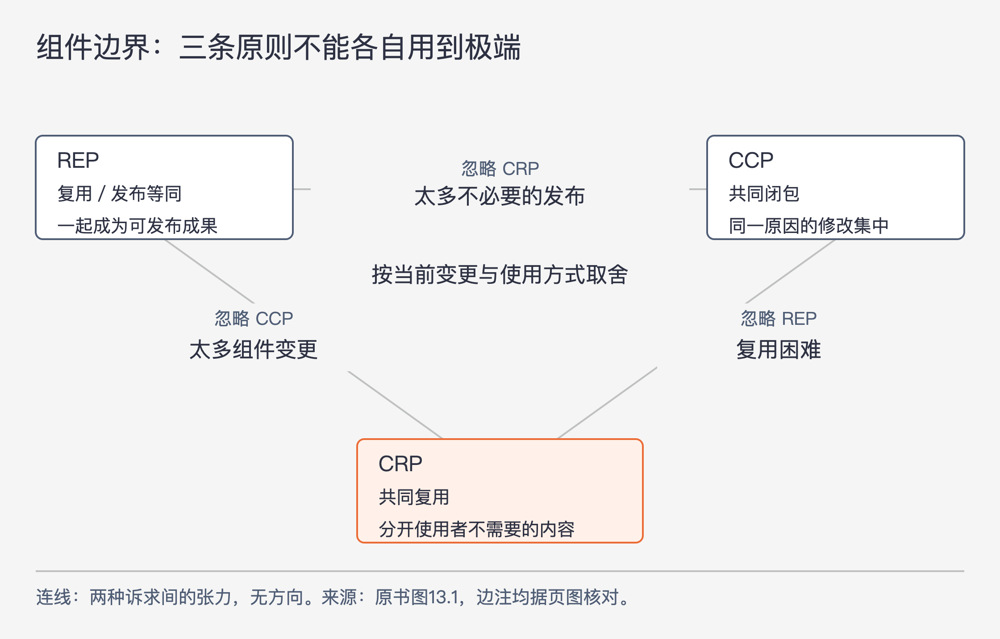

# 《架构整洁之道》第13章｜组件聚合 · 书镜8.2

第12章说明组件是可以独立交付的单位。本章接着问：哪些类应该被放进同一个单位？“功能相关”还不足以回答，因为维护者关心一次修改要动多少处，使用者关心被迫接受多少无关内容，发布者还要让一个版本有明确含义。作者用三条原则把这些要求放在一起讨论。

## 一、原书回顾：同一个组件要怎样一起改、一起用、一起发布

章首指出，类怎样组成组件是重要设计决策，却常常依赖临时判断。本章依次给出复用/发布等同原则（REP）、共同闭包原则（CCP）和共同复用原则（CRP）。它们会相互补充，也会彼此拉扯，不能把每一条都单独用到极端。

### 复用/发布等同原则

REP 要求复用的最小粒度与发布的最小粒度相同。作者先从软件复用的现实条件讲起：Maven、Leiningen、RVM 等管理工具和大量可复用组件共同发展，使团队更容易采用他人的成果。这是书中写作时期的背景，不是对今天工具使用情况的排名。

要持续复用一个组件，用户需要知道自己依赖的是哪个版本、它何时发布、此次改了什么。没有版本标识，就难以描述哪些组件组合可以兼容；没有发布通知和变更说明，使用者也无法决定继续留在旧版，还是安排升级。因此，可复用软件还需要一个让用户能够作出升级选择的发布过程。

从结构上看，一个组件不能装入完全无关的类。它们应有共同主题，能共享一个版本号、版本跟踪和发行说明，并让作者与使用者都理解“这次发布了什么”。如果类之间只因为方便就被装在一起，一份版本说明可能对大部分使用者都没有意义。

作者承认，这条要求仍然较弱：说一起发布应当合理，还没有精确告诉我们如何分组。REP 提供的是复用与发布必须对齐的底线，后面两条原则才进一步说明，哪些联系值得放在一起、哪些联系应当拆开。

### 共同闭包原则

CCP 要求把“因同一目的而修改，并且需要一起修改”的类放进同一组件；不会因同一原因一起修改的类，分到不同组件中。这里同时有原因与共同变化两个条件，不能只看类在最近一次提交中恰好被一起编辑。

作者把维护性放在多数应用开发场景的优先位置。如果一次需求变化分散到许多组件，每个组件都要安排修改、验证、发布和部署。若这些变化能够集中在一个组件内，其余组件就不必为同一需求重复经历这些工作。CCP 追求的是把一种变化的影响收在有限范围内。

这也解释了名称中的“闭包”与开闭原则（OCP）的关系：这里关注能否让某一类变化不再要求外部组件跟着修改，不是数学闭包的计算，也不是语言里的闭包函数。作者承认百分之百封闭不可能，设计者只能根据经验和对需求的判断，选择值得防护的变化类型，把相关修改点聚到一起。

源文脚注指向第27章“运送猫咪的难题”，提示同一种业务变化跨多个服务的成本将在后面再讨论。本章先把它作为组件划分的判断依据。

### 与 SRP 原则的相似点

作者明确把 CCP 视为单一职责原则（SRP）的组件版本。SRP 让不同变更原因的函数分到不同类，CCP 则让不同变更原因的类分到不同组件。共同点是围绕变更原因决定聚合，而不只看技术形式是否相似。

例如，两个类即使一个负责计算、一个负责存储，如果同一项规则变化总要求它们同步调整，CCP 会提示我们认真考察它们是否应作为一个交付单位。这个例子是对本节含义的解释；作者没有据此要求所有计算与存储一律合并。

### 共同复用原则

CRP 要求不要让组件用户依赖他们不需要的内容。原书先给出应放在一起的例子：容器类与配套遍历器通常一起使用，关系紧密，适合成为一个复用单位。大多数复用也往往需要一组协作的类，而非孤立地取出一个类。

更重要的是哪些类应分开。假设使用者只引用组件里的一个类，组件级依赖却依然成立。组件更新时，使用者可能要升级对应版本，重新编译、验证和部署，即使改变的完全是它没用到的另一个类。引用很少，并不必然让整份组件依赖变得很轻。

因此，理想情况下，依赖某组件的使用者确实需要它作为一个整体。若多数使用者只要其中少数类，剩余内容各有独立变化，就应考虑拆分。作者把 CRP 看成一种排除原则：把没有共同复用关系的类分开，避免无关变化迫使别的团队行动。

书中的编译和部署成本以组件作为发布整体为前提。不同构建工具可能减少部分重复工作，但这个前提下的升级选择、兼容检查和依赖范围仍需要设计。

### 与 ISP 原则的关系

第10章的接口隔离原则（ISP）说，使用者不应依赖类中自己不用的方法；本章 CRP 把同一个思路扩大到组件：使用者不应为了几个类而背上许多无关类的依赖。前者缩小类型接口，后者缩小组件使用范围，两者可以分别完成，不能互相冒充。

### 组件聚合张力图

图13-1｜按原书图13.1重绘；连线表达原则之间的取舍，没有调用方向。每条边的文字表示只顾两端、忽略第三条原则时的典型代价。

REP 与 CCP 倾向于把值得一起复用、一起维护的内容黏合起来，容易把组件推大；CRP 排除使用者不需要的内容，倾向于把组件切小。因此，架构师要在三者之间选择适合当前项目的位置。

沿 REP—CRP 这条边走，容易忽略共同闭包：虽然组件便于独立复用、也少带无关内容，一次普通需求却可能同时修改很多小组件。沿 REP—CCP 这条边走，容易忽略共同复用：组件中聚集的内容太多，一小部分变化也让许多无关用户被卷进发布。原图的第三条边 CCP—CRP 标为“复用困难”：若只顾内部维护和避免无关内容，没有形成有意义的共同发布单位，外部用户仍难以把它作为可靠成果采用。

作者建议根据团队当前状况调整位置。项目早期通常更重视研发速度和共同修改，愿意先牺牲部分复用性；当系统成熟，其他项目开始依赖它，就需要更认真地处理版本、使用范围和复用发布。在原图中，这被描述为重心从右侧向左侧移动。它是作者的阶段性经验判断，不是每个项目必须按相同路线移动的定律。

原书还强调，组件安排很大程度上取决于开发进度与被使用的方式，不能仅凭功能名称一次决定。脚注把张力图的想法归功于 Tom Ottinger。

### 本章小结

把类组合成组件，不能只套一个“职责相同”的标签。维护便利与复用便利可能要求不同边界，要根据应用需要取舍，而且取舍会随时间变化。今天合理的组件拆法，明年可能需要重做；这正是使用方式与团队需求改变后的正常设计工作。

## 二、主题讲解：用一次变更和两个使用者检验组件边界

### 先从内部交付最常发生的变化出发

下面是假设案例。一个销售系统有价格计算、折扣条件、促销配置读取和报表导出。早期只有一个团队，促销规则每次调整，价格计算、条件判断和配置解释都要同步改变。报表导出则由另一类需求推动。

若只按技术职责拆成“所有计算”“所有配置”“所有导出”三个组件，一次促销调整就可能横跨前两个组件。这时 CCP 提示我们：关注的是同一种业务变化涉及哪些类，而不只是类采用了什么技术。把促销计算与它专属的配置解释放到同一组件，可能让团队一次修改、一次验证、一次发布；把变化原因独立的报表导出分开，也可能减少牵连。

这只是基于假设变更模式的候选方案。若实际记录显示配置读取是稳定通用能力、几乎不随促销规则改变，它就未必需要被合入。共同变化要靠需求与改动证据判断，不能仅凭两个类“看起来有关”。

### 外部使用者出现后，边界需要再看一遍

后来有两个使用者：在线收银需要计算优惠，离线分析只需要识别促销类型。如果组件同时携带数据库接入、页面格式和导出模板，在线收银每次升级都带上多余内容，离线分析的负担更重。CRP 提醒我们，原来对一个团队方便的大包，可能对新使用者很不合适。

但不能立刻把每个类都拆成单独组件。假设金额计算与舍入规则必须共同升级才能保证结果正确，拆开后所有使用者都要追踪一组彼此兼容的版本。这些内容可能本来就应该共同复用。可以先识别共同使用的一组，再把独立使用的一组分出去。

这时 REP 接上来：决定对外提供一个促销计算组件，就要让它有可说明的版本和发布内容。用户需要知道某一版改变了什么、适用哪些配套版本、是否要升级。REP 让拆分后的东西真正成为可采用的成果，而不仅是仓库里另一个目录。

### 三条原则对应三种代价，不能只数组件

对同一份候选拆法，可以用三件具体事情检查。一次“调整叠加优惠规则”需要改几个组件，主要看 CCP；在线收银是否被迫接收离线报表变更，主要看 CRP；新版本是否足够明确，让两类使用者能选择何时升级，主要看 REP。

组件数增加可能降低无关依赖，也可能增加一次需求的协调次数。组件数减少可能集中修改，也可能让大量使用者频繁收到不相关发布。因此，“组件更小”和“组件更少”都不是独立的质量结论。

可以先保留当前最常见变化的集中性，再在确实出现独立使用者时拆出稳定、可说明的复用单位。这个次序是本假设下的选择：若项目一开始就是供多团队采用的库，发布与兼容的需求会从第一天就很强，不能照搬“先不管复用”的做法。

## 自测：一次提交一起改，就应该放一起吗

假设开发者在一次提交中同时修改短信模板和运费算法，理由是它们都要赶同一发布日期。另一方面，金额计算与币种舍入分属两个组件，却每次都要共同更新。如何判断？

核对思路：同一日上线不等于同一变更原因。短信与运费可能只是时间上偶合；金额计算与舍入则可能由同一业务规则推动，还需要一起复用和保持版本兼容。检查后者是否应合并更有依据。同时保留另一种可能：如果币种舍入本身是稳定通用规则，频繁共同修改来自一个错误接口，就应先修接口，而不是把所有依赖它的业务都合并。

## 来源与范围

依据 Robert C. Martin《架构整洁之道》第13章，PDF物理第121—127页（正文书内第92—97页）。五个主小节和“与 SRP 原则的相似点”“与 ISP 原则的关系”两个子小节按原顺序保留。已查看PDF第124、126页，核对小标题与张力图全部三条边；OCR 未完整提取的“复用困难”已据页图恢复。销售、促销、短信与运费例子均为本文假设。下一章从“组件内放什么”转向“组件之间怎样依赖”。

<!-- source_sha256: 64400d05a5e1fe23dedbc41526c9227f74b3647fce36eda738a11c325074f2c3 -->
