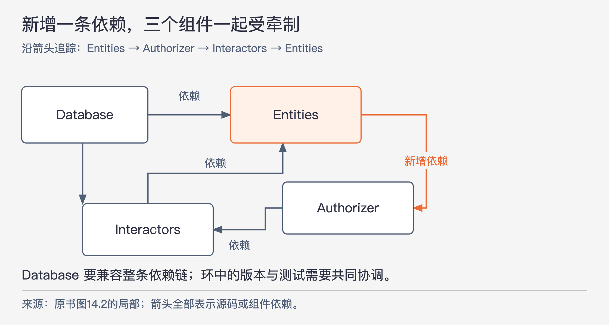
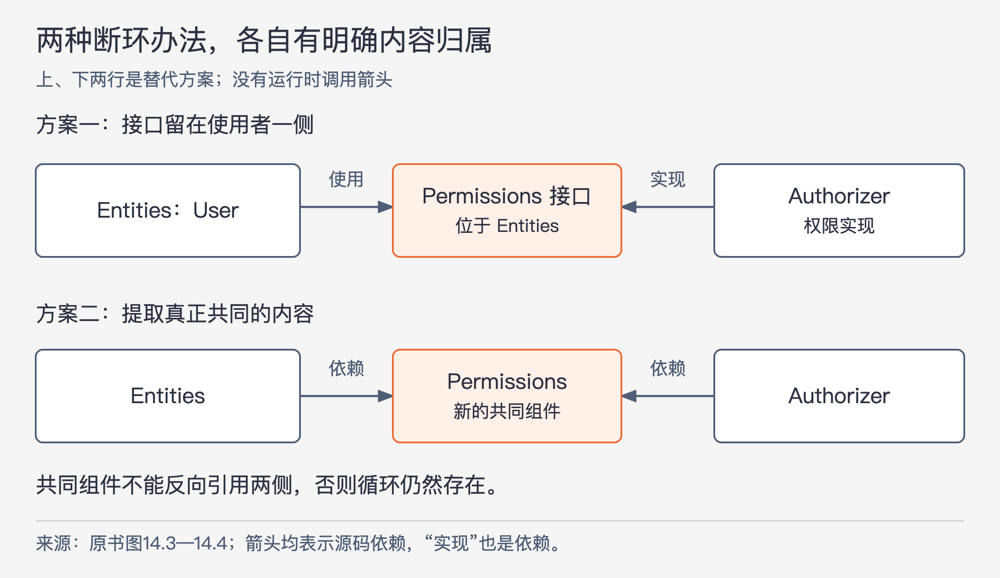
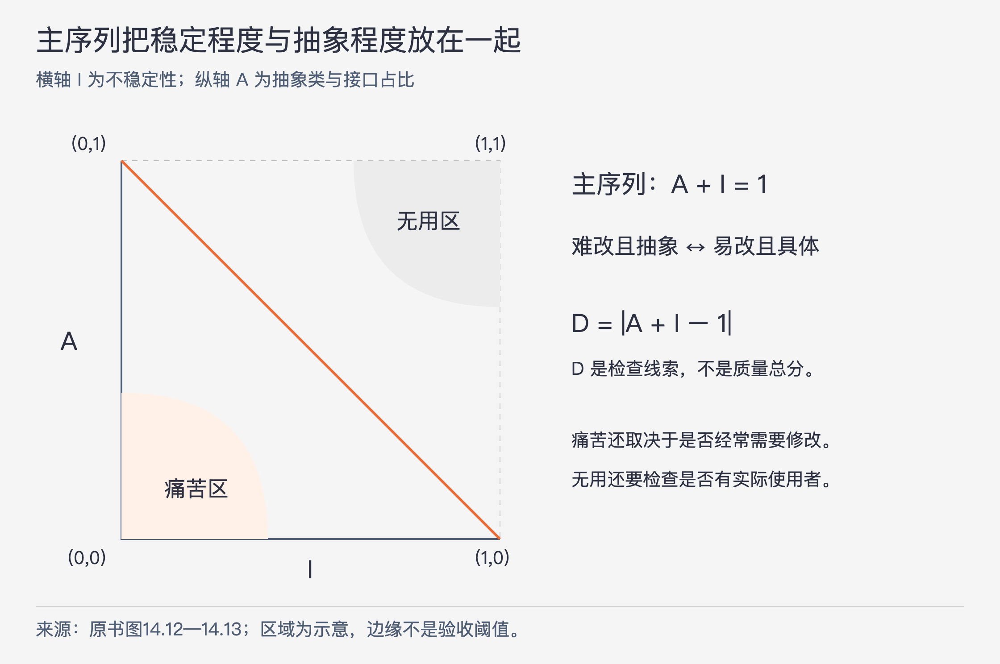

# 《架构整洁之道》第14章｜组件耦合 · 书镜8.2

第13章讨论组件内部怎样聚合。本章讨论组件之间怎样依赖，才能让团队分别开发、逐步集成，并把变化留在适合变化的地方。作者先处理依赖环，再解释依赖应该指向哪里，最后用几个指标帮助检查这些选择。指标是检查线索，不能代替对实际变化的判断。

## 一、原书回顾：从打破依赖环到检查稳定性与抽象程度

章首提醒，组件关系还受到团队、组织和持续变化的设计影响。三条原则分别是无依赖环原则（ADP）、稳定依赖原则（SDP）与稳定抽象原则（SAP）。它们要帮助组织研发活动，也必须随逻辑设计演进。

### 无依赖环原则

ADP 要求组件依赖图中不出现环。作者从“一觉醒来综合征”切入：昨天自己的代码已经正常，今天却因别人修改了共同源文件或依赖而失效。人员少时还可以临时协调，团队与系统扩大后，大家可能长期忙于适应彼此修改，始终得不到稳定版本。

作者介绍了两种历史应对：每周构建，以及用独立发布组件并控制依赖结构，并将二者的来源追溯到电信行业。前者推迟集成冲突，后者试图让每个团队能够选择何时接纳变化。

### 每周构建

每周构建让程序员前四天在各自私有版本工作，周五再统一提交、构建和集成。它确实提供了连续工作的时间，但也把几天积累的问题推到同一时刻。项目扩大后，周五处理不完，就延伸到周六；为了避免周末加班，又把集成提前到周四，最后大量工作日都被协调占据。

在这种工作方式下，频繁整体集成打断个人工作，减少集成又扩大差异、拉长反馈，构建和测试越来越困难。作者批评的是这套把变更攒在一起处理的节奏及其代价，不能据此推出“任何频繁构建都会降低效率”。

### 消除循环依赖

替代方案是将项目划分为可单独发布的组件。个人或小团队完成一版后，用明确版本号发布并通知使用者，自己继续开发私有的新版本。使用者依赖已发布版本，自主决定立即升级还是继续使用旧版。一次修改不会因为共享最新源码而立刻扩散，集成可以成为较小的渐进步骤。

这种安排要求依赖结构没有循环。从任意组件出发，沿依赖箭头不能再回到自己，这样的图叫有向无环图（DAG）。原书图14.1包括 Main、View、Controllers、Presenters、Interactors、Authorizer、Database 和 Entities，箭头表示组件依赖。

以 Presenters 为例，反向追踪可以找到使用它的 View 与 Main；它发布新版时，这些使用者决定是否升级。测试 Presenters 则顺着依赖向下，只需选定 Interactors 与 Entities 的相容版本。Main 没有其他组件依赖，发布它不会在这张组件依赖图上继续引发上游组件升级；这不意味着改变入口就不会影响系统运行。

整体构建也能先准备被依赖者，再准备使用者。原书按 Entities、Database 与 Interactors、其余上层组件、Main 描述大致推进过程；实际顺序应逐边核对：图中 Database 也依赖 Interactors，View 也依赖 Presenters，所以它们不能被误读成无需先后关系的同批并行步骤。

### 循环依赖在组件依赖图中的影响

现在新增一个需求：Entities 中的 `User` 要使用 Authorizer 中的 `Permissions`。原图原本已经有 `Authorizer → Interactors → Entities`，新增 `Entities → Authorizer` 后，三者闭合成环。

图14-1｜提取原书图14.2中形成环的三个组件，并保留 Database 的相关依赖。箭头全部表示源代码或组件依赖；重点是新增的 Entities → Authorizer。

Database 原来依赖 Entities，如今沿依赖继续追踪，还必须把 Authorizer 和 Interactors 放进考虑范围。三者在独立发布和验证上表现得像一个更大组件，团队必须共同协调一组版本。测试 Entities 也会把原本位于上方的授权与用例组件带进来。

结果不只是“图不好看”。测试需要更多库，独立维护变困难，发布次序也失去一个可以从底部开始的明确起点。作者用很强的措辞描述问题随组件增多而增长，但没有给出几何增长的实测模型；应保留为对协调成本的警示。

原书还特别指出，Java 这类需要从已编译文件读取声明信息的语言，会受到构建先后关系的牵制：若 A 等待 B 的产物、B 又等待 A 的产物，就无法继续把它们当作有明确先后的独立构建步骤。合并构建可能让程序产出，但也牺牲了本节希望保留的独立发布边界。

### 打破循环依赖

图14-2｜依据原书图14.3、14.4提炼的两种断环办法。箭头均为依赖，“实现”仍是一种源码依赖。两行是替代方案，不是必须连续实施的步骤。

第一种办法应用 DIP。先弄清 `User` 到底需要 `Permissions` 的哪些操作，把这些操作声明为接口，放进 Entities；Authorizer 的具体权限实现来实现该接口。`User` 依赖同组件内的接口，Authorizer 反过来依赖 Entities，原来的出向依赖被反转，环便断开了。运行时仍可执行授权代码，改变的是源码需要认识谁。

第二种办法提取共同组件。把造成双方相互依赖的类移到新的 Permissions 组件，让 Entities 与 Authorizer 都依赖它。共同内容有了独立归属，原来构成环的那条关系不再需要直接指向对方。新组件不应反过来依赖原来的两个组件，否则只是把环画大。

### “抖动”

新增组件意味着组件结构会随着需求变化而调整。作者用“抖动”描述这种持续移动和扩张：发现循环，就要重新安置接口或类，有时必须增加组件。不能假设最初的组件图从此不变；依赖检查必须跟上软件演进。

### 自上而下的设计

作者据此反对在尚未设计具体类、尚不了解共同变更与共同复用时，提前确定一张完美而固定的组件图。组件依赖图主要反映怎样构建、维护与隔离变化，不能直接等同于功能分解图。

早期模块逐渐出现后，团队才看清哪些类经常一起修改，哪些东西适合复用，哪些方向的依赖把不相干变化带到高价值规则。于是 SRP、CCP 帮助集中共同修改，CRP 帮助整理复用范围，ADP 在出现循环时推动结构调整。

例如 GUI 的外观变化不该轻易牵动业务规则，报表增删也不该迫使高阶策略改动。组件图需要逐步把这些保护关系表达出来。本节批评的是在证据不足时把组件图一次定死；并不意味着项目启动时不能有方向、假设和初步边界。

### 稳定依赖原则

SDP 要求依赖朝更稳定的方向。设计中有些组件本来就是为了方便频繁修改。若一个很难修改的组件开始依赖它，易变组件每次修改都要顾虑那个使用者，原来预留的灵活性就可能被一条依赖夺走。

因此，稳定程度不能只靠组件自身决定，还取决于谁依赖它、它又依赖谁。下一节为此给出专门定义。

### 稳定性

作者以立起的硬币和桌子区分“不曾变化”与“不容易改变”。硬币可以暂时不倒，但轻碰就倒；桌子不容易被掀翻。稳定性在这里指改变它所需的工作量，不是统计过去多久没改过。

软件组件难改的原因很多，包括体量、复杂度和清晰度。本章暂时忽略这些，专看依赖带来的压力。若许多外部组件使用 X，X 改动就必须考虑它们；原图让三个组件依赖 X，而 X 不依赖其他组件，称它既要对使用者“负责”，又是“不对外依赖”的。相反，Y 没有使用者却依赖三个组件，修改它不用向别的使用者协调，但外部依赖有三个可能的变更来源。

这是一种位于依赖图中的稳定程度。业务本身仍可能提出新需求，不能把“不受外部依赖驱动”理解成“没有任何变更理由”。

### 稳定性指标

作者用外部类与组件内部类之间的依赖数量度量位置稳定性：

- `Fan-in`：组件外部有多少类依赖组件内部的类。
- `Fan-out`：组件内部的类依赖多少个组件外部的类。
- 不稳定性 `I = Fan-out / (Fan-in + Fan-out)`。

此处按跨组件的类来计数，不能把它无声换成 import 行数、方法调用次数，或只数组件之间有几条边。原书图14.7中，外部类 q、r、s 依赖 Cc 内的 t、u；u 又依赖外部类 v。因此 Cc 的 `Fan-in = 3`，`Fan-out = 1`，`I = 1/4`。图里只有两个入向组件，但入向外部类是三个，这个区别会影响结果。原书脚注说明，它在先前文章中也用过 Ca、Ce 指代入向、出向关系。

作者提到，可以从 C++ 的 `#include`，或 Java 的 import 与全限定名称发现这些依赖；一个文件对应一个类时尤其容易检查。这些语法是识别依赖的线索，统计时仍应回到跨组件的类关系，避免把同一依赖的多处写法重复计数。

有入向而无出向依赖时，`I = 0`，表示本指标下最稳定；无入向但有出向时，`I = 1`，表示最不稳定。原书据此要求沿依赖方向 I 递减，让较易改的组件依赖较难改的组件。若入向和出向都为零，公式成为0/0，原书未规定取值，不能自行把这种孤立组件算成0或1。

### 并不是所有组件都应该是稳定的

若所有组件都难以修改，系统也无法灵活演进。架构的工作是决定哪些部分需要稳定、哪些部分应保留易变性。作者通常把易变组件画在上方，依赖下方的稳定组件，方便观察反向的依赖关系；上下位置只是绘图约定。

原书随后假设 Stable 中的类 U 需要 Flexible 中的类 C。Flexible 本应方便修改，现在却要承受 Stable 及其使用者的牵制。作者把 U 需要的函数提取成 US 接口，放进新的 UServer 组件，再让 C 实现 US。两边共同依赖稳定接口组件，Stable 不再直接依赖 Flexible，后者恢复了独立变化的空间。

原图说明 UServer 可以达到 `I = 0`，Flexible 保持 `I = 1`；实际项目仍要根据完整类依赖重算。不能只给组件取名 Stable，就把真实指标当成已知。源页把一处图中反向依赖同时说成违反 ADP，但单条反向箭头并不自动成环；是否违反 ADP 仍必须检查是否存在返回路径。

### 抽象组件

一个只装接口、几乎没有可执行代码的组件，也有作用：它让多个实现与使用者依赖同一套声明，同时避免把具体代码装进这个稳定单位。作者认为，这在 Java、C# 等静态类型环境中是常见安排。

作者同时说明，动态类型的依赖反转不一定需要显式声明和继承接口，因此不一定需要同样的接口组件。这个比较只说明表达机制不同，不取消实现之间必须遵守的行为约定。源页在这一段把 UServer 又写成 UService，本文固定使用前文与图中的 UServer。

### 稳定抽象原则

SAP 要求组件的抽象程度与稳定程度相配。一个许多人都依赖、很难直接改动的组件，需要通过抽象保留扩展空间；一个方便修改的组件则可以容纳具体实现。

### 高阶策略应该放在哪里

高阶策略表达系统重要的业务决策，作者希望它们不随细节变化而反复修改，因此放进稳定组件。但是，稳定也会使代码难改。开闭原则提供了另一条路：保持已有约定，通过新增实现扩展行为，而不直接修改所有使用者依赖的代码。

这里需要的是可扩展的结构。把高阶策略塞进许多具体细节之中，再要求大家不要改，不能得到同样效果。抽象类与接口使“保持稳定”和“接纳新行为”可以在一定范围内同时成立。

### 稳定抽象原则简介

作者把两端描述得很清楚：稳定组件应有足够抽象，才能扩展；不稳定组件应包含可修改的具体实现，才能发挥易变的用途。结合 SDP，依赖指向更稳定的一侧，也就应指向更能通过抽象保持的那一侧，这相当于组件层面的 DIP。

但组件由许多类组成，可以部分抽象、部分稳定，不能像判断一个类是否声明为抽象类那样，只用两个状态处理。接下来的比例指标正是为了描述这种中间状态。

### 衡量抽象化程度

令 `Nc` 为组件中的类总数，`Na` 为其中抽象类和接口的数量，则：

`A = Na / Nc`

`A = 0` 表示没有抽象类或接口，`A = 1` 表示全部为抽象类或接口。源文 OCR 把除号识别成减号，页图确认这里是除法。若组件没有可统计的类，比例也不能直接计算；这个指标本来就建立在按类统计的模型上。

### 主序列

作者把 I 放在横轴、A 放在纵轴。理想的稳定抽象组件在 `(0, 1)`，理想的易变具体组件在 `(1, 0)`。其他组件往往介于两者之间：例如一个抽象类继承另一个组件的抽象类，虽然自身完全抽象，却因外部依赖而并非完全稳定。

图14-3｜依据原书图14.12—14.13重绘。横轴 I 越大越不稳定，纵轴 A 越大表示抽象类与接口占比越高；主序列为 A + I = 1。区域只作设计提示，不表示实测故障概率。

### 痛苦区

`(0, 0)` 附近的组件具体而难改。大量使用者依赖它，一次具体实现变化可能影响很多地方；它又缺少足够抽象，难以通过增加新实现接纳变化。作者称附近为痛苦区，以被广泛依赖且经常要调整的数据库表结构为例。

随后作者给出重要例外：有些具体工具库与 String 一类广泛使用的设施，本身很少需要改变。落在这个区域不必然有害；需要变化却难改，才会产生真正的痛苦。作者甚至提出，应把“多变性”看成第三个轴，图中痛苦程度取决于这个额外条件。

源页同时出现“这类库 I 为1”和“位于(0,0)”的说法，两者与前面定义冲突。本文不沿用那个数值，把本节可确认的限定保留下来：长期无需改变的具体组件，不能仅凭低 A 与低 I 就判为坏设计。

### 无用区

`(1, 1)` 附近的组件很抽象，却没有多少组件依赖。作者用历史遗留、无人实现也无人使用的抽象类说明问题：增加了设计和理解负担，却没有服务于实际调用。

原书把它称作无用区。具体评估时仍须确认它确实没有使用者、没有正在形成的需求，而不是仅凭坐标就删除代码。此处的“抽象程度高”表示比例高，不表示抽象概念一定深刻。

### 避开这两个区域

连起 `(0,1)` 与 `(1,0)` 的线，就是作者借用天文学名称所称的主序列。它表达一种平衡：被依赖得多而难改的组件，应有较多抽象支持扩展；较具体的组件，应放在容易修改的位置。

作者倾向让组件尽可能靠近两端，但也承认大型系统很难全都如此。靠近主序列是经验目标，而不是要求所有组件都变成只有接口的空壳。原书允许中间状态，实际调整也需要考虑复用、共同变化及多变性。

### 离主序列线的距离

原书定义：

`D = |A + I - 1|`

D 的范围为0到1；0表示位于主序列，1表示离它最远的两个角。这里是作者定义的归一化指标，不直接等同于平面上带单位的垂直距离。原书脚注说明，这个指标在旧文章中曾称 D′。

作者提出两种用法。一种是观察系统中各组件的分布，比较 D 的平均值和方差。他希望两者接近0，即组件整体靠近主序列、彼此偏离程度也较小，再借离散情况寻找明显偏离常态的组件。图14.14用标准差带标记值得调查的点：可能是抽象很多却少有人用，也可能是实现很具体却被依赖得太多。平均值、方差和图中的标准差不是同一个量；源文没有给出可照搬到任何系统的统计验收规则。它只是提出进一步检查对象，没有自动给出重构办法。

另一种是跟踪单个组件随版本的变化。图14.15中的 Payroll（工资计算）组件，从 R1.0 到 R2.1 的 D 出现波动，R2.1 超过图中设定的0.1线。原书把它与意外增加的对外依赖联系起来，建议追查原因。0.1是该例的检查线，不能直接升级为所有项目的统一及格线；单看 D 上升，也不足以确定一定新增了外部依赖，还要查看 A、I 与实际修改。

### 本章小结

这些原则和指标描述作者认为较好的依赖模式：没有环，依赖指向较稳定的一侧，稳定程度与抽象程度匹配。作者最后明确提醒，指标只是对已选标准的度量，不等同于真理。源文这一限定必须和公式一起使用，否则容易把有帮助的观察工具变成制造无用接口的理由。

## 二、主题讲解：先找不能独立改的原因，再看指标

### 用一条依赖解释团队为什么一起受阻

下面是假设案例。订单规则组件需要判断配送区域，配送接入组件又调用订单流程，订单流程本来就依赖订单规则。于是出现“订单规则 → 配送接入 → 订单流程 → 订单规则”。哪怕三个组件分属三个仓库、各自打了版本号，升级时仍可能被迫验证一整圈相容版本。

先追查规则究竟需要配送接入里的什么。若只需要“某地址是否可配送”的判断，可以在订单规则侧声明所需接口，由配送接入实现。规则执行时仍可询问配送，源代码却不再向外引用接入组件。若双方只是共同使用一份配送区域定义，提取共同组件可能更直接。

两种方案的选择要跟内容走。对行为的需要，适合考虑接口；共同数据或协作类确实应单独发布时，可以考虑提取组件。无论选择哪种，都要重新走一遍箭头，确认没有绕另一条路径回到起点。

### 区分难改、常改与抽象多少

假设订单规则有很多使用者，因此一次接口修改协调很贵，它在本章意义上较稳定。但业务部门每周都提出变化，说明它同时具有较强多变性。两个事实并不矛盾，也正因此值得检查：能否把稳定的判断约定与经常调整的实现分开？

反过来，一个无人使用的促销实验模块，虽然半年没动过，也未必稳定；删除或修改它可能毫无协调成本。不要把 Git 中最后修改时间直接替代 I。A 也只表示抽象类与接口的比例，不会告诉我们接口是否真能吸收业务变化。

在这个例子里，值得保留的抽象应允许换一种配送判定实现，而不修改订单规则调用处。随手给每个具体类增加一个同名接口，若参数仍完全泄露接入细节，A 可能好看了，实际变化传播却没改善。

### 用一组数字定位问题，不让数字替自己决定

假设某组件有10个类，其中2个是接口或抽象类；8个外部类依赖它，它又依赖2个外部类。那么 `A = 0.2`、`I = 2/(8+2) = 0.2`、`D = 0.6`。它靠近具体且难改的一侧。

接下来要问：它真的经常改吗？使用者依赖的是稳定能力还是内部格式？哪些变化让八个使用者都要调整？如果这是长期固定的格式转换表，暂时没有修改压力，就不该只为把 D 降到0而创建接口。如果这是不断调整的结算规则，并且每次都牵动所有使用者，数据就支持优先检查边界。

若将组件分开或反转依赖，要重新计算全部受影响组件的指标；移动类会同时改变类数量和依赖数量。不能只保留有利数字，把计算口径变了当成架构改善。更直接的验证是再拿同一项需求试走：需要改哪些产物，哪些团队必须同步，哪些测试可以独立完成？

## 自测：同样D为1，处理会一样吗

两个组件的 D 都为1。甲是长期不变、被广泛使用、自身没有外部依赖的具体基础类型库；乙是一套全部由抽象类型构成、依赖若干外部类型，却没人实现、没人使用的业务框架。是否应该统一要求二者增加实现或增加接口，直到 D 下降？

核对思路：不应按同一处方处理。甲位于 `(0,0)`，但多变性很低，先确认是否真的有维护痛苦；乙位于 `(1,1)`，应先确认是否有实际使用需要，可能需要删去无用抽象而非增加更多抽象。题目给出了入向或出向依赖，避免把分母为零的孤立组件放进计算。D 把两种不同问题折成同一数值，只有结合 A、I、用途和变化才能判断。

## 来源与范围

依据 Robert C. Martin《架构整洁之道》第14章，PDF物理第128—148页（正文书内第99—117页；第148页为空白）。主小节与子小节按实际顺序保留。已查看PDF第131、132、134、138—141、143—147页，核对图14.1—14.4、类依赖计数、接口组件名称、A/I/D公式、主序列及版本趋势图。源页的构建次序分组、ADP表述、UServer拼写及工具类库I值疑点已在相应位置说明。订单配送与10类组件数字是本文假设，未宣称为项目实测。

<!-- source_sha256: 64400d05a5e1fe23dedbc41526c9227f74b3647fce36eda738a11c325074f2c3 -->
