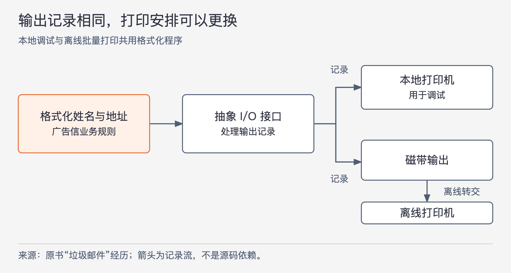
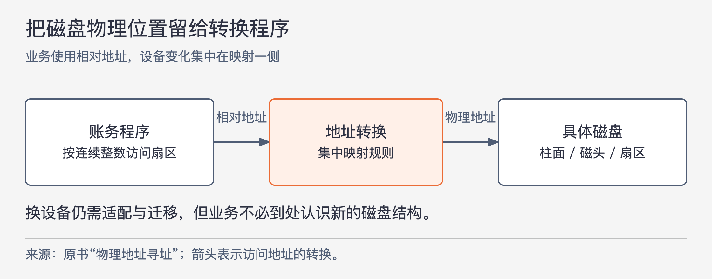

# 《架构整洁之道》第15章｜什么是软件架构 · 书镜8.2

一个系统今天能够运行，并不能说明明天容易修改、交付和维护。本章把架构放进软件的整个使用过程：怎样安排组件和通信，才能在继续满足业务的同时，让尚无充分依据的技术选择仍有调整空间？作者先分开四类工作，再用设备替换的历史经历说明这种空间怎样产生。

## 一、原书回顾：用组件关系支持软件的全生命周期

章首先谈架构师的工作。作者反对让架构师长期脱离代码，主张他们持续承担编程任务，亲自体会设计给团队带来的便利和麻烦。架构师未必写最多的代码，但需要在实际工作中引导系统结构，以免设计判断脱离开发者承担的成本。这是作者的职业主张，不是由本章实验得出的岗位配置标准。

随后作者给出本章的工作定义：软件架构安排系统如何切成组件、组件怎样组合、彼此怎样通信。目的包括开发、部署、运行和维护。系统当然需要正常工作，但“工作正常”与“以后容易继续工作”是不同的检查对象；架构差的系统也可能已经实现所有功能，麻烦到下一次修改或部署才显露出来。

作者因此把架构目标放到全生命周期：便于理解和修改，方便维护与部署，尽量提高程序员生产力、降低总运营成本。保留可选项，是他用来支撑这个目标的主要策略。

### 开发（Development）

架构需要适合实际开发它的人。作者对比两个规模：只有五名开发者时，一个组件和接口尚不严格的单体系统，也可能支持高效合作；若是五个团队、每队七人，不清楚的组件与接口便容易让团队互相妨碍。

如果只受开发进度驱动，后一种组织很可能把软件自然分成五个组件，每个团队负责一个。它方便分工，却未必最适合部署、运行或维护。原例要揭示的是不同目标可能拉扯同一结构，不能把团队人数直接换算成固定组件数。早期小团队感受不到明确边界的收益，也解释了为什么有些系统起初缺乏这类设计。

### 部署（Deployment）

写完的代码需要能交付到运行环境，开发才产生实际效果。作者把轻松的一键部署作为目标，批评开发初期只考虑职责和接口、忽略部署工作量的做法。

他的例子是一套微服务系统：每个服务看起来边界清楚、便于开发，积累起来却有很多连接与启动关系。部署时，服务数量、相互配置和启动时机都可能成为出错来源。若提前考虑这些成本，可能会选择少一些服务，让一部分组件留在进程内，另一部分独立运行，并集中管理必要的连接。

这段讨论不推出“服务越少越好”。它要求把部署作为设计输入，避免把开发上的局部方便直接当作整个系统的最优选择。原书关于部署成本与可用性的关系，也属于设计判断，没有给出统一的数量公式。

### 运行（Operation）

作者在这一节强调投入产出：在他的经验中，不少运行效率问题可以增加内存或服务器缓解，而开发、部署和维护上的困难更依赖人力。因此他建议架构优化不要只围绕运行性能展开。

源文对“几乎任何运行问题都可增加硬件解决”用了很强的措辞。这里保留其经验归属和相对投入的论点，不把它当作所有吞吐、延迟或正确性问题的结论。一个方案是否满足实际运行要求，仍需按具体条件判断，本章没有提供通用性能验证方法。

架构对运行还有一个作用：让系统的行为在结构中可见。用例、功能和必需行为应当以容易找到的类、函数或模块出现，开发者看得出系统怎样完成工作，而不必先遍历全部技术细节。这份可见性又会帮助后续开发与维护。

### 维护（Maintenance）

作者认为，持续新增功能和修复缺陷会耗费软件生命周期中大量人力，其中两类成本尤其突出。

第一类是“探秘”：面对陌生系统，先找到功能在哪里实现、改哪里才合适。第二类是“风险”：找到位置并作出修改后，仍可能破坏别的行为。前者是理解与定位，后者是修改带来的不确定后果，不能合成一个模糊的“难维护”。

清楚的组件分工让新增能力有可判断的放置位置；稳定接口限制内部变化怎样传给外部。二者分别减少查找范围与误伤范围。这并不保证任何局部改动都安全，但为判断和验证提供了明确边界。

### 保持可选项

作者再次联系行为价值与架构价值：软件需要方便地改变机器行为，而这种可改动性取决于组件的组织和连接。所谓保留可选项，重点是让高层业务策略尽量不被具体技术细节固定住。

本节把系统分为策略与细节。策略包括业务规则和操作过程；细节包括让人、其他系统或程序员与策略交互的具体设备、数据库、Web系统、服务器、框架和协议。某个细节可以必不可少，但它的具体选择不必成为业务规则的前提。

原书逐项说明希望延后的选择：

- 数据库：高层策略尽量不关心底下是关系型、分布式、多级数据库还是文本文件。
- Web服务：策略不直接认识 HTML、AJAX、JSP、JSF 等展示技术，甚至不预设自己一定通过网页提供。
- REST、微服务或 SOA 框架：先建立业务操作，再决定外部怎样访问和分布这些操作。
- 依赖注入框架：高层策略不承担具体依赖如何解析和组装的细节。

推迟决定的价值来自更多信息和实验机会。策略若能脱离某个数据库运行，就有机会尝试不同存储方案，观察是否适合实际需要；Web框架和发布形式也可以这样比较。架构要提供可试验的空间，而非把尚未做出的决定藏成代码里的隐含假设。

公司已经规定数据库或框架时，作者仍建议尽量保留替换能力，他把这种态度形容为“假装决定还没确定”。可理解为控制核心代码对既定技术的依赖，不是让团队忽略组织约束或暗中更换技术。保留能力与立即实施替换，是两件事。

### 设备无关性

作者回到20世纪60年代，描述早期程序员多来自数学或其他工程背景的环境，并提到当时超过三分之一的程序员为女性。这些是本章的历史叙述，论证重点则是他们怎样从直接操作设备转向统一记录接口。

PDP-8上的字符打印子程序，直接使用电传打印机指令。`PRTCHR` 留出返回地址位置；`TSF` 检查设备准备状态，未就绪就经 `JMP .-1` 返回继续检查；就绪后执行 `TLS` 发送寄存器中的字符；最后 `JMP I PRTCHR` 返回调用方。这种程序确实能打印，但把等待和发送的具体设备知识写进了代码。

直接读卡和打卡也曾工作正常。问题在设备需要更换时出现：卡片容易丢失、损坏、顺序混乱，甚至混入空白记录；磁带更容易保管、备份，读写也更方便，却无法直接替换已经写死读卡器指令的程序。

后来操作系统把设备访问抽象为处理一条条记录的标准函数。应用通过这些函数读写，运行人员把抽象设备连接到实际读卡器、磁带等设备。同一个业务程序就能在不改规则的情况下更换设备。作者把它视为后来 OCP 思想的一次早期体现，当时尚未使用这个名称。

### 垃圾邮件

第一个个人经历发生在20世纪60年代末。作者所在公司替客户打印个性化广告：客户送来包含姓名、地址的磁带和预印信纸，程序把每条记录准确填到留白处。每卷信纸有几千封信、重量接近500磅，通常要处理数百卷，规模让打印方式的成本变得重要。

起初程序通过 IBM 360 配套的单行打印机输出，作者记述每个工作日可以打印几千张，而机器月租达到几万美元。由于程序使用操作系统的抽象 I/O 接口，他们能够把同样的输出改写到磁带，再将磁带交给离线打印机。

图15-1｜依据原书广告信打印经历整理。箭头表示记录流向；上下两条路径是可选使用方式，不表示每次都同时输出。

作者记述，IBM 360约10分钟写满一卷磁带，五台离线打印机可以持续按7×24小时工作，每周打印几十万封信。源页在这段中另有一句对磁带写入时间与单行打印时间的比较，时间基准并不充分，本文不据此推算提速倍数。这里能够明确还原的结构变化，是昂贵主机负责快速准备输出，持续的实体打印交由离线设备承担。

程序仍负责姓名和地址格式，具体设备由操作系统及运行安排选择。本地打印机可以用于调试，磁带与离线打印机用于批量任务；这一选择到了实际使用时才作出。作者用这个过程说明，推迟设备决定可以带来实际操作空间。

### 物理地址寻址

第二个经历发生在20世纪70年代初。作者为本地卡车工会编写账务系统，把 Agent、Employer、Member 三类记录放在25MB磁盘上。不同记录尺寸对应不同柱面区域及扇区格式；程序知道盘有200个柱面、10个磁头，还知道每类记录安排在哪里。

这种设备知识不只在读写函数里。索引保存记录ID与柱面、磁头、扇区号码；Member还用双向链表连接，前后记录的链接也保存物理位置。因此换盘时，既要迁移数据、重写记录地址，也要寻找散布在业务代码中的硬编码。硬件几何结构变了，整个应用都可能跟着改。

图15-2｜依据原书相对地址方案整理。箭头表示访问时的地址转换；原书没有给出具体换算公式，图中也不补造。

后来一位更有经验的同事建议把磁盘看作连续扇区队列，用连续整数作为相对地址，再由专门转换程序把相对地址映射为柱面、磁头、扇区。团队修改高层代码，清除了它对物理结构的直接认识。

这次重构本身需要工作，数据迁移也未自动消失。收益在于以后选择不同磁盘时，物理结构知识有了集中位置，不必让每一处业务逻辑都再次理解新设备。它与广告信例子处理同一个问题：用业务所需的稳定表达，隔开设备自己的表示方式。

### 本章小结

作者希望架构师把高层策略与实现细节分开，让系统先推进核心行为，同时尽量推迟缺乏充分依据的细节决定。两个故事都说明，保留可选项依靠具体边界与通信约定，不会因为宣布“以后可以换”就自然成立。

## 二、主题讲解：保留选择，需要现在做什么

### 先确定必须交付的行为

下面假设要做一个订单凭证系统：读取订单，按规定生成凭证，交给指定输出渠道。核心规则是哪些订单可以生成、凭证应包含什么信息、金额怎样表达。现在必须把这些规则讲清，否则换多少框架也无法验证业务是否正确。

至于凭证先打印、下载为文件还是交给另一系统，可以在明确输入输出含义之后再决定。推迟技术选型的前提，是程序已经能表达和检验自己要完成的工作。若“以后选型”导致连凭证内容都没有可运行的计算，那只是推迟了开发，尚未形成可选项。

### 为真实的不确定性留一处替换位置

先让凭证规则产生明确结果，再由输出侧把它交给某种设备。可以用一个简单输出实现验证凭证内容，不必预先支持所有打印机，也不必发明可容纳任意设备的通用框架。

原书磁盘例子中的相对地址是这一安排的具体形态。应用需要“访问某条位置已确定的记录”，不需要到处知道磁头数量；因此转换程序有真实作用。若新增的一层只是原样转发厂商专属对象，业务代码仍依赖厂商含义，更换时的工作并未减少。

在凭证例子里，可以检查是否能替换输出实现，同时保持生成规则与其测试不变。真正需要切换时，输出设备相关代码可能仍须重写；边界的作用是明确哪些地方不应跟着重写。

### 把四类工作放到同一个决定里

假设五个团队分别负责订单、凭证、打印、查询和管理界面。分成五个独立服务方便分工，却会增加部署连接；全部放进一个共享大模块，则可能让协作和定位修改变困难。单凭其中一项方便，不能选定结构。

可先让源码职责和接口清楚，再根据实际运行与交付需求选择哪些部分独立部署。审视一次修改时，同时看：谁要参与开发，怎样构建部署，运行过程能否满足要求，后来的人能否找到规则和验证影响。四个问题对应本章的四类目标，不必保证它们在每种选择下都达到最优，但应看见代价由谁承担。

### 有些决定已经有充分依据

假设业务明确要求特定硬件的即时反馈，而且是否可达标直接决定产品能否成立，那么早期就需要验证该设备与程序的配合。把这种验证无限推迟，会让关键未知长期存在。这里是对本章原则的条件分析：应延后的是尚非核心约束的具体选择，不能把已决定可行性的条件也当成无关细节。

反过来，公司已经选定某数据库，也不要求现在为所有数据库编写实现。先阻止数据库语法和结构穿过需要稳定的边界，保留未来调整的可能；是否真的替换，要等实际需求与成本证据。这样才同时尊重当前条件与将来变化。

## 自测：一键部署成功，架构就好了吗

假设系统用一条命令即可部署，运行也稳定；每次新增凭证字段，却要修改订单规则、数据库实体、网页模板和打印协议，团队还要先花几天查清这些位置。应怎样评价它？

核对思路：部署目标得到支持，但维护中的探秘与修改风险仍高。继续区分新增字段为什么牵动各处：若它确实改变所有业务约定，协调可能必要；若只是打印页加一个展示字段，却让不相关规则和数据库内部结构一起变化，就要检查边界。不能用单项成功代表全生命周期的成本已经合理。

## 来源与范围

依据 Robert C. Martin《架构整洁之道》第15章，PDF物理第150—160页，正文书内第121—130页。原九个小节按序保留，章首架构师职责与架构定义另行保留。已回看PDF第156—160页，核对设备指令、打印经历、硬盘参数、索引及相对地址改造。历史数字均为作者在本章的叙述，未独立考证；源页打印时间比较存在解释空间，未推算收益比例。订单凭证案例为本文假设，未使用外部资料。

<!-- source_sha256: 64400d05a5e1fe23dedbc41526c9227f74b3647fce36eda738a11c325074f2c3 -->
