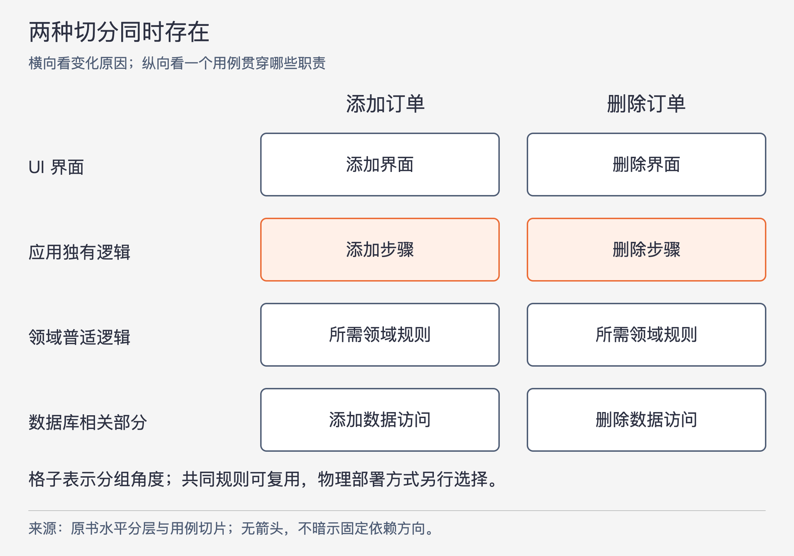
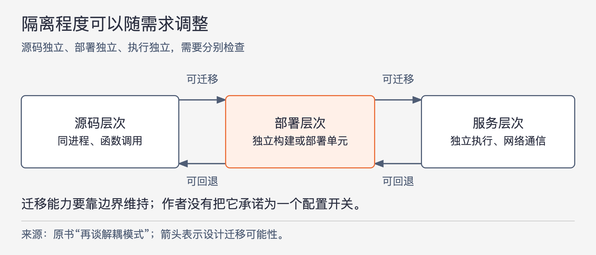

# 《架构整洁之道》第16章｜独立性 · 书镜8.2

上一章提出保留可选项。本章把它落实为独立性：哪些部分可以分别修改，哪些产物可以分别部署，哪些工作可以在不同进程或机器上运行？这些能力有关联，却不能只靠把系统拆成几个服务就同时获得。

## 一、原书回顾：沿变更原因分开，再选择分到什么程度

章首列出架构应支持的目标：用例与正常运行、维护、开发、部署。本章先看这些目标各自需要什么，再讨论怎样用水平分层和用例切分保持它们之间的选择空间。

### 用例

购物车应用的结构应让人容易找到购物车相关行为。主要用例应作为类、函数或模块占据明显位置，名字能说明功能；开发者不应先翻遍技术组件，才知道程序怎样完成添加商品、处理订单等工作。

原书脚注进一步解释用例：描述谁能用系统完成什么业务目标，以及系统如何响应外部请求。它可以包含多个交互场景，适合用用户或领域专家的语言表达，并由开发者与用户共同澄清。用例因此不是一个接口地址或页面名称的同义词。

本节再次强调架构揭示设计意图的作用，并把详细讨论连接到第21章“尖叫的软件架构”。这里先建立判断：只看系统的主要结构，能否说出它为谁完成哪些工作？

### 运行

运行需求会约束架构选择。作者举出每秒处理100000个用户、毫秒级查询大数据仓库这类要求，意在说明吞吐和响应目标必须被结构支持，并未给出可以达成这些指标的具体实现或测量结果。

不同系统可能需要分布在多台服务器上的小服务，也可能使用同一地址空间中的线程、独立进程，甚至一个单进程程序就足够。关键是恰当隔离组件，同时避免业务逻辑无意依赖某种固定交互方式。若所有工作都依靠共享内存对象协作，后来再转成网络通信，就会多出难以忽略的迁移工作。

### 开发

作者引述康威定律，说明系统结构常会反映组织的沟通结构。多个目标不同的团队若要独立推进，就需要隔离良好的组件和清晰的工作范围。

这支持先找合适边界、再分配工作，减少团队为无关变更反复协调。它并不保证照着组织图建模块就能得到好的业务结构；本章后面还要同时考虑分层、用例以及部署方式。

### 部署

作者希望系统构建完成后能够立即部署，避免依赖大量手工目录准备、苛刻文件布局和零散配置。组件分开之外，还需要主组件把它们正确启动、连接和监控，让组装成为有明确位置的工作。

“立即部署”是设计目标，不表示实际软件可以没有配置。它要求部署所需的组装与准备能够被系统安排清楚，不能把大量隐含步骤交给操作者记忆。

### 保留可选项

用例、运行条件、团队结构和部署需求往往无法预先全部知道，即使知道也会改变。因此，架构很难一次求出同时满足所有目标的固定结构。

作者主张使用实现成本较低的原则，先隔离能够辨认的不同变化，让将来必要的调整仍有位置可做。保留可选项是在不确定条件下减少相互牵制，不是预先实现所有可能的系统形态。

### 按层解耦

即使未知全部用例，架构师通常知道系统大体要做什么，例如购物车、运输清单或订单处理。以这种意图为基础，SRP与共同闭包原则帮助把共同变化的内容聚合，把不同原因改变的内容隔开。

UI与业务规则常有不同变化来源，所以用例中的界面部分和规则部分应该可以分别调整。业务规则内部也有差别：原书以输入字段校验代表应用特有的逻辑，以账户利息与库存清点代表领域中较普适的逻辑；它们的变更速率和原因可能不同。

数据库、查询语言和表结构属于具体实现，作者希望它们不要把变化带进UI或业务规则。由此形成水平分层：UI、应用独有的业务逻辑、领域普适的业务逻辑、数据库。这里分的是变化原因，不能据此认定任何输入校验都只属于应用层；某个条件若表达领域规则，还要按实际含义判断。

### 用例的解耦

添加订单和删除订单也可能由不同原因、按不同节奏改变。它们各自贯穿界面、应用规则、领域规则和数据访问，因此可以把用例看作穿过水平分层的垂直切片。

图16-1｜依据原书“按层解耦”和“用例的解耦”绘制。图展示两种分组方向，没有调用或依赖箭头；八个格子表示需检查的职责范围，不要求建立八个独立进程或数据库。

原书要求增加订单与删除订单的UI分别组织，业务和数据库相关部分也作相应划分。这样新增一个用例时，可以在它自己的范围推进，减少对原有用例的影响。按用例划分数据访问职责，不等于每个用例必须复制整套数据库；图关注什么变化应留在何处，物理部署另有一层决定。

### 解耦的模式

这些分组也影响运行。高吞吐用例和低吞吐用例如果已经隔开，就有机会分别安排资源；UI和数据库若不嵌在业务代码里，也较容易移到不同机器。

但跨机器运行需要更强条件。组件不能继续依赖同一个地址空间，必须通过网络交换数据。作者在这里使用服务、微服务和SOA等名称，又立即说明，他没有把其中一种当作普遍最优方案；有时需求确实要求把组件分到服务层次，是否这样做仍是应保留的选项。

### 开发的独立性

水平分层让UI团队较少干扰业务团队；按用例切分让添加订单团队较少干扰删除订单团队。两种分组配合，才可能支持不同组织方式下的并行开发。

这里的独立性以清晰约定为前提。团队仍需要共享必要的业务含义，只是无需为每一处不相关实现修改都一起行动。换一批团队也不必立即推翻全部组件安排。

### 部署的独立性

如果隔离足够好，分层实现和具体用例还可以分别替换。作者甚至提出运行中热切换的可能：增加若干jar文件或启动新服务即可接入新用例，其他部分不受影响。

这是附有条件的能力描述。源码分开只是起点，是否能在运行中安全加载、接替状态和保持既有调用，本章没有展开实现。不能把“有多个jar”直接当作“已经支持热切换”的证据。

### 重复

架构师常因看到相似代码而急于复用。作者区分真正的重复和表面性的重复：真正的重复意味着每一处副本都必须随同一规则修改；表面相似的代码可能有不同变化原因，几年后会走向不同实现。

垂直方向的例子是两个界面看起来一样的用例。如果它们将来分别演进，强行使用同一显示逻辑，会让本应独立的需求重新耦合。相似语法、查询或表结构也会造成同样误判。应消除的是确实需要同步修改的重复，不能把“看起来相同”当作足够证据。

水平方向的例子是数据库记录与视图模型字段相似。为省一次转换，直接把数据库记录传到UI，可能让存储结构变化直接改变界面。建立单独的视图模型、复制所需字段，付出的工作可以换来独立变化空间。作者保留这份“重复”，因为两种数据结构承担不同用途。

### 再谈解耦模式

作者最后把“隔离到什么程度”分成三类。下表沿用本章分类，强调各自承诺的边界。

| 模式 | 希望独立的对象 | 本章描述的运行方式 |
| --- | --- | --- |
| 源码层次 | 模块的源码修改与相关编译影响 | 同一地址空间，简单函数调用，整体作为一个运行程序加载 |
| 部署层次 | jar、DLL、共享库等构建与部署单元 | 多数组件仍可在同一地址空间；也可能有进程间、socket或共享内存通信 |
| 服务层次 | 各自独立的执行单元 | 以网络数据交换协作，源码与二进制各自独立，仍依赖共享的数据含义 |

原书在源码与部署两类中均提到 Gem，说明举出的包装名称并不能独自决定隔离程度。应检查真正控制了哪种依赖、哪个单元可独立变化，不宜把这张表当作所有语言工具的精确分类规范。

图16-2｜依据“再谈解耦模式”的演进讨论整理。箭头表示设计迁移的可能方向，非调用关系；从左到右不是必走的升级路线，回退也需要实际工作。

项目早期可能一个服务器就够，源码隔离已足以支持整个生命周期；后来独立交付需求增加，可以先将部分组件做成独立部署单元；真正出现跨机运行需要时，再选择适合的部分成为服务。作者倾向于保留这种逐步推进能力，尽量让程序在适用期间维持单体。

默认从服务开始也有代价：资源、通信和开发成本较高，还可能因为每个服务都不愿拆得太细，使内部职责依旧过粗。“微”这个名字不能证明内部已经充分解耦。

需求降低时，迁移方向可以反过来。以前需要独立服务，现在也许可以合回部署单元甚至单体。作者希望这种变化尽量保护大部分业务源码，甚至允许同一系统针对大规模与小规模部署采取不同模式。

### 本章小结

作者承认，允许上述迁移并不容易，也没有要求它一定是一个简单配置开关。核心判断是：适合系统的解耦模式会随时间改变，设计时需要预见这种变化，不能把当前运行方式当作永远不变的业务前提。

## 二、主题讲解：用订单变更检验三种独立性

### 先让添加与删除分别说清自己的规则

下面假设订单系统只有一个进程。添加订单需要检查请求是否完整、计算必要内容并保存；删除订单需要确认当前状态是否允许删除，再执行相应操作。两者都涉及订单，却不是同一个操作。

如果它们共用一个带大量 `mode` 分支的方法，增加删除限制时很容易碰到添加流程。先把用例分别组织，能让两套测试和变化位置清楚。它们若共同遵守同一项订单状态规则，则可以使用同一份规则实现；将用例分开，并不意味着拒绝真实的共同规则。

同时把界面处理、用例步骤、领域规则和存储访问分清。删除按钮改位置，应主要留在界面；是否允许删除改变，应能找到负责该判断的规则；数据库换一种保存组织，应由访问实现处理。垂直与水平切分一起作用，才看得出每种变更走哪条路径。

### 让数据转换承担真实边界

假设数据库记录包含内部存储状态，界面只需要订单编号和可显示的状态名称。两者暂时都是几个字段，直接透传很省事；以后数据库将状态拆成两个字段，页面却仍只需要一个名称，原来的相似就结束了。

单独的视图模型让展示侧继续表达自己的需要，由转换处吸收存储表示的变化。转换也可能写错，因此需要检查字段含义与结果。它的价值在于明确变化归属，不能只为遵守层数而在每一层复制同一对象。

### 开发能独立，还不等于运行能分开

假设添加和删除已能由不同团队分别修改，但它们仍通过同一个内存中的可变订单对象协作。源码层面的分工已经改善；把其中一个组件直接搬到另一台机器，它就无法继续取得同一个对象引用。

要跨机运行，需要规定传哪些数据、对方接收后完成什么、失败时调用方知道什么。把本地方法换成网络请求也会改变等待和失败的条件。这些是从“没有共同地址空间”推导出的必要问题；本章未提供完整的通信和一致性方案，不能将搬迁成本写成零。

若当前困难只是两组团队要分别发布，一个可独立部署的组件也许已经足够，没有理由自动增加网络边界。应先找限制发生在源码、构建部署还是运行资源，再选择相应程度。

### 用同一个需求复查投入是否值得

假设只有添加订单需要更高吞吐，删除订单仍很少调用。职责分开让我们能够只考察添加侧的资源需求。是否需要拆成服务，还要看实际瓶颈与调用方式；本章不给“达到多少行就拆”的阈值。

设计调整后，可以分别验证：删除规则的修改是否要求添加团队同步改源码？部署删除组件是否强迫添加组件重新构建？添加侧扩展运行资源时是否仍被共享地址空间限制？这三问对应三种独立性。答对其中一问，不代表其余两问也自动成立。

若后来规模缩小，还应能判断保留服务边界的开销是否仍有必要。合回一个进程时，原有职责边界可以继续保留；部署单元变少，不等于业务逻辑必须重新混在一起。

## 自测：两个服务一定比一个进程独立吗

假设添加和删除分别部署为两个服务，却共用一个经常改字段的请求结构，每次发布都必须同步升级；另一个版本只有单进程，却把两套用例和数据接口隔离，改删除规则只需修改删除模块。应如何比较？

核对思路：前者具有进程或服务分离，源码与协议演进仍相互牵制；后者具备较好的源码独立性，但不一定能分别部署或跨机运行。要先说明正在追求哪种独立性，再检查具体约定和代价。服务数量不能代替这项判断。

## 来源与范围

依据 Robert C. Martin《架构整洁之道》第16章，PDF物理第161—171页，正文书内第132—141页。十三个原小节按序保留，含用例脚注、水平与垂直切分、两类假重复、三种解耦模式及回退可能。已回看PDF第165、168—171页确认关键分类与末尾限定。订单细节为本文假设；原书性能数字是需求示例，没有当作实测能力。未引入外部资料，未将热切换或服务迁移声称为已经验证的能力。

<!-- source_sha256: 64400d05a5e1fe23dedbc41526c9227f74b3647fce36eda738a11c325074f2c3 -->
