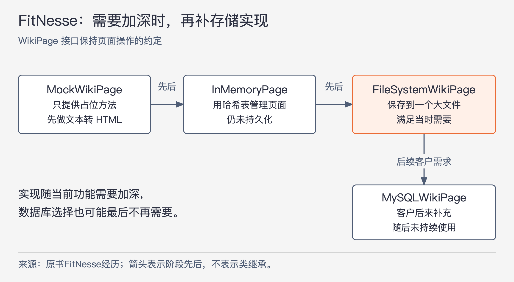
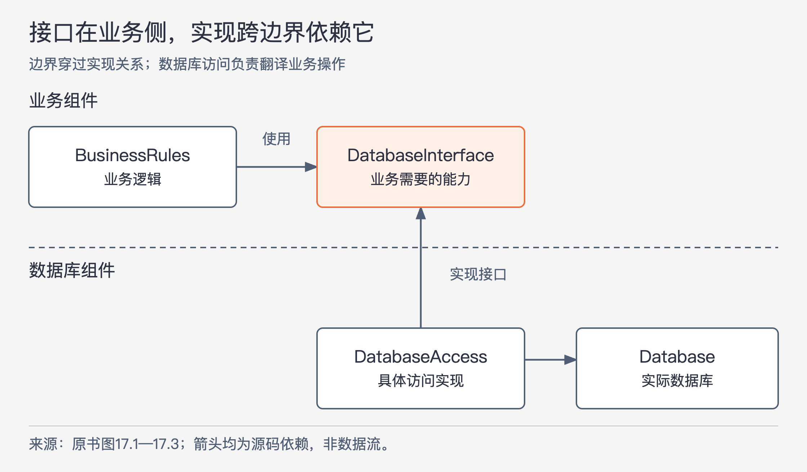

# 《架构整洁之道》第17章｜划分边界 · 书镜8.2

前两章讨论保留选择与独立性，本章回答边界具体画在哪里。作者先讲两次过早决定部署与工具的失败，再讲 FitNesse 怎样一边开发功能、一边推迟数据库选择，最后用源码依赖说明：业务可以使用数据库，却不必认识它的具体实现。

## 一、原书回顾：让具体实现依赖业务所需的约定

章首把架构设计称为划分边界的工作。边界约束两侧之间的依赖，有些在编码前确定，有些在演进中出现；早期边界的重要作用，是让框架、数据库、Web服务器、工具库、依赖注入等具体决定可以延后，而不持续干扰核心业务。

作者将降低构建与维护所需人力作为目标，批评没有业务依据的技术决定提前形成耦合。这并不表示任何早期决定都有问题：应该先辨认哪些选择由当前用例决定，哪些只是尚未证实的技术设想。后面的故事正用这一区别解释成本从哪里产生。

### 几个悲伤的故事

**P公司的故事。** 这家公司在20世纪80年代做出一个简单的单体桌面应用，90年代成为成功的GUI产品。90年代末客户要求Web版本，公司聘请一批Java程序员改造。新团队一开始便选择把GUI、中间件和数据库分别放在不同服务器上，并规定领域对象在三层各有一份实例。

分布式部署设想随之进入每次调用：调用转成消息对象，再经过序列化、编码和网络传输。现在给记录加一个字段，三个层次的对象及跨层消息都得跟着改变。两段相邻边界都有双向传输，于是作者列出四个传输方向，每个方向有发送与接收处理，共八个处理函数。

源文进一步概括要同时构建三个可执行文件，并写到“每个文件都要包含三个变更过的业务对象、四个新的消息结构以及八个新的处理函数”。这组数字是作者对修改负担的叙述，本章没有附源码或完整计数口径；本文不将它进一步换算成修改量倍数。可以确定的推理是：一个字段要求跨越对象副本、消息结构和两侧处理过程，使本来简单的功能牵动大量传输代码。

除了初始化、编码和解析，还要处理socket、超时和重试。然而开发团队长期只在一台机器上运行三个程序，作者记述该产品实际部署也从未用到设想的集群。系统仍然为尚未需要的跨机通信持续付出开发与运行成本。

脚注专门提醒，这里的三层分布主要是部署拓扑，是架构应当允许延后决定的一项安排。反面教训来自未经需求支持就固定部署形态，不能据此否定所有三层职责分工或确有需要的集群。

**W公司的故事。** W公司经营本地租赁车队，招聘架构师原本为了控制开发成本。新方案却先建立覆盖所有业务对象的庞大领域模型，再围绕对象配齐一整套服务。

原书拿“给销售记录添加联系人”展开后果。程序员只有名字、地址和电话号码，却先要到 `ServiceRegistry` 查 `ContactService` 的ID，向它发送 `CreateContact`。消息要求几十个字段都填有效数据，而调用者没有那些信息，于是被迫伪造数据才能取得新联系人ID；再把ID填入 `UpdateContact`，发给 `SaleRecordService`。

一次简单功能还要求测试时启动全部服务、消息总线和BPEL服务器，消息在多个队列间等待。功能继续变化，又会牵动服务约定、许多WSDL文件与重新部署。这里不仅多了网络开销，还让业务操作被迫满足超出自身需要的庞大数据要求。

作者随后明确限定：服务组织本身没有错，问题在于草率强制一整套域对象服务体系，让开发工作转而服务于工具。故事中“控制”一词的中间名讽刺，编者注也说明是修辞；它不提供判断方案好坏的技术依据。应抓住可以追踪的负担：新增联系人为什么需要不存在的字段和这么多独立设施？

### FitNesse

成功案例来自作者与儿子 Micah 在2001年的创业经历。他们想用简单wiki包装 Ward Cunningham 的FIT工具，帮助编写验收测试。作者在当时确立“下载即可执行”的要求：用户不应需要下载超过一个jar文件。这个部署约束先于技术偏好，影响了后面的选择。

他们为所需的基本功能编写了小型Web服务器，虽然已有开源选择，但简单实现方便部署，也让具体Web框架可以稍后决定。脚注补充，多年后他们接入了Velocity。这里呈现一次特定约束下的选择，不是建议所有项目自写Web服务器。

数据库也曾考虑MySQL，但团队先把页面查找、获取和保存的方法放入 `WikiPage` 接口，让业务只使用页面操作。实现随着功能需要逐步加深。

图17-1｜按原书FitNesse叙述整理。箭头表示开发先后；MySQL分支来自后来客户需求，不是原方案必经的一步。各阶段名称保持原书拼写。

最初三个月主要处理wiki文本到HTML的转换，与持久化无关，`MockWikiPage` 只提供空的数据访问方法。等占位实现无法支持下一批功能，他们才做 `InMemoryPage`，用内存中的哈希表管理页面。

随后约一年的功能开发，使程序已经可以创建页面、建立链接、渲染wiki格式，甚至运行FIT测试；缺少的是跨运行保存数据。需要持久化时，团队再次评估MySQL，选择先把哈希表写入一个大文件，形成 `FileSystemWikiPage`，然后继续开发功能。

又过三个月，他们认为文件已经足够，原来以为必须做的数据库决定不再必要。后来一个客户确实需要MySQL，看到 `WikiPage` 结构后，用一天写出 `MySQLWikiPage`。该实现曾随产品发布，但最终没人持续使用，连最初提出需要的客户也停止使用。

作者将这段过程概括为数据库决定推迟超过一年，并记述前18个月没有依赖数据库：不必处理表结构、查询、服务器、密码和连接耗时，测试也不需要数据库参与。这些是本章的项目回忆；三个阶段时长不应简单累加成本文计算的另一条时间线，一天实现MySQL也不是所有存储迁移的工期保证。

这条边界有两种价值。没有真实需求时，核心功能能持续推进；真实需求出现时，现有结构也没有禁止新增数据库实现。最后没有长期采用MySQL，仍能说明此前没有白白承担这项技术的日常成本。

### 应在何时、何处画这些线

作者建议在变化原因不同的内容之间画线，例如GUI与业务逻辑、GUI与数据库、数据库与业务逻辑。他预先回应一个异议：很多人把表结构和查询当成业务逻辑本身，但业务通常需要的是查询和保存的能力，而不是必须认识这些能力的数据库写法。第18章还会继续讨论这种区别。

图17-2｜依据原书图17.1—17.3重绘。所有箭头表示源码依赖；边界穿过接口实现关系，`DatabaseInterface` 归在业务侧。

`BusinessRules` 通过 `DatabaseInterface` 加载和保存数据；`DatabaseAccess` 实现这个接口，并把请求转成实际数据库操作。边界要画在接口与具体实现之间，让接口和业务逻辑同处一侧，数据库及其访问实现位于另一侧。

`DatabaseAccess` 有两条对外依赖：一条指向业务需要的接口，一条指向实际数据库。两端都不必反过来认识这个具体访问类。提升到组件层，便得到 `Database → BusinessRules`。这里的Database组件包括把业务调用翻译成数据库操作的适配代码，所以它依赖业务约定；不能把这句话误解成独立的数据库产品本身依赖这个应用。

原书提到Oracle、MySQL、Couch、Datomic以及大文件作为可能的实现。它们能否替换，取决于实现是否满足接口要求；这张图显示替换位置，不会证明任何两种数据库在所有业务下都等价。业务代码不直接认识这些选择，就可以先开发、测试规则，等确实需要时再决定实现。

### 输入和输出怎么办

使用者容易把可见界面当作整个系统，因此认为GUI必须从第一天就能工作。作者以游戏反驳：屏幕、鼠标、按钮和声音背后还有处理任务与事件的数据结构和函数；这个模型应能在没有实际显示界面的条件下执行逻辑。

因此，GUI与 `BusinessRules` 之间同样应有边界，源码依赖由GUI指向业务。图17.4表达的是界面要认识业务，业务不应写死某种界面。编者注举出命令行、Web和移动界面等替换形式。

源文称I/O“不重要”，相对的是核心模型的独立实现和验证。它不说明用户体验没有价值，也不等于产品不需要输入输出。一个游戏模型能无界面运行，与一款游戏能否为用户提供合格体验，是两项不同要求。

### 插件式架构

GUI和数据库都可以按上述方式放在业务核心外面：外围实现服从核心定义的能力要求，核心保持对具体实现的独立。原书图17.5把两条依赖都指向 `BusinessRules`，作者把这种安排称为插件式架构。

界面可考虑Web、客户端/服务器、SOA方式的接入或命令行等形式，存储可考虑SQL、NoSQL、文件或未来需要的其他实现。这里的“插件”强调源码依赖与可替换位置，不自动包含运行时自动发现、热加载或插件商店。

作者同时承认替换未必轻松。一个起初围绕Web交互设计的系统，改成客户端/服务器界面时，可能连界面与业务之间的交互方式都需调整。边界提供可调整的可能，并没有许诺所有替换都能原样插入。

### 插件式架构的好处

作者用 ReSharper 与 Visual Studio 说明依赖的不对称。两个产品由不同团队开发；原书以当时叙述中的俄罗斯与美国雷德蒙作为地理分隔，意在强调彼此独立，这里不把地点当成当前公司资料。

图17.6中的源码依赖从 ReSharper 指向 Visual Studio。插件侧需要适应宿主提供的能力和变更，宿主不必为每次插件内部修改调整源码。作者使用“一方可以中止另一方工作”的强说法，强调宿主约定变化对插件的制约；这不是对两个公司全部商业关系的判断。

系统内部可以有意采用这种不对称：网页格式或存储实现变化，应由相应适配代码承担，业务规则不因这些无关细节反复修改。作者把它比喻为挡住变化的防火墙。这个比喻以接口含义仍成立为条件，不能保证任何插件故障都不会影响运行。

最后作者回到SRP：边界两侧以不同原因、不同速度变化，就值得分别安置。GUI与业务规则如此，依赖注入框架与业务规则也如此。SRP帮助决定在哪儿分开，依赖方向决定分开后保护谁。

### 本章小结

把系统分成核心业务组件，以及为它提供必要能力的外围实现，再调整源码依赖，让外围指向核心抽象。作者将此联系到依赖反转原则与稳定抽象原则。画一条边界线还不够，类、接口、数据和引用关系需要实际符合这条线。

## 二、主题讲解：给业务一组它能理解的操作

### 从联系人需求看接口是否过大

下面借W公司的任务作假设改写。当前业务只是把联系人姓名、地址、电话附到一条销售记录。如果接口要求还传入无从知道的信用分类、组织层级或其他材料，开发者即使发出了一次成功请求，也可能已经偏离业务事实。

先明确这次操作必要的输入、结果和拒绝条件，再选择如何保存它。若其他用例需要更丰富的联系人信息，可以通过自己的步骤补齐；不必让这次简单操作承担所有业务的字段要求。这解释了W公司的深层问题：边界按庞大对象目录形成，调用者被迫理解超出当前用例的内容。

### 让业务侧声明需要，访问侧解释实现

假设业务侧声明“为指定销售记录保存联系人”，并明确成功后可查询到哪些信息。具体实现可以把数据存入某张表或某个文件，但不应要求业务方提供表名、连接句柄或厂商查询对象。

接口在业务一侧，是因为它表达这项操作需要什么。实现侧同时了解业务约定与存储方式，负责转换。若接口与实现一起放在只有数据库模块才能提供的包中，业务为了编译仍必须引入那个具体模块，那么源码层面的保护并未完全建立。

边界可以先留在一个进程内。P公司的教训已经说明，为边界配上网络协议是另一个决定。如果本地函数调用足以支持当前需求，就无需为尚未出现的跨机部署支付序列化、排队和故障协调成本。

### 像FitNesse一样，让占位实现跟上当前问题

当正在验证联系人格式和业务校验时，内存实现可能足够，让规则测试不用依赖数据库。等问题转到“重启后记录是否还在”，内存实现就不再能够回答，需要真正的持久化实现。

FitNesse从空方法到内存、再到文件的过程，正说明实现应随着要验证的问题加深。空实现只能支撑不需要数据保存的阶段；不能因为早期测试很快，就宣称持久化、容量或故障恢复已经验证。保持边界允许继续推进，也要求如实说明当前实现的能力。

随后若确有另一种数据库需求，可以把它接到同一业务约定上，用相同的业务情形核对结果，再单独验证存储相关条件。替换成功的依据是约定得到满足，不能仅凭实现了同一个接口名。

### 用两种变化检验线有没有画对

第一种变化：联系人页面改为分步填写，姓名地址电话的含义不变。若业务操作的输入仍能由界面整理出来，业务规则可以保持。第二种变化：业务新增“某种联系人必须得到特定批准”的要求。这个决定属于业务本身，核心规则就应改变；不能为了宣称GUI是插件而把批准逻辑藏在页面里。

还可以故意替换一种简单存储实现，看业务代码是否仍需要修改数据库专属类型。如果需要，继续追查泄露位置。验证边界的过程应围绕实际变化展开，不以接口数、层数或可执行文件数作为质量证据。

## 自测：把接口放到数据库组件里够不够

假设业务代码引用 `db-module` 中的 `ContactStore` 接口，接口返回数据库框架的记录类型；具体实现另有一个类。团队认为“业务只依赖接口，所以数据库已成为插件”。还需检查什么？

核对思路：接口的归属和数据类型仍把业务绑在数据库模块及其表示上。需要检查业务真正要使用哪些信息，接口能否放到表达这项业务需要的一侧，以及实现能否把数据库记录转换为业务能理解的结果。调整后，先用另一实现运行相同业务情形；若业务源码仍须引用数据库细节，保护就尚未成立。也要承认，有些替换会改变业务所需的保证，届时必须重新审视约定，而不能只挪动类。

## 来源与范围

依据 Robert C. Martin《架构整洁之道》第17章，PDF物理第172—184页，正文书内第143—154页。七个原小节按序保留，P/W两则故事与FitNesse各阶段均展开，未以结论清单代替案例过程。已回看PDF第174—184页核对修改计数、历史类名、阶段时间、图17.1—17.6与替换限制。历史公司描述、项目耗时与收益均为原书叙述，未作为当前资料或可复制工期。联系人接口、具体字段及验证过程为本文假设，未读取外部材料。

<!-- source_sha256: 64400d05a5e1fe23dedbc41526c9227f74b3647fce36eda738a11c325074f2c3 -->
