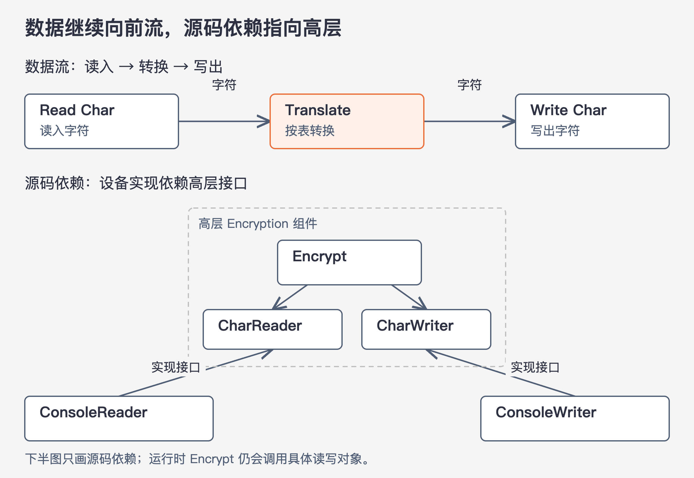

# 《架构整洁之道》第19章｜策略与层次 · 书镜8.2

第18章要求源码依赖指向高层，却还留下一个判断问题：哪部分代码算高层？本章用一个读字符、转换字符、写字符的程序，说明层次怎样决定组件关系，以及为什么数据的流向不能直接当成依赖方向。

## 一、原书回顾：先分开策略，再决定依赖指向

本章在正式小节前先给出“策略”的宽泛含义：程序中关于怎样把输入变成输出的规则，都属于策略。计算业务结果、安排报告格式、校验输入，各自包含不同的策略。因此，低层代码也有策略；“策略”不专指商业决策或某一种设计模式。

架构设计要把这些规则按变化的方式分开。变更原因、发生时间和层次相近的规则放进同一个组件；这些方面不同的规则分进不同组件。作者希望组件最终组成有向无环图：节点表示组件，箭头表示源码对另一组件的依赖。Java 的 `import`、C# 的 `using`、Ruby 的 `require` 是书中用来说明这类关系的例子。这里讨论的是代码需要知道谁，不是运行时谁先执行。

### 层次（Level）

作者用距离输入、输出的远近定义层次：直接管理输入和输出的规则处在最低层，离这些细节越远的规则层次越高。这个“距离”指规则是否还在处理设备、格式和接入方式，不应机械理解为调用栈里相隔几个函数。

原书的加密程序从输入设备读字符，按转换表把字符换成另一字符，再写到输出设备。Read Char 与 Write Char 直接接触输入、输出；Translate 负责中间的转换，因而处在更高层。原图用实线表示数据流、虚线表示源码依赖，就是为了让读者看见它们可以不同向。



图19-1｜依据原书图19.1、19.2重绘并分成两部分。上半图的箭头表示数据流；下半图的箭头表示源码依赖。下半图中 Encrypt、CharReader、CharWriter 同属高层组件，具体读写类位于边界外。

数据从读入端经过 Translate 流向写出端，看上去很容易顺势写成下面的结构。以下按 PDF 第194页校正 OCR 中的函数拼写，保留原书示意代码；它没有展开终止条件，也不是可直接使用的加密实现。

```text
function encrypt() {
  while (true)
    writeChar(translate(readChar()));
}
```

这段代码能表达所需的数据处理次序，问题在于 `encrypt()` 直接认识了低层的 `readChar()` 和 `writeChar()`。读写方式一变，高层代码便可能需要跟着改。把数据流画对，并不等于把依赖安排对。

原书的改进是引入 CharReader 和 CharWriter 两个接口，并把它们和 Encrypt 放在同一个高层边界内。ConsoleReader、ConsoleWriter 处在外面，各自实现对应接口。Encrypt 按“读一个字符、转换、写一个字符”的规则运行，却只引用高层接口，不引用具体控制台类。低层实现的源码反过来依赖高层接口，于是输入、输出策略可以独立变化。

接口在这里承担一项很具体的工作：把加密程序需要的读写能力说清楚，同时不写出由哪种设备提供。接口一旦反过来包含控制台专用信息，加密代码便会重新知道设备细节，原来的保护就减弱了。

接下来，作者把这个例子接回组件分组原则。单一职责原则（SRP）和共同闭包原则（CCP）都支持将因同一原因、在相同时间变化的规则集中起来。作者认为，高层策略通常变化较少，变化原因也较重大；低层更容易出现频繁的小改动。在这个例子中，他认为加密规则比输入、输出设备更稳定。这里应保留“通常”和例子语境，本章没有证明所有业务规则都比所有技术细节稳定。

当源码依赖统一指向高层时，低层的小改动就较难传播到高层。原书图19.3把类图收成两个组件：IODevices 依赖 Encryption；Encryption 不认识 IODevices。这就是低层成为高层插件的含义。插件关系靠源码依赖形成，不要求额外引入一个插件市场或动态加载平台。

### 本章小结

作者把本章与 SRP、OCP、CCP、DIP、SDP、SAP 联系起来，留给读者结合前文辨认。它们在这里各有分工：按变化原因组织代码，为稳定规则隔开易变实现，通过接口使源码依赖指向更高层；不能用记住六个缩写代替对加密案例的理解。

## 二、主题讲解：怎样判断一条规则该放在哪一层

### 延续加密程序，逐个问它必须知道什么

以下是在原书案例上构造的教学变化，不是新的生产加密方案。假设最初从控制台读字符，后来要从文件读，再后来由另一段程序把字符交进来。字符转换规则没有改变，只是字符从哪里来发生了变化。

先看转换规则需要的信息：它需要待转换字符和转换表，并不需要文件路径、控制台提示语或网络地址。再看文件读取需要的信息：它要知道怎样打开文件、怎样取得字符以及怎样结束读取。这两组代码的知识不同，变化原因也不同。它们之间就出现了值得保留的边界。

层次的判断因此不能只看“谁调用谁”。一个协调全部工作的函数，虽然位于调用栈入口，却可能混杂着打开文件、创建对象和执行业务计算；这个函数作为整体并不自动成为最高层。应把其中的规则分别识别出来，再看哪些必须了解外部输入、输出。

### 接口必须用高层需要的语言表达

让高层定义 CharReader，意思是高层声明“我需要读字符的能力”。低层文件读取类来实现它，意思是“我用文件提供这个能力”。如果接口方法反而要求高层传入某个控制台库专用对象，高层便必须了解控制台库，名称上有接口也不能完成隔离。

同样，CharWriter 应表达加密程序需要交出的结果。若它要求接收某个界面控件，高层算法又要学习界面细节。判断接口是否归属正确，可以检查参数和返回值：这些类型是否只描述高层真正需要的输入和输出，还是悄悄带入了设备、框架或供应方定义？

这种安排不会减少运行时的合作。Encrypt 仍然逐个读取、转换和写出字符；变化的是它的源码只依赖自己一侧的能力约定。Data 的归属问题也因此与上一章接上了：不只接口名称，连跨边界数据的类型都要检查。

### 改规则时，允许该变化的地方变化

假设现在转换规则确实改了，原来的逐字符转换变成必须同时观察一段输入才能决定结果。此时，“读一个字符、写一个字符”的接口也许仍够用，也许已经不合适。不能为了守住原有边界，硬把新规则塞进大量条件分支。

保护高层免受设备变化，不等于冻结高层自己的需求。合适的处理顺序是先确定新转换规则需要哪些信息，再检查接口是否仍表达这些需要。若接口含义变了，低层实现可能需要跟着改。这种传播来自高层能力变化，恰好与依赖方向一致。

本章的稳定性判断也要这样使用。若某个系统每天变化的是业务决策，而接入设备多年不变，不能硬说业务代码“肯定变化少”。仍可以依据规则与输入、输出的关系讨论层次，再结合实际变化记录判断组件是否分得合适。作者提供的是组织依赖的方法与常见变化预期，二者不应被混为一个无需验证的定律。

## 自测：接口放进公共包就算高层了吗？

假设团队建立 `common` 包，里面放 CharReader 接口，但接口返回一个具体文件库的对象。Encrypt 只导入 `common`，没有直接导入文件读取实现。输入改成控制台后，是否必然无需改 Encrypt？

核对思路：还不能得出这个结论。需要沿返回类型继续检查；它携带文件库的假设，可能要求 Encrypt 使用文件专用操作。包名不会决定层次，把接口放进公共目录也不会自动消除依赖。若改为仅交付加密规则所需的数据，还要确认终止、失败等行为是否能清楚表达；原书示例没有完整定义这些生产条件。

## 来源、范围与阅读连接

本卡依据第19章，PDF 第192–196页，书内第162–166页。已实际查看第194、195页，核验图19.1、19.2、接口归属和代码拼写。原章只有“层次（Level）”“本章小结”两个正式小节；前置的策略定义与有向无环图说明保留在第一部分开头。第194页脚注将中间转换称为“中央转换器”，本卡未引入这一别名作为新术语。文件输入与公共包案例均为教学假设。本卡不评价加密算法的安全性。第20章继续把高层业务逻辑区分为业务实体与用例。

<!-- source_sha256: 64400d05a5e1fe23dedbc41526c9227f74b3647fce36eda738a11c325074f2c3; content_lineage: fresh_from_source; source_unit: clean-architecture/19 -->
