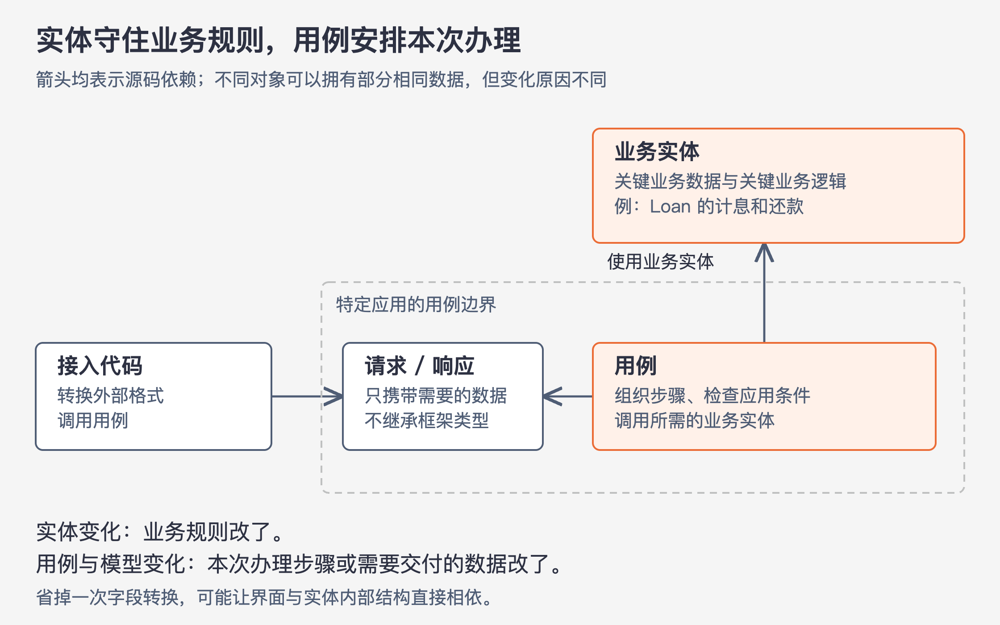

# 《架构整洁之道》第20章｜业务逻辑 · 书镜8.2

前两章讲怎样让低层细节依赖高层规则。本章进一步拆开“业务逻辑”：有些规则即使不使用计算机也成立，有些规则规定某个应用如何带用户完成一件事。业务实体和用例分别承载这两部分；请求与响应模型负责把用例需要的数据交进来、把结果带出去。

## 一、原书回顾：业务实体与用例为什么需要分开

原章先用赚钱或省钱界定它所讨论的业务逻辑。银行按 N% 向借款人收取利息，无论由计算机计算，还是由职员使用计算器计算，这条规则都对业务成立。作者把它称为“关键业务逻辑”。执行它所需的借款数量、利率、还款日程等，称为“关键业务数据”；即使没有自动化系统，这些数据也必须存在。

规则需要操作数据，数据又只有在这些业务规则下才具有相应意义，因而适合放在同一个独立模块中。作者把这种组合称为“业务实体”。这里的“赚钱或省钱”是本章的商业应用语境，不必把它扩大成所有软件目的的唯一解释。

### 业务实体

业务实体包含操作关键业务数据的规则。它可以直接持有数据，也可以方便地取得数据；对外提供的操作则完成业务行为。原书图20.1中的 Loan 保存借款本金、利率和期间，并提供收取还款 `makePayment()`、计息 `applyInterest()`、收取滞纳金 `chargeLateFee()` 等操作。

这个例子的重要之处是把借贷规则与数据放在一起。Loan 的工作不包括数据库如何存储一行记录、页面如何展示贷款，也不包括第三方框架如何启动对象。只要别的系统也需要相同的借贷规则，这个模块就有复用的可能。

作者紧接着限定实现形式：业务实体可以用类表达，但不要求一定使用面向对象语言。只要关键业务数据与操作它的逻辑被放在一个独立的软件模块中，就符合这里的要求。因而不能把“业务实体”等同于某个 ORM 框架要求加注解的数据库映射类。

### 用例

还有一类规则规定应用运行的次序和条件。原书假设银行有一个职员新建借贷的应用：先收集并验证客户联系信息，再检查信用值，符合条件后才进入还款预估。这个流程描述的就是一个用例。

原书图20.2把该用例命名为“为新贷款收集联系信息”。输入包括名字、地址、生日、驾照号码或社会安全号码等；输出供用户确认这些信息，并显示信用值。主要步骤依次是：接受并校验名字，校验其余联系信息，取得信用值，判断是否拒绝，然后在允许继续时创建客户对象并进入还款预估。最后的客户对象代表客户这一业务实体，包含银行与客户关系中的关键规则。

这里有一处需要保留的原文疑点：正文提到信用值在500以上，并写成“大于”既定阈值；图20.2却明确写“小于500”进入拒绝页，“否则”继续。本卡按图回顾流程时，500属于继续分支；不能据此断言原作者已经统一了边界条件。这不影响实体与用例的分工，却会影响真正实现该用例时的结果。

用例控制何时调用哪些业务实体，以及这些调用怎样组成某一项应用功能。业务实体保存可用于不同情景的规则，用例负责特定情景。例如，借贷如何计息属于 Loan；应用是否必须先完成联系信息验证，才允许取得某项预估，则属于这个应用的操作规则。

原书对流程使用了“屏幕”“跳转到页面”等非正式表述，随后特别要求：用例不详细描述用户界面。仅凭用例，读者不应确定交付形式是 Web、富客户端、命令行，还是内部服务。它应说明输入、输出和处理步骤，不把控件、页面模板或具体接入方法写进业务实现。

在代码中，用例也可以是对象：它有实现应用规则的方法，保存或接收输入、产生输出，并持有需要协作的业务实体引用。依赖方向由用例指向业务实体。业务实体不需要知道由哪个用例安排自己工作。原因是用例与某个特定应用及其输入、输出更近，而业务实体的规则适用于更一般的业务情景，层次更高。

### 请求和响应模型

用例需要输入和输出，但它不该因为接收请求就必须理解 HTTP，也不该因为交付结果就必须拼接 HTML 或 SQL。作者要求用简单的数据结构表示用例请求和响应。这些类型不继承 HttpRequest、HttpResponse 等框架接口，也不携带用户界面的细节。

图20-1｜依据本章的实体、用例和请求响应模型关系绘制。箭头均表示源码依赖。图中“接入代码”是教学概括，表示把外部输入转换成用例数据的代码；模型与用例处在同一应用边界，实体不依赖它们。

独立的数据结构是保护用例的一部分。若请求对象继承了 Web 框架类，用例虽然没有直接接收 HTTP 连接，也会通过类型依赖把框架带进来。外部格式换了，原本与它无关的用例就可能受影响。

另一种诱惑是直接把业务实体塞进请求或响应。它们看起来有许多相同字段，似乎可以省掉一层转换。作者明确反对这样合并：实体随关键业务规则变化，请求响应随应用交互需要变化，两者的变化原因和速度不同。合在一起后，为适应不同用途，代码容易不断增加分支和临时数据。这与单一职责原则、共同闭包原则所要求的组织方式相冲突。

### 本章小结

业务逻辑是本章所讨论的软件为业务提供价值的部分，应尽可能独立于界面、数据库和框架。把这些低层细节作为插件接入，才能让实体和用例中的规则独立开发、测试与复用。这里包含两种业务逻辑，不能只保护实体、却把用例留在界面代码中。

## 二、主题讲解：沿着一笔贷款，看三种对象各自负责什么

### 先把长期规则和本次办理步骤分开

以下继续使用贷款，但具体变化均为本文构造的假设。Loan 已经存在，本金、利率、期间共同决定它怎样计息、接受还款。无论职员从网页还是内部工具处理它，同一笔贷款都应遵守相同规则。如果网页发来“已还清”标记便直接把状态改掉，Loan 自己不检查实际还款，规则就分散到了入口；换一个入口时容易漏掉检查。

让 Loan 接收还款行为，并根据自身规则更新数据，能够把这项判断集中起来。它不需要知道按钮颜色，也不需要知道请求来自哪个页面。

接着考虑“取得还款预估”这个应用动作。它可能要求先收集联系信息、再查询信用结果、最后调用相应业务计算。即使某一项计算在 Loan 内完成，先后次序和准入条件也不必都塞进 Loan。负责组织这些步骤的用例清楚本次申请的目标，Loan 则保持其自身规则。以后另一个应用只为已存在的贷款计算还款结果，不必被新申请的联系信息流程捆住。

### 再把本次交互用的数据从实体中取出来

假设网页提交联系人资料。入口先把外部字段转换成普通请求数据，用例校验本次动作所需信息并执行处理，最后交付普通响应数据。这里的“普通”不是“任意字段随便装”，而是这些类型只携带本次动作需要的数据，不要求调用者继承框架类或拿到业务实体的内部状态。

返回整个 Loan 看起来节省了字段映射，但界面一旦直接使用它的所有属性，Loan 的内部表示就成了外部依赖。未来业务要改变本金的表示方式，或者响应只应展示部分信息，就得同时顾及实体与每一种界面。改为明确的响应模型后，可以在边界处取出所需数据，实体内部如何组织仍由实体自己决定。

转换也有成本：字段需要明确对应，遗漏或含义误解需要测试发现。因此，这里没有“所有地方都复制一份对象”的要求。划分应围绕不同变化原因和真实边界发生；同一用例内部的临时变量没有必要仅为形式而层层包装。

### 用一组变化检查分工是否合理

现在接连发生三件事：页面改版；新申请要求补一种联系信息；某类贷款的计息规则调整。

页面改版主要影响外部展示和接入。如果用例的输入、输出含义不变，用例与 Loan 应当能继续工作。新增联系信息会影响请求模型、用例验证与相关接入，但不必因此修改已有贷款如何计息。计息规则调整则应进入负责这条规则的实体，调用它的用例继续组织原来的流程，除非新规则也改变了用例需要提供的数据。

这些变化并不保证每次只改一个文件。它们帮助我们解释为什么改这些文件，以及哪些改变不应该蔓延。若一个字段既承担实体计算，又直接控制某页面的显示和某次申请是否可继续，便值得检查三种用途是否被揉在一起。

## 自测：不同入口能否共用同一个用例？

假设网页和内部服务都需要取得还款预估，处理规则完全相同，只是输入封装和输出格式不同。另一项批量复核任务则使用相同计息规则，却不要求重新收集客户联系信息。应该共用哪些东西？

核对思路：前两个入口可以各自转换外部格式，再调用同一用例。批量复核是否共用该用例，要检查其流程要求；若流程不同，可以有不同用例，共用相同的业务实体规则。不能为了复用一个入口方法，给所有场景加入“是否跳过联系信息”的开关。至于信用值恰好500时怎样处理，应先解决原章已有的条件不一致，不从类结构猜答案。

## 来源、范围与阅读连接

依据第20章，PDF 第197–202页，书内第167–172页。已查看第199、200页，核对 Loan 图和完整用例框。图20.1把本金字段拼成 `principle`；本文用中文“本金”解释，不把这个图中文字当作建议的英文命名。信用值500的比较条件在正文与图20.2间存在上述差异。原书关于业务实体名称的脚注归于 Ivar Jacobson，本卡不扩展其历史。本卡未引入真实银行政策，第二部分为假设案例。第21章接着讨论：软件的顶层结构能否让人看出这些用例。

<!-- source_sha256: 64400d05a5e1fe23dedbc41526c9227f74b3647fce36eda738a11c325074f2c3; content_lineage: fresh_from_source; source_unit: clean-architecture/20 -->
