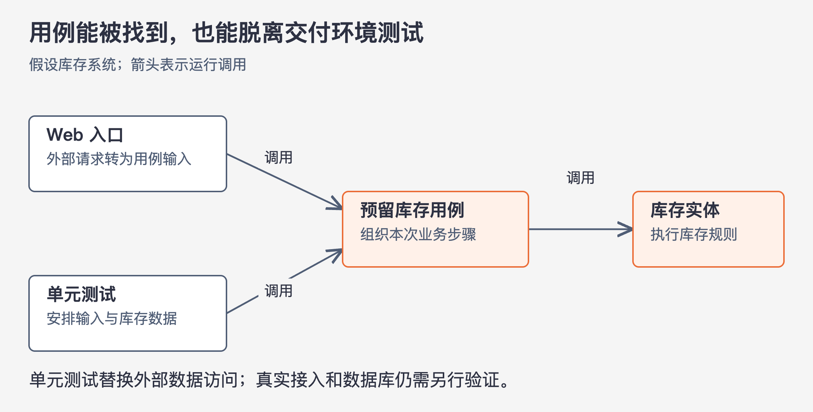

# 《架构整洁之道》第21章｜尖叫的软件架构 · 书镜8.2

一个新成员打开项目，首先看见的是系统能做什么，还是它用了什么框架？本章用住宅和图书馆的设计图提出这个问题，再把判断推进到代码结构、技术选择和用例测试。标题中的“尖叫”，指软件的用途应当清楚可见。

## 一、原书回顾：让系统用途成为架构的主题

原章先让读者看两种建筑设计图。住宅里，大门与起居室相通，餐厅靠近厨房，还可能有亲子活动空间；这些空间的组合让人认出“家”。图书馆有较大的入口、借阅办理区域、阅读区、小会议室和成排书架，人也能从布局认出它的用途。

作者把同样的问题交给软件：顶层目录与软件包是在告诉人们“健康管理系统”“账务系统”“库存管理系统”，还是只让人认出 Rails、Spring/Hibernate、ASP？两种建筑都使用建筑材料，区别却由使用活动及其关系表现出来。这个类比为后文的用例优先提供直观理由。

### 架构设计的主题

作者再次引用 Ivar Jacobson 的用例驱动设计：系统架构应该为用例提供支持，也应明显呈现应用有哪些用例。别人阅读架构时，应能辨认用户要完成的事情以及相应的业务组织。

框架可以提供工具和手段，但如果顶层组织完全服从框架规定的分类，系统自己的用例便容易退到后台。作者反对让框架替应用决定架构主题。他没有在此规定一种适用于所有项目的目录树，讨论重点是结构反映什么、支持什么。

### 架构设计的核心目标

围绕用例组织架构，应当允许脱离某个框架、工具和运行环境，仍完整描述用例。住宅先满足居住需求，再保留选择砖、石头、木材的余地；软件也应先确定应用要完成的事情，并尽量保留选择实现工具的余地。

因此，作者希望框架、数据库、Web 服务等决定尽可能延后，已经作出的选择也容易调整。他列出的 Rails、Spring、Hibernate、Tomcat、MySQL，是这种可选工具的例子。这里的收益来自用例已经与周边实现隔开；单纯把技术选型日期推迟，却让规则和技术细节混在一起，并不能取得同样结果。

### 那 Web 呢

作者把 Web 放在交付手段的位置，视为输入、输出的一种方式。一个应用通过 Web 与使用者交互，不应因此让全部内部结构围绕 Web 组织。只要业务含义和用例没有变化，应用应尽量能够改为命令行、富客户端或服务等形式交付，而保留基础的业务架构。

他进一步主张，是否以 Web 交付本身也应尽量延后决定。这个主张服务于保护选择余地；本章并没有证明所有真实项目都允许延后交付方式，也没有逐项讨论交付约束已经写入需求时怎样权衡。

### 框架是工具而不是生活信条

作者承认框架强大而有用，但提醒读者审慎对待“这个框架能解决一切”的教程和宣传。框架的作者和爱好者容易把自己的使用方式当成理所当然，应用开发者则需要考虑采用它的成本。

这里的实际问题包括：得到哪些便利，应用为此承担哪些依赖，怎样避免框架掌握业务代码的组织方式，以及如何继续把注意力放在用例上。原章没有提供一张评分表；它要求的是保留判断，不把熟悉框架等同于完成架构设计。

### 可测试的架构设计

上述独立性应当能通过测试观察到。实体与用例的单元测试，不应要求先运行 Web 服务、连接数据库或启动应用框架。用例对象直接调度业务实体，在受控输入下验证规则；外部能力可以在边界处被替换。

这是一项结构上的检验。如果测试一条纯业务规则也必须完整启动环境，就值得检查用例是否已经依赖了外部细节。原章在这一段谈的是业务实体与用例的单元测试，不能把它扩写成“真实数据库和界面都不需要测试”。

### 本章小结

作者用新成员阅读医疗系统源码收尾：他应先认识医疗用例，之后才去问视图和控制器在哪里。系统可以先把用例与规则设计清楚，再安排具体交付细节。这与开头的建筑图相呼应：清晰呈现用途，是架构支持业务的一种外在表现。

## 二、主题讲解：目录能看懂，还要用例能单独运行

### 让一次库存预留成为可找到的工作单元

下面是本文构造的库存系统案例。用户要为一个订单预留指定数量的商品。一个新成员如果只看到 `controllers`、`services`、`repositories`，必须逐层搜索后，才可能拼出“预留库存”在哪里执行、缺货如何处理、已经预留后再次请求会怎样。

可以让库存预留作为一个清楚命名的用例出现，并让该处的代码直接表达本次应用动作。比如，接收订单与商品数量，取得相关库存，调用实体中的可用量判断与预留行为，产生成功或无法预留的结果。这些细节在此是假设需求；真实项目仍须先确定自己的规则。

命名只是入口。若“预留库存”目录中仍只有一个薄薄的方法，所有规则散落在页面控制器和数据库回调里，新成员依然不能顺着用例理解行为。所谓“尖叫”，要有源码中的实际职责来支持。

### 同一个用例可以接受不同的调用入口

图21-1｜本文假设案例。箭头表示运行调用。Web 入口和单元测试都能进入同一用例；数据库的测试替身由外部装配，不要求业务用例创建真实数据库连接。图只展示业务测试边界，不覆盖完整交付测试。

先从测试入口给用例普通的请求数据，再提供可控制库存数据的测试替身。测试可以安排“数量足够”和“数量不足”的情形，观察用例是否产生预期结果、是否调用正确的实体行为。这个过程不需要网页，也不需要真实数据库，因而能直接检查本次应用动作。

Web 入口则负责从请求中提取字段，转换成同样的用例输入，并把用例结果交给外部展示代码。以后增加命令行入口，只需解决新的输入、输出适配问题；业务规则完全相同的情况下，不必复制预留逻辑。

若第二个入口需要不同的授权流程或不同的业务步骤，就应重新判断是否仍是同一个用例。共享名称相近的接口不等于共享全部行为，不能为了“独立于交付方式”删掉实际的应用要求。

### 已经选定框架，也可以检查依赖的范围

假设项目从第一天就明确要使用某个 Web 框架。本章仍然可用：检查库存实体是否需要框架容器才能创建，用例输入是否继承框架请求类，业务错误是否只能通过 HTTP 状态表达。把这些牵连放回接入代码，可以保留业务部分的独立性。

这比假装没有作出技术选择更有用。作者希望保留的是调整工具时不重写业务规则的能力。已经确定的工具可以继续使用，接入和测试也要真实完成；只是在安排依赖时，把框架的影响控制在它实际服务的地方。

同样，独立用例测试通过后，还要检查真实持久化、请求转换和结果显示。这些检查证明交付能工作。单元测试则更直接地证明用例规则能在较小环境中被理解和验证，二者回答不同问题。

## 自测：改成业务目录名，是否已经达标？

假设团队把项目顶层目录改为“库存预留、出库、入库”，但测试“库存不足时拒绝预留”仍必须启动完整 Web 框架和数据库。你会怎样评价？

核对思路：用途比以前容易找到，这是阅读上的改善；但用例独立性尚未得到证明。继续查看是数据访问没有可替换边界，还是业务对象必须依赖框架生命周期。若只是业务规则测试没有选择更小的入口，也要与真实源码耦合区分。目录结构、代码依赖与测试方式需要一起看。

## 来源、范围与阅读连接

依据第21章，PDF 第203–206页，书内第173–176页。实际查看第204、206页，核对开篇建筑案例、原小节及测试段落。原章无插图，图21-1为明确标识的假设案例图。“尽可能延后工具决定”与“用例单元测试不依赖框架”保留作者主张及其语境；不据此宣称现实工程没有技术约束或不需要集成验证。第22章将给出这些依赖关系的整体结构。

<!-- source_sha256: 64400d05a5e1fe23dedbc41526c9227f74b3647fce36eda738a11c325074f2c3; content_lineage: fresh_from_source; source_unit: clean-architecture/21 -->
