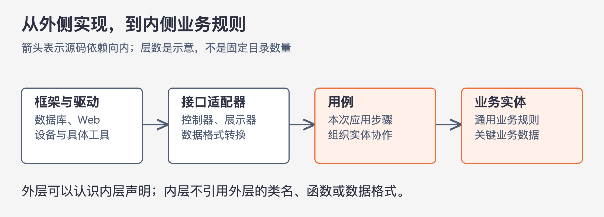
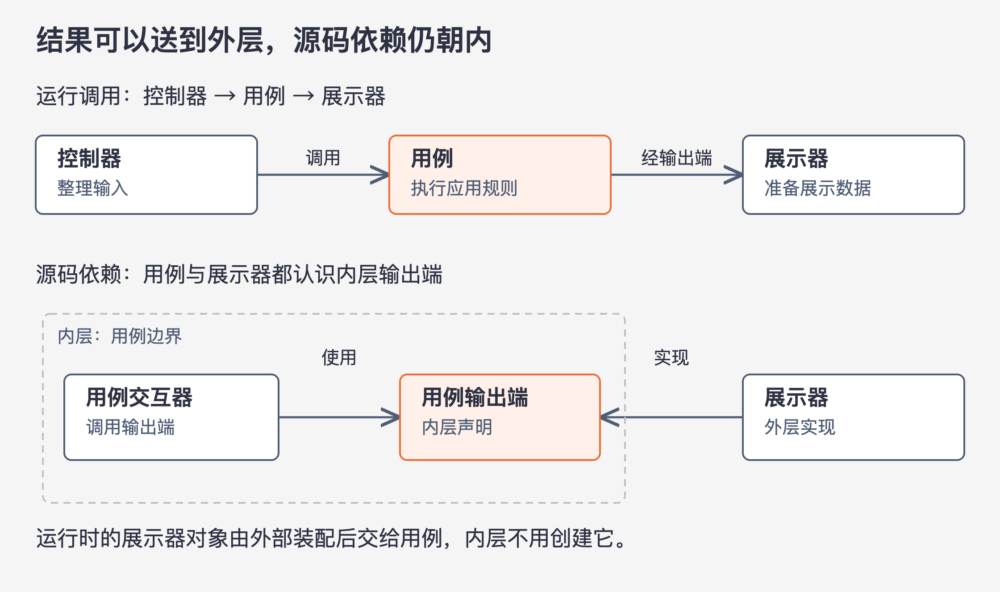
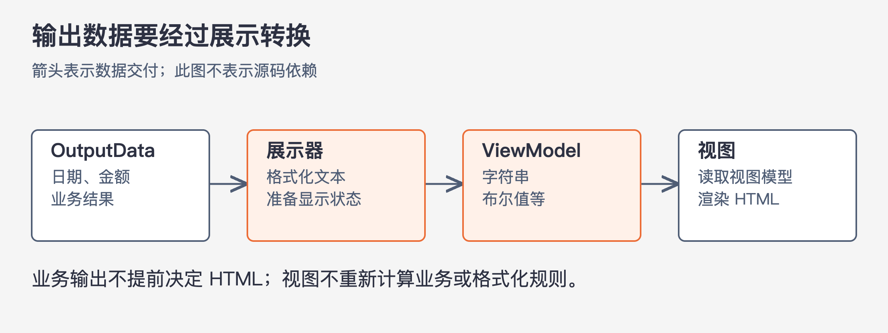

# 《架构整洁之道》第22章｜整洁架构 · 书镜8.2

前面已经分别讨论业务实体、用例、插件和交付方式，本章把它们放进同一幅结构图。读图时最需要辨认的，是源码必须认识谁、运行时又会调用谁。整洁架构用向内的源码依赖保护业务规则，同时允许请求与结果穿过多道边界。

## 一、原书回顾：用依赖关系把几种架构思想连接起来

原章先介绍几种相近的设计：Alistair Cockburn 的六边形架构，也称端口与适配器架构；James Coplien 与 Trygve Reenskaug 提出的 DCI；Ivar Jacobson 提出的 BCE。作者还提到 Freeman 与 Pryce 对六边形架构的推荐。这里是在交代思想来源，不要求读者先掌握所有流派。

作者提取的共同点是按不同关注点切割软件：业务逻辑有自己的位置，用户接口和系统接口分属其他位置。由此希望得到五种能力：不被框架支配；业务逻辑能脱离外部环境测试；更换界面不修改业务规则；更换数据库不把数据库细节传进业务；业务不必认识外部接口的具体实现。Oracle、SQL Server 与其他数据库的替换只是书中的说明例子，这些目标依赖于后文的隔离是否真正成立。

### 依赖关系规则

图22-1｜根据原书图22.1改为从外到内的横向示意。箭头只表示源码依赖向内，不表示请求只能单向流动，也不要求每次调用经过全部四层。四类职责是示意，实际层数可以不同。

原图用同心圆表现层次。越往内，越靠近高层策略；越往外，越靠近具体机制。贯穿它们的规则是：跨层的源码依赖只能指向内层。

这条规则检查的不只是构造函数和显眼的调用。内层代码不应引用外层声明的函数、类、变量等名称；同样也不该使用外层框架生成的数据格式。若方法只叫“处理请求”，参数却是框架的请求对象，内层仍然知道框架。作者的目标是让外部细节的变化不必迫使内层跟着改变。

### 业务实体

最内层封装关键业务逻辑。业务实体既可为带方法的对象，也可由数据结构和函数组成；它们应能被系统中的不同应用复用。对于单一应用，则体现该应用中最通用、层次最高的业务规则。

页面导航、外围安全机制或某个应用运行步骤的调整，不应无端改动这些规则。这里保护的是规则与外围机制的分离；如果改变的本身就是业务规则，实体当然需要变化，不能将“最稳定”理解成永远不改。

### 用例

用例层包含特定应用情景的业务逻辑，控制数据在实体之间怎样流入、流出，安排实体中的规则实现本次动作。它与实体的分工仍沿用第20章：实体知道业务本身，用例知道这个应用怎样完成一次工作。

作者希望用例变化不传播到实体，同时数据库、界面和框架变化也不直接侵入用例。另一方面，用例细节真正改变，就理应修改用例层。隔离不同变化，不会消灭业务需求自身的变化。

### 接口适配器

这一层负责转换表达形式。用例方便处理的数据，与 Web、数据库、外部服务方便处理的数据往往不同；控制器、展示器以及数据访问适配代码负责在两者之间转换。

例如，控制器从外部输入中形成用例所需模型；展示器接过用例结果，转成界面所需信息。数据库相关代码把内部需要的数据转换为存储操作，并把结果转回来。若使用 SQL，作者要求 SQL 限于这一层内真正访问数据库的代码，不能让更内层的用例和实体拼 SQL。

本节概括 MVC 时把展示器、视图、控制器放在适配讨论中；后面的图22.2又把实际 View 放在更外侧，让它依赖 ViewModel。两处粒度不同。本卡保留这个差别，并在完整案例中以 ViewModel 和实际渲染的边界解释：准备可展示的数据，与真正把它画出来，可以继续分开。

### 框架与驱动程序

最外侧放数据库、Web 框架等工具与具体机制，配上让它们和内部适配代码合作的连接代码。它们需要被使用，但应避免把自己的类型和组织方式带到业务内部。

把数据库画在外面，不表示数据库没有价值，也不表示所有数据问题都无关业务。这里说的是数据库产品、驱动和存储访问方式属于具体实现；用例所需的数据含义仍要在内层被明确表达。

### 只有四层吗

四个同心圆用来展示结构，不是固定目录规范。系统可以有更多层，或根据实际职责进行组织。无论层数多少，越往内应越接近通用规则，越往外越接近具体实现，跨层源码依赖仍须向内。

因此，照着图新建四个包，并不能证明已经获得整洁架构。若内层类型仍继承外层框架接口，依赖规则就已经被破坏。

### 跨越边界

控制流可能从控制器进入用例，再走向展示器。展示器比用例更外层，若用例直接引用具体展示器类，源码依赖就向外了。原书用依赖反转处理这个转折：用例一侧定义输出端接口，用例调用这个接口；展示器实现它。

图22-2｜根据图22.1右下角及本节文字重绘。上半图表示运行调用，下半图表示源码依赖。用例输出端属于内层，展示器实现这个接口；实际输出仍能够到达展示器。

运行时，用例持有的接口引用对应一个具体展示器对象，所以结果可以送到外层。编写用例源码时，却只需知道内层接口声明。类之间的多态关系，让控制流的方向与源码依赖方向分开。这种做法也可用于其他需要从内层请求外层能力的边界。

### 哪些数据会跨越边界

作者倾向于基本结构体、简单可传输对象、普通参数、哈希表等形式。具体载体并非重点，重要的是数据结构独立、简单，并且不带违反依赖方向的类型。

不能直接把数据库框架返回的“行结构体”送入用例。即使它读取字段很方便，用例也会因此依赖数据库框架定义的结构。类似地，不能为省转换直接把业务实体当作边界消息传递。跨越边界时，应采用内层方便理解和使用的表达，只取需要的数据；不能让外层方便的格式反过来支配内层。

### 一个常见的应用场景

原书图22.2给出一个使用数据库的 Java Web 程序，可以按一次请求走完。

Web 服务器把用户输入交给 Controller。Controller 将输入整理为简单的 InputData，通过 InputBoundary 调用 UseCaseInteractor，即用例交互器。用例交互器执行应用步骤，与 Entities 业务实体协作；需要加载数据时，它使用内层的 DataAccessInterface。外侧 DataAccess 实现该接口，并访问 Database，于是用例不用直接认识数据库。

接着，用例从实体取得结果，组成简单的 OutputData，经 OutputBoundary 交给 Presenter。与输出端类似，数据访问接口也由内侧声明、外侧实现，这样调用数据库的需要不会把数据库类型引进用例。

图22-3｜根据图22.2及其后说明绘制输出段。箭头表示数据交付与转换，不是源码依赖。日期、金额与按钮状态从业务结果变成视图方便使用的文本和开关。

Presenter 把 OutputData 转为 ViewModel。日期对象转成适于展示的日期字符串，金额也按展示需要格式化。按钮和菜单项的名称、是否可用的开关，都进入 ViewModel。View 读取这些已准备好的数据，将其转换成 HTML。它不再决定业务规则，也不应重新计算这些展示条件。

这个完整案例表明：向内的源码依赖不会阻止结果返回页面。不同位置分别负责处理业务、转换数据和实际渲染，运行合作与依赖保护可以同时成立。

### 本章小结

作者将可测试性与外部工具可替换性归结为分层和依赖方向。业务规则能在较小环境中运行；数据库或 Web 框架变化时，也能主要修改外侧代码。实际替换仍须确认接口含义、数据兼容及接入行为，本章的结构图不能替代这些验证。

## 二、主题讲解：沿着一次库存查询检查四种依赖

### 从用户看到的结果倒着找职责

以下是本文构造的假设案例。用户查看某商品是否可预留，页面要显示可用数量，以及“预留”按钮是否可用。库存实体计算可用数量；查询用例取得这次需要的库存并组织结果；展示器准备页面显示的文字与状态；视图将这些内容渲染出来。

先确定“是否允许预留”来自哪条规则。如果它由库存和业务限制决定，判断就应在实体或用例中形成，展示器只把该结果转换成按钮状态。若展示器自行根据字符串猜测可用数量，业务判断会散落到外侧；若实体直接返回“按钮灰色”这样的界面表达，业务规则又被具体页面限制。正确分工需要明确每项数据的含义，不能只按类名分层。

### 数据库结果先变成业务需要的数据

假设数据库查询返回某框架专用的记录对象。数据访问实现从记录中取出商品和库存数据，按照内层接口约定交付。用例据此调用实体，不需要知道列如何命名，也不需要调用记录对象上的数据库方法。

这里常出现一种表面整洁：用例只导入 `InventoryGateway` 接口，但接口返回 `DatabaseRow`。调用名称已经被隔开，返回类型仍把存储细节带进来。依赖审查要沿着参数、返回值和继承关系走到底，不能只确认“已经有接口”。

若存储结构改变，适配实现负责重新取得相同含义的数据。若数据含义本身改变，例如“可用库存”从一种业务口径变成另一种，则实体或用例也可能需要修改。依赖规则隔离的是不同层次的变化，不会让业务口径变化自动消失。

### 输出接口让内层交出结果，而不认识页面

用例形成“商品、可用数量、是否允许预留”等结果后，调用自己的输出端。网页展示器接到结果，形成页面模型；另外一个调用入口也可以提供适合自己的输出实现，只要用例语义一致。

为这项安排做一个小测试：给用例替换数据访问接口与输出端，用固定库存数据运行，再观察交付了怎样的业务结果。它检验用例；给展示器一份已知结果，检查显示文本和按钮状态，则检验展示转换。最后才用真实外部环境验证数据库读取和页面渲染。

每个测试都围绕一个明确问题。把全部测试堆进一个启动全系统的用例，会使失败难以定位；完全不测外侧，也会漏掉数据取错、字段映射错误或显示异常。整洁架构使这几种测试容易分开安排。

### 不必为了四个圆造出四倍代码

小功能未必需要为每一步新建一组文件。真正需要保留的是不同变化的分界，以及源码没有向外认识具体实现。如果一个简单转换没有独立变化原因，强行包装只会增加阅读成本。反过来，若没有分出边界就无法替换数据库或独立测试用例，省掉的代码可能正是需要的隔离。

本章可以用来审查现有代码，也可以指导新代码。先选一条真实请求，标出业务规则、应用步骤、外部格式转换和具体工具；再检查接口、数据类型和运行装配。图上的箭头都朝内，只是要验证的设计意图，最终还得与实际源码一致。

## 自测：查询接口返回 ORM 实体，可以吗？

假设用例依赖一个自己声明的查询接口，但该接口返回携带 ORM 框架依赖的数据库映射对象。输出端又把这个对象直接交给页面。两处边界分别存在什么问题？

核对思路：查询接口的返回类型让外层框架进入内层；直接输出又把存储表示扩大成页面依赖。应先定义用例需要的数据含义，由数据访问实现负责转换，再明确用例响应与视图模型。若对象只有简单字段、完全没有外层依赖，也仍须检查它是否把实体与交互模型两种变化原因绑在一起，不能只凭“它是普通对象”认定适用。

## 来源、范围与阅读连接

依据第22章，PDF 第207–214页，书内第177–184页。实际查看第209、213、214页，核对图22.1、22.2、输出端与数据访问接口的方向，以及日期、金额、菜单和按钮的转换。原章10个小节按顺序保留。MVC/视图归属的概括与图示粒度不同，已在接口适配器小节说明；未把它改写成唯一固定目录结构。三张图均为原章关系的教学重绘；库存查询为本文假设。第23章将进一步解释为何让视图保持简单，有助于测试。

<!-- source_sha256: 64400d05a5e1fe23dedbc41526c9227f74b3647fce36eda738a11c325074f2c3; content_lineage: fresh_from_source; source_unit: clean-architecture/22 -->
