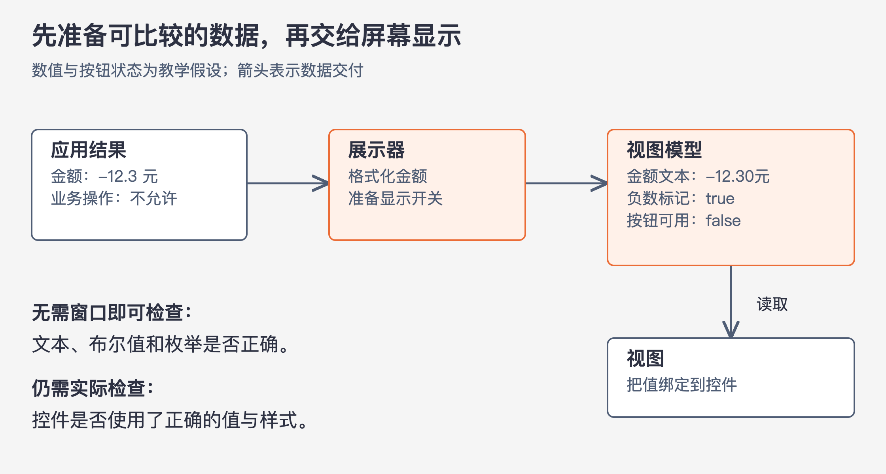

# 《架构整洁之道》第23章｜展示器和谦卑对象 · 书镜8.2

第22章让展示器准备视图模型，让视图负责显示。本章解释这种分工的测试理由：有些代码必须接触屏幕、数据库或服务通信，验证起来比较困难；可以把其中能单独判断的规则提取出来，让不得不留在外部边界上的代码尽量简单。作者把这一做法称为谦卑对象模式。

## 一、原书回顾：把难测的部分缩到真正需要外部环境的地方

原章先指出，展示器与视图的分离只是这种模式的一种应用。整洁架构的多个边界，都可以借助类似的划分被识别和保护。

### 谦卑对象模式

模式最初为单元测试服务：把容易测试与难以测试的行为拆成两组模块或类。难测的一组称为谦卑对象，保留必须接触外部环境的行为，并把这些行为简化到必要程度；其他可独立判断的行为移到另一组。

GUI 是原书首先举的例子。让测试检查屏幕上某个元素是否真的出现，比检查一个对象返回什么字符串困难。但界面涉及的许多判断与转换，并不必须依赖屏幕。把这些行为留下来和绘制代码混在一起，会让本来容易测的部分也变得难测。

因此，谦卑对象不是“职责越少就越好”的泛泛要求。它先找出难以隔离的行为，再把可以独立处理的内容移走。得到的边界可以让多数规则在较小环境中被验证。

### 展示器与视图

原书把视图放在谦卑对象一侧。它只负责把准备好的数据填到 GUI，尽量不再处理数据。展示器在容易测试的一侧，接收应用结果，按视图需要进行格式化，再写入视图模型。

日期例子最直接：应用给出 Date 对象，展示器把它转成需要的日期字符串，视图直接显示。金额也类似：展示器决定保留几位小数、加什么货币标识，将结果写入视图模型。若负金额要显示为红色，视图模型中就准备一个布尔标记，视图据此应用显示状态。

图23-1｜依据原章日期、金额和按钮例子绘制；数值与禁用状态为本文假设。箭头表示数据交付。视图模型中的金额字符串、负数标记和按钮状态可以在不显示窗口时检查；图不把屏幕渲染本身视为已验证。

同样的原则延伸到按钮、菜单、单选项、多选项和文本框。控件名称由展示器填入字符串，能否使用由布尔开关表示。即使是一个数值表格，也应先由展示器把数值格式化成适合表格显示的字符串，再让视图填充。

作者把要求推得很明确：应用能控制的显示内容，应尽量以字符串、布尔值或枚举进入视图模型，视图负责加载这些值。这样才称得上“谦卑”。译者脚注也解释，它只承担桥梁和通信作用，不在途中额外干预信息。

### 测试与架构

可测试性不仅是测试代码的事，也能帮助判断架构。把易测与难测行为分开时，往往恰好划出一种架构边界。展示器与视图只是一个例子，数据库和服务也有类似位置。

原文有时简写成“可测试和不可测试”，结合前文应理解为在所讨论的单元测试条件下容易或难以验证。模式的用处是减少需要外部环境的行为，不是宣布某些组件永远不能测试。

### 数据库网关

用例交互器与数据库之间，可以用数据库网关接口提供应用需要的操作。原书以 UserGateway 为例：应用想取得某个时间之后登录过的用户的姓，就在网关声明 `getLastNamesOfUsersWhoLoggedInAfter`，接收 Date，返回姓的列表。方法表达的是应用需要什么结果，不要求用例自己写出 SQL。

SQL 或其他数据库访问调用由外侧实现完成。这些实现应尽量只负责取得所需数据，属于谦卑对象；用例交互器则负责特定应用的业务逻辑，处在易于单独测试的一侧。测试时用桩或替身实现网关接口，就能安排数据库可能交付的数据，检查用例如何处理。

原段口头上说查询“昨天登录”的用户，方法名却只表达“某时间之后”。二者在真实查询里未必等价：仅给起点，未必排除今天的数据。本章未补全时间区间条件，所以本卡只据此说明接口应表达业务所需操作，不把这个方法当作已经完善的日期查询规范。

### 数据映射器

接着，作者讨论 Hibernate 一类 ORM 工具的位置。他先作了一个概念上的区分：对象向使用者提供操作，内部数据可以隐藏；数据结构则公开承载数据，不包含同样的行为约束。按照这一区分，他认为所谓 ORM 在这里更适合被称为“数据映射器”，因为它把关系数据库中的数据装入数据结构。

原书用“ORM不存在”的强烈说法强调上述概念区别。这是作者在本章采用的论证方式，并非声称市面上没有名为 ORM 的产品，也不是对所有映射工具功能的逐项调查。

从职责看，这类映射工具应留在数据库一侧。它们在数据库与网关接口之间完成外部数据的取得和转换，形成另一道谦卑对象边界。用例可以依赖自己需要的网关操作，不必依赖工具如何装载字段。

### 服务监听器

当应用接收或调用其他服务时，也可以使用同样的分工。输出时，应用把需要交付的数据装入简单数据结构，再交给负责外部格式和传输的模块；输入时，服务监听器接收外部数据，将它转换成应用方便使用的形式。

这样，业务处理不必直接操纵通信格式，难以隔离的发送、接收行为也不会和大量业务判断混在一起。跨边界数据保持简单，既便于独立处理，也使两边各自承担的工作更清楚。

### 本章小结

作者认为，系统的多种架构边界都可能发现谦卑对象：一侧接触难以直接进行单元测试的机制，另一侧处理可独立验证的规则，中间通过简单数据结构合作。能否把两类行为分开，是识别边界和改善可测试性的一个具体切入口。

## 二、主题讲解：把一张账单页面拆成可检查的判断

### 先找出失败时最难定位的混合行为

以下是本文假设的账单页面。它接收金额和结算状态，显示金额文本；负数使用特殊颜色，尚未结算时允许点击某个操作按钮。若一个页面函数同时计算业务结果、格式化金额、决定按钮是否可用，再实际创建控件，测试失败时便很难判断错误发生在哪一步。

先把业务结果确定下来。是否允许执行操作，若由业务规则决定，应由实体或用例给出；展示器把它转成视图需要的按钮状态。金额怎样按约定格式展示、负数怎样转换成显示标记，则可以由展示器处理。视图只读取这些已确定的值，并用界面技术表达出来。

把业务权限藏到按钮样式里会产生另一种错误：页面上不可点击，不代表其他入口不能执行该业务操作。分离展示不应把业务规则移到展示器里，更不能让按钮禁用替代用例检查。这是沿原章分工作出的教学推论。

### 在不打开窗口时检查展示器

现在给展示器一个负金额和明确的业务状态，观察它产生的金额字符串、负数标记、按钮文字及可用开关。预期结果都能作为普通数据被比较，不需要查看实际窗口。这些检查适合集中覆盖格式、边界值和状态组合。

视图仍可能发生错误：颜色绑定写错，文本装进了错误控件，按钮没有使用对应的开关。展示器测试不会发现这些问题。模式让视图保持简单后，可以把有限的实际渲染检查集中在“值是否正确接到控件”上，而不用每次重走完整业务来验证所有格式分支。

测试工作因而被分得更清楚：业务测试判断能否操作，展示器测试判断如何准备显示数据，视图检查判断这些数据是否被正确呈现。不能把展示器测试通过直接报告成页面已正确显示。

### 数据库和服务边界可以用相同办法判断

假设账单数据来自数据库。用例需要“给出这个客户在某个范围内的账单数据”，数据库网关实现负责查询和转换。用例测试替换网关，用小组固定数据检查汇总或筛选后的行为；实际数据库测试检查查询条件和字段转换是否正确。这与展示器和视图的分工相似，但不是说网关实现可以随意不测。

再假设需要通过外部服务发送账单。内侧形成清楚的发送数据，外侧负责编码和通信。若发送器里开始决定客户属于哪种账单规则，就应检查这项判断能否移回用例；若它只是把内部字段转为外部协议所需格式，就仍属于边界接入的工作。

不能仅凭“代码难测”就把它命名为谦卑对象。还要检查里面是否剩下大量可以独立验证的规则。真正完成拆分后，外侧留下的是必要的接触与转换，内侧留下的是业务或展示判断；两边都要有适合其责任的验证。

## 自测：数据库替身能证明查询正确吗？

假设用例在替身网关上通过了“只处理昨天登录用户”的测试，真实 SQL 却只限制登录时间晚于昨天零点，没有限制结束时间。能否说这个功能已经通过验证？

核对思路：替身证明用例在给定数据下如何处理，不能证明 SQL 能交付正确的数据集合。需要分别明确时间范围和比较条件，并验证真实网关实现。这个例子也提醒我们检查原书方法名的含义，不能把模糊需求变成一个接口后，就认为含义已经准确。

## 来源、范围与阅读连接

依据第23章，PDF 第215–219页，书内第185–189页。已实际查看第218页，核对 UserGateway 方法拼写、日期参数和 ORM 论证。原章7个小节全部保留；谦卑对象模式脚注指向 Meszaros，数据库网关脚注指向 Fowler，本卡未延伸查阅所引书籍。日期查询的起止范围未在原章完整说明，已显式记录。账单页面与测试情景为本文假设，不代表真实财务流程。第24章进一步讨论：若完整边界暂时太贵，可以保留哪些部分。

<!-- source_sha256: 64400d05a5e1fe23dedbc41526c9227f74b3647fce36eda738a11c325074f2c3; content_lineage: fresh_from_source; source_unit: clean-architecture/23 -->
