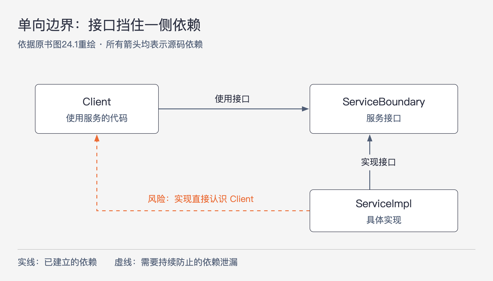

# 《架构整洁之道》第24章｜不完全边界 · 书镜8.2

一条完整的架构边界，既要隔开代码依赖，也要支撑组件分别编译、部署和演进。这些工作都有成本。本章讨论一种中间选择：当分离的理由已经出现，但还不足以承担全部成本时，先保留哪些隔离，暂缓哪些工作。

## 一、原书回顾：先留下边界，再决定做到多完整

本章开头列出了完整边界的支出：双向的多态接口、输入输出数据结构、依赖关系管理，以及让组件能够独立编译和部署的工作。它们既需要前期设计，也需要后续维护。架构师可能认为眼下不值得全部实现，却又担心以后无法低成本地拆开。作者把这种预见与 YAGNI 的提醒放在一起：不要为臆想的需求过度设计，但也不能完全放弃对变化的判断。不完全边界就是在这组矛盾中提出的做法。

### 省掉最后一步

第一种方式，把接口、输入输出格式和代码依赖都按可分离组件设计好，最后仍统一编译、统一部署。它没有省掉设计完整接口所需的代码和思考，省下的是多组件的版本管理与发布管理。边界在代码组织上保留，发布单元暂时合并。

FitNesse 早期就是这样处理 Web 服务器的。作者预想，未来或许会在别的应用中复用这个 Web 组件，因此先把它与 wiki、测试部分隔离。但 FitNesse 又希望用户下载一个 JAR 就能运行，不必寻找第二个 JAR 或处理版本兼容问题，于是保留了单一交付包。

这段经历也有后半程。随着独立复用 Web 组件的需求变少，wiki 与 Web 之间的隔离逐渐弱化。按作者写作时的回顾，后来如果真要分离，还得补做不少工作。这个反例提醒读者：设计时预留过边界，不等于多年后仍然能够随时拆开；省掉独立构建和发布，也少了持续检验隔离是否完好的机会。

### 单向边界

第二种方式连接口工作也少做一部分。作者用策略模式说明：`Client` 使用 `ServiceBoundary` 接口，`ServiceImpl` 实现它。客户端不必直接引用具体服务实现，未来隔离二者所需的一次依赖反转已经完成。

图24-1｜单向边界保留了一侧的隔离。依据原书图24.1重绘；箭头表示源码依赖，虚线是可能出现的违规依赖，不是运行时消息。

图中的接口给客户端提供了稳定的使用方式，但实现类仍有机会反过来直接依赖客户端。假如服务为了通知处理结果，直接认识某个具体 `Client` 类，另一侧的隔离就被破坏了。完整边界需要继续为这类交互安排接口和数据，且长期维护。单向边界把这部分工作暂缓，依赖开发者与架构师自律来阻止泄漏。

因此，“单向”描述的是目前做到了哪一侧的隔离，不能理解成运行时只允许单向传递信息。调用返回值当然可以存在；关键是返回过程是否让底层代码认识了本应隔离的具体对象。

### 门户模式

第三种方式更轻：使用门户模式，也就是 facade pattern。客户端只调用 `Facade`，由它把请求转交给背后的多个服务函数。服务细节不必直接暴露给客户端，调用入口也因此集中起来。

但这里没有依赖反转。依赖仍沿 `Client → Facade → Service` 传递，所以客户端在整体依赖关系上仍被服务实现牵动。原书以静态类型语言中的重新编译说明这种传递性影响，并提醒读者，直接建立反向通道也很容易。这个例子所能保证的是入口收拢，不能据此断定两侧已经独立演进。

关于“服务源码的任何修改都会导致客户端重新编译”的表述，应放在作者描述的静态编译依赖情境中阅读。本章没有区分各种语言、二进制兼容方式和构建系统，不能把这句话扩大为所有工程的构建定律。

### 本章小结

这三种做法是示例，并非不完全边界的全部种类。它们分别暂缓了不同的投入，也承担不同的隔离风险。边界后来确有必要，可以继续补全；如果始终没有必要，也可能逐渐降解。架构师需要判断哪里值得预留，以及采用完整还是不完全的形式，不能用某一种模式替代这个判断。

## 二、主题讲解：为一个尚未独立发布的计费组件保留什么

### 先说清楚希望挡住哪一种变化

以下是帮助理解的假设案例。一个 Java 订单应用计算服务费，当前只有一种计费规则。团队预计可能接入另一家渠道，但还没有确定需求。眼下希望做到的事情是：修改渠道的计费实现时，不必改订单的处理流程。是否需要把计费组件独立发布，是另一个问题。

如果订单代码直接创建渠道计算器，并在多处读取渠道专用字段，未来换渠道时，这些位置都要重新检查。边界的价值来自挡住这条变更路径。先明确这条路径，才能判断“留一个接口”究竟解决了什么；接口数量本身不能证明设计有用。

### 三种选择省下的是不同的工作

假设订单只需要“根据订单资料计算费用”，我们可以让它使用一个计费接口，由渠道实现来完成计算。接口与参数用订单能够理解的名称，返回结果也不携带渠道 SDK 对象。双方暂时放在一个 JAR 中，这是单向边界的一种应用。它为更换计费实现留下了位置，同时避免现在就承担独立发布。

如果计费还需要主动通知订单，而我们也为通知设计了接口、数据，并清理了全部跨边界依赖，代码已经具备分离条件，只是最终一起打包，那就更接近“省掉最后一步”。这时设计成本已经花掉，节省的主要是版本与发布管理，不能再把它当成几乎免费的占位。

如果当前连计费接口也不值得引入，可以先用一个门户集中计费入口，避免订单的多个位置分别访问各个渠道函数。这有助于将来找到需要改动的地方，但调用方仍可能通过门户传递性地依赖实现。选择门户，就应接受这份较弱的隔离。

| 方案 | 已经保留的东西 | 暂缓的工作 | 需要继续观察的风险 |
|---|---|---|---|
| 省掉最后一步 | 按独立组件准备的接口、数据和依赖关系 | 分别编译部署及其管理 | 同包开发使边界逐渐弱化 |
| 单向边界 | 一侧使用接口，具体实现依赖该接口 | 另一侧的完整隔离 | 实现反过来认识具体客户端 |
| 门户模式 | 集中的调用入口 | 依赖反转和完整隔离 | 实现变化仍沿依赖链传递 |

这张表比较的是作者的三个示例。实际项目可以结合使用，不需要把每个模块强行归到唯一一种模式。

### 一次“方便的回调”怎样破坏预留边界

继续看计费案例。渠道实现计算完费用后，需要记录订单状态。开发者为了方便，直接传入 `OrderService`，让渠道实现调用它的内部方法。虽然订单仍使用计费接口，另一边却已经认识了订单的具体实现。以后拆出计费组件，就必须把这段反向依赖一起拆掉。

修正时先确认通知是否确有必要。结果能随普通返回值交回订单，就不必增加另一条回调通道；若确实需要独立通知，再为该交互明确接口及其数据。这里的选择取决于真实交互，不能为了补成“完整模式”而制造本来没有的机制。

可以用一个小检查检验隔离：只保留订单需要的计费接口和数据，去掉渠道实现后，订单处理逻辑还能否编译或接受替代实现？如果不能，检查泄漏的是具体类、参数类型，还是回调路径。这是在观察边界承受了什么，不能代替真实的发布验证。

### 预留边界也需要退出条件

如果第二家渠道迟迟没有出现，而每次变更都在为闲置接口支付维护成本，可以重新评估这条边界。FitNesse 的经历说明，预留结构可能自然退化。团队需要知道这种退化是否已经发生，不能仍把“随时可拆”当成事实。

反过来，如果多个调用方开始依赖计费、独立发布已经有明确价值，继续只靠同包开发的自律，风险也会增加。这时应补足阻止反向依赖的约束，并实际验证分离构建和部署。作者没有给一个通用的时间表；本章提供的是成本选项，下一章继续讨论怎样在系统演进中选择实现边界的时机。

## 用一个新情形检验理解

团队说：“数据库访问已经藏在 `StorageFacade` 后面，以后换存储引擎肯定不影响上层。”检查发现，门户的方法返回数据库驱动专用对象，而且门户与所有调用方一起构建。你会怎样修正这个判断？

核对思路：先承认入口已经集中，这是现有收益。再检查返回类型造成的直接依赖，以及门户到存储实现的传递依赖。若上层仍认识驱动对象，换引擎就可能要求上层跟着修改。是否进一步引入接口和独立数据，取决于替换需求及成本；仅仅出现了 `Facade` 这个名字，不能证明隔离已经完成。

## 来源、范围与阅读连接

原书范围为《架构整洁之道》第24章，PDF物理页220–223，正文书内页191–193。回顾保留原书四个小节及章首的成本与 YAGNI 讨论。图24-1依据原书图24.1；计费和存储门户情形是本文假设案例。关于编译传播的说明保留了原书语境，未引入外部版本事实。本章的选择将在第25章的层次、数据流与边界时机讨论中继续展开。

<!-- source_sha256: 64400d05a5e1fe23dedbc41526c9227f74b3647fce36eda738a11c325074f2c3 -->
