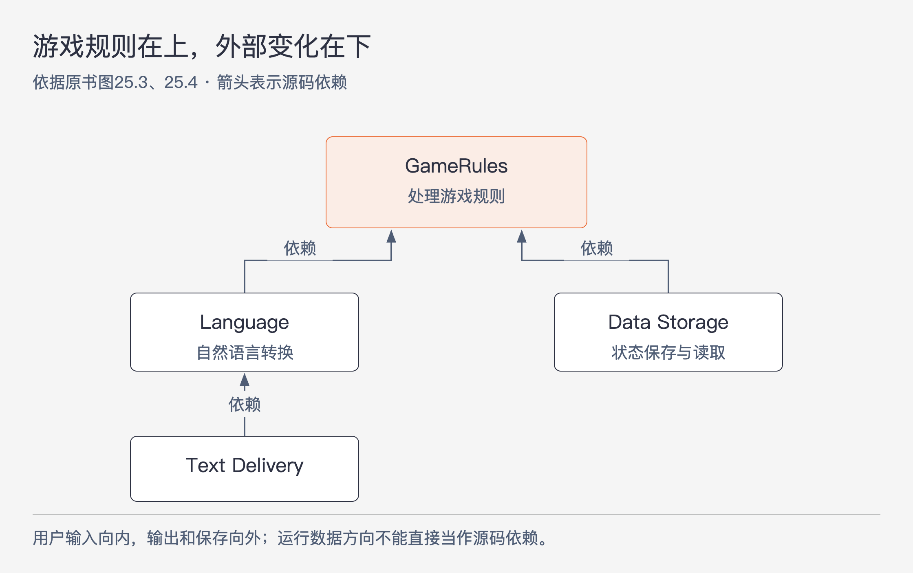
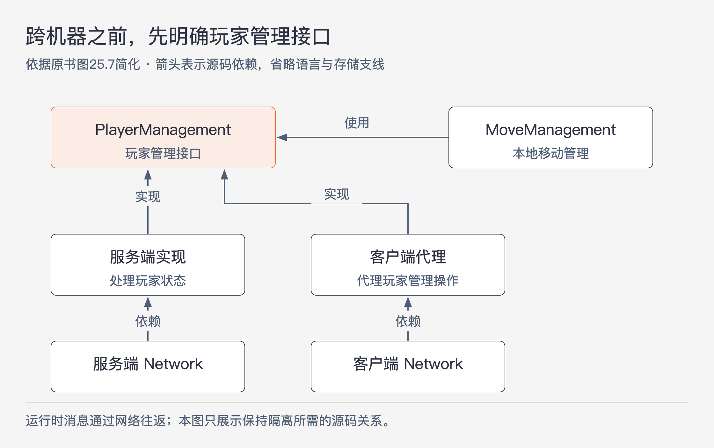

# 《架构整洁之道》第25章｜层次与边界 · 书镜8.2

把系统分成 UI、业务逻辑、数据库，能得到第一张草图，却未必找到了所有需要隔离的变化。本章让同一个文字冒险游戏逐步增加语言、通信、多人协作和玩家状态管理，观察边界怎样从这些要求中显现。最后还要回答：找到了潜在边界，是否就应该立刻把它全部建好？

## 一、原书回顾：从一个小游戏找出多条变化方向

原书先提出常见的三组件划分。游戏接收用户输入、执行游戏规则、保存状态，看起来正好能放进 UI、业务逻辑和数据库。但作者接下来不断补入具体需求，让读者检查这个分法遗漏了什么。

### 基于文本的冒险游戏：Hunt The Wumpus

原例是 Hunt the Wumpus：玩家在洞穴中追捕虚构怪兽，使用 `GO EAST`、`SHOOT WEST` 之类的文字命令，游戏则描述看到、闻到或听到的情况。玩家还要避开陷阱、陷坑等危险。作者介绍它曾在1972年流行，这一背景只是交代例子的来源。

第一个新增要求是多语言。保留文字交互，却让游戏可以面向不同地区。若游戏规则直接生成英语句子，换成西班牙语就要修改游戏规则；因此，游戏与 UI 之间应传递不依赖自然语言的命令和结果，由 UI 负责文字表达。这样，英语和西班牙语 UI 都可以使用同一套游戏规则，游戏规则无需知道正在使用哪种语言。

第二个变化方向是状态保存。状态可能保存在闪存、云端，甚至本机内存中。游戏规则应通过一个接口保存和读取状态，不必认识具体介质。把这个接口按依赖关系规则安排好，存储实现就依赖游戏需要的约定，游戏规则不依赖具体存储。原书图25.1、25.2依次增加的，正是语言和持久化这两组替换可能。

### 可否采用整洁架构

游戏已经具备用例、业务实体及其数据结构，形式上可以采用整洁架构。但作者马上在脚注中收紧范围：这样的小游戏本来大约200行代码就能完成，并不需要这么复杂的架构。这里是在借一个容易理解的程序练习发现边界。

接着，作者进一步拆开 UI。语言可能变化，文字的收发方式也可能变化：命令行、短信、聊天程序都能承载同样的语言。于是，语言转换与文字收发之间也出现了一条候选边界。`Language` 处理自然语言，`Text Delivery` 处理通信方式；英语和西班牙语实现前者，控制台和短信实现后者。

图25-1｜去掉具体实现后，依赖仍朝向较高层策略。依据原书图25.3、25.4重绘；箭头是源码依赖，不表示数据只能朝这个方向流动。

原书在这里特意展开接口的位置。游戏向外输出结果时，可以调用游戏一侧定义、语言组件实现的接口；语言组件把输入送入游戏时，则调用由游戏实现的输入接口。语言与文字收发之间也作类似安排。运行时既有输入又有输出，不能因此让两边的具体代码相互依赖。理解这组例子时，需要分别看“谁调用谁”和“接口定义属于哪一层”。对外输出的调用方可以用自己维护的接口约束实现方；低层把输入交给高层时，也应使用高层所定义的入口。

原书简化图中的箭头全部指向较高层：文字收发依赖语言，语言和存储依赖游戏规则。实际信息流却会来回走。用户输入先经过文字收发，再由语言层转成游戏命令；游戏处理命令，把状态送往存储，再把结果送回语言层和文字收发层。左边负责用户通信，右边负责持久化，两路在游戏规则处相遇。脚注将这样的顶部处理位置联系到早期结构化设计中的“中央变换器”，并再次提醒：图上的箭头画的是源码依赖。

### 交汇数据流

如果再加入多人联网，系统就需要网络组件。用户交互、状态保存之外，又增加了第三路信息，三路暂时都由 `GameRules` 控制。原书图25.5用这个变化说明，数据流的数量并不是由“三层架构”预先规定的，业务复杂度增加时还会继续分出新的路径。

这里没有要求把网络与业务规则混在一起。网络承载其他玩家的信息，游戏规则决定这些信息对游戏意味着什么；引入网络只增加一种外部交互方式，并未改变策略应该处在较高层的位置。

### 数据流的分割

刚刚看到三路信息汇聚到 `GameRules`，也不能据此认定整个系统永远只有一个最终处理中心。作者继续拆开游戏规则本身。

移动管理需要知道洞穴如何连接、洞穴中有哪些物体、玩家怎样移动，以及移动会触发什么事件。这一部分可以报告 `FoundFood`（发现食物）或 `FellInPit`（掉入陷坑）。更高层的玩家管理则决定这些事件怎样影响血量、玩家状态和最终输赢。知道玩家“遇到了什么”与决定“这件事对游戏进程有什么后果”，由此成为两层策略。

作者随后把同一分离推进到一个面向大量玩家的假设版本：`MoveManagement` 在玩家本机运行，`PlayerManagement` 在服务端运行，向多个移动管理实例提供微服务 API。原书图25.7因此加入玩家管理的接口、代理、服务端实现，以及各自的网络组件。

图25-2｜跨机器部署后仍须安排源码依赖。依据原书图25.7简化，省略语言和数据存储支线；本图不画网络消息的实际传输路径。

这张图让两件事同时可见：移动管理依赖玩家管理的接口，网络通信又被具体的代理与实现处理。程序被放到不同机器上之后，接口仍必须隔离两边的实现细节。服务化把这条边界变成了完整的系统边界，但它并没有替代此前对策略层次的判断。

### 本章小结

作者再次回到“大约200行的小游戏”这一限定。把例子不断扩展，是为了展示潜在边界可能出现在很多地方，并不意味着这些边界都值得在原小游戏中实现。

架构师需要比较两种代价：现在建立、维护边界要花多少工作；如果忽略它，后来需要补建时，又会付出多少成本和风险。YAGNI 提醒人们，臆想的需求常常不会发生，过度设计可能比设计不足更糟。另一方面，真正需要分离时，即使有广泛测试，后补边界也可能很艰难，不能把测试当作消除结构成本的保证。

作者没有给一个能在项目开始时决定所有边界的公式。应持续观察系统的变化，比较完整边界、不完全边界和暂不设置边界的成本，在收益超过投入时采取行动。这个判断需要反复进行。

## 二、主题讲解：沿着一次变化，把藏在“业务逻辑”里的边界找出来

### 分层草图之后，还要问什么会分别变化

以下沿用原游戏，并增加明确标识的假设情形。团队已经有英语控制台版本，现在要增加中文短信版。如果只看三层草图，任务很容易被概括成“修改 UI”。这句话仍然太粗，无法判断哪些代码应该一起改。

先把要求拆成两次可单独理解的变化：英语换成中文，改变的是自然语言表达；控制台换成短信，改变的是文字怎样送达。假如两者都写在一个函数中，每增加一种语言就可能重写一遍通信处理。把语言与文字收发隔开后，同一个中文实现才有机会同时服务控制台和短信。

接口也应跟着问题来设计。游戏输出“玩家发现食物”这样的结构化结果，语言组件负责表达为一句话；通信组件接收已经形成的文本，再负责送达。这里的结构化结果是对原书语言无关 API 的讲解，不是原书给出的完整字段定义。重点在于：游戏规则不该通过识别中文或英文句子来判断玩家遇到了什么。

### 一次动作里，数据方向和依赖方向为什么不同

玩家输入“向东走”。运行时，文本由外向内进入游戏；游戏完成移动后，结果又由内向外显示。若把这两段运行轨迹直接画成源码依赖，就会得到语言与游戏相互依赖的循环。

解决办法是给输入和输出各自一个明确入口。游戏对外提供接收移动命令的接口，也定义自己输出事件所需要的接口。语言组件调用前者、实现后者。于是运行消息能够双向传递，而源码中的语言组件仍依赖游戏定义的接口。判断依赖方向时，要检查引用了谁的类、接口与数据类型，不能只看调用发生在请求还是响应阶段。

同理，游戏保存状态时运行调用会到达存储实现，但它可以只认识自己的存储接口。存储适配代码实现这个接口，源码依赖便指回游戏。图25-1应该用这种方式阅读；否则读者会误以为游戏无法输出，也无法保存数据。

### “业务逻辑”仍然可能包含不同层次的决定

现在回到玩家掉进陷坑。移动管理知道当前洞穴有陷坑，因此产生 `FellInPit` 事件。至于损失多少血量、是否立即结束游戏，则是玩家管理的决定。

可以用两次假设修改检验分离：第一，洞穴连接关系改变，但陷坑的后果不变；第二，训练模式下掉入陷坑不再立即失败，但洞穴和移动方式不变。如果两次修改总是碰到同一团代码，就值得检查“地点和事件的产生”是否与“事件后果”混在一起。这个检查并不自动要求拆服务，它先帮助我们找到可以分别说明的职责。

分离成立以后，再讨论放在哪里运行。本地版可以把两部分放在同一进程内；大量玩家共享状态的假设版可以让玩家管理在服务端运行。此时还需要代理、通信和失败处理。原书图是解释边界的简图，没有给出网络超时、一致性或防作弊的完整设计，不能拿它直接当作多人游戏的实施方案。

### 怎样把发现的边界留在合适的程度

假设只有一位开发者维护一个短期演示，中文与短信需求也没有确定，那么把所有候选位置都做成完整组件，会先增加工作量。此时可以让命令和文本保持清楚的区分，暂不独立发布语言组件。这与上一章的不完全边界衔接。

若后续发现，同一语言已经用于多种入口，而每次调整通信方式都要修改语言处理，隔离的收益就变得具体了。可以记录最近一次修改触及了哪些文件、为什么跨层，以及建立接口后能隔开什么。然后比较这份收益与接口、转换和维护成本，而不是凭“以后也许要扩展”无限加层。

对较高成本的分离，更需要实际尝试：用一个可替代的文字收发实现连接现有语言组件，观察是否必须改游戏规则；或者在不加载真实存储的条件下执行移动逻辑。这样的检查能暴露隐藏依赖，但不能证明任何未来需求都已被预见。边界选择仍应随着事实调整。

## 用一个新情形检验理解

游戏新增“同一套洞穴地图，普通模式和练习模式采用不同的受伤规则”。有人提议复制全部移动逻辑，分别制作两个游戏服务。根据本章，你会先检查哪条边界？什么情况又会使这个分离不足？

核对思路：先检查移动管理能否只报告事件，让玩家管理决定后果。这样可以共享地图和事件产生过程。如果练习模式连洞穴如何移动、何时触发事件都不同，就不能把所有差异硬塞进玩家管理，需要重新观察职责。是否使用两个服务还要单独说明部署和运行需求，不能从“两套规则”直接推出“两套服务”。

## 来源、范围与阅读连接

原书范围为《架构整洁之道》第25章，PDF物理页224–232，正文书内页195–202。回顾保留五个原小节、所有主要案例变化，以及小游戏规模、箭头含义和中央变换器的脚注说明。两图分别依据原书图25.3–25.4和图25.7；中文短信版、训练模式及修改检查是本文假设讲解。没有补充外部技术资料。本章承接第24章的边界成本选择，第26章转向由谁装配这些组件。

<!-- source_sha256: 64400d05a5e1fe23dedbc41526c9227f74b3647fce36eda738a11c325074f2c3 -->
