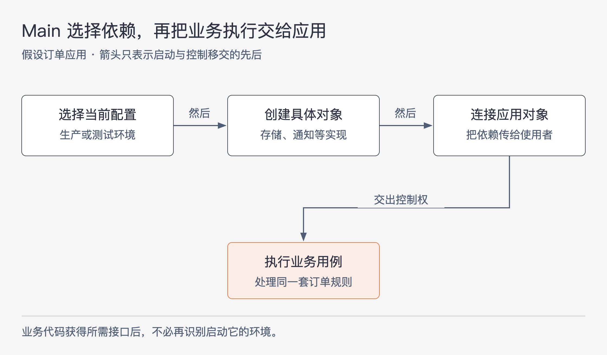

# 《架构整洁之道》第26章｜Main 组件 · 书镜8.2

把业务规则、界面和存储隔开以后，总得有代码选择具体实现，把对象连接起来，再启动应用。本章把这份工作交给 Main 组件。它知道大量运行细节，却不因此成为最高层业务策略；恰恰因为这些细节集中在这里，其他组件才可以少知道一些。

## 一、原书回顾：从启动代码看细节应该放在哪里

本章开头将 Main 定义为负责创建、协调和监督其他组件运转的组件。任何系统至少需要一个承担这类职责的地方。原书随后只有“最细节化的部分”和“本章小结”两个小节，中间的代码是同一段游戏启动示例的连续展开。

### 最细节化的部分

作者把 Main 放在整洁架构的最外圈，视为低层策略。它是系统的初始点，创建工厂、策略对象和其他全局设施，最后将控制权交给较高抽象层的代码。书中用“除了操作系统，没有其他组件依赖它”强调依赖方向：应用内部不应该反过来依赖启动组件提供业务能力。

依赖注入框架也被放在这个位置处理。原书的要求是，框架先帮助 Main 获得依赖，随后 Main 应能够自行将这些依赖交给需要它们的对象，而不让后续分配继续依赖框架。这个要求的目的，是限制框架知识扩散的范围。

接下来，作者展示 Hunt the Wumpus 的 `Main` 类。它实现 `HtwMessageReceiver`，保存游戏引用、初始为10的血量和洞穴列表，还定义描述洞穴的字符串数组。数组分别提供环境、形状、洞穴类型和装饰描述，例如明亮或潮湿、圆形或不规则，以及墙上刻痕等文字。游戏主体要处理地图和事件，却不必知道这些用于构造本次游戏的词汇。

代码随后进入 `main` 函数。`HtwFactory.makeGame` 接收具体类名字符串 `htw.game.HuntTheWumpusFacade`，以及一个 `Main` 实例，用来创建游戏。作者在这里又把 Facade 描述为比 Main 更易变化的具体细节，利用工厂与类名间接加载它，以减少实现变更对 Main 编译和部署的影响。这里的“最细节化”是在强调 Main 承担装配细节，并未为所有类规定唯一的层次排名。

Main 接着创建地图、建立从标准输入读取文本的数据流，并执行一次休息命令。之后进入主循环：显示当前洞穴、血量和箭数，读取一条文本，把东西南北、休息或射箭等缩写转换成游戏命令。输入 `q` 时退出；其余情况下执行所选命令。命令先初始化为休息命令，之后才按输入替换，因此没有匹配到已列出的命令时，示例仍会执行原先的休息命令。

循环确实位于 Main，但它没有在循环里展开移动、射箭和伤害计算的具体规则，而是把执行交给游戏提供的命令对象。启动组件负责接入外部输入，业务后果由较高层组件处理。

最后一段 `createMap` 展示初始状态怎样准备：随机生成10至39个洞穴，为各洞穴尝试建立四个方向的连接，选定玩家位置，再为怪兽、蝙蝠和陷坑选择不等于玩家位置的洞穴，并设置5支箭。原例调用了三次添加蝙蝠洞穴、三次添加陷坑洞穴的方法；由于辅助方法被省略，不能据此断言这些危险位置一定彼此不同。代码末尾明确说明省去了大量代码，因此这段摘录用于说明职责，不能作为完整可运行程序。

这些连续代码共同表达的是：文字、资源选择、输入方式和初始地图可以集中在外层，游戏的高层代码接收准备好的对象与信息，再执行规则。

### 本章小结

Main 可以被看作应用的一个插件：设置初始状态、读取配置、加载外部资源、装配系统并移交控制。既然是插件，就可以有多个版本。例如，开发、测试和生产环境分别有自己的 Main；国家、地区或客户不同，也可能采用不同的配置入口。

这不要求每种配置都复制整套应用。作者要强调的是用架构边界隔离 Main，使配置变化发生在启动与装配部分，较高层代码继续使用同一套接口与规则。

## 二、主题讲解：换一种启动方式，为什么不该重写业务

### 先分清“先运行”和“决定业务规则”

下面使用一个假设的 Java 订单应用。生产运行需要真实存储与通知渠道，测试运行希望使用可控的内存存储和通知替身。下单的判断规则在两种环境中保持相同。

图26-1｜启动阶段承担选择与装配。图为依据本章职责划分绘制的假设订单示例，箭头表示启动与控制移交的先后过程，不表示源码依赖。

如果下单代码一进来就判断“现在是不是测试环境”，再自行寻找数据库连接、选择通知实现，它既在处理订单，也在决定程序怎么装配。业务代码于是认识了运行环境和具体实现，后续每增加一种启动方式都可能修改下单流程。

Main 可以提前把这些选择做好：生产启动选择生产实现，测试启动选择测试实现，然后把对象传入处理下单的代码。业务组件只按接口使用这些能力，不需要识别“是谁启动了我”。Main 虽然先运行，仍属于配置细节；处理订单是否允许创建、需要做哪些业务动作的代码，才负责较高层的决定。

### 对象已经传进来，就不必再回到容器里找

一个实际检查点是：业务代码拿到存储接口之后，执行订单时还需不需要访问全局框架容器。如果每一步都向容器查询具体服务，框架知识仍然存在于业务运行路径，Main 的装配工作并没有完成隔离。

依照本章的方向，可以让入口利用依赖注入框架创建对象，然后通过明确的参数或构造过程将依赖传入。此处只解释职责，不规定某一框架的配置语法。对于这个假设应用，读者应能在不启动整个框架的情况下，用准备好的依赖对象执行同一段下单逻辑。

这也解释了为什么 Main 可以比较具体。配置文件名、当前使用的存储实现、环境资源如何取得，本来就需要有地方知道。把它们全部隐藏到一个“自动发现”的全局工具中，如果业务代码到处调用该工具，知识只是换了位置，并没有被隔离。

### 游戏的主循环给了我们什么边界

原书 Main 含有输入循环和命令分支，因此不能把本章简化为“Main 只能有几行装配代码”。边界应按职责判断：接收字符 `e` 并选出向东移动命令，是把某种外部操作方式接入应用；决定向东之后进入哪个洞穴、触发什么事件，属于游戏规则。

对应到订单例子，入口可以把外部请求转为下单所需的数据，再调用业务能力。但库存不足时是否允许创建订单，不能因为入口最先看到请求，就顺手写入启动代码。否则换成批处理启动方式时，还得复制这段业务判断。

同样，原书把随机地图和初始箭数放在 Main，并不证明所有产品里的地图生成都只能放在这里。若“怎样生成关卡”本身成了持续变化、需要复用的产品规则，就应成为明确的业务能力，由 Main 选择和装配。这里是在将原书的职责判断应用到新情况，而非改写原例。

### 多个 Main 的收益与代价

在假设应用中，生产与测试 Main 复用同一份订单规则，各自选择依赖、准备资源。配置差异可以局部化，测试也能直接控制环境。代价是装配需要维护：新增一个必要依赖时，各启动路径都要提供正确对象；如果两套启动配置长期不核对，也可能出现测试装得起来、生产缺少依赖的问题。

因此可以分别检查两件事。第一，同一份业务逻辑能否接受不同实现；第二，每个实际使用的启动入口能否正确完成装配。前者验证边界，后者验证启动配置。两者都完成，才足以支持“多种配置复用同一套应用”的判断。

原书的类名字符串工厂也是一种具体装配手段。它把某些错误从编译阶段推迟到加载阶段，并依赖实现类可被找到、符合预期接口等条件。本章没有提供完整工厂代码或加载机制，因此不应据此保证“任意替换 JAR 都无需重新部署”，也不必为了遵循 Main 原则强行使用字符串加载。

## 用一个新情形检验理解

应用要新增命令行批量导入入口。团队准备复制网页入口中的折扣判断，再分别维护。已有业务代码又在内部读取全局配置判断运行环境。你会先调整哪两处？

核对思路：折扣判断应由两个入口调用的业务能力承担，避免启动方式决定业务规则；运行环境相关的实现选择应移到装配处，再把依赖传入。最后分别验证两个入口的装配和转换，并让相同输入执行同一套规则。仅新建一个 `BatchMain` 类，无法自动解决前述依赖。

## 来源、范围与阅读连接

原书范围为《架构整洁之道》第26章，PDF物理页233–238，正文书内页204–208。回顾保持两个原小节，按原代码顺序保留字符串准备、工厂创建、输入循环和地图初始化。PDF第234、236、237页已用于核对类名与控制流程；未把被省略的辅助代码补写成原书事实。订单应用及图26-1为假设讲解。第25章讨论边界如何出现，本章说明组件如何装配，第27章继续检查服务与架构边界的关系。

<!-- source_sha256: 64400d05a5e1fe23dedbc41526c9227f74b3647fce36eda738a11c325074f2c3 -->
