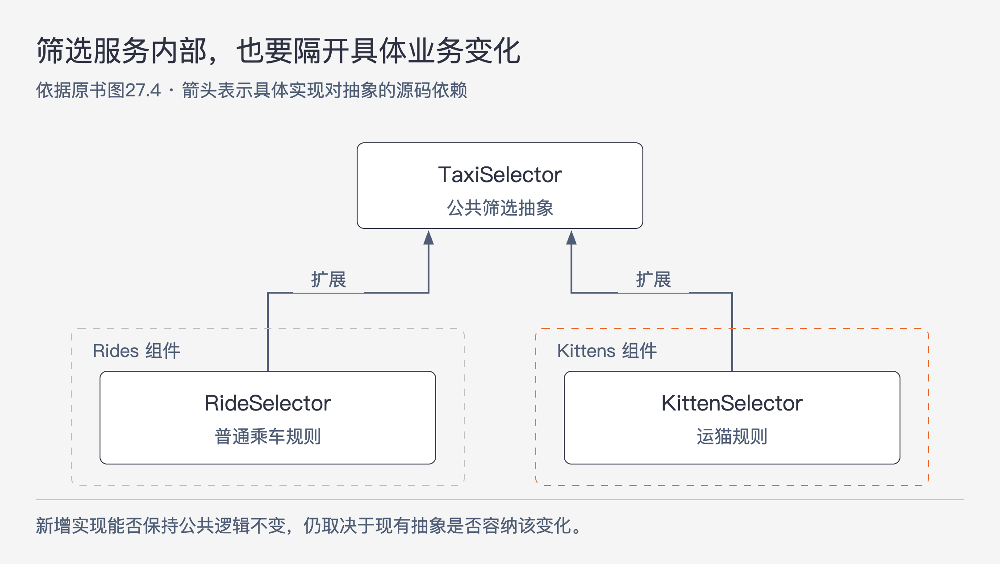

# 《架构整洁之道》第27章｜服务：宏观与微观 · 书镜8.2

把程序拆成多个服务，确实形成了进程边界。但一次业务变化到来时，这些服务能否分别修改和部署，还要看它们共享了什么、依赖了什么。本章用出租车系统新增运猫业务的例子，检查服务边界与架构边界究竟是不是同一回事。

## 一、原书回顾：一项运猫业务如何穿透所有服务

章首提出服务化常见的两个承诺：服务之间强隔离，以及能够独立开发和部署。作者后面的论证逐一检查这两个承诺的成立条件。

### 面向服务的架构

作者反对“用了服务就已经有架构”的推论。本书所说的架构，要区分高层策略和低层细节，并安排跨边界的依赖关系。服务只是把某些程序行为放到不同进程或平台上，由通信完成调用。这样的分隔可能很有价值，却不能单独说明策略被谁依赖、变化会传到哪里。

作者用函数作类比：每个函数都能隔离一段行为，但并非每次函数调用都有系统架构意义；具有架构意义的是跨越关键边界、且遵守依赖关系规则的调用。服务也一样，有些服务恰好对应架构边界，有些服务只是部署和通信的安排。原书并没有否认跨平台、跨进程隔离的实际价值。

### 服务所带来的好处

这一节引出作者对两项“好处”的质疑。质疑的对象是把服务化效果看成必然结果，后面两个内部小节分别说明原因。

### 解耦合的谬论

服务位于不同进程，通常不能直接访问彼此的变量。这是实际的隔离。但它们仍可能共享处理器资源、网络资源或数据，因此继续相互影响。

作者举的是共享数据记录：在记录里新增一个字段后，每个需要操作该字段的服务都要修改，并且对字段含义达成一致。服务各自拥有进程，仍然共同依赖这份数据约定。这句话的范围是“需要操作该字段的服务”，不能扩大成每次新增字段都会迫使全部消费者升级。

此外，服务接口可以被清楚定义，普通函数接口也可以。接口是否严谨取决于设计，跨了网络并不会自动使接口更正式、更准确。

### 独立开发部署的谬论

另一个承诺是让不同团队分别开发、维护和运维自己的服务，借此扩展组织规模。作者承认这种安排有道理，但提出两点限制。首先，大型系统也可以采用单体或组件化方式，服务化并非唯一选择；其次，若服务通过数据或行为紧密耦合，团队仍必须协调开发、部署和运维。

服务和团队一一对应的设想，只说明责任怎样分配，不能证明修改能够彼此独立。后面的出租车案例正是为这一点提供具体情境。

### 运送猫咪的难题

原书明确采用一个虚构的出租车调度系统。用户通过 `TaxiUI` 下单，表达接送时间、价格、豪华程度、司机经验等偏好。`TaxiFinder` 向多个 `TaxiSupplier` 取得可用车辆，将候选车辆短期保存成与用户关联的数据记录。`TaxiSelector` 按用户条件筛选，`TaxiDispatcher` 再负责分派订单。各服务由小团队负责，原文脚注还将这种“小团队负责少量服务”的设定推演为服务总数与程序员数量大致相当；这是案例的组织设定，不是团队规模建议。

假设系统运行一年多后，市场部门宣布新增运猫业务：在城市建立猫咪集散点，用户可以把猫送到家中或办公室，系统选择附近车辆先取猫、再送达。已有一家出租车公司参与，未来可能增加参与者，也会有不参与的公司。司机可能对猫过敏，因此不能被派去运猫；乘客也可能过敏，因此不能给这些乘客安排过去三天内运过猫的车。

这些条件会传到原来的每个功能环节。UI 要表达新业务与相关需求；车辆查找及供应商要区分参加活动的公司、车辆和司机；候选记录必须承载后续筛选需要的信息；筛选要处理过敏和近期运猫历史；派单要支持取猫、送猫并留下有关事实。原书据此判断，这个设计里的服务都需要改动，而且必须协调。

作者把这种同时穿过多个功能环节的修改称为横跨型变更。它并非微服务独有，单体系统也会遇到；按步骤切分服务，却没有隔离同一业务变化在各步骤里的实现，特别容易受到它的影响。

### 对象化是救星

作者随后给出组件化的方案。原有查找、筛选、供应和分派逻辑尽量保留在公共的抽象基类中；普通乘车的具体规则放进 `Rides` 组件，运猫规则放进 `Kittens` 组件。两个组件用策略模式或模板方法模式扩展公共抽象，依赖方向指向这些较稳定的抽象。具体对象由 UI 控制的工厂创建。

在作者设定的扩展方式下，新增运猫组件时，`TaxiUI` 仍需变化，其他已有公共组件则可以保持不动。新功能通过新的 JAR、Gem 或 DLL 被系统加载。这里不能漏掉 UI 仍需修改的限定，也不能把“动态加载”理解成任意系统都天然具有热更新能力；案例前提是公共抽象、工厂和加载方式已经支持这种扩展。

原书的改进依赖提前找到合适的变化位置。它展示了运猫变化怎样被容纳，并没有证明一开始就能准确预见全部未来业务。

### 基于组件的服务

相同方法也可以放入服务内部。服务无需成为一块内部无法分离的小型单体，它可以由多个组件组成。以原书的 Java 设想来说，公共抽象在一组 JAR 中，新功能在另一组 JAR 中，扩展类实现或继承前者。服务装载这些组件后，就有机会通过增加组件实现新功能，符合开闭原则。

原书图27.3仍然保留查找、供应商、筛选和派单等服务，却在各自内部加入普通乘车与运猫的具体实现。因此，服务进程的划分可以继续存在，组件的划分负责另一件事：让特定业务的变化通过扩展发生，减少对已有公共逻辑的改写。

### 横跨型变更

原书在这一节把镜头缩到一个 `TaxiSelector`。普通乘车的 `RideSelector` 和运猫的 `KittenSelector` 都依赖共同的筛选抽象，它们各自处在所属的业务组件里。

图27-1｜一个服务内部也可以有架构边界。依据原书图27.4重绘；箭头表示具体实现对抽象的源码依赖。

在这个案例里，普通乘车与运猫的变化贯穿多个服务，所以隔离它们的边界也穿过多个服务的内部。只在部署图上给服务画框，无法表达这条边界。需要继续查看每个服务内部是否把公共逻辑与具体业务扩展分开，以及依赖是否指向公共抽象。

### 本章小结

作者承认服务化可能改善可扩展性和研发组织方式。但在本书讨论的范围内，架构仍由组件的边界与依赖关系定义，不能从通信方式直接推断。

三种情况都可能发生：一个服务对应一个独立组件；一个服务内部包含多个有边界的组件；客户端与服务端虽然分开部署，却因过强耦合而缺少架构意义上的隔离。原文脚注提醒，最后一种情况并不罕见。判断应落在具体依赖和变更过程上。

## 二、主题讲解：用一次业务变化检验“独立部署”

### 先跟着一个过敏条件走完整条链

沿用原书的运猫案例，进一步推演“对猫过敏的乘客不能坐近期运猫的车”。这是对原案例的分析，不是一个实际系统的实施记录。

筛选服务需要知道哪些车在过去三天运过猫，这个事实不能凭空出现。某处必须记录运猫完成情况，并在查找或筛选时提供。用户的过敏条件也需要被表达和传递。即使筛选服务的网络接口完全没有变化，它对数据含义的要求仍可能使其他服务修改。

所以，“接口地址没变”不足以证明解耦。应检查同一份记录是否被多个服务共同理解，新字段的默认含义是什么，旧版本还能否正确处理，哪个行为变化会要求上下游一起调整。原书没有给出完整的数据兼容方案，但它指出了需要检查的位置：共享的语义和行为。

### 公共流程里应该留下什么

假如筛选服务把“读候选、按条件判断、返回结果”作为公共流程，普通乘车和运猫分别提供自己的适用规则，就不必在每一步公共流程里增加 `if 运猫`。服务需要执行某种筛选能力，具体实现负责解释相应的业务条件。

这样的抽象必须能容纳原案例所需的差异。如果公共接口只允许输入价格和距离，却完全没有办法获取行程类型、司机资格或运猫历史，新建一个 `KittenSelector` 类也无法自动完成扩展。接口本身仍然要演进。图27-1表达的是依赖方向，并没有承诺接口一经建立就永不变化。

与此同时，扩展规则不能把所有行为都绕开。普通筛选与运猫筛选仍要遵守共同接口约定，例如如何报告没有可用车辆。否则新增实现虽然能被加载，调用方仍要针对它增添专用分支，变化又回到了公共部分。

### 多个组件一起发布，与改写所有服务有所不同

原书把运猫规则安放到查找、供应、筛选、派单各服务的扩展组件里。因此，“新增运猫功能”仍可能包含多个产物，部署也仍需要协调。收益是把这次变化尽量限制在运猫相关实现，避免为了新功能改写普通乘车与公共流程。

这项收益与“完全无需协调”要分别验证。要支持后一个判断，还需要具体的兼容协议、装载机制和发布条件。本章没有展开这些问题。尤其是向加载路径增加 JAR 的叙述，是一个支持插件装载的设计设想，不能据此保证运行中的 Java 服务不用重启就能安全启用任何新功能。

### 架构判断可以用变更清单来复核

在这个假设系统里，可以先列一张具体清单：新增运猫后，哪些公共类要改，哪些普通乘车规则要改，哪些地方只增加扩展，哪些数据或行为需要共同升级。再说明每一项的原因。

如果“公共流程不改”只是因为把相同的运猫分支复制到了多个服务的公共数据处理器中，隔离并未成立。如果 UI 和工厂改变、运猫扩展新增，而公共抽象所表达的行为保持稳定，这才符合原书方案的目标。再用既有乘车场景和新增运猫场景分别检查结果，才能发现新组件是否破坏了旧语义。

反过来，业务规模很小、规则也长期稳定时，维护许多扩展点可能得不偿失。原书批评的是服务化的自动承诺，不是在为所有项目规定“服务加插件”这一套结构。边界的投入仍要回到前两章的成本判断。

## 用一个新情形检验理解

系统增加“轮椅友好车辆”。有人认为只要给候选记录增加 `wheelchairAccessible` 字段，再写一个筛选实现，就已经完成了独立扩展。还需要检查什么？

核对思路：车辆供应商是否能提供可靠事实，查找过程是否保留该信息，未知值如何处理，UI 如何表达需求，派单是否保持所需条件。若公共数据模型或既有行为无法表达这些要求，仍要修改相关部分。可以通过组件设计限制改动范围，但单个字段和一个新类不能证明整条业务已经独立演进。

## 来源、范围与阅读连接

原书范围为《架构整洁之道》第27章，PDF物理页239–246，正文书内页210–216。回顾保留七个主小节及“服务所带来的好处”下的两个内部小节。出租车与运猫是原书虚构案例；过敏条件的逐步追踪、轮椅车辆情形及验证建议是本文推演。图27-1依据图27.4。动态加载能力只按原例前提描述，未引用外部运行时资料。第26章说明装配，第28章将同样的依赖问题用于测试组件。

<!-- source_sha256: 64400d05a5e1fe23dedbc41526c9227f74b3647fce36eda738a11c325074f2c3 -->
