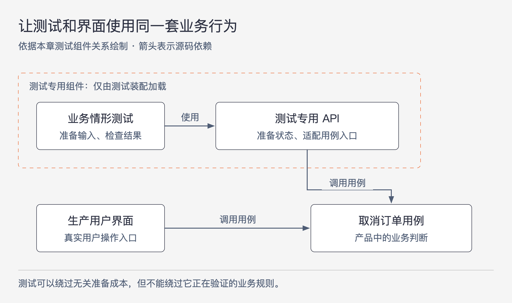

# 《架构整洁之道》第28章｜测试边界 · 书镜8.2

业务行为没有变，只改了页面导航，成百上千个测试却跟着失败。这时测试可能已经依赖了它本不必关心的细节。本章把测试视为系统组件，讨论怎样让测试既能约束业务行为，又不把界面和内部代码结构固定下来。

## 一、原书回顾：让测试与产品代码能够分别演进

原书首先强调，测试代码也是系统的一部分，需要像其他代码一样接受架构设计。它可以不在生产环境运行，仍然承担不可缺少的职责。

### 测试也是一种系统组件

作者暂时搁置单元测试、集成测试、TDD、BDD、功能测试等术语争论，也列举 FitNesse、Cucumber、SpecFlow、JBehave 等不同测试形式。从本章关心的架构角度，它们有共同特点：包含非常具体的输入和预期，依赖被测试的部分，而应用的其他组件不应依赖测试。

因此，测试位于整洁架构的最外圈。它们通常独立部署到测试环境，不需要随生产应用一起运行。用户使用应用不需要加载测试，但开发过程需要测试验证系统、避免问题再次出现。作者借此说明：一个组件可以在运行部署上独立，在系统的整体设计中仍然重要。

“所有测试对架构来说一样”限于这里的依赖位置与独立性，不能理解为各种测试的范围、速度、成本或能发现的问题都一样。

### 可测试性设计

如果开发者因为测试不进入生产环境，就把它排除在设计之外，测试容易与产品的多变细节紧密耦合。产品中一个通用部分发生小改动，许多测试都要相应调整，这就是脆弱的测试问题。

原书给出的例子是通过 GUI 校验业务逻辑。测试从登录页面开始，沿导航一步步找到业务入口，再完成操作。登录页面或导航顺序一变，大量本想检查业务规则的测试就失败。开发者知道一个小改动会让上千个测试出错，便可能抵触需求，产品也因此难以变化。测试的维护成本反过来束缚了系统设计。

作者据此提出可测试性方向：不要让测试依赖多变的东西。GUI 经常变化，因此业务逻辑应该能绕开 GUI 被测试。这个判断要结合测试目的来看：原例讨论用页面路径验证业务规则的成本，界面行为本身仍有独立的验证需要。

### 测试专用 API

一种做法是为业务验证设计测试专用 API。原书允许它具备超过普通用户入口的能力：忽略某些安全限制、绕过数据库等高成本资源，直接把系统置于某种可测试状态。它应覆盖用户界面所调用的交互器和接口适配器，并提供准备、控制测试所需的额外能力。

这个 API 的目标比“绕过 UI”更进一步：让测试套件的结构与应用内部结构分开。测试可以描述要执行的情形，不必逐层复制内部类与函数的调用方式。交互器在这里指执行一个应用用例的代码，接口适配器则负责把外部表达转换为该用例能够使用的输入和输出。

### 结构性耦合

作者以一套逐类、逐函数对应的测试套件说明结构性耦合：产品每个类有对应测试类，每个函数有对应测试函数。若这些测试随着产品结构移动、拆分而大量改动，即使业务行为不变，测试也被迫同步重写。

测试专用 API 在两者之间提供稳定的使用方式。产品内部可以重构，测试仍然调用相同的业务操作；测试自己的组织和辅助代码也可以调整，不要求产品跟着修改。作者进一步指出一种演进差异：测试往往越来越具体，用更多情形描述行为；产品代码则可能越来越抽象，用更通用的实现满足这些情形。把两者的结构绑死，会妨碍这两种演进。

因此问题不只是测试文件叫什么。真正需要检查的是，内部结构变化是否在没有业务理由的情况下传播到大量测试。

### 安全性

前面允许测试 API 绕过限制、强制设置状态，因此它不应被不加区分地部署到产品环境。作者要求把测试 API 及其具体实现放到一个可独立部署的组件中。这个限制是前面高权限设计的组成部分，不能只保留便利性，把隔离部署的条件省掉。

### 本章小结

测试帮助验证稳定性和防止问题复发，需要作为系统组件精心设计。若测试脆弱、难以维护，最终可能被开发者放弃。架构上考虑测试，是为了让它在系统变化时仍然承担验证职责。

## 二、主题讲解：把“取消规则测试”从页面和类结构里解开

### 一个业务情形为什么要点击这么多页面

以下是一个假设的 Java 订单应用。测试要验证“已经发货的订单不能按未发货流程取消”。现有测试先登录、打开订单列表、设置筛选条件、进入详情、点击取消，再检查结果。即使规则没有变，只要菜单被调整，测试就可能到不了取消入口。

问题是业务判断与页面路径被绑在了一起。可以让多数针对取消规则的测试直接准备订单状态、执行取消用例、检查结果，把页面导航本身留给确实要验证它的测试。这样，导航变化仍会被相关界面测试发现，却不会迫使所有业务情形重复维护导航细节。

图28-1｜两个入口使用同一套业务行为。依据本章测试组件与测试 API 的关系绘制；箭头表示源码依赖，测试专用组件可从生产部署中排除。

这张图的重点是共享业务实现。若测试 API 内部另写一套“已发货则拒绝”的判断，测试只能证明测试代码自己的规则，无法验证实际的取消用例。绕过的是无关的页面和资源成本，所要检查的业务规则必须仍由产品代码执行。

### 测试 API 应该稳定在哪一层

假设取消流程后来从一个类拆成“读取订单、检查状态、执行取消”几个内部对象。若每个测试都直接构造这些对象，并验证它们的内部调用顺序，重构会带来大量改动。

测试 API 可以提供“准备一个已发货订单”“请求取消”“查询业务结果”等操作。内部装配改变时，调整 API 后面的适配代码；测试仍然表达原有情形。这里的稳定来自测试需要验证的业务行为，而非把所有内部函数原样转发一次。若 API 只是内部类的复制品，它同样会随类结构变化。

这也有边界。如果单个算法的局部测试已经足够稳定，没必要强迫它穿过一个庞大的统一 API。原书提供的是解耦方向和一种方法，应先检查有哪些测试正在承受不必要的变化，再决定测试入口的范围。

### 为了准备状态而绕过，与为了验证规则而绕过

测试“已发货订单的取消限制”时，可以通过测试专用能力直接准备一个已发货订单，不必真的走完整下单、支付、发货链。这减少了与当前测试目的无关的准备工作。

但如果目标是测试“普通用户无权取消别人的订单”，就不能使用绕过权限的调用来证明该权限规则正确。测试需要经过实际的授权判断，并控制身份和资源归属。是否绕过某个部分，取决于这次要验证的行为，不能一律以“测试要快”为理由跳过。

同理，使用内存替身可以验证用例在某种存储结果下怎样处理，但无法单凭这一项证明真实数据库的映射、查询和事务配置正确。后者有自己的验证范围。这里是在界定本章方法的证据边界，并未规定固定的测试比例。

### 测试组件独立部署，才与它的权限相匹配

测试 API 若能够强制写入订单状态或替换关键资源，就应将这种能力连同实现放在独立的测试组件中。生产装配使用正式入口，测试装配才加载测试专用能力。这样，代码依赖和交付物都能体现权限边界。

可以检查生产产物是否包含测试专用入口和实现，而不只看某个页面是否隐藏了按钮。测试不必在生产运行，并不等于它在架构上可以无人负责；恰好相反，它的装配、准备和权限需要被明确安排。

### 用两次变化检查是否解耦

第一次只调整页面导航，业务规则保持不变。预期是导航相关测试可能变化，直接验证取消规则的测试保持稳定。第二次只调整业务内部类的组织，公开行为保持不变。预期是少量装配或适配代码改变，而大部分情形测试仍然成立。

接着再真的修改规则，例如增加一种允许取消的业务状态。相应业务测试就应该改变。解耦的目标是减少无关变化带来的改动，不能让测试对真正的行为变化也失去反应。

## 用一个新情形检验理解

一个测试 API 暴露 `createOrderRow`、`invokePrivateCancelStep2`、`setInternalFlag3`。它已经不需要打开网页，团队认为测试边界设计完成了。你怎样判断？

核对思路：UI 耦合可能减轻了，但测试仍然依赖数据库结构、私有步骤和内部标志。先明确测试要表达的业务情形，把无关的内部准备集中在适配部分，再检查产品重构能否不修改大部分测试。还要确认这些高权限操作没有进入生产产物。不能仅以“没有 GUI”认定测试已经能独立演进。

## 来源、范围与阅读连接

原书范围为《架构整洁之道》第28章，PDF物理页247–251，正文书内页218–221。回顾保留四个主小节以及“测试专用 API”中的“结构性耦合”“安全性”两个内部小节。取消订单、权限测试和图28-1均为本文假设讲解。原书列举的测试工具仅用于还原其讨论范围，不作现行工具推荐。第27章检验服务的隔离，本章检验测试的隔离，第29章把可测试性推进到硬件与操作系统之外。

<!-- source_sha256: 64400d05a5e1fe23dedbc41526c9227f74b3647fce36eda738a11c325074f2c3 -->
