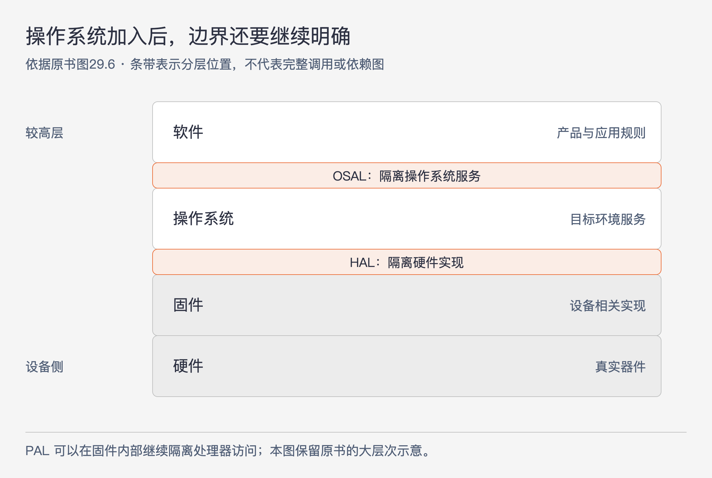
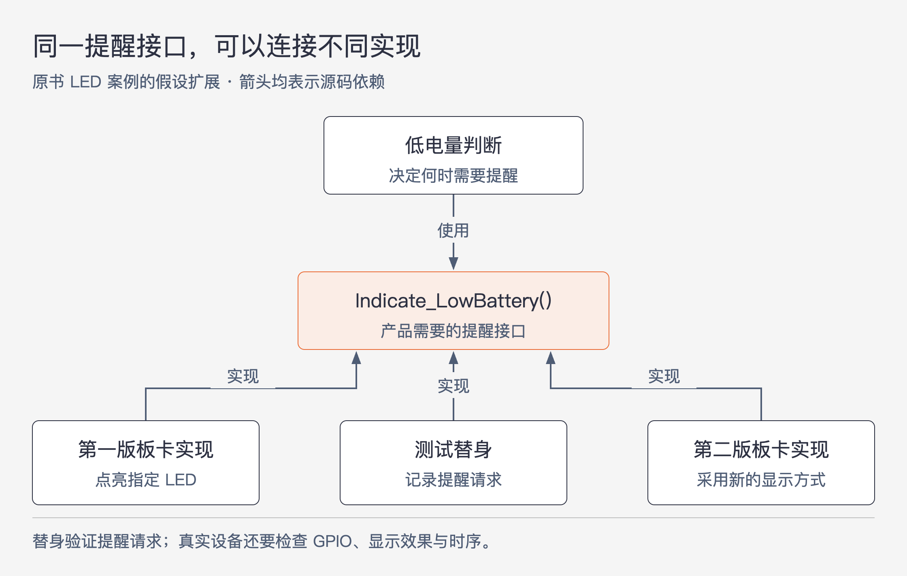

# 《架构整洁之道》第29章｜整洁的嵌入式架构 · 书镜8.2

程序已经能在电路板上运行，为什么换一块芯片、换一个操作系统，几乎所有代码都要重做？本章把问题追到依赖关系：产品长期需要的规则，与特定硬件的操作方式混在一起，前者就会被后者的寿命限制。能否在目标硬件之外测试这些规则，是检查隔离是否成立的一种具体办法。

## 一、原书回顾：把本可长期使用的软件从平台细节中分离出来

章首从 Doug Schmidt 关于国防软件持续维护的文章谈起。按本章的转述，软件不会像物理部件一样磨损，但硬件和固件会过时，进而要求软件改变。作者补充，未妥善管理的硬件、固件依赖，会使本可长期使用的软件提前失去价值。

作者比较了 Wikipedia、TechTerms、Lifewire 和 Webopedia 中按 ROM、闪存、嵌入设备或直接编程到硬件来定义固件的说法，转而采用一种服务本章论证的区分：看代码多大程度依赖具体硬件，以及硬件演进时它是否难以延续。本文中的“固件”沿用这个架构视角，不把它宣称为术语的唯一定义。作者甚至把业务代码直接嵌入 SQL、或没有与 Android API 分离的情形类比为“写固件”，意在强调平台依赖，并非给这些程序重新作行业分类。

章首有两个重要案例。第一个是作者在20世纪90年代末参与的通信系统重设计，从时分复用（TDM）迁移到 VOIP。原文先回顾 TDM 在20世纪50至60年代的先进地位，以及80至90年代的广泛部署，再说明迁移时的困难：工程师回答“系统遇到某种电话情况应该怎么办”，竟要回到旧产品代码里寻找答案。通话规则和 TDM 技术实现长期交织，旧代码既是实现，也成了事实上的产品定义，无法直接取出业务规则继续使用。

第二个案例更小：串口命令需要被解析、分发，本来可以长期使用的消息处理器，却和操作 UART 的代码放在同一文件里，内部充满串口硬件细节。UART 是控制串行通信的硬件部件。通信硬件变化时，消息解析与分发也被迫一起搬迁。作者所说“多写软件、少写固件”，指的是限制这种依赖扩散，不是否认底层硬件代码的必要性。

### “程序适用测试”测试

作者认为，许多嵌入式项目只重视代码是否能运行，缺少对长期结构的投入。他引用 Kent Beck 的三个阶段：先让代码工作，再通过重构让代码更好理解、更能按需求修改，最后根据实际性能需求优化。作者观察到一些项目跳过中间阶段，直接在能跑的代码上做各种微优化。

他又联系 Fred Brooks 关于准备抛弃一个设计的建议，把两者理解为从实践中学习，再做出更好的结构。这里保留的是作者对这两种建议的解释，不将它延伸为每个项目都应整体重写的命令。

为了说明“能跑”只是起点，作者列出一个小型嵌入式项目中同一源文件的函数，再按职责重新分组：

| 原文件混在一起的职责 | 原例中的函数或操作 | 作者借此指出的问题 |
|---|---|---|
| 定义域逻辑 | `calc_RPM`、`Do_Average`、`Get_Next_Measurement`、两个传感器归零函数 | 测量与计算规则和平台细节没有清楚分开 |
| 硬件平台设置 | 定时器与外部中断处理、`uC_Sleep` | 直接受微处理器与工具链限制 |
| 开关响应 | `btn_Handler`、`Dev_Control` | 输入控制职责混入同一文件 |
| 获取 A/D 输入 | `Read_RawData` | 读取硬件与处理读数没有明确边界 |
| 持久化 | Flash 配置加载保存、数据集存取、`bytes2float` | 存储职责与其他规则交织 |
| 名实不符的函数 | `Sensor_init` | 名称未能帮助理解实际职责 |

原书没有给这些函数的完整实现，因此这里只保留作者的分组，不能依据名字重新认定每个函数都属于某个通用层次。作者继续检查项目后发现，几乎所有代码都知道自己运行在特定微处理器上，使用厂商扩展的 C 结构，只能依赖特殊工具链与目标硬件进行测试。它通过了“程序能用”的检查，却难以迁移和长期演进。

### 目标硬件瓶颈

嵌入式开发确有特殊约束：地址空间、实时性、截止时间、I/O 能力、特殊用户接口、传感器，以及与物理世界的连接。硬件和软件还经常同时开发，写代码时目标板未必可用。如果全部代码必须等到目标硬件到位才能运行和测试，软件缺陷也要等到那时才暴露，进度会受到限制。

作者把这种只能依靠目标平台测试的局面称为目标硬件瓶颈。他承认嵌入式工作特殊，但认为这些约束不足以取消隔离依赖的设计原则。越多不涉及真实硬件行为的代码可以提前验证，开发就越少被目标板的可用性牵制。

### 整洁的嵌入式架构就是可测试的嵌入式架构

这一小节引出后续方法：通过软件、固件及其边界的设计，使可以脱离目标环境的部分先被测试。标题中的可测试性有明确对象，是减少不必要的目标环境依赖，不能据此认为真实硬件验证可以省去。

### 分层

原书先画软件、固件、硬件三层。硬件会因为部件淘汰、功耗、性能或价格等原因更新，而产品功能可能还需要继续存在。

硬件与代码在物理上容易区分，但这条物理分界不会阻止寄存器、芯片类型等细节进入应用代码。如果软件与固件混成一体，不仅换硬件困难，普通功能修改和修复缺陷也会受影响。一点局部变化可能需要完整回归，缺少自动验证时就依赖大量手工测试，并不断出现遗漏。原书图29.1、29.2因此既给出理想分层，也展示只剩“固件加硬件”的退化情况。

### 硬件是实现细节

软件与固件的分隔往往比硬件的物理分隔模糊，所以需要明确硬件抽象层，简称 HAL。它向上层提供所需服务，向下隐藏具体硬件操作。

第一个例子是持久化。固件按字节或字节组写 Flash，软件想保存和读取的是名称与值。HAL 应按后者的需要提供接口，使调用者不关心数据最终位于闪存、磁盘、云端还是内存。原书还指出 HAL 是早已有之的思路，其在 PC 上的历史早于 Windows。

第二个例子把抽象层次继续向上推。LED 连着一个 GPIO 位，固件可以直接改这个位。`Led_TurnOn(5)` 隐藏了一点硬件操作，却仍让上层知道要点亮第5个灯。如果这个灯表示电量不足，上层真正需要的操作是 `Indicate_LowBattery()`。至于由第几个灯、哪个 GPIO 位来表达，应放在下面。

所以 HAL 要按上层所需的含义设计，不能只是给寄存器操作换一批函数名。同一大层内还可以继续细分，层数由要隔离的知识决定，不限于固定三层。

### 不要向 HAL 的用户暴露硬件细节

这个短小但独立的原小节给出检验标准：合理的 HAL 应让使用它的软件能够脱离目标硬件测试。如果接口仍要求调用者提供寄存器地址、GPIO 映射或厂商专用结构，细节依赖就没有真正被挡住。后半句是对本章标准的解释，原书在此直接强调的是 HAL 对平台外测试的支撑。

### 处理器是实现细节

硬件依赖还可能从编译器与头文件进入。某些嵌入式工具链提供特殊关键字、寄存器访问和类似全局变量的设备操作入口，写起来方便，却使代码依赖厂商扩展。作者没有把问题归因为厂商恶意，而是要求开发者限制这些方便功能的使用范围。原文给“帮助”加上故意写出的 HTML 斜体标记，也是在提醒读者注意便利背后的约束。

作者用一个带有虚构名称的 ACME DSP 头文件说明类型绑定。针对 `_ACME_X42`，它用 `unsigned int`、`unsigned short` 等定义若干固定位宽名称；针对 `_ACME_A42`，对应关系又换成 `unsigned long`、`unsigned int` 等。若应用广泛包含这份厂商头文件，就把平台选择与类型假设扩散到很多地方。迁移处理器或在宿主机测试，都可能遇到类型大小不符合原假设的问题。

此处原文有一处需要说明的矛盾：正文称包含该头文件相当于“同时定义”两个平台宏，但同页代码是 `#if` 与 `#elif` 的条件分支，并未同时定义它们。本文按照可见代码解释“依赖某个平台分支及其类型假设”，不沿用那句字面上不成立的说法。

作者建议改用 `stdint.h` 所表达的固定位宽类型。如果目标编译器没有提供它，可以在目标侧写一个适配头文件，把厂商类型映射为 `uint32_t`、`uint16_t` 等名称。这样，普通代码不必到处包含 `acmetypes.h`。这个变化解决的是类型接口的一部分依赖，并不能单凭更换一个头文件保证所有代码都可移植。

第二段代码来自作者所述的真实项目，作用是向串口输出一行 `hi`。它修改 `IE` 中断控制位，把字符写入 `SBUF0`，轮询 `TI_0` 判断发送缓冲区状态，再清除相应标志，随后输出换行和回车。短短一个输出动作就认识了具体处理器的寄存器与等待方式。

作者同时批评示例中二进制字面量依赖当时的语言扩展。这里保留它作为原书时代的工具链例子，不将“C 不支持二进制字面量”作为跨版本结论。即使某种语法能被另一个编译器接受，代码直接操作的这些处理器寄存器仍然需要隔离。

解决办法是将寄存器访问集中在底层，再通过处理器抽象层 PAL 提供操作。使用 PAL 的固件可以用替代实现脱离目标处理器测试；真正访问寄存器的代码仍与设备绑定，必须在相应环境中验证。

### 操作系统是实现细节

裸机系统可能主要需要 HAL，但如果应用依赖 RTOS、嵌入式 Linux 或 Windows，操作系统也会成为变化来源。原书列出的原因包括授权费用、质量或需求变化，以及现有操作系统不能再满足要求。

替换操作系统不一定只是改 API 名称。线程、消息等机制的语义与原语也可能不同，直接依赖它们的应用需要大面积调整。作者因此引入操作系统抽象层 OSAL，让应用使用自己所需的操作系统服务接口。

图29-1｜原书含操作系统的分层示意。依据图29.6重绘，OSAL 位于软件与操作系统之间，HAL 位于操作系统与固件之间；它表达分层与边界位置，不是全部调用关系图。

有的 OSAL 操作只需包装一个函数，有的需要组合多个函数。迁移时实现符合原有接口及行为的新版本，尽量避免重写应用。作者也回应代码膨胀的担忧：封装能集中原本重复的操作系统使用代码，未必带来很大额外负担；还可以为应用提供一致的消息传递方式，避免每个线程各自定义并行模型。这是作者的成本判断，不是没有测量前就能保证的资源收益。

另一个直接收益是，OSAL 可以被替代，从而使应用在目标操作系统之外测试。这里仍要保留“行为一致”的要求，只把函数改名，而不处理等待、唤醒等含义的差异，不能完成迁移。

### 面向接口编程与可替代性

HAL 和 OSAL 之外，各层内部也可以按接口与功能模块继续分隔。作者以定制 `printf` 为例，说明调用者通过稳定接口使用不同实现的可能性。

在 C 中，头文件常用来定义接口，因此需要控制它暴露什么。应尽量只放调用者必需的函数声明、结构体名字和常量；只供实现使用的数据结构、常量与 `typedef` 不应随接口公开。越多代码知道实现细节，细节变化时就越多代码需要修改。

每个合理的接口都能提供替代位置，让相应模块有机会在目标平台之外测试。但替代实现仍要满足调用方实际使用的行为。以 `printf` 为例，名称和参数相同而不支持调用方需要的格式，并不足以完成替换；这是本章可替代性主张在实际使用中的必要限定。

### DRY 条件性编译命令

原书最后讨论散落的条件编译。作者曾在一个电信应用中看到 `#ifdef BOARD_V2` 出现几千次，并用出现一次与出现6000次的对照说明重复程度。这里的6000是论证中的示意数量，不能当作该项目的精确测量。

大量调用方都要判断板卡版本，就等于大量代码都知道这项硬件差异。可以把不同板卡的操作放入 HAL 实现，让应用统一使用接口，再由链接器或运行时加载器选择对应实现。平台差异集中后，无需在每个使用点重复条件分支。原书脚注将 DRY 联系到 Hunt 与 Thomas 的《程序员修炼之道》，这里保留原则出处，不展开该书内容。

### 本章小结

作者希望嵌入式开发也吸收一般软件设计的隔离经验，不要让全部产品代码都随硬件一起过时。若所有代码只能在目标板上测试，开发会十分艰难。长期维护的关键，是让该依赖硬件的部分有清楚范围，让可以长期使用的规则有脱离环境进行验证和演进的机会。

## 二、主题讲解：换板卡时，低电量提醒究竟应该改哪里

### 从产品需要的行为开始，而不是从寄存器开始

以下是一个假设的电池设备。电量过低时，它应提醒用户；第一版电路板用第5个 LED 表示。最直接的实现，是在判断低电量的函数里修改第5个灯对应的 GPIO 位。

这段代码同时知道两件事：什么情况下需要提醒，以及这块板如何把提醒显示出来。现在换成第二版板卡，指示灯改接别的引脚，判断电量的函数也必须修改。若新版改用屏幕提示，原函数甚至要引入显示驱动。这正是原书低电量例子想让读者看见的变化传播。

图29-2｜把可替换的位置放在产品所需的操作上。基于原书 LED 案例扩展的假设示例；箭头均表示源码依赖。测试替身只记录提醒请求，不证明真实灯或屏幕工作正常。

先给产品需要命名：`Indicate_LowBattery()` 表示发出低电量提醒。电量判断只提出这项请求，具体是亮灯、显示文字还是其他方式，由对应实现决定。第一版实现内部仍然可以调用 `Led_TurnOn(5)`，寄存器操作并未消失，只是调用方不用再知道它。

### 离开目标板后，先证明哪些事情

测试时提供一个替代实现，记录是否收到低电量提醒请求，再给产品规则输入可控的电量值。这样可以检查触发条件与状态变化，测试不需要认识 GPIO，也不需要等待目标板空闲。

但这只能证明规则提出了正确请求。真实设备上，GPIO 映射是否正确、灯是否点亮、时序是否符合要求，还需在设备相关层次验证。把两类验证分开，目的在于让大部分与硬件无关的错误提前暴露，剩余的硬件错误有更集中的检查范围。

如果 HAL 的参数仍然是寄存器地址，测试替身虽然可以记录地址，产品规则却仍然绑定旧板卡。这种设计可能方便模拟，却没有达到本章所要求的知识隔离。可测试只是检验线索，还要看测试替换之后上层到底仍知道哪些细节。

### PAL 和 OSAL 分别继续隔离什么

假设指示灯驱动依靠特定处理器的寄存器完成写入。可以在固件内部用 PAL 隔开寄存器访问，让上面的设备控制代码只请求所需操作。这样，即使它还属于固件，也有一部分能够借助 PAL 替身在宿主环境中测试。HAL 与 PAL 保护的调用者不同，不能只因都有“抽象层”三个字就混成一个接口。

再假设低电量判断由操作系统周期性触发，提醒通过消息交给显示任务。换操作系统时，定时与消息 API 都可能变化。OSAL 可以表达应用实际需要的等待和消息行为，由各操作系统适配实现它。接口需要说明超时、唤醒、消息顺序等调用方依赖的行为；这些是本假设案例需要确认的问题，并非原书提供的完整接口规格。

若新的 OSAL 只保留旧函数名字，却改变了等待超时的含义，上层代码仍可能出错。可替代性包含行为要求，函数名稳定只完成其中一部分。

### 别把抽象层做成另一份厂商说明书

如果一个名为 HAL 的公共头文件包含全部厂商头文件，再把每个寄存器和板卡宏都重新导出，上层的编译依赖仍然存在。首先应检查接口究竟暴露了哪些类型与常量，再决定如何隐藏实现。

在这个设备里，“第5个灯”应该只出现在第一版板卡实现中。第二版实现可以使用另一种显示方式，组装时选择其中一个。应用无需遍布 `BOARD_V2` 分支。类似地，固定位宽类型应由适配层正确映射，而不让普通算法为了在宿主机编译，假装自己处在某个目标芯片分支。

抽象也有成本。设备资源紧张、调用发生在严格时序路径上时，需要测量具体实现的开销，选择合适的编译、链接或调用方式。本章支持隐藏变化细节，并未要求每个边界都用运行时多态或多一层昂贵调用。选择机制时应验证资源和实时约束，不能以可移植为由忽略设备本身的要求。

### 按三次修改检查边界是否有用

第一，只改变低电量规则，硬件保持不变。规则测试应能在宿主环境中给出反馈，不必为了每个阈值情形重新操作电路板。第二，只改变指示灯引脚，规则保持不变。改动应主要落在板卡相关实现，而非所有产品逻辑。第三，替换操作系统，产品行为保持不变。应检查 OSAL 的适配与行为是否成立，再在目标设备上完成必要集成验证。

这三个情形都没有承诺零修改。它们把预期改动范围说清楚，帮助发现哪些依赖仍在向上扩散。如果每次仍要重做全部代码与全部手工测试，就需要回到接口、头文件和条件编译处继续检查。

## 用一个新情形检验理解

一款传感器设备已经有 `SensorHAL`，但接口返回厂商 SDK 的数据结构；测量算法包含 `BOARD_V2` 分支；测试在 PC 上把板卡宏定义成目标版本后就能编译。能否据此说目标硬件瓶颈已经解除？

核对思路：先检查返回类型是否仍传播厂商依赖，平台宏是否改变了宿主机上的类型假设或行为。若产品算法确实需要板卡差异，应明确这些差异表达什么，再决定放入接口还是实现；不能仅删除宏而丢掉行为。将可以分离的部分放到标准接口后，用有明确行为的替身测试算法，最后再验证真实传感器和时序。PC 编译成功与设备行为正确，是两个不同证据。

## 来源、范围与阅读连接

原书范围为《架构整洁之道》第29章，PDF物理页252–268，正文书内页223–238。回顾按原小标题顺序保留11项，其中含 HAL 警示、处理器、操作系统、接口和条件编译各节；章首定义讨论、TDM 迁移与 UART 案例另行保留。图29-1依据原书图29.6，图29-2及电池设备为假设讲解。书中提到的外部文章、词典与其他书仅按本章提供的内容回顾，未作为额外正文输入。

ACME 宏的正文与代码冲突已就近说明；串口示例中的语言特性按原书时代语境处理，本文不提供当前 C 标准兼容性结论。各示例用于解释依赖和替换点，未验证真实设备、工具链或资源开销。本章承接第28章的可测试性问题，将其扩展到硬件、处理器与操作系统。

<!-- source_sha256: 64400d05a5e1fe23dedbc41526c9227f74b3647fce36eda738a11c325074f2c3 -->
