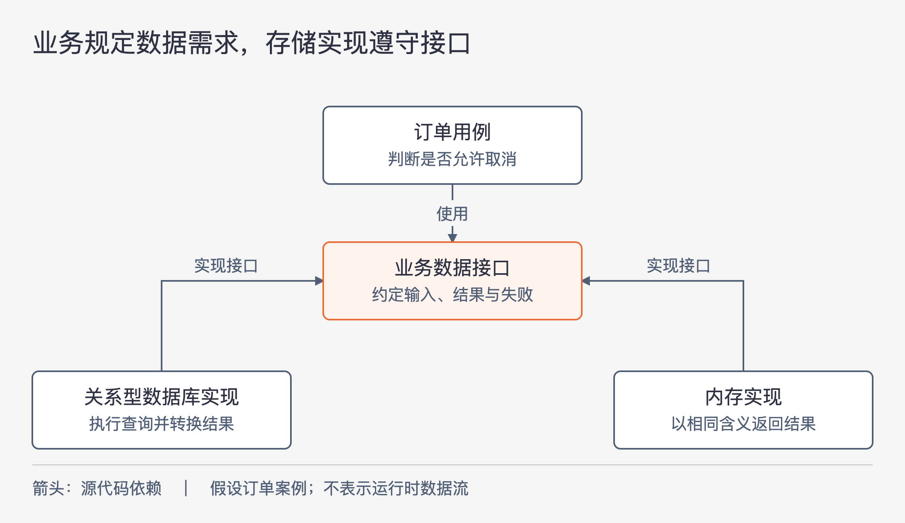

# 《架构整洁之道》第30章｜数据库只是实现细节 · 书镜8.2

一个订单系统离不开订单数据，但这是否意味着它的所有代码都应该围着数据库表来设计？本章把两个常被混在一起的问题分开：业务需要怎样的数据，以及用什么工具保存这些数据。作者主张让前者决定系统的核心，让后者通过受限的边界提供服务。

## 一、原书回顾：从数据模型与存储工具的区别谈起

原章开篇把数据库比作房屋的门把手。这是一个刻意强烈的比喻，紧接着就有重要限定：数据模型、数据的组织结构对架构很重要；这里被称为实现细节的，是负责存取数据的数据库软件。整章讨论的是两者在依赖关系中的位置。

### 关系型数据库

作者先肯定关系型数据库的价值：Edgar Codd 在1970年提出的关系模型，后来成为广泛采用的数据存储方式，数学基础与工程设计都很出色。这些优点说明它是一项优秀技术，却不能据此要求每个用例都认识数据表。

按行、列组织数据，有利于某些访问方式。用例关心的却是业务需要：找哪些对象、判断哪些条件、产生什么结果。作者因此把了解表结构的代码限制在架构外圈。如果数据访问框架把一行记录包装成对象，然后让这个对象一路穿过用例、业务逻辑和 UI，表结构的变化就可能沿着对象传播。对象的外观并不会自动消除对关系模型的依赖。

### 为什么数据库系统如此流行

作者从机械硬盘解释文件系统和关系型数据库的发展。硬盘容量持续增长，读取却仍要经过移动磁头、等待旋转和读入扇区。应用最终只需要其中一个字节，也得先完成这些机械操作。原书用毫秒级磁盘访问与纳秒级内存访问的对比，说明这种速度差为什么促成索引、缓存、查询优化器和标准存储格式；这些数量级属于本章的历史说明，不是当前设备的测试数据。

文件系统和关系型数据库分别适合两种访问问题。文件系统便于按名字找到完整文档，例如找到 `login.c`；若要找到所有含变量 `x` 的 C 文件，就得进一步查看内容。数据库更擅长按共同属性筛选记录，对内容不透明的完整文档则未必占优势。二者都要组织数据、安排索引，并把常用数据放进内存来减少慢速访问。

这一段的论证方向是：许多我们熟悉的数据组织约定，是为存储与查找服务的。用例是否也需要采用这些约定，仍须单独判断。

### 假设磁盘不存在会怎样

作者提出一个思想实验：如果所有数据都在内存中，程序员会怎样操作它们？他给出的答案是链表、树、哈希表、堆栈和队列，并通过指针或引用访问。即使实际数据来自文件或数据库，程序也常会先把它们装入内存，再整理成便于计算的数据结构。

这里保留两个不同性质的说法。原书认为硬盘将退出历史、RAM 将取代它，这是成书时作者的预测；本章没有提供足以验证这项预测的证据。思想实验本身则是在追问：去掉存储介质的约束后，业务处理还需要保持表格的形状吗？理解后一个问题，不需要把前一个预测当作既成事实。

### 实现细节

沿着思想实验，作者把数据库概括成硬盘与内存之间搬运数据的手段，并用一个长期保存字节的容器来比喻它。其意图是让系统核心摆脱对磁盘格式、读写机制乃至磁盘存在本身的认识。

这是为突出架构边界而作的概括。本章没有逐项论证数据库的全部能力都能归结为字节搬运，也没有要求把现有数据库替换成自制文件。它要求审视的是：存储机制是否已经决定了本应由业务决定的结构。

### 但性能怎么办呢

作者承认性能是架构必须考虑的事情。他的主张是，把快速存取数据的具体操作尽量封装在业务逻辑之外，让数据访问层负责相应优化。这样，优化磁盘读取、索引或查询方式时，核心规则可以保持稳定。

原书在这里给出了隔离方向，没有展开所有性能约束如何跨越边界。因而不能把这一节读成“所有性能问题都能在数据库适配代码中独立解决”。后面的讲解会用查询范围的变化说明这个界限。

### 一段轶事

20世纪80年代末，作者带领团队开发一个监控 T1 线路通信质量的系统。系统从线路两端的设备抓取数据，再用预测算法发现并报告问题。他们使用 UNIX，把数据保存在可随机访问的文件里；数据之间没有多少适合关系查询的内容联系，树和链表足以组织处理过程，存储格式也便于加载到内存。

新来的市场推广经理坚持产品必须配有关系型数据库。作者从技术必要性出发反对：现有文件方案已经够用，把树和链表改造成表与 SQL 会增加工作。随后一位硬件工程师用“房子不能建在几根杆子上”的比喻向管理层游说，认为加入关系型数据库能让存储更可靠。作者继续争论；后来这位工程师成为软件开发经理，产品也引入了数据库。

作者最终承认自己处理错了。他仍坚持核心架构没有技术理由围着关系型数据库重做，但客户合同确实把数据库列为必选项，商业要求不能因工程师不赞同就被忽略。他把这种需求的来源归因于数据库厂商的市场宣传，并对“企业级”“面向服务的架构”等宣传用语提出警惕。这是作者对当时经历的解释，不能扩大成对所有数据库需求或所有企业技术采购的判断。

他的事后方案是：保留核心数据结构，在系统的一个受限位置接入关系型数据库，提供安全、有限的数据访问。这样可以响应客户要求，同时控制改动范围。作者当时没有采取这条路，而是辞职转做咨询；原文并未声称这个折中方案已经在该项目得到验证。

### 本章小结

原书最后再次区分数据组织、数据模型与存取工具。前两者影响系统表达什么和怎样推理，数据库则承担具体的持久化工作。架构应安排两者的关系，使选择或调整存储工具时，业务规则不必随之重写。

## 二、主题讲解：让一次查询说清业务要什么

### 先把业务问题从表结构中读出来

以下是用于讲解的假设案例。一个订单系统要回答“这笔订单是否允许取消”。规则是：订单属于当前客户，而且还没有发货。直觉做法是把订单表对应的对象查出来，交给用例判断其中的列值，再把同一个对象交给页面。

这条路径能工作，但三方很快可能对表的含义形成共同依赖。用例把某个数据库状态码当作“已发货”，页面把数据库空值当作“待处理”；以后存储把状态拆成两列，修改就不再局限于读写代码。问题来自规则对存储表示的直接认识。

先把需要的数据说清楚：订单归属、业务上的发货状态，以及取消判断所需的其他事实。用例使用这些含义明确的信息；数据访问实现负责从实际存储中获得它们。这既保留了数据模型的重要性，也给表结构留下调整空间。

### 接口规定需求，适配代码负责兑现

图30-1｜箭头表示源代码依赖，均指向被依赖的类型。订单用例使用业务需要的数据接口；两种实现遵守同一接口。此图是本章隔离主张的假设案例展开，不表示运行时数据只沿箭头方向流动。

图中的接口可以表达“按订单标识读取取消判断所需信息”。关系型数据库实现把这个需求变成查询，再把结果整理成用例认识的结构。内存实现则从已有对象中寻找同样的信息，可以帮助检查业务判断是否依赖数据库环境。

两种实现要满足相同的业务含义。例如“没有找到订单”不能一边表示不存在，另一边却把暂时不可读也算进去。若含义不同，接口虽然一致，用例行为仍会变化。这个例子说明，隔离需要清楚地规定输入、结果和失败含义；给类增加一个接口名称还不够。

保存操作也遵循同样的思路。业务决定什么状态变化允许发生，存储实现决定如何记录它。涉及多个记录必须一起成功时，不能只写一个含糊的“保存”就算解释完了。边界必须保留用例需要的成功条件，而本章没有提供完整的事务设计方案。

### 查询变慢时，分清改的是方法还是要求

继续这个案例。若读取单笔订单太慢，适配代码可以考虑调整查询、索引或缓存方式，业务判断通常无需变化。这与原书希望隔离存储优化的方向一致。

如果新需求变成“列出某客户所有可取消订单”，而接口原先只支持逐笔读取，循环查询就可能成为问题。此时需要让数据访问接口表达批量获取所需信息的能力。如果结果很多，还得明确一次返回多少、如何继续读取。返回范围是用例与数据访问之间的约定，不能假装它只关乎磁盘。

因此，“数据库是实现细节”的可用判断是：先确认业务需要什么，再寻找能满足这些要求的存储实现。性能证据也可能暴露接口设计不足，促使双方重新划分职责。原书提供的隔离原则帮助限制变化，并不保证已有接口永远正确。

### 把外部要求接进来，也要保住真实用途

假如采购合同要求使用某种数据库，可以沿着原书轶事的事后方案，评估它应承担哪一部分真实的数据职责、提供哪些访问方式。核心规则是否需要变化，应由实际业务语义决定。

这项选择有成本：数据转换、适配代码、存储行为的验证都需要维护。对于很小、寿命很短、业务几乎只是记录增删改查的程序，全面建立多套模型可能得不偿失。这是从本章主张推导的取舍，原书没有给出通用规模门槛。可以从一处会反复变化的边界开始，检查每一层转换究竟保护了什么，再决定是否扩大。

## 自测：换了一种存储，什么应该保持一致

假设订单原先存在关系型数据库中，现在改用另一种保存方式。团队保证“接口签名完全没变”，但新实现把暂时读取失败返回为“订单不存在”，并把“已进入发货流程”改成“已发出包裹”。这次改动是否只涉及实现细节？

核对思路：两处都改变了用例看到的含义。前者把故障变成业务事实，后者可能改变允许取消的范围。应先修复结果语义或明确修改业务规则，再谈存储替换是否被隔离。只替换查询方式、保持输入输出含义与成功条件一致，才有理由期待取消判断保持稳定。

## 来源、范围与阅读连接

依据《架构整洁之道》第30章，同版 PDF 物理页270—276，书内页241—246；物理页270为章首页。正文按原有七个小节顺序回顾，开篇的数据模型限定单独保留。原章的硬盘技术、市场观察与 RAM 预测均按成书时语境表述。订单案例及接口取舍属于讲解中的假设与推论，没有引用外部案例或补充现实性能数据。下一章把同样的边界问题转向 Web 与用户界面。

<!-- source_sha256: 64400d05a5e1fe23dedbc41526c9227f74b3647fce36eda738a11c325074f2c3 -->
