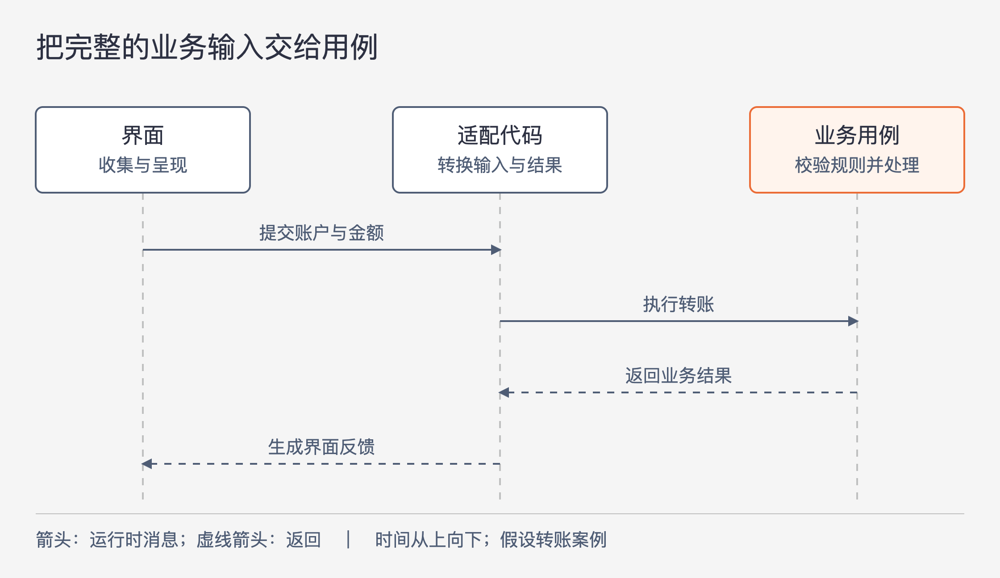

# 《架构整洁之道》第31章｜Web 是实现细节 · 书镜8.2

同一个业务，用桌面窗口、浏览器还是别的界面来操作，会怎样影响核心代码？第30章讨论保存数据的工具，这一章转向接收输入与呈现结果的工具。作者希望业务用例能够跨越界面潮流存活，同时承认不同界面的交互方式有真实差异。

## 一、原书回顾：沿技术钟摆寻找能保持稳定的边界

原章引入回顾了 Web 热潮中的几次转向：先让浏览器保持简单、把计算集中到服务器，随后引入 Applets；再用 Ajax 与 JavaScript 把更多处理放进浏览器，后来又通过 Node 把 JavaScript 代码带回服务器。作者用这段历史提醒架构师，不要把眼前流行的计算位置当作永久不变的前提。

这里对 Web 的强烈评价属于作者的论述语气。它服务于一个明确问题：技术形态变化时，业务规则是否必须跟着变化。不能据此说 Web 在交互、传播或部署方面从未带来区别。

### 无尽的钟摆

作者把视野继续向前推：客户端/服务器、小型机与瘦终端、大型机与打孔卡，都涉及计算资源放在中心还是终端的问题。集中与分散反复出现，Web 是这段变化历史中的一个阶段。架构师需要把寿命更长的业务逻辑同这些配置选择分开。

接着是 Q 公司的个人财务软件。作者原本喜欢它的桌面 GUI；Web 流行后，某个版本把外观改成浏览器风格，他很不适应。后来几个版本又逐渐去掉浏览器式设计，回到桌面界面。这个故事呈现的变化是“桌面风格—浏览器风格—桌面风格”，并没有提供该公司的源码结构。作者明确说自己不知道 Q 公司的架构师是否已将业务逻辑与 UI 解耦；他提出的是事前应做什么准备：让界面改动尽量局限于界面。

另一个例子是 A 公司的智能手机系统更新，应用外观随之大改。作者同样不知道内部实现，也不知道这次更新给应用开发者造成了多大影响。他希望系统与应用的架构师都做好 UI 隔离。文中关于市场人员推动改版的说法是作者的推测与批评，不能据此补出真实公司的内部决策过程，更不能编造改版成本。

两个例子的共同作用，是说明界面变化可能被业务之外的原因推动。它们没有证明某家公司采用了坏架构，也没有给出解耦后具体能节约多少工作。

### 总结一下

作者把 GUI 归入实现细节，把 Web 看作一种输入输出设备，借此延续设备无关应用的思路：系统不应让核心业务规则绑在特定交付方式上。

随后他主动处理一个反对意见。浏览器有 JavaScript 校验、Ajax 交互、拖拽和可组合的界面组件，这些行为同 UI 类型紧密相关。浏览器与桌面客户端/服务器应用的交互模式也不同。若想仿照 UNIX 对普通 I/O 设备的处理，把全部界面交互压进同一种模型，几乎做不到。原文承认这点。

作者于是换了抽象位置。一个业务用例代表用户要完成的一次操作，可以用输入数据、处理过程和输出数据描述。UI 与应用的多次交互中，总会出现一个时刻：执行该用例所需的输入已收集完整，可以开始处理；执行结束后，也会形成足以交回界面的结果。把这两端整理为明确的数据结构，就能使执行用例的代码脱离具体设备。

这里的“完整”有范围：完整到足以执行这一次用例。原书没有要求整个页面、整个会话或整套业务流程只能对应一个巨大请求。它提出了寻找边界的方法，没有替所有交互预先画好边界。

### 本章小结

作者强调，这种抽象需要反复尝试，通常不能一次找准。界面可能继续因市场或技术选择变化，因此为用例建立独立输入输出仍有必要。难点在于识别哪一段属于交互过程、哪一段已经形成了业务操作。

## 二、主题讲解：在输入足够执行时，把控制权交给用例

### 一次转账，包含多少次界面操作

下面用一个假设的个人财务程序展开。用户选择转出账户、选择转入账户、输入金额，最后确认转账。桌面版可能在一个窗口完成；浏览器版可能分几步，也可能在每次输入后即时提示。

如果把所有这些动作都编进一个认识页面控件的业务类，改版会影响业务代码。如果反过来规定所有平台都必须发出同样的鼠标、键盘和焦点事件，界面又会被不合适的模型束缚。

先找一次业务操作需要哪些信息。假设该程序的转账用例需要当前操作者、两个账户和金额。当这些信息已准备好，就能发起这一次转账。输入框的颜色、焦点位置以及是否弹出确认窗口，都不需要成为用例的数据。

### 完整输入不等于输入一定正确

图31-1｜箭头表示运行时消息，时间从上向下。界面先组织交互，随后提交一次用例所需的完整输入；结果返回后，再恢复界面自己的呈现方式。这是按本章主张展开的假设转账案例。

图中“完整”只意味着信息足以作出业务判断。金额可以齐全却不符合规则，转出账户也可能不属于当前操作者。用例仍要根据业务条件决定接受还是拒绝。界面的即时校验可以帮助用户减少输入错误，但不能替代用例必须执行的判断。

这是对原书边界思路的具体展开。若把“完整输入”误解为“UI 已保证一切合法”，就把核心规则重新放回某个界面实现里。以后增加另一种入口时，它可能没有执行同样的校验。

适配代码负责把界面或协议的数据转换成用例输入。用例返回的结果也应能表达业务含义，例如转账成功或因某项条件被拒绝。展示代码再决定用弹窗、页面还是文本呈现。于是，改变错误提示的位置不需要改变拒绝转账的规则。

### 交互里确实需要业务判断时，就给它一个明确位置

继续这个案例。假设输入金额后，界面要显示预计手续费。手续费由业务规则决定，不应为了让界面独立，就在页面里另写一套算法。

可以把“估算手续费”视为一次更小的查询操作，提交计算所需输入并取得结果。用户最后确认时，再执行转账用例。是否需要分成这两步，取决于实际规则：估算只是提示，还是构成一段时间内有效的承诺？如果是承诺，就得明确哪些条件被固定下来。这些差异会改变用例和输入输出，不属于按钮样式。

这个推导说明，“输入—处理—输出”不等于一次用户旅程只能调用一次业务逻辑。它要求每一次调用都有明确目的，不让零散 UI 事件悄悄变成业务约定。原书没有展开手续费或承诺模型；这里只用它说明边界如何随着问题变清楚而调整。

### 判断一次改动，先问它改变了什么

把转账按钮从页面底部移到浮动工具栏，通常改变的是呈现；把确认流程改成需另一位操作者批准，则改变了谁有权完成转账。后者即使由 UI 改版提出，也已进入业务规则。

因此，保护核心代码并不意味着拒绝所有来自界面的需求。应沿着具体变化判断：是同一操作换一种收集和呈现方式，还是操作本身的条件、结果、角色已经改变？只看任务单上写的是“前端需求”还是“后端需求”，容易分错边界。

图中也没有规定浏览器和服务器各运行哪些组件，更没有引入网络服务拆分。它描述的是职责与消息关系。真正涉及设备限制、持续交互或界面本身就是产品核心的系统，仍需要针对实际交互设计；本章不能直接给出一套通用于所有设备的 UI 抽象。

## 自测：新增批量入口之后，规则还在同一个地方吗

财务程序增加批量转账入口。团队复用了原用例，但发现原来“金额必须大于零”的判断只写在网页中。另一位开发者建议，把原网页表单嵌进批量工具来复用校验。这能证明界面与业务已经分离吗？

核对思路：批量工具必须依赖网页才能获得业务判断，说明边界仍未找准。应让用例承担自身成立条件，各入口保留适合自己的输入提示。随后还要明确批量失败的含义：一笔失败是否影响其他笔。这个新问题属于批量操作的业务要求，不能靠复用页面自动解决。

## 来源、范围与阅读连接

依据《架构整洁之道》第31章，同版 PDF 物理页277—281，书内页248—251；物理页277为章首页。原有“无尽的钟摆”“总结一下”“本章小结”依次保留，技术历史的引入在它们之前单独回顾。Q、A 公司保持原书匿名，作者不掌握内部实现的限定已保留。转账、手续费和批量操作均为假设讲解，未补写真实公司经历。下一章继续讨论框架依赖应放在哪里。

<!-- source_sha256: 64400d05a5e1fe23dedbc41526c9227f74b3647fce36eda738a11c325074f2c3 -->
