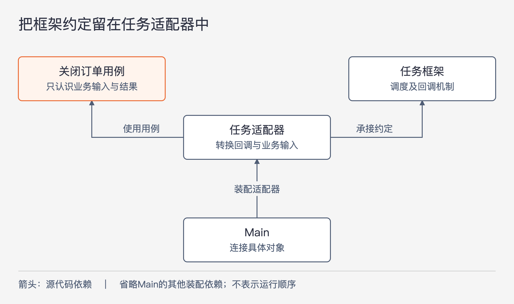

# 《架构整洁之道》第32章｜应用程序框架是实现细节 · 书镜8.2

框架让许多事情更容易，但它替我们安排的结构，未必就是业务最合适的结构。本章关心采用框架之后谁承担变化的代价：框架可以为应用服务，核心业务也应保有自己定义规则和依赖的空间。

## 一、原书回顾：使用框架之前，看清承诺由谁承担

原章首先承认，许多框架有效、有用，而且免费。作者首先区分框架所提供的帮助与系统架构的整体决定。一个框架即使希望覆盖整个应用，也不能自动代表应用的全部需要。

### 框架作者

作者认可框架作者帮助社区的动机，同时指出他们不认识每一个使用者，也不掌握每个项目的问题。他们最了解的是自己以及身边人遇到的困难，框架优先解决这些问题。

框架能流行，是因为许多使用者的问题与它所解决的问题重合。重合解释了框架为什么有用，也提示我们检查未重合的部分。框架在已有场景中表现良好，不能直接证明未来业务需要的每种变化都与它相容。

### 单向婚姻

原书用“单向婚姻”形容使用者与框架之间的不对称关系。应用团队需要阅读文档、遵守约定，可能还得继承框架基类、把框架工具放入业务对象，并据此安排整体结构。框架作者却不必为某一个应用承诺长期保持它依赖的行为。

在作者看来，框架设计者掌握自己的实现，倾向于鼓励更紧密的整合；应用团队没有同样的控制权，却承担升级和离开的成本。文中关于作者希望用户长期绑定的描述带有修辞与推断，不能推广为每位开源作者的真实意图。需要留下的判断是控制权与迁移责任不对等。

### 风险

第一类风险发生在依赖方向上。框架可能要求业务对象乃至业务实体引用它的类型或继承它的基类，于是框架进入架构内圈。以后调整框架时，业务规则所在的代码也会受影响。

第二类风险是适用范围随业务发展而改变。初期需求恰好符合框架，成熟后的新要求可能超出它的设计。原先省下的工作，可能逐渐转成适应框架限制的工作。作者描述的是一种可能的演变，没有给出所有框架都会经历这个过程的统计证据。

第三类风险来自框架自己的演进。新版本可能向应用不需要的方向发展，原来使用的功能可能消失或改变行为，团队却因其他原因不得不升级。

第四类风险来自更合适的替代方案出现。即使现有框架没有恶化，团队也可能想换一种实现；早先广泛散布的依赖会提高迁移成本。四类风险分别涉及依赖结构、需求成长、上游变化和未来替换，需要分别检查。

### 解决方案

作者建议把框架留在架构外圈，作为业务逻辑的插件使用。若框架要求继承某个基类，可以由外围的代理类满足要求，再让它与核心业务协作，避免核心类直接承担框架约定。

这里的“代理类”指替核心承接框架要求的一层外围代码，不应自动理解成必须采用某个动态代理机制。重点是依赖的位置：认识框架的代码依赖核心定义的能力，核心不反过来认识框架。

原书以 Spring 为例。它肯定使用 Spring 连接对象依赖的价值，但反对在业务对象中到处写自动注入注解，主张让业务对象对 Spring 不知情。连接依赖的工作可以放在 Main 组件中。Main 负责把具体实现接起来，位于作者定义的低层位置，拥有很多具体依赖是预期行为。

这一建议表达的是本书的架构立场。它并未比较不同注入写法的全部特征，也没有给出一套可直接替换项目配置的代码方案。

### 不得不接受的依赖

作者同时承认，使用 C++ 很难避开 STL，使用 Java 也很难避开标准类库。依赖本身无法全部消除；有些选择会与项目相伴整个生命周期。

因此，关键在于团队是否主动理解并接受这项承诺。不能把“隔离框架”推成“给所有标准库都包装一个接口”，也不能因为总有不可避免的依赖，就不再区分哪些依赖值得限制。

### 本章小结

作者建议先小范围采用，积累了解之后再增加投入；能把框架留在边界之外多久，就尽量保留多久。他在结尾用买奶牛与喝牛奶的俚语提醒读者，可以先取得所需能力，再判断是否需要作出更全面的承诺。译者脚注对俚语的解释服务于这个意思，没有增加新的架构规则。

## 二、主题讲解：把替换范围控制在实际使用框架的地方

### 一个任务框架为什么会进入业务类

下面是一个假设例子。系统需要每天检查订单，并按业务规则标记应关闭的订单。团队采用任务框架，框架要求任务对象继承它的基类，并通过特定上下文获得本次执行信息。

直接让“关闭订单用例”继承任务基类，初期很省事：回调发生时，就在同一对象中读参数、查询订单并执行判断。随着代码增长，用例可能开始依赖框架上下文来取得日期或执行标识。此后，即使只是想从管理入口手动运行同一业务操作，也必须考虑怎样制造框架上下文。

这时可以具体地说出耦合造成了什么：业务操作已经无法只凭自己的输入执行。核心业务承接了调度工具要求的生命周期和类型，使得调用方也必须满足这些要求。

### 让外围任务适配器调用普通的业务用例

图32-1｜箭头表示源代码依赖。任务适配器位于外围，承接框架要求，再使用业务用例。Main 负责装配具体对象。此图是本章代理类与 Main 主张的假设展开，不表示启动或任务执行顺序。

框架要求的基类由任务适配器继承。适配器收到回调后，提取业务执行所需的信息，整理成用例输入，再调用关闭订单用例。用例只处理“哪些订单可以关闭、关闭后的结果是什么”等规则。

这样，手动入口也可以提供同样含义的输入，调用同一用例。若后来更换任务框架，主要修改接收回调、提取参数和装配对象的代码。业务算法能否保持不变，还取决于新框架是否满足原来约定的执行条件。

Main 在图中承担装配职责：创建或取得具体对象，建立连接，然后交给运行环境使用。它知道框架和适配器并不违反本书原则，因为它本来就在处理具体选择。若把这些选择再次搬进用例内部，外围适配器便失去了保护作用。

### 适配层不能把行为差异藏起来

继续假设：旧框架一次只运行一个任务，新框架可能同时触发多个实例。只改一个类、让源码重新编译，并不能证明替换成功。业务操作原先是否假设不会并发执行，需要被检查。

这一例子中的并发差异是为讲解构造的条件，并非对任何实际任务框架的描述。它提醒我们，隔离框架类型只是开始，执行次数、顺序和失败后的行为也可能影响业务。适配代码应兑现业务所需的条件；如果做不到，就要明确调整用例的约定与实现。

同样，外围适配器不应把框架特有异常原封不动抛给核心，让业务再按框架错误码作决定。需要业务作判断的失败，应转换成它能理解的含义。否则依赖只是从参数移动到了异常中。

### 先试用一段真实流程，再决定包住多少

可以先用框架接起这一个任务，把正常执行、拒绝执行和失败情况走一遍。观察哪些框架概念已经进入业务输入、结果、基类或初始化过程，再判断哪些值得隔离。这样能把“将来可能难换”变成具体可检查的依赖位置。

隔离也需要付出代价。外围代码要维护转换、生命周期连接和错误解释；框架若负责的是整个图形界面的交互模型，一层薄适配器也未必能保留所有特性。对问题本身高度依赖某个运行环境的应用，接受较深依赖可能是有理由的选择。应把能获得的能力、预计使用期限与迁移范围一起考虑，而非预先承诺所有框架都可低成本替换。

这些取舍延续了原书“主动接受依赖”的限定。本章给的是检查依赖的方向，没有规定每个项目必须增加多少层包装。

## 自测：框架依赖是否真的被移出了核心

团队声称已把任务框架放到外圈，因为只有适配器继承框架基类。但业务用例的方法仍接受框架的任务上下文，失败时还返回框架专用结果对象。这算完成隔离了吗？

核对思路：用例仍需要认识框架类型，依赖边界并未建立。应先确定它实际需要的业务输入、结果和失败含义，再由适配器转换。随后用另一个入口调用相同用例，并检查执行条件是否一致；仅统计继承关系不足以判断隔离是否有效。

## 来源、范围与阅读连接

依据《架构整洁之道》第32章，同版 PDF 物理页282—286，书内页253—256；物理页282为章首页。六个原小节依次保留，开篇肯定框架价值及结尾译者脚注的含义也有去向。Spring、STL 与 Java 标准类库仅按本章举例的范围回顾，不评价当前版本。任务调度与订单关闭是明确假设案例，未引入外部实践事实。下一章用收费视频网站整合角色、组件、依赖方向与部署选择。

<!-- source_sha256: 64400d05a5e1fe23dedbc41526c9227f74b3647fce36eda738a11c325074f2c3 -->
