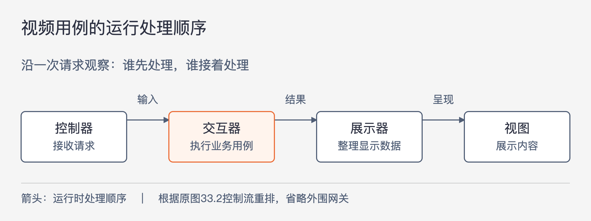
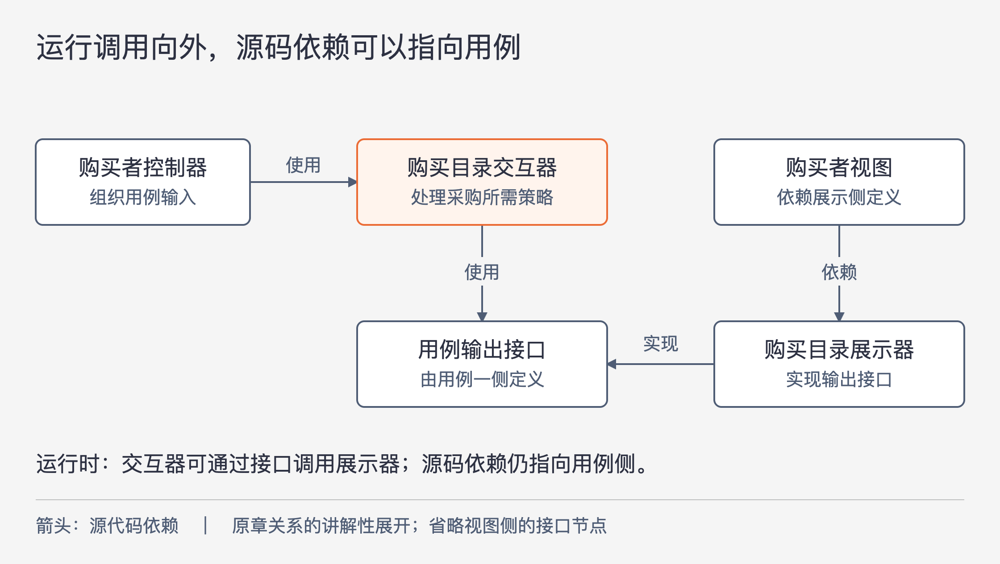

# 《架构整洁之道》第33章｜案例分析：视频销售网站 · 书镜8.2

前面几章解释了哪些技术应留在边界之外。这一章把原则放进一个收费视频网站：先识别谁要完成什么事，再安排组件及其依赖，最后决定怎样组合部署。读者需要看清的是这个设计过程，不必把图中的每个方块立即变成一个服务。

## 一、原书回顾：从角色和用例走到组件与部署选择

原章开篇说明，这是一次简短的案例分析，目的是示范架构师如何思考和作决定，范围不足以覆盖一个实际网站的全部需求。

### 产品

作者以自己熟悉的教学视频销售业务为背景。个人用户可以购买在线播放许可，也可以支付更高费用下载视频并永久拥有它。企业用户只能在线播放，但可以批量购买并获得折扣。个人购买者通常自己观看；企业采购则常为其他人购买，购买和观看由不同的人承担。

视频作者负责上传文件、撰写简介，并提供习题、作业、答案、源代码等配套资料。管理员负责创建播放列表、增删其中的视频，并设置不同许可类型的价格。

这些差异决定了分析的起点。支付接入方式尚未展开，数据库也尚未选定，系统已出现几种不同的责任：制作内容、组织销售、购买许可和消费内容。作者因此先识别角色与用例。

### 用例分析

原图33.1按四个角色列出业务操作，下面保留图中的具体项目及章内产品约束。

| 角色 | 原图中的用例 | 需要保留的区别 |
| --- | --- | --- |
| 作者 | 提交 MP4、提交考题、提交视频简介 | 产品文字还包括其他配套资料，图只示范部分操作 |
| 管理员 | 添加新列表、向列表添加视频、从列表中删除视频、设置许可价格 | 管理内容组织与许可价格 |
| 购买者 | 购买下载许可、购买在线播放许可、购买企业许可、购买者查看目录 | 企业购买者与实际观看者可分离；企业许可不提供下载 |
| 观看者 | 观看者查看目录、在线播放视频、下载视频 | 图中的下载能力仍受已购买的许可约束 |

依据单一职责原则，作者把这四种角色视为主要的变更驱动力。目标是当一类角色提出新需要时，尽量不影响其他角色对应的代码。这里的角色是责任划分；同一个个人用户可以同时作为购买者和观看者，不能据此把两类责任混成一类。

图中还用虚线椭圆标出“购买许可”和“查看目录”。前者联系几种具体购买方式，后者联系购买者与观看者各自的查看目录。作者称其为抽象用例，用来分析可共享的一般策略。他明确承认这种抽象不是产品运行的必要条件，只是相近用例值得共同分析。脚注也说明，这里的图示是作者自己的简化表达，不能当作严格的 UML 记法教程。

用例清单刻意省略了登录、注销等内容以控制篇幅。省略并不表示这些能力不重要；这张图更不能直接作为完整需求验收清单。

### 组件架构

原图33.2同时沿两条方向分隔代码。一条按管理员、作者、购买者和观看者分组，另一条按视图、展示器、交互器和控制器分开。交互器是执行具体用例的代码，展示器把用例结果整理成适合视图使用的形式，控制器接受输入，视图负责呈现。

图中的双实线代表架构边界。底部还有 `Revenue Gateways`、`Data Gateways` 和标为 Datomic 的数据库。它们显示收入相关和数据访问相关的外围能力如何与用例相接；本章没有展开收入网关的具体协议或收费处理过程，也没有论证 Datomic 是唯一合适的数据库。

查看目录的共享部分体现为 `Catalog View` 和 `Catalog Presenter`。作者假设将它们写成抽象类，再在购买者、观看者相应组件中放置派生类。这里是本案例采用的一种实现设想，不应扩大为“所有共享 UI 都必须通过继承实现”。

每个方块都可以成为独立构建的潜在 `.jar` 或 `.dll` 单元，但这不要求上线时一定交付那么多文件。作者提出几种组合方式：

- 按技术职责组合成五个交付文件：视图、展示器、交互器、控制器及工具类。
- 把视图和展示器合并，交互器、控制器与工具类各自独立。
- 再进一步，只保留“视图与展示器”和“其他组件”两个交付文件。

他仍要求构建环境体现组件划分，使对应组件可以单独构建；部署时则可以组合它们，并随变化调整组合。构建边界与部署组合在这里有联系，也有各自的选择空间。

### 依赖关系管理

原图的运行控制流从右向左：控制器接收输入，交互器处理，展示器格式化结果，视图最终展示。下面改用从左向右的阅读方向，只表达同一条运行路径。

图33-1｜箭头表示运行时的处理顺序，按原图33.2的控制流重新排布。此图未画源代码依赖，也未展开数据库与收入网关的调用。

原图中的源码依赖却不全沿控制流前进。作者要求跨越架构边界的依赖指向包含更高层策略的组件。有些关系是使用关系，有些关系通过继承或实现接口建立；后者使低层实现依赖高层定义，即使运行时由高层把工作交给低层完成。

这段讨论把开闭原则落实到组件关系上：高层定义所需能力，低层通过实现这些能力接入。于是更换展示或存储细节时，不必仅因控制流要经过那里，就修改核心用例。原图对开放箭头和闭合箭头作了说明：使用关系与继承关系承担不同的作用，控制流本身不足以说明源码应该依赖哪个组件。

### 本章小结

作者把本案例概括为两个维度的隔离：角色对应不同的变更原因，架构层次对应不同的变更速率。沿这两个维度组织代码，有助于把可能因不同原因、在不同时刻变化的部分分开。

这种组织保留了组合部署的余地。原书没有测量每层实际的变化频率，也没有承诺划分后任何修改都只影响一个组件；这是一种安排变化边界的设计判断。

## 二、主题讲解：让购买者的需求有明确的修改位置

### 先找不同的人在要求什么

以下是延续原产品的假设变更。企业购买者希望在批量采购时查看折扣，而观看者希望打开目录后快速找到已获许可的视频。

两个人都在“查看目录”，但面对的问题不同。购买者要比较价格与采购数量，观看者要确认自己可以播放什么。如果一开始只建立一个包含所有条件的目录方法，它可能逐渐需要分辨购买身份、观看身份、折扣、许可和页面样式。随后任何一个角色的变化都可能影响同一段代码。

可以先分别定义购买者查看目录与观看者查看目录的结果含义，再观察哪些部分相同。例如视频标题和简介的基本展示可以共享，企业折扣与观看资格则各自保留。这个顺序与原书先区分角色、再讨论抽象用例一致。把相同外观当作全部策略相同的证据，会过早合并责任。

### 用例把结果交出去，源码仍可以依赖高层定义

假设购买目录的展示方式要从网页改成另一种客户端。先看清用例与展示器之间的关系。

图33-2｜所有箭头均表示源代码依赖；“实现”箭头指向接口所属处。此图按原章依赖关系原则展开一个用例的输出边界，增加接口节点用于讲解，并非逐类复制原图33.2。

交互器处理一次目录请求，形成用例结果，然后通过输出接口交给展示器。输出接口由用例一侧定义，展示器实现它。因而运行时可以由交互器调用展示器，而编译时展示器却依赖用例定义的接口。两种方向同时成立，没有矛盾。

视图与展示器之间也可以用类似安排保护格式化策略。图中只保留该侧组件之间的依赖，没有展开所有接口。检查实际代码时，应继续查看接口究竟放在哪个组件，参数和返回值是否偷偷引用了视图或框架类型。

目录结果若已被用例拼成某个页面的 HTML，即使图上依赖箭头正确，用例仍知道了特定显示形式。这说明依赖不仅出现在导入和继承处，也可能通过数据结构的含义进入核心。

### 组件边界和交付文件回答不同的问题

假设目前团队很小，所有网站代码一起部署最方便。仍然可以让购买、观看、内容管理等组件保持独立职责，并让构建关系反映允许的依赖。把它们放进同一次发布，不必把代码重新合并成任意互相访问的结构。

等到页面经常调整、购买策略较稳定时，可以评估是否把视图与展示器作为单独交付组。若部署分开却要求每次同步升级，或一处接口变化总让全部组件重编译，预期收益可能并未出现。应先查清真实变更依赖，再决定拆出多少交付单元。

反过来，把每个方块立刻变成独立网络服务，会新增通信失败、部署协调和运行管理问题。原书图描述的是组件及潜在构建单元，没有要求这种进程拆分。图本身也不足以确定收费流程需要哪种事务或跨服务方案。

### 用一次变化验证划分是否有帮助

还是企业折扣这个变更。先追踪它真正改变什么：采购数量怎样影响价格、购买者目录要看到哪些价格信息、管理员需要怎样设置价格。即使按角色划分，这次变更也可能合理地涉及多个角色组件，因为一条业务政策确实连接着它们。

需要避免的是不相关的影响。例如只调整企业采购价格，不应因为共用一个含大量条件的展示器，就改变个人观看者的播放资格。组件隔离的价值，要通过这种具体传播路径判断。

可以在设计评审时走两次路径：一次跟着运行过程确认输入如何到达结果，一次跟着类型依赖确认哪些组件在编译时必须认识哪些定义。再用真实变更检查角色划分是否稳定。三者能相互补充，单独一张组件图不能证明系统已经符合设计。

## 自测：共享目录应当保留到哪一层

企业购买者新增“按采购数量显示折扣”，观看者目录仍只需要显示自己获准播放的视频。有人建议在共同的 `Catalog Presenter` 中增加一个企业判断分支，并让观看者也提供采购数量，统一接口。这个方案有什么问题？

核对思路：观看者被迫提供与其任务无关的信息，共同抽象已经吸收了购买者特有的策略。可以保留确实相同的目录展示部分，把采购折扣及其结果留在购买者用例与展示路径。若两种目录以后差异很大，减少共享也合理，因为原书已经明确抽象用例不是产品正确运行的必要条件。

## 来源、范围与阅读连接

依据《架构整洁之道》第33章，同版 PDF 物理页287—292，书内页258—262；物理页287为章首页。五个原小节与原图33.1、33.2对应的角色、用例、网关、共享目录、构建和部署选择均已回顾。原图已按同版页图核对。折扣改版、目录结果和交付评估是基于原产品的假设推演；本章不是该网站的完整设计，也没有补写登录、支付或许可执行的生产方案。下一章将进一步检查：这些边界能否真正落实到包、可见性和构建关系中。

<!-- source_sha256: 64400d05a5e1fe23dedbc41526c9227f74b3647fce36eda738a11c325074f2c3 -->
