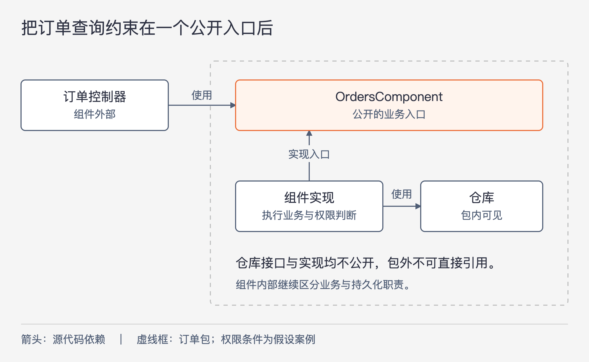
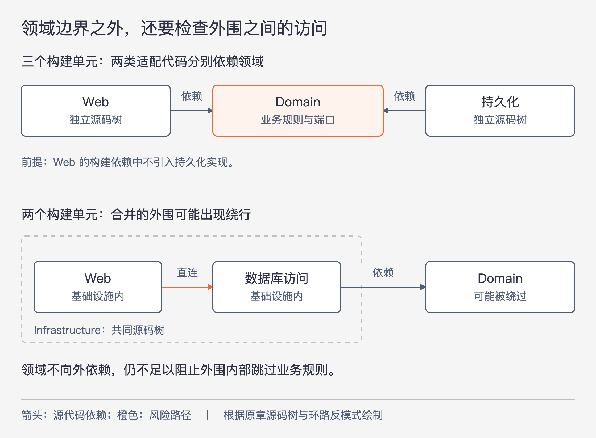

# 《架构整洁之道》第34章｜拾遗 · 书镜8.2

本章由 Simon Brown 撰写。它把全书的边界原则推进到代码细节：包应怎样组织，哪些类型可以公开，构建关系能禁止哪些访问。判断架构是否落实，需要查看开发者实际能写出什么依赖。

## 一、原书回顾：用同一个订单查询检查四种代码组织方式

原章始终围绕在线书店的“客户查看订单状态”用例。例子采用 Java，作者认为原则可用于其他语言，但不同语言维护边界的具体手段仍需分别考虑。

### 按层封装

第一种方式按技术职责水平分层：Web、业务逻辑、持久化各在一个包中。控制器处理请求，业务服务表达订单规则，数据仓库接口描述数据访问，具体实现负责持久化操作。严格分层要求每层只能依赖相邻的下一层。

原书文字和图中的类名存在单复数与拼写差异。为便于持续跟踪，本文沿图示主要写法使用 `OrdersController`、`OrdersService`、`OrdersServiceImpl`、`OrdersRepository` 和 `JdbcOrdersRepository`。五者分别是控制器、服务接口、服务实现、数据访问接口及其实现，名字统一不改变职责或关系。原脚注批评了以 `Impl` 结尾的笼统命名，但此章会继续说明，比名字更深的问题在可访问性。

作者援引 Martin Fowler 对分层结构的讨论：起步时，它简单、容易理解；规模扩大后，只分成三大块不够，还需要进一步模块化。与此同时，顶层目录只显示 Web、service、data，很难看出程序处理什么业务。两个完全不同领域的项目，可能拥有几乎相同的技术目录。

这里承认了分层的初期用途。后续批评针对的是规模增长后的组织能力和边界执行，不能省略前提后写成“分层永远不该用”。

### 按功能封装

第二种方式把相关功能、业务概念或聚合根所涉及的类型集中在一起。原来的五个类型都放进订单包，顶层结构由此显出订单业务。

这样修改“查看订单”时，相关代码在同一位置，更容易定位。脚注也承认，现代 IDE 的导航会减弱这项便利。作者观察到一些团队先按层组织，遇到困难后改成按功能组织，但他对这两种方式都不满意，后文要进一步比较。

把类搬到同一个包，改变了组织位置。它能否形成受保护的边界，还要看包外究竟能访问其中哪些类型。这是本节留给后文的问题。

### 端口和适配器

第三种方式区分内部领域代码与外部基础设施代码。内部表达业务概念，外部承担 UI、数据库和第三方集成。依赖只能由外向内，领域代码不应反过来认识具体技术。

订单例子中，服务接口、服务实现以及数据访问所需的接口放在领域包；Web 控制器与 JDBC 实现在外部。数据访问接口从 `OrdersRepository` 改称 `Orders`，强调业务领域所谈的是订单集合，而非一种存储技术的名字。这个命名建议来自原章对领域语言的运用；把名称改短本身并不能改变依赖关系。

关键变化是接口的归属。业务实现使用内部定义的 `Orders`，外部 JDBC 类实现它。于是运行时业务仍可读取数据，源码依赖却由具体存储实现指向领域定义。

作者提醒，图34.4是简化的 UML 类图，省略了交互器，以及跨边界时的数据编码、解码对象。因此不能只照图中五个类型，就宣称已完整实现全书的整洁架构。

### 按组件封装

这一节先说明作者的经验来源。Simon Brown 曾用 Java 开发多种企业软件，包括 Web、客户端/服务器、分布式和消息系统，其中很多采用传统分层。脚注回忆，他1996年毕业后的第一份工作使用 PowerBuilder 构建数据库桌面应用；后来一个项目却需要自己做数据库连接与 AWT 界面组件。作者用这段经历表达对技术更替的感受，不能把它当作不同技术生产率的对照实验。

接着，他沿订单例子展示分层中的具体漏洞。Web 控制器与业务服务处于不同包，服务接口必须公开；服务实现要访问另一个包的数据仓库接口，后者也必须公开。新人接到新订单功能，为尽快完成任务，发现可以通过依赖注入直接把 `OrdersRepository` 接入 `OrdersController`。功能跑通了，箭头依旧向下，但控制器已经绕过业务服务。

这形成了宽松分层，允许跳过相邻层。作者承认，有意采用命令查询责任分离（CQRS）时，读取与更新走不同模式，某些旁路可能合理；但若业务层承担权限判断，未经设计的跳过可能绕过应执行的规则。是否合理，要看旁路的业务含义，不能只看图上有没有循环。

“控制器不得直接访问数据层”若只是团队约定，就得依赖自律、评审或工具来执行。原书列出 NDepend、Structure101、Checkstyle 等构建后静态检查的例子，用规则禁止 Web 包依赖 data 包。这可以发现违规并使构建失败，但规则需要维护，反馈也可能晚于写下代码的时刻。作者更希望编译器直接拒绝不允许的访问。

因此他提出按组件封装：把一个粗粒度业务能力相关的类型放入同一包，UI 留在外面。订单组件公开 `OrdersComponent`，内部包含它的实现、数据仓库接口和 JDBC 实现。调用方只看见这个业务入口，组件内部继续区分业务逻辑与持久化职责。

此处“组件”的定义与正文作者并不完全相同。

| 使用者 | 本章回顾的定义 | 与交付文件的关系 |
| --- | --- | --- |
| Robert C. Martin | 可部署的最小单元，Java 中对应 jar | 部署单元是定义的关键 |
| Simon Brown | 一个执行环境中，良好接口背后一组相关功能 | 放入哪个 jar 是另外的维度 |

Brown 用 C4 模型解释自己的术语：系统包含容器，例如 Web 应用、移动应用、数据库或文件系统；容器包含组件，组件包含类。这里的容器是该模型对执行或存储环境的称呼，不宜自动代入某个具体容器化产品。

按组件封装把订单功能集中在一个明确入口后，组件外部无需知道它内部怎样访问数据库。作者把这种单体内的良好边界视为以后微服务化的一个前提，但没有要求立刻将组件拆成远程服务，也没有证明有了这种包结构就能无成本拆分部署。

### 具体实现细节中的陷阱

四种组织方式在图上不同，实际实现却可能把区别抹掉。作者指出一种常见习惯：所有类型都写成 `public`。这样其他代码就能直接使用本应隐藏的类，甚至初始化具体实现。

只要这些访问在语言层面允许，包名和设计说明就无法自行阻止它。开发者可能仍按原设计工作，但当新成员不了解规则、工期紧张或图与代码不同步时，设计会依赖持续的人工约束。

这一节把问题从“怎样分组”转向“分组后是否真的隐藏了东西”。

### 组织形式与封装的区别

作者先做一个思想实验：四种方案中的类型全部公开，再忽略包框。剩下的类间使用与实现关系非常相近。图34.7借此强调，仅靠摆放方式和架构名称，不能得到可执行的封装。

这不宜解释成四种方案在业务语义与依赖归属上绝对相同。原章要指出的是：如果任何地方都能引用这些类型，许多本想禁止的访问仍然成立。随后图34.8重新加上包与访问控制，差别才变得具体。

| 方式 | 需要公开的主要类型 | 可以隐藏的部分及剩余问题 |
| --- | --- | --- |
| 按层封装 | `OrdersService`、`OrdersRepository` 等跨层接口 | 服务与仓库实现可以隐藏，但控制器仍可能引用公开的仓库接口 |
| 按功能封装 | 以 `OrdersController` 作为包的入口 | 其他类型可包内可见；包外复用订单能力却要通过控制器，是否合适取决于场景 |
| 端口和适配器 | `OrdersService`、`Orders` 等被外部适配器使用的接口 | 具体实现可以隐藏，运行时再装配；公开端口仍需正确约束使用者 |
| 按组件封装 | `OrdersComponent` | 组件实现、仓库接口与实现均可隐藏，包外代码无法直接引用仓库 |

原译文将其中的权限多次称作“包范围内的 protected”。这里按图意统一说“包内可见”。若写 Java 顶层类型，包访问权限对应不写访问修饰符的默认访问，而不是给顶层类加 `protected`；这是阅读实现细节时必须辨清的术语，不能照译文字面生成代码。

公开类型减少，包外能建立的直接类型依赖就随之减少。按组件封装因此可以借编译器阻止控制器直连仓库。原书也给出 .NET 的相似思路：使用 `internal`，并把每个组件放在独立 assembly 中。具体权限单位不同，不能把 Java 包与 .NET assembly 当成同一个东西。

这一节还有三个限定。首先，讨论对象主要是同一源码树中的单体程序。其次，Java 包名的层级不等于访问权限的层级，子包不会因为目录嵌套就自动获得父包的包内访问能力。最后，反射等机制可以绕过普通的类型访问约束，原脚注明确不赞成这样作弊。编译器边界维护的是相应规则所覆盖的源码访问，不是对一切运行行为的绝对保证。

### 其他的解耦合模式

语言访问权限之外，原书还提出模块化框架、模块系统和独立源码树。OSGi 与当时讨论的 Java 9 模块系统，可以帮助区分“类型是 public”和“类型所属的部分对外发布”这两件事。这里保留作者成书时的讨论，不把其对 Java 9 的期待写成今天的技术状态。

按端口和适配器组织时，可以进一步拆成三棵源码树：业务代码包含服务接口、服务实现和 `Orders`；Web 代码包含控制器；持久化代码包含 JDBC 实现。后两者在编译时依赖业务代码，业务代码不依赖它们。作者举 Maven、Gradle、MSBuild 等构建工具的模块或项目组织作为实现方向。

把所有组件都拆成独立项目，可能带来性能问题，并增加复杂度与维护成本。另一种较省事的做法只保留 Domain 和 Infrastructure 两棵树。它仍能阻止领域代码依赖基础设施，但会留下另一条路：同在基础设施里的 Web 控制器，可以直接访问数据库代码，绕过领域规则。

作者将其比作巴黎的 Périphérique 环路：车辆不进入市区，也能从城市外围的一处到另一处。这个反模式表明，“领域没有向外依赖”与“每次业务访问都经过领域规则”是两项不同的检查。两树方案可用，但需要继续限制外围各部分之间的访问，尤其要正确安排类型可见性。

### 本章小结：本书拾遗

再清晰的设计也要落实成类、包、源码树，以及编译期和运行期的连接方式。作者建议尽量用编译器维护所选边界，同时考虑团队大小、技术水平、时间和预算，并警惕数据结构等位置带来的额外耦合。

本章把“实现细节”放到实际落地的位置：数据库或框架的具体选择可以由核心隔离，而让隔离生效的可见性和构建安排，需要认真实现。二者讨论的是不同问题，不能因前面称技术为实现细节，就忽略本章这些细节。

## 二、主题讲解：让绕过业务入口的代码写不出来

### 从“查得到订单”继续追问“凭什么能看”

以下沿原书订单查询构造一个假设条件：客户只能查看自己的订单，客服则要通过另一套已授权的操作查看。最初，权限判断放在订单业务入口中，查询结果再交给控制器呈现。

新人直接从控制器访问仓库，仍能查到订单；若测试只检查“输入订单编号，返回订单状态”，它也可能通过。但查询路径已经绕过了确认操作者身份与订单归属的步骤。必须把这个失败机制看清楚，才知道应该禁止哪种依赖。

要保留的规则是：相应入口的订单查询必须先经过自己的访问判断。它不要求所有读取都经过一个万能服务，也不否定原书提到的、有明确责任安排的 CQRS 查询路径。若需要单独的查询组件，就应说明权限由哪里执行，而非只在图上给旁路起一个新名字。

### 公开业务入口，把内部访问类型留在组件内

图34-1｜实线箭头表示源代码依赖。订单组件只公开业务入口，仓库类型留在包内；图中“包外不可引用”是访问限制，不是一次运行时请求被拦截。关系依据原图34.6、34.8，权限检查是讲解所加的假设条件。

图里，控制器可以引用公开入口，订单组件的实现可以使用包内仓库。把仓库接口也留在包内之后，控制器即使知道它的名字，普通源码中的直接引用也会被编译器拒绝。这样，维护者不必等到代码评审才第一次发现这条直连。

这个设计保护的是调用方的选择范围。组件内仍然需要清楚地划分查询、规则与数据转换，不能因为外部看不见，就把全部逻辑塞进一个巨大的类。原文所谓订单相关代码有一个修改位置，应理解为集中在一个组件范围内，不是任何变更只改一个文件。

默认包可见性的范围也决定了实现方式。若再把仓库移到 `orders.persistence` 子包，它与 `orders` 已是不同的包，不能沿用“放在下面就能访问”的直觉。需要重新安排类型位置或采用合适的模块边界。目录结构很像树，权限却不会自动沿这棵树传递。

### 单独保护领域，还不能阻止外围绕行

图34-2｜箭头表示源代码依赖。上半部展示三个构建单元的安排；下半部展示把 Web 与数据库代码合入同一基础设施单元后可能出现的额外访问。橙色箭头是风险路径，不表示推荐依赖。图据原章“三棵树、两棵树、环路反模式”的讨论绘制。

在三棵树的方案中，Web 与持久化代码分别依赖 Domain，Web 构建时若没有持久化模块可用，就不能直接引用其中的 JDBC 类。这个保护来自实际构建依赖，必须检查配置是否也遵守该安排。

如果为了减少项目数量，把 Web 与 JDBC 放进同一个基础设施模块，领域代码仍然可以保持干净，但外围两处可能相互可见。原来禁止的捷径又出现了。此时可通过更细的包可见性、导出范围或构建划分维护所需限制；仅验证“Domain 没有导入 Infrastructure”会漏掉这个问题。

这也解释了为什么包、模块、源码树三个词不能互换。它们是不同的组织或约束手段。选择哪种，应看它能否阻止当前真正不允许的依赖，以及为此增加多少构建和维护工作。

### 检查公开类型之外，还要检查它带出的数据

假设团队已只公开 `OrdersComponent`，却让它返回数据库框架专用的记录对象。控制器为了渲染页面，开始读取数据库字段名或依赖该对象的懒加载行为。即使控制器不能直接引用仓库，数据库的表示方式仍然通过返回值传了出去。

这是根据原章结尾“警惕数据结构带来的耦合”所作的假设展开。应该继续检查接口参数、返回值、异常及其含义：调用方是否必须认识内部实现才能正确使用？如有必要，把返回值整理成该用例需要的订单状态结果，明确包含哪些信息及何时已经完整取得。

这样的转换也有维护成本。只有当它隔离了具体的认识负担或变化风险，才值得保留。为每一个简单对象机械复制一套字段，却没有改变任何依赖关系，不会自动加强边界。

### 让检查对应具体失败，不追求一个架构名称

在这个订单案例中，可以分别验证三件事：无权客户不能取得订单；控制器不能直接引用隐藏的仓库类型；对外结果不要求调用方认识数据库实现。第一件检查行为，第二件检查编译期访问，第三件检查接口是否泄露实现知识。它们相互补充，任何一件都不能替代另外两件。

若团队暂时无法拆分构建模块，仍可先收紧已有包的公开范围，并用针对性的结构检查补充。原书倾向编译器执法，但也承认静态检查能起作用。需要关注规则是否跟随代码维护、何时给出反馈、有没有意外放行的入口。

对一个很小的项目，三棵源码树、多个导出声明和大量独立构建也可能带来过高负担。可以从原书这个具体失败开始：先保证外部不能轻易绕过订单入口，再随着实际协作与变化需求增强约束。选择需要接受的例外时，应写明它服务哪个用例、规则由谁承担，而非默许所有类型公开。

## 自测：一个改包名的重构够不够

团队把所有 `web`、`service`、`data` 代码移到 `orders` 包下，并宣布完成组件化。但全部类仍为 `public`，外部控制器继续直接创建 `JdbcOrdersRepository`。另一个方案则只公开 `OrdersComponent`，仓库隐藏在包内，但接口返回了数据库专有对象。两种方案分别漏掉什么？

核对思路：第一种只改变组织位置，没有限制外部依赖；第二种阻止了直接访问类型，却仍通过数据把实现知识带给调用方。需要分别检查访问权限与接口内容。此外，收紧权限后还要确认构建装配能正常完成、业务权限判断确实执行。包名、编译通过和一张结构图都只能提供其中一部分证据。

## 来源、范围与阅读连接

依据《架构整洁之道》第34章“拾遗”，作者 Simon Brown；同版 PDF 物理页293—309，书内页264—279，物理页293为章首页。八个原小节按顺序回顾，保留四种组织方式、两位作者的组件定义差别、PowerBuilder 经历脚注、CQRS 例外、可见性限定、模块和源码树方案及环路反模式。本文类名统一已就近说明；译文“包范围内的 protected”按包访问语义解释，没有照字面使用 Java 关键字。

权限条件、返回值泄露及验证情形属于讲解中的假设推演。原书援引的文章、工具和 C4 资料只在本章提供的内容范围内回顾，未引入外部资料或当前版本能力。原书后续还有附录；本卡保持第34章边界，不把附录的历史项目并入本章。

<!-- source_sha256: 64400d05a5e1fe23dedbc41526c9227f74b3647fce36eda738a11c325074f2c3 -->
