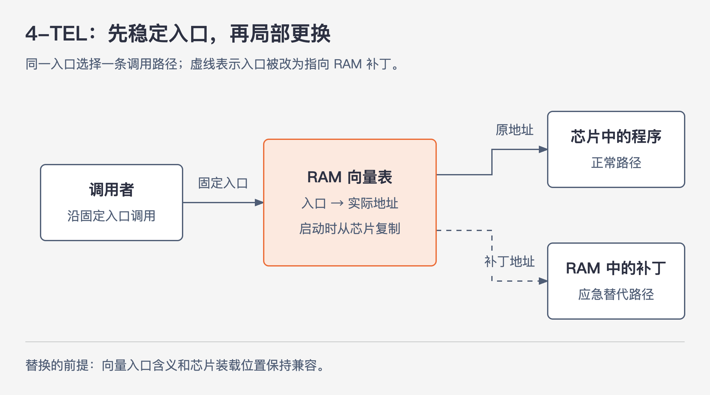
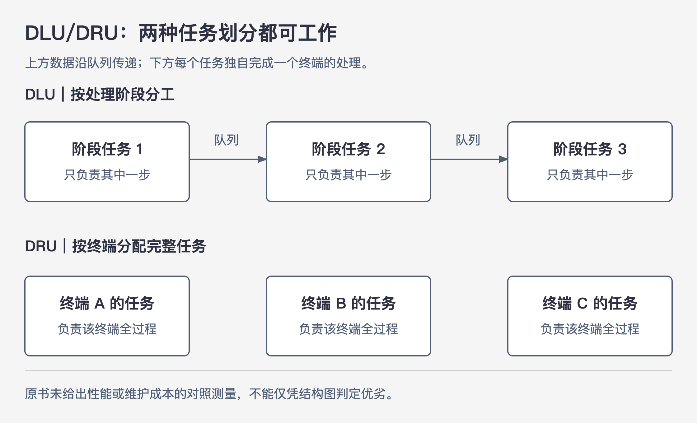
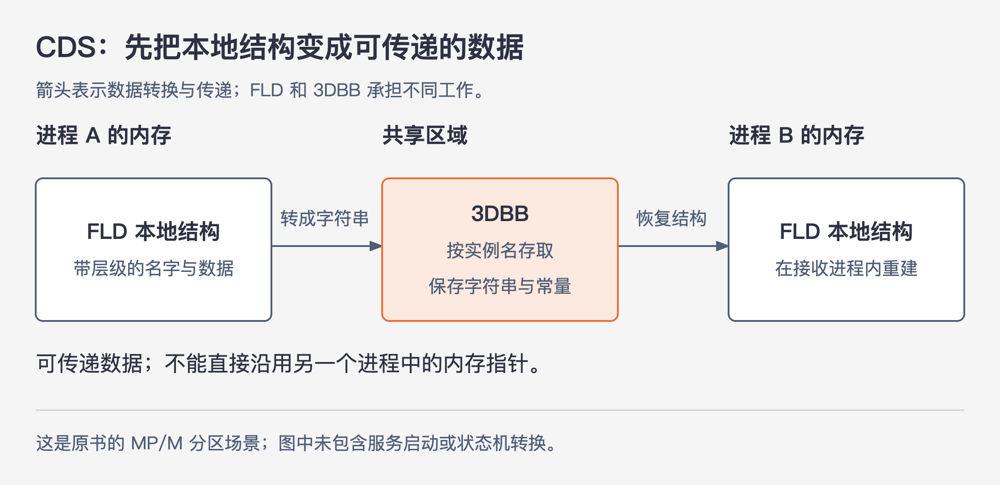
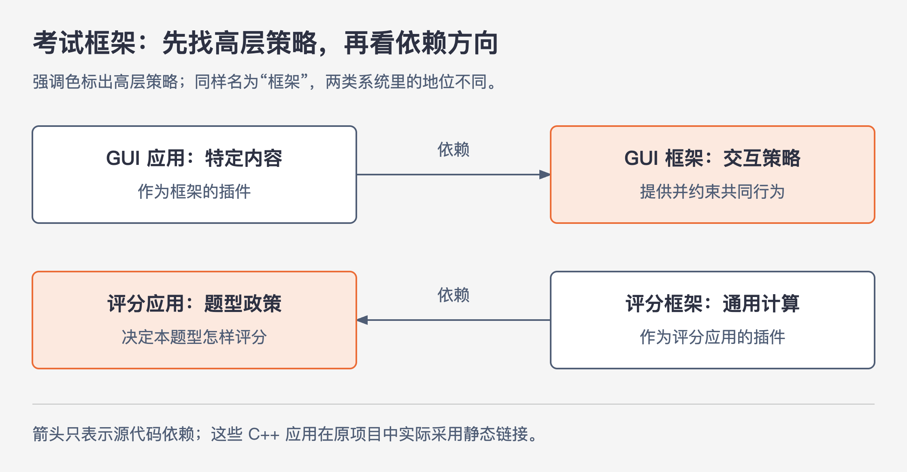

# 《架构整洁之道》附录A｜架构设计考古 · 书镜8.2

一个系统能运行之后，架构的好坏往往要等下一次变更才显现：修一个错误是否要换掉整机的芯片，换一种调制解调器是否要修改几百处代码，新增应用是否还得重做所谓的通用框架。附录 A 回到这些具体经历，解释作者为什么逐渐重视边界、依赖方向和独立部署，也记录他怎样受到新技术与宏大设计的吸引，又怎样修正自己的判断。

本篇保留原书的项目顺序和内部小节。前半部分跟着作者经历事情，后半部分用一个明确标出的假设项目讨论：面对一次变更，怎样找到值得保护的边界，同时控制设计本身的成本。这里的历史主要是作者的个人回忆，不能据此断定某种设计在所有项目中都更好。

## 一、原书回顾：从一次次维护和交付中认识架构

原书引入说明，这些项目有的提供正面经验，有的提供反例，还有一部分主要关系到作者的职业经历。因此，回顾会保留人物与项目之间的转折，不把每则轶事都解释成一条架构原则。

### 工会财务记账系统

20 世纪 60 年代末，ASC Tabulating 为 Teamster 工会 705 区开发财务记账系统，使用 GE Datanet 30。机器占据一间房，需要严格的环境控制，磁盘约能存储 20MB，寻道却要半秒到一秒。原书用图 A.1—A.3 展示整机、磁盘柜和直径 36 英寸、厚 3/8 英寸的盘片，还穿插运输事故和盘片飞出的转述。它们让读者看到当年的物理条件；这些轶事不承担架构结论的证明。

ASC 与工会办公室相隔约三十英里。十几名录入员通过 CRT 终端操作系统，另用电传打印机输出报表。终端每秒处理约 30 个字符，公司为它们租用专线并配备 300 波特率调制解调器。Datanet 30 能同时处理多个异步终端，是选择它的重要原因。原书图 A.4、A.5 对应这两类终端。

当时没有现成的操作系统和文件系统。保存一条记录，需要自行计算盘片、磁道、扇区并控制磁盘。系统围绕 Agent、Employer、Member 三类记录提供增删读改，还承担付款提醒和记账。咨询公司把这些功能写进内存很小的机器里，但硬件和软件的维护费用都高。

1971 年，18 岁的作者与两个朋友受雇重做系统，换用成本较低、性能更好的 Varian 620/f 小型机，配备采用 IBM 2314 技术的磁盘。图 A.6 展示了这台机器。新环境仍然只提供汇编器，他们还得自己写处理中断和 I/O 的抢占式任务管理器，以及磁盘、终端、磁带驱动。按作者回忆，团队常常每周工作约 80 小时，花了八九个月才搭好系统。

这次他们让程序轮流使用一个固定内存区域。一个程序运行到填满自己的终端输出缓冲区，便被换回磁盘；另一个程序随后换入。任务管理器继续以终端能够接受的速度发送字符，缓冲区快空时再把原程序换回来。终端本来就很慢，换入换出的时间能够被输出过程吸收，所以用户没有抱怨响应时间。图 A.7 描绘的正是这套内存、缓冲区、任务管理器和交换空间的关系。

作者从中辨认出两个不同的边界。输出时，应用只交出字符串，不知道终端型号或发送速度；它调用任务管理器，也在编译时依赖任务管理器。这个边界隔离了设备细节，但没有反转依赖。启动时，任务管理器虽然把控制权交给应用，却不引用某个具体应用的源代码，只跳转到双方约定的内存入口。应用可以替换，只要遵守入口约定。这里已经出现了多态调用的作用，尽管当时没有使用面向对象语言。

### 激光切割

1973 年，作者加入 Teradyne Applied System（TAS），参与用高能激光调整电子元器件的系统。电阻印在陶质基板上，其性能与材料和几何形状有关：宽度越大，对电流的阻碍越小。系统一边测量，一边切掉材料，直到与目标性能的误差小于 0.1%。计算机需要协调定位台、探针、测量设备、二维反射镜和激光功率。切割必须随着测量结果及时调整，单独让激光移动并不足够。

使用的 M365 是 Teradyne 自制的小型机，原书把它描述为 PDP-8 的加强版。开发主要依赖单向循环的 Tri-Data 磁带：要回到加载点，只能继续向前卷；25 英尺长的磁带以每秒约一英尺运行，等待可能长达 25 秒。启动按钮先装入初始化程序，再从磁带第一块数据装入后续程序，继而加载操作系统。用户输入程序名后，系统还要在磁带中寻找编辑器或其他程序。

编辑也受这种顺序存储限制。ED-402 每次读入约 50 行源代码，修改后写到另一条磁带，不能直接回到前一块。程序员通常先在纸上标好修改，再从头到尾录入；需要重来时，必须先把当前源代码完整复制出来。终端只有 24 行、每行 72 个字符，而且只显示大写字母；72 列的来历与打孔卡末尾保留序号有关。约两万行程序汇编一次要 30 分钟，期间出现磁带读取错误的概率约为十分之一，所以团队通常编译两份，降低没有可用结果的风险。这些限制解释了当时一次修改为什么昂贵。

软件看上去也有层次。总执行程序 MOP 提供基础 I/O 和简单的 Shell，各子公司共享它的源代码，再各自修改、人工合并。工具层控制测量、定位和激光，但它调用 MOP，MOP 又为它增加特殊处理并回调它，两个部分已经难以分别理解和维护。

上方还有隔离层，为客户执行一种领域专用语言（DSL）：客户用移动激光头、移动定位板、切割等指令描述任务，不必直接写 M365 汇编。可是这门语言的目的主要是简化编程，并没有承诺脱离硬件；它仍与下层的一些做法紧密相连。整个系统最终作为一个编译单元，生成使用绝对地址的二进制代码。作者借此提醒读者，存在“工具层”“隔离层”等名称，并不能证明边界已经保护住了各部分。

### 铝压铸监控

20 世纪 70 年代中期，作者在 OMC 参与车间自动化。工厂用几十台压铸机生产铝制部件，操作员按产量计酬；系统要记录每台机器完成的操作次数与周期时间。IBM System/7 接收机器事件，每完成一个周期便更新统计，再把消息发给中央 IBM 370，由 CICS-COBOL 程序在 3270 终端展示。

这是用汇编编写的中断驱动实时系统，没有现成的操作系统、子进程或框架可依赖。作者觉得工作本身有趣，却不适应公司的工作文化；他忘记交付日期和重要会议，最终被解雇，也承认自己负有责任。原书明确说，这段经历没有太多独特的架构内容，不能把这次离职解读为架构失败。

作者特别记住了 System/7 的 SPI 指令：程序可以主动触发中断，让其他较低优先级的处理获得执行机会。他把这种目的类比为 Java 的 `Thread.yield()`。这里保留的是作者对“主动让出执行机会”的类比，不据此把两者的具体调度语义判作相同。作者后来设计 BOSS 时借鉴了这段经验。

### 4-TEL

1976 年 10 月，作者回到 Teradyne，在这里继续工作了 12 年。4-TEL 每晚检测一个服务区域的电话线，生成待修线路列表，也让测试员执行定点测试。每个服务中心（SC）管理多个中央办公室（CO）；每个 CO 处理接近一万条电话线。

拨号与测量设备必须位于 CO，当地的 M365 计算机称为中央办公室线路测试器 COLT。服务中心另有一台 SAC，通过调制解调器与 COLT 通信。最初 COLT 包办菜单、终端通信、报告等工作，SAC 只是接收并显示内容。链路每秒只能传约 30 个字符，测试员为了几项测量结果也得等整屏字符慢慢传来；COLT 同时还需要昂贵的内存来容纳这些功能。

团队把拨号和测量留在 COLT，把分析、报告和显示迁到 SAC。通信内容缩减成 `DIAL XXX`、`MEASURE` 一类简单命令及结果数据。报告在靠近使用者的地方生成，连接建立后的屏幕更新变快，COLT 内存占用也减少了。两边交换的内容足够少、含义明确，使这次职责划分能够奏效。

下一次变化来自硬件成本和可靠性。M365 及其磁带驱动器在工业现场既贵又不可靠，团队用 8085 处理器、RAM 和 EPROM 电路板替换它。作者和 CK 花约六个月手工转换汇编程序，得到约 30KB 的代码。开发机用 64KB RAM 加载二进制文件测试，产品则把程序切成 30 个 1KB 片段，烧入 30 块 EPROM。图 A.8 展示了这种可用紫外线擦除的芯片。

产品投产后，小修改变成大维护：只要在单一二进制文件中增删代码，后续指令和子程序地址就可能移动。即使只修一个错误，也得重新烧录、运送、更换全部 30 块芯片。现场还会发生标签写错或掉落、芯片插错、针脚折断等问题，工程师因此要多带整套备件。物理上分成 30 块芯片，并没有让软件变成 30 个可独立更新的部分。

图A-1｜向量表把调用入口与实际代码地址分开。根据原书“4-TEL”重绘，箭头只表示运行时的调用路径；虚线路径表示该入口被改为指向补丁后的替代路径。启动时复制地址表的动作未画入调用图。

“向量化”项目花了三个月来改变这一点。团队把程序改成 32 个独立编译、每个小于 1KB 的单元，并为各单元固定装载位置。每块芯片开头放一个固定大小的地址表：40 字节，存放 20 个地址；RAM 中准备 32 个对应表。启动时把芯片的地址表复制进 RAM，之后子程序调用通过 RAM 中的表间接完成。正文只采用上述可确认的容量关系，原书下一句关于子程序数量的矛盾表述见末尾来源说明。

现在，某块芯片内部的地址可以变化，其他调用者仍使用原来的向量入口。修改通常只涉及一两块芯片，现场也只替换这一两块。后来团队还能在空插座中安装新功能，菜单和主程序按约定接入它。作者回头把这称为物理上可插拔的插件架构，并用“发明了对象”形容自己的领悟；这是对项目经验的追认，不是在提出面向对象技术的历史首创证据。

RAM 中的向量表还带来了远程修补能力。维护人员拨号连接设备，把修复代码写进空闲 RAM，再把有问题的向量项指向它，就能先恢复运行，等常规维护时再更换芯片。这是等待正式固件更新期间的应急办法。作者同时承认，团队当时还不知道怎样隔离界面和业务逻辑，独立部署这一点的改善并不等于整个系统已经整洁。

### 维护中心计算机（SAC）

SAC 通过专线或拨号线路命令各地 COLT 测量，收集原始数据，再分析故障位置。前面的设备拆分改善了通信和部署，但 SAC 内部仍承受着另一组问题。

### 工单分派

派遣规则直接影响修理资源。按照当时的工会分工，中央办公室修理工处理 CO 内部问题，线路修理工处理 CO 到客户之间的线缆，客户修理工处理客户现场及线缆末端连接。把故障定位到合适的范围，才能避免派错人、再次派遣和客户等待。

负责决策的核心代码由一名很聪明、却不善沟通的人写成。作者转述了“三周构思、两天写完、随后离职”的传言；作者记述的维护结果是，后来的维护者难以理解代码，增加功能或修错常常引出新问题。每个错误都会伤害产品最重要的用途，管理层最终禁止再修改这段代码。核心规则仍在执行，却失去了适应变化的能力，这使作者开始特别重视代码的可理解性。

### 维护中心计算机（SAC）｜系统架构

1976 年的 SAC 约有六万行 M365 汇编代码。自制 MPS 采用非抢占式轮询切换任务。机器没有预置堆栈，任务变量放在特定内存区域，切换时换入换出；共享变量依靠锁和信号量，重入与竞争问题很常见。

更难维护的是，设备控制、业务逻辑和 UI 没有分开。调制解调器的位操作散在各处，消息和格式化代码也混在整套程序中。硬件组准备换成自研调制解调器时，软件组反复请求保留旧设备逐位一致的控制接口，因为旧设备不会同时退役，两种设备必须混合使用。

新硬件最终采用了完全不同的控制结构。团队没有能力逐一改掉几百处调用，便在写串行总线的公共子程序里识别旧命令的字节模式，把它们转为新设备所需的 I/O 地址、格式、顺序和延时。这个转换还必须理解一串操作，而不只是替换一个数值。

补丁确实工作了，但公共写入函数被迫猜测散落在上层的设备意图。作者由此认识到，应在明确的设备接口后集中处理硬件差异；等控制细节进入整个代码库之后再补一层转换，代价会高得多。

### 大型重写

到了 20 世纪 80 年代，自制小型机逐渐失去经济吸引力，团队也想摆脱 SAC 的结构问题。第一次“虎之队”计划用 C、UNIX、硬盘和 8086 平台重写，耗费两三个人年却没有交付。

大约在 1982 年，团队又以自研 80286“深思者”为硬件基础启动重写，仍选 C 和 UNIX。项目持续数年又不断延期。作者不确定第一套 UNIX 系统何时部署；在他的回忆中，到 1988 年离职时仍未成功，也可能后来始终没有成功。

作者给出的解释是，新团队必须追上仍在被大批人员积极维护的旧系统。重写目标会随着旧产品变化，新的语言和操作系统并不会自动消除这种追赶。

### 欧洲

公司进入欧洲市场时无法等新系统，英国团队便复制了一份美国版 M365 代码，适配当地电话系统、人员分工和管理方式。跨大西洋传递大量代码不方便，双方从一开始就没有建立持续整合的办法。

此后，同一个错误需要两边各自修复；两份代码又分别变化，某处美国版修改不一定能用于英国版。后来通信条件改善，团队多次尝试合并，想把地区差异变成配置，但相似代码里的细节已经分化，而且两个市场还在继续变化，整合反复受挫。重写团队也必须同时追赶两个地区的需求，进度因此更慢。这里包含业务差异、代码边界和协作条件三个因素，不能只把责任归到复制代码这一个动作上。

### SAC 结论

作者把维护 SAC 汇编代码的经历视为自己多数软件教训的来源。几个问题彼此叠加：重要规则无人理解，设备细节遍布系统，地区分支持续分化，重写团队追赶不断变化的产品。

### C语言

8085 平台成本较低，可以提供 32KB RAM、32KB ROM 和丰富的设备控制能力，已经用于多个工业项目。开发环境却仍依赖 M365 上的自制汇编器和磁带。公司购买 PDP-11/60 后，作者提前读完手册，参与配置两台各 25MB 的可更换磁盘驱动器，又布置六台 VT100 终端作为开发环境。原书把总计 50MB 的磁盘写得兴奋十足，这反映的是当时摆脱磁带工作方式的感受。

团队购买 Boston Systems Office 的 8085 汇编器，转换已有源代码，并搭建从 PDP-11 向 8085 开发环境下载二进制文件、再烧录 ROM 的交叉开发流程。开发工具运行的机器与最终运行产品的机器由此分开；但是，编写产品时使用的语言仍然是汇编。

### C语言（续）

作者读了 Kernighan 与 Ritchie 的《The C Programming Language》，喜欢它既能控制底层操作、又比汇编简洁的表达方式。他从 Whitesmiths 购买 C 编译器，发现其输出能与已有的 BSO 8085 工具链衔接，于是打通了从 C 到目标硬件的路径。

工具能工作之后，还需要说服嵌入式汇编程序员改变习惯。作者把这个故事留待以后，因此本节没有交代团队采用新语言的过程和结果。

### BOSS

8085 没有自带操作系统。作者综合 MPS 的维护经验和 System/7 的中断经验，设计了 BOSS，即基础操作系统与任务调度器。主要代码用 C 编写，提供多个任务轮流推进的能力；脚注又以“Bob 唯一成功的软件项目”解释这个名字，属于自嘲。

BOSS 不根据中断自动抢走当前任务的执行权。任务等待事件时，主动调用 `block(eventCheckFunction)`，暂停自己，并把检查事件的函数与该任务一起登记到轮询队列。调度器逐个调用检查函数，某个函数返回 `true` 时，就恢复对应任务。任务主动阻塞是切换发生的条件，因此这是一种非抢占式任务切换器。

理解这一点，才能看清后面的多个任务如何配合。BOSS 成为几个产品的共同基础，附录首先介绍了采用它实际部署的 pCCU。

### pCCU

电话系统数字化改变了测试设备应该放在哪里。过去，从中央办公室到用户主要是铜双绞线；数字传输能够让一条线路承载更多通话，减少大规模铜线投入。数字化之后，信号先到本地分发点，再转成模拟信号，经较短的铜线接到用户。

4-TEL 检测的是铜线，测量设备因此应该移到靠近用户的位置；拨号控制仍需留在中央办公室。原来的 COLT 把两者装在一起，硬件布局改变便暴露出此前未分开的职责。新方案叫 CCU/CMU：CCU 留在中央办公室，CMU 放在各本地分发点。一个 CCU 管多个 CMU，还得从数字交换机获取电话号码与 CMU 的对应关系。

### 排期中的陷阱

新硬件和软件需要好几个人年。团队见客户的数字交换机部署不断延期，自己又被日常故障牵制，也就反复推迟 CCU/CMU。直到某个客户通知下个月上线，原计划才显得来不及完成。

老板重新检查了这个客户的实际情况：它只有一个中央办公室和两个分发点；分发点仍有传统模拟交换机，现有 COLT 恰好能拨号；电话号码某一位为 5、6、7 时归分发点 1，其余归分发点 2。只针对这个环境，就可以在中央办公室增加一台计算机，接收 SAC 命令，按号码选择分发点，再把拨号和测量命令转发给那里已有的 COLT。

这个简化方案就是 pCCU。作者用 C 和 BOSS 花一周开发出来，完成了首次实际部署。它成立依赖于小规模站点、兼容的交换机和可从号码判定去向这几个条件；附录并没有说它能替代所有客户需要的 CCU/CMU。作者还特意说明，这个故事主要为下一个项目铺垫，并不自带深刻的架构结论。

### DLU/DRU

得克萨斯州一个客户的服务区太大，需要多个办公室共同派遣修理工，每个办公室都要连接 SAC。可是 SAC 默认终端在本地，用私有高速串行总线连接。普通远程拨号链路约 300bps，客户不能接受；更快的调制解调器价格高，还需要质量更好的固定线路。

团队设计了本地显示单元 DLU 和远程显示单元 DRU。DLU 插入 SAC，表现为标准终端控制器，把多个终端的字符流复用到一条 9600bps 链路；远端 DRU 解开这些流，再交给各自的终端。团队还自行设计了传输协议。作者用当年可获得的通信条件解释这项工作的必要性；其中关于互联网与开放协议的年代概括，仅作为他的时代回忆保留。

### DLU/DRU｜系统架构

作者负责 DLU，Mike Carew 负责 DRU，两边都使用 8085、C 和 BOSS，内部划分却很不一样。

图A-2｜同一组产品里的两种任务划分。根据原书 DLU/DRU 的描述简化；上方箭头表示任务间经队列传递数据，下方各任务分别负责一个终端的全过程。阶段编号和终端字母仅作示意，不是原产品模块名。

DLU 按处理步骤分工：每个任务只处理自己的一小段，把结果送入队列供后续任务取走。数据可以分给多个任务，也可以从多个任务汇到一起，像具有分支和汇合的流水线。它与管道和过滤器的思路相近。

DRU 则为每个终端创建一个任务，由这个任务完成该终端需要的所有工作。任务之间没有 DLU 那样的队列流水线，更像多个熟练工人各自从头到尾完成一件产品。

两位设计者都觉得自己的方案更好，也为此辩论，结果两种设计都运行良好。作者从中接受了一个限制：结构看起来完全不同，也可能同样适用。附录没有提供吞吐、延迟或维护成本的对比实验，不能替他们补出哪一种性能更高的结论。

### VRS

传统故障定位需要两个人配合。测试员先估算线缆故障位置，误差约为 20%；修理工到附近地点后打电话联系测试员。测试员运行测量程序，把断开、短接等要求转告修理工，修理工操作后再反馈。经过两三个周期，系统算出新位置，修理工再前往那里重复过程。

语音合成提供了另一种交互办法：修理工直接拨入系统，用电话按键发出命令，听取测量结果和操作要求，便不用由测试员逐项转述。这个产品的价值首先是改变现场工作流程。

### 起名字

公司为产品征名。候选包括带讽刺意味的 SAM CARP（大意是“资本主义贪婪压制无产阶级的另一种表现”）、Teradyne 交互式测试系统、服务区测试访问系统，都未当选。最终采用“语音应答系统”，英文 Voice Response System，简称 VRS。

### VRS｜系统架构

作者明确说自己没有直接参加 VRS，接下来是他认为可信的二手故事。团队采用当时流行的微型计算机、UNIX、C 和 SQL 数据库，最终选择 UNIFY。它支持在 C 中嵌入 SQL，开发者便在程序各处写入 SQL 语句及供应商专用 API。

系统很受欢迎，修理工每天使用，客户也满意。问题到 UNIFY 产品停止开发时才暴露出来：团队想改用另一种数据库，便得逐处寻找和替换 SQL 方言与专用调用。作者记不清候选究竟是 Sybase 还是书中另一处写作 Ingress 的产品名称。经过三个月尝试，团队放弃迁移，转而聘请第三方继续维护 UNIFY，维护合同价格逐年上涨。

这段故事的因果链包括供应商停止开发、调用散布、替换失败以及持续维护费用。原系统的业务成功不能消除这些约束，三个月的失败也不能证明所有数据库迁移都不可能。

### VRS 总结

作者由此形成了把数据库视为业务逻辑之外的实现细节的主张。他反感的是业务与第三方产品难以分离的状态。附录没有给出改造后架构或成功迁移的细节，这一节的证据到“付费维持旧产品”便结束。

### 电子前台

1983 年，公司希望利用计算机、电信和语音能力开发新产品，由包括作者在内的三人团队设计 ER，即电子前台。来电者通过按键拼出联系人名称，系统按该联系人预先登记的号码逐个呼叫；都无人接听时，让来电者留言，之后再定期呼叫联系人并播放收到的留言。联系人可以从外地拨入系统，更新自己的多个号码。

团队自行制造主板、内存、语音和电信硬件。主计算机基于 80286“深思者”，运行 C 程序和 MP/M-86；每块语音板处理一条电话线，包含电话接口、编解码器、内存和 80186，运行不带操作系统的汇编程序。主机与语音板通过共享内存通信。

软件按呼叫状态交接工作。每条线路有监听进程，来电后启动处理进程；状态改变时，由对应的新进程接管。当前进程决定下一步，把必要状态写成磁盘文件，用命令行启动下一个进程，然后退出。

作者第一次负责整个产品的软件架构，系统也运行成功。他回看时认为它还不符合本书的全部整洁标准，未形成插件式架构，但服务关注点较集中，可以分别部署，并存在高层与底层进程之分，大多数依赖方向合理。

原书还称这是世界上第一个语音留言系统，并谈到专利归公司所有，脚注强调雇佣合同中的权利归属。这是作者的历史与权属叙述；本篇没有独立核验首创地位或专利状态，后文也不以它们支撑技术结论。

### ER的消亡

ER 没有取得良好的市场结果。作者认为 Teradyne 擅长销售测试设备，却不懂如何进入办公设备市场。尝试两年后，CEO 放弃了产品，也放弃了专利申请；据作者回忆，晚三个月进入的另一家公司最终取得相关专利。这与前文“拥有专利”的说法在时间和法律状态上并不充分清楚，应保留为回忆中的表述差异。

这里发生的是产品和市场层面的失败。它与前文软件运行良好并不冲突，也不能用其中一个结论替代另一个。

### 修理工派遣系统

ER 的硬件和软件还能服务已有产品线，VRS 的成功也显示了修理工自助操作的价值。于是团队开发 CDS，把范围集中到领取工单和回报维修状态。过去，修理工完成任务后要打给服务中心，由操作员查询并读出下一张工单；CDS 则直接与工单系统交互，朗读任务，记录修理工与工单的对应关系，并更新维修状态。它还需与其他设备和自动测试系统配合。

工单流程比 ER 呼叫流程复杂，作者把进程拆得更细：每个事件触发状态转换，当前进程根据状态启动新进程，自己继续等待队列或退出。状态机写在外部文本文件中。因此，改变已有服务的衔接方式可以修改文件，新增处理能力则可加入新服务再把它接入流程，其他服务不必跟着修改。作者把它与开闭原则、热替换和后来所谓业务流程语言相联系。

细小状态转换太频繁，ER 原有的磁盘文件通信不够快。作者改用共享内存机制 3DBB，即三维黑板，按状态机实例的名字访问数据。不过，各 MP/M 进程位于不同内存分区，一个分区中的指针到了另一个分区就没有原来的意义。因此，3DBB 适合传字符串和常量，不能直接承载由内存指针连接的树或链表。

工单描述又不能只当作一句完整的话来念。它可能来自自动系统，也可能由操作员手工输入；原书给出 `/pno 8475551212 /noise /dropped-calls` 这样的格式，每个斜杠开始一个主题代码，后面可能带参数。代码种类很多，一张工单可能有几十段，还包含拼写和格式错误。系统必须尽量理解并修正这些输入，再转成修理工能够听懂的内容。

图A-3｜FLD 解决结构表达，3DBB 负责传递可跨分区使用的数据。根据原书 CDS 案例重绘；箭头表示数据转换与传递，接收端得到自己的结构，不接收发送端的内存指针。

为此，作者设计了 FLD（外场标记数据）：用名字与数据组成带层级的二叉树，提供查询 API，也能转换成字符串，经 3DBB 传递，再由接收进程恢复成自身可用的数据结构。

作者回头把 1985 年的这些做法类比为微服务、XML/JSON 和 Socket。相似之处在于小进程配合、显式交换数据以及可转换的结构表达；原文也承认具体格式不同。不能把这个类比改写成 CDS 已使用后来的那些标准，或推断它已经解决了分布式系统的所有问题。

### Clear Communications公司

1988 年，一批 Teradyne 员工创办 Clear Communications，作者几个月后加入。团队希望监控长距离数字 T1 线路，在美国地图上让故障线路闪红灯。他们采用 Sun SPARC 工作站、X Window、C 和 UNIX，希望借助当时可用的图形界面完成这个产品。

团队常常每周工作 70—80 小时，投入大量精力，采用进程、消息队列和规格很大的通信结构，甚至实现了七层协议栈；同时又在赶工中写下难以维护的代码。作者承认自己写过一个约 3000 行的 `gi()` 图形解释函数。宏大的结构与局部混乱同时存在。

三年过去，客户寥寥，市场没有接受原来的宏大愿景，投资人也逐渐失去耐心。作者的工作和家庭生活都受到冲击。原书借这段低谷引出后面的职业转折，没有提供足够材料来把商业失利全部归因于那个大函数或某一种通信结构。

### 蓄势待发

改变职业方向的电话到来前两年，作者通过 1200bps 调制解调器、每天两次的 UUCP 拨号连接，开始接收电子邮件和 Netnews；Sun 的 C++ 编译器也让他有机会转用 C++。

他广泛阅读面向对象相关著作：Stroustrup 的 C++ 书与带注解参考手册，Wirfs-Brock 的责任驱动设计，Peter Coad 的 OOA、OOD、OOP 系列，Goldberg 的 Smalltalk-80，Coplien 的 C++ 惯用法，以及对他影响很大的 Grady Booch 的对象设计著作。

他又在 Netnews 上围绕 C++、语言特性和设计原则持续辩论约两年。作者回忆，后来 SOLID 原则的一些基础在这些讨论中逐渐形成。这里表现的是经历、阅读和讨论的积累，不能写成换用 C++ 后自动得到优秀设计。

### Bob大叔

同事 Billy Vogel 喜欢给人起外号，把作者叫作 Uncle Bob。作者怀疑它与 J. R. “Bob” Dobbs 有关，但并不确定。一开始无所谓，后来这个称呼连同工作上的失望让他更加想离开。

### 一通电话

招聘人员认为作者熟悉 C++ 与面向对象设计，联系他去 Rational 开发计算机辅助软件工程工具。作者推测，对方可能从 Netnews 讨论中得知自己，但并不知道实际渠道。Rational 正是 Grady Booch 所在的公司，这让阅读、讨论与工作机会接到了一起。

### ROSE

1990 年，作者以合同工身份加入 Rational，开发可以绘制 Booch 图的 ROSE。图 A.9 给出这种表示法的例子；它在这里用于交代工具要帮助程序员表达什么，也说明与后来 UML 表示法的联系，不是对 ROSE 内部组件的架构图。

ROSE 有明确的分层和依赖规则，各层能够分别研发、发布和部署。这让作者得到很好的学习经验，他在那里合作了一年半。但团队当时还没有完全掌握插件式架构，也受到面向对象数据库潮流影响。

### 辩论仍在继续

作者继续参与 Netnews 讨论，开始给《C++ Report》写文章，并在 Booch 帮助下写第一本书《Designing Object-Oriented C++ Applications Using the Booch Method》。离开 Clear 后，没人再叫他 Bob 大叔，他反而怀念起来，于是把 Uncle Bob 放进邮件和 Netnews 签名中，名字就此传播。

### ……以另一个名义

ROSE 的规则很严格，却没有把依赖指向高层策略。GUI 依赖表现层，表现层依赖修改规则，修改规则依赖数据库，源码依赖跟着处理流程向下。系统像编译器一样，把图形解析成内部表示（IR），经过规则修改，最终存入面向对象数据库。

团队期待数据库让对象像 RAM 中的数据一样可自然访问：用到对象时加载对象，沿引用访问时继续加载。按作者回忆，实际得到的却是庞大、缓慢、侵入性强且昂贵的第三方框架，影响各层工作。问题不能仅归为“用了数据库”，因为依赖方向使这些影响更容易传进上层。

作者认为更大的错误是过度设计。层数很多，每一层都有通信开销，团队生产力受到拖累。耗费许多人年并经历两次困难发布后，这个工具被放弃，换成威斯康星州一个小团队写的较小程序。这是作者对当时那套实现的回忆，不是在断言 ROSE 名称下的所有后续产品都消失了。

他由此强调设计规模要匹配问题。一个小桌面工具承受不了没有相应收益的庞大结构。清晰分层是正面经验，依赖方向不当和过度设计是反面经验；两者需要一并保留，才能理解作者为何修正早期评价。

### 系统架构师注册考试

这个原标题中的“架构师”指设计建筑物的建筑师。ETS 受 NCARB 委托开发考试系统：考生根据要求设计图书馆、餐馆、教堂等，原先由资深建筑师集中人工评分，费用高，也容易出现等待和意外。项目希望让考生在计算机上作答，再用另一套程序评分。本段描述的是作者当年的项目背景，不涉及现行资格考试规定。

ETS 把考试拆成 18 个部分，每个部分都有类似 CAD 的作答 GUI 和独立评分程序，合计 36 个应用。作者与 Jim Newkirk 看到，18 个 GUI 的操作机制相近，18 个评分程序又会用到相同的数学算法，便承诺先开发可复用框架：第一份应用花较长时间，之后的应用几周即可完成。

他们选了最复杂的 Vignette Grande，花一年做出约 45000 行框架和 6000 行应用。ETS 接收后，又签约开发原书所说的“剩余 17 个应用程序”，团队再招聘三名程序员。然而，其他应用与框架之间不断出现小冲突。第一个复杂应用能跑通，只证明框架适合它，尚未验证其余应用是否具有同样的需求形状。

团队因此申请延期，改用另一种开发方式：同时做四个应用，只从旧框架取出能在四者中共同使用的组件，边做应用边调整共享部分。又花一年，得到约 45000 行的新框架，以及四个各 3000—6000 行的应用。新框架代码量没有明显缩小，改变的是它接受过多个实际使用者的共同检验。

两类框架还采用了不同依赖方向。

图A-4｜高层策略所在的位置决定依赖方向。根据原书考试项目重绘；箭头只表示源代码依赖，指向包含高层策略及其约定的一方，不表示运行时调用或部署顺序。

GUI 的高层交互策略在框架中，各应用提供特定内容和连接代码，因此应用作为框架的插件。评分恰好相反：每种考试的高层评分政策在具体应用中，通用数学能力由评分框架提供，所以框架作为插件接入评分应用。名字同样叫“框架”，并不意味着它在两边都应拥有同样的地位。

原书强调，这些程序实际是静态链接的 C++ 应用，团队当时没有显式使用插件概念；作者是根据后来理解的依赖指向规则来解释它们。因此，“作为插件”不能被误读成当时具备动态加载或独立热部署能力。

交付四个应用后，下一批四个终于能在每个几周的节奏内完成。前面的延期消耗了近一年，团队又增加一名程序员，最后仍按时交付，客户也满意。作者得到的经验是：通用框架应与几个实际使用它的应用共同开发。故事中的四个应用是那次项目的做法，不是所有团队都必须遵守的数量门槛。

### 小结

作者说明，这些故事只是个人项目史的一部分，其中有些主要关系到职业经历。他有意把叙述停在 20 世纪 90 年代初，更晚的故事留给另一部书。附录的作用是让读者看到架构思想怎样从具体限制、失败尝试与后来反思中生长出来；它没有给出一套凭项目名称便能套用的成功公式。

## 二、主题讲解：用一次变更检查边界，再决定多做多少设计

下面的维修调度系统是用于讲解的假设案例，不是作者做过的另一个项目。假定一个 Java 后端接收设备故障，读取测量结果，按照责任区域派遣修理工，再把工单显示在网页或通过电话语音读出。它起初服务一个地区、一种测量设备和一个工单数据库。

### 先写清楚系统要保住哪种判断

这套系统的一次正常处理是：收到故障，判断位置，确定负责的修理工类别，领取工单，完成维修后回报状态。用户关心派对人、说清任务和准确记录结果。页面怎么排版、数据库怎么查询、测量设备怎样编码命令，分别服务于这条流程。

假设最初的实现把这些动作写在一段服务代码里：解析设备字节，拼接 SQL，判断地区，选择修理工，再拼一段网页文字。代码不长时，这样写可能很快。可是一旦换测量设备，程序员就得在派工条件之间找字节操作；换成语音入口，又可能复制一份包含同样派工规则的流程。SAC 与 VRS 的经历说明，细节一旦散布，后来的替换必须先找齐所有使用点，再理解它们各自的条件。

可以从真实变化开始分开职责。派工规则需要的是“故障位于中心局、线路还是客户现场”这样的结果；负责设备通信的部分把原始测量转成规则能理解的数据。工单存取部分提供“获取下一张可领取工单、登记领取结果”这样的操作，再在内部处理数据库调用。显示或朗读部分使用已经确定的任务信息，组织各自的表达。每个边界都保护一类判断，读者能说清它让哪次变更少影响哪些代码。

不过，若新增设备测量的根本就是另一种物理现象，原来的故障判断可能也得调整；若客户改变修理职责，派工规则本身就应改变。接口只能隔离表达和实现差异，不能承诺让业务对所有外部变化都无感。

### 调用、依赖和部署，需要分别检查

假设派工规则运行时要调用数据库实现来保存结果。这只能说明执行时谁请求谁。接着要看代码：如果派工规则直接引用某个数据库库中的类型，它在编译时就认识这个供应商；如果规则一侧声明自己需要的存取约定，再由数据库实现遵守约定，具体实现便可以在规则之外替换。运行时仍要访问数据库，源码却不必因此依赖供应商。

工会记账系统的两个边界有助于区分这件事。输出边界隐藏了终端型号，却仍由应用依赖任务管理器；启动边界则让管理器按固定入口启动不认识的应用。两者都能隔离一些变化，后者又进一步解除对具体应用的编译依赖。不能把所有有用的边界都叫作依赖反转。

部署还有另外一层问题。假设设备实现已经与派工规则分开编写，但发布时仍需要所有系统一起升级，那么源码的可替换性还没有成为部署上的独立性。4-TEL 起初就有 30 块可拔下的芯片，地址却随着整个二进制文件变化；直到入口和装载位置稳定下来，局部换芯片才真正可行。考试框架则展示相反的提醒：源码符合插件式依赖方向，也可能仍然静态链接为一个程序。

| 检查对象 | 在假设项目中具体看什么 | 单独通过后还不能说明什么 |
| --- | --- | --- |
| 运行调用 | 派工规则怎样请求测量、存取和展示 | 不能据此判断源码依赖方向 |
| 源代码依赖 | 谁引用供应商类型，谁定义所需接口 | 不能据此断定能独立部署 |
| 交付与部署 | 改一个实现需要更新哪些程序，旧新版本能否配合 | 独立部署仍不能保证业务规则正确 |

### 拆在哪里，要跟着眼前的约束走

现在假设测量设备迁到远处，而网页仍在服务中心使用。直觉上可以把整套服务复制到远端，连报告也一起生成。但如果链路慢、用户只需要几项结果，复制后的系统仍要远程传很多展示数据。4-TEL 的处理更有针对性：让设备附近完成测量，让用户附近完成分析和报告，两边只传命令与必要结果。

这个思路还有下一步。若拨号控制必须留在中心，测量又必须靠近用户，原来放在一起的两个功能就需要分开。pCCU 前面的数字化变化正是这种情况。物理位置改变会暴露旧的职责捆绑，边界不能只按今天机器摆放的位置确定。

但当前只新增一个小站点，是否立刻需要完整的跨地区平台？可以像 pCCU 那样先核对真实条件：现有设备是否兼容，去向能否用明确规则确定，需要支持几个站点。若条件满足，简单转发就可能覆盖本轮需要；如果下一位客户的号码无法决定位置，就必须引入真实的号码与设备映射。简化方案的使用范围应该写在它旁边，避免一次救急被悄悄升级成永久前提。

同样，后台任务怎样划分也要看工作。可以按“读取测量、转换结果、生成输出”分成流水线，也可以每个设备或每个会话拥有一个任务，完成自己的全过程。DLU/DRU 让我们看到两者都可能有效。对假设项目的选择，仍需检查数据传递次数、排队等待、会话状态是否容易管理，以及维护者能否看懂；附录并没有替我们预选一种答案。

### 流程外置之后，数据也得能够跨过边界

接着，客户要求修理工从电话里领取工单、请求复测、提交维修结果。若每加一种衔接都要修改多个服务，团队可能把状态转换写成一份外部配置：处于“等待测量”时收到“测量完成”，接下来执行“解释结果”；收到“测量失败”，则进入相应的错误处理。

CDS 展示了这类做法的收益。已有服务的组合可以变化，新行为可以作为服务加入，再修改状态机把它接上。但把流程移进文件后，那份文件依然决定产品行为；没有对应服务的新操作，也不会因添加一个状态名称就自动出现。对假设项目而言，应验证正常路径、异常事件和结束条件，并明确配置更新时已有会话怎样继续。这些是从机制推出的实施问题，原书没有交代 CDS 如何解决全部细节。

服务拆开后，数据也不能照搬进程内部表示。CDS 中，一个进程的指针在另一个进程内没有原来的意义，因此 FLD 提供结构化表达，再转成 3DBB 能承载的字符串。对假设项目也是如此：传递工单编号、故障描述和状态等明确数据，比把某个数据库实现的内部对象作为所有服务的共同语言，更容易让边界两边分别变化。

不过，可读格式只解决表达和传递的一部分问题。字段含义改变、缺少必要数据、人工输入含错，仍需明确处理。CDS 的困难正是手工工单带有错字和半自由格式，并非只要选一种序列化格式就能自动理解。若采用更细的进程划分，还要承担额外通信、调试和状态管理成本；ER 到 CDS 的磁盘通信瓶颈已经给出了具体例子。

### 让多个使用者决定哪里值得共享

假设团队接下三个地区的维修业务。第一地区使用的规则最复杂，于是有人提议先围绕它做一个通用框架，另外两区只写少量配置。考试项目的第一次尝试正好检验了这个直觉：最复杂的单个应用仍不能代表其他应用，很多冲突只有第二个、第三个使用者出现后才看得见。

可以同时推进几个实际地区的最小完整流程。它们若都需要相同的测量单位转换或工单状态校验，就检查这些能力是否真的共享规则；修理职责不同的地方则保留各自策略。每提取一个公共部分，都拿这些应用验证它的输入、结果和变化方式。这样得到的共用代码是经过使用检验的，不必承诺以后任何需求都能直接装进去。

还要判断共享部分处于哪一边。假设几个入口共用固定的交互步骤，各入口只补充内容，统一流程可能是高层策略；如果几个地区拥有不同的派工政策，只共享计算或数据转换能力，那么政策仍应留在地区应用。考试系统中 GUI 框架和评分框架的相反依赖方向，正好说明不能按“框架”这个名称决定地位。

这里有真实代价：并行推进多个应用更费协调，共同部分也可能经历修改。原书没有把第二次框架说成低成本，团队又投入了一年。得到的经验是用多个实际使用者减少错误概括，而非声称抽象必然立即节省工期。

### 用变化的结果检验设计，也给设计本身设上限

对这套假设系统，最小验证可以选三次明确变化：换一个设备实现、增加一个语音入口、加入第二地区的派工政策。记录每次必须修改的规则与实现、需要回归的行为，以及需要一起部署的部分。对于应被隔离的变更，检查它是否仍穿过边界；对于业务真的变化的地方，则检查规则是否准确更新。

| 看似方便的做法 | 可能在哪里暴露问题 | 本案例中可检查的证据 |
| --- | --- | --- |
| 在业务代码各处调用供应商 API | 替换设备或数据库时到处修改 | 规则部分是否仍认识具体供应商类型 |
| 把每种设备或地区差异都加成条件分支 | 一次修改影响许多无关路径 | 第二种实现加入后，原流程是否需要处处判断 |
| 为新地区复制整套程序 | 修错要多处重做，规则继续分化 | 同一修复能否共享，真正不同的政策是否各有归属 |
| 围绕一个复杂应用先做通用框架 | 其他应用不断要求特殊处理 | 多个实际使用者能否同时使用共享部分 |
| 每个小步骤都拆成独立服务或层 | 交接、等待和调试成本超过收益 | 每个边界保护了哪种已知变化，付出了哪些运行与维护成本 |

这些检查是本文从附录案例推导出的实践办法，原书没有给出统一的数值验收阈值。ROSE 提醒我们，还要问每一层到底保护了什么：若只是转发一次调用，却增加了查找、通信与理解成本，就需要重新评估。SAC 的大规模重写又提醒我们，处理旧结构时必须考虑产品仍在变化，无法仅靠选择新语言消除追赶工作。

最后，技术运行、持续修改和产品经营分别需要证据。VRS 有业务价值却难以摆脱供应商，ER 能运行却没能进入目标市场，考试项目经历框架返工仍最终交付。这些结果允许同时存在。评价架构时，可以检查它是否保护了需要长期保留的规则、是否降低了具体变更成本，但不能用它包办市场、人员和计划上的所有解释。

## 自测：给出判断，也说出成立条件

**情形一：** 某网关由十个可替换模块组成，但改动一个模块后，其他模块记录的地址也要同步改写。负责人称它“已经支持独立部署”。这个结论缺了什么？

核对思路：可拆卸的物理形态还不够。需要检查稳定入口、装载约定、调用方是否依赖会变化的内部地址，以及新旧模块是否能一起运行。4-TEL 的向量表针对的是这种变化传播；换一个包装名称不会消除它。

**情形二：** 同一维修系统，一组人按处理阶段建立任务与队列，另一组人为每个终端建立完整任务。哪一组违反了整洁架构？

核对思路：仅凭任务划分无法判定。应检查职责、依赖、运行约束和实际效果，分别比较排队、数据交接和会话状态管理。DLU/DRU 的原始结果是两者都工作良好，不能从图形不同推出一方错误，也不能由此声称两者在任何规模下都等效。

**情形三：** 两个考试应用共用“Framework”。一个负责统一 GUI 流程，另一个仅提供各题型评分要用的数学计算。是否都应让应用依赖 Framework？

核对思路：先找高层政策。GUI 的共同行为由框架决定时，应用可作为补充内容接入；评分政策由题型应用决定时，通用计算实现应遵守应用所需的约定。框架同名不代表政策归属相同，静态链接也不会改变源码依赖的含义。

**情形四：** 团队花一年给一个地区做出通用维修平台，第二地区接入时不断增加例外。此时一边有大客户催上线，一边有人要求全面重写。下一步怎样获得足够的判断依据？

核对思路：先区分真实政策差异和设备、存储等实现差异，用几个地区的实际最小流程同时检验共享部分；记录哪些假设只适合第一个地区。再确认旧系统在重写期间还会新增哪些功能，是否有当前客户可用的较小交付范围。考试项目支持“与多个使用者共同提炼”的方向，SAC 与 pCCU 分别暴露追赶风险和条件明确的简化机会；它们都不能替这个项目直接决定工期或保证结果。

## 来源、范围与阅读连接

依据《架构整洁之道》同版 PDF 附录 A“架构设计考古”，PDF 物理页 313—354，正文印刷页 284—324。第 313 页为附录扉页；第 314 页有引入，末页包含考试项目收尾与“小结”。原文由 macOS Vision OCR 提供，本篇逐页读取文字，并回看同版 PDF 的版面、小节层级、关键数字及图 A.1—A.9。

原书共 33 个内部标题，均按顺序保留：16 个主要标题与 17 个下一级标题。“C语言”确有上下两层同名标题；“系统架构”分别属于 SAC、DLU/DRU、VRS。原标题“系统架构师注册考试”保留，同时说明实际讲的是建筑师考试。硬件照片和 Booch 图用于说明历史环境，本文以文字保留其用途；四张配图均为根据本附录关系绘制的解释图，没有伪装成原图。

本篇没有加入外部技术或历史资料。原书关于人物、首创、专利、市场表现及技术年代的描述保留作者归属；VRS 明确是二手信息，SAC 重写的最终状态和 VRS 候选替代数据库仍依作者回忆保留不确定性。部分型号有印刷或 OCR 差异，8085、M365、DRU 按同节反复出现的主型号统一。内存表述存在位宽与 KB 混用，因此工会系统只保留容量有限这一论证前提，没有把不一致单位换算成新数字。

PDF 第 329 页同时写明“40 字节、20 个地址”和“超过 20 个子程序”，后者不能从前者推出。本篇保留前两个明确数值，不替原书补写容量结论。第 343—344 页对专利拥有与申请放弃的表述也未给出足够清晰的状态时间线，故未作独立权属判断。工会系统的一些硬件事故是转述，不能作为已核验的事故记录。考试项目先说明 18 个 GUI 加 18 个评分程序，后面又使用“剩余 17 个应用程序”等计数；本篇按原文保留这些数值，不补造未交代的分组口径。

第二部分的维修调度系统、验证动作与自测中的具体场景均为本文讲解所构造。它们用于把“边界”“依赖”和“部署”放回可观察的变化中，不是作者给出的测量结果。阅读本附录后，可以回到书中有关依赖反转、组件、业务规则、数据库和框架的章节，对照这些失败和改进理解原则为何出现。

<!-- source_sha256: 64400d05a5e1fe23dedbc41526c9227f74b3647fce36eda738a11c325074f2c3 -->
