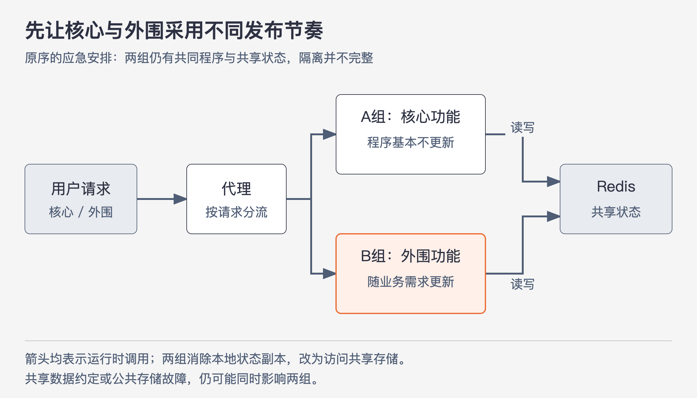

# 《架构整洁之道》推荐序二｜旧原则怎样帮助处理新系统 · 书镜8.2

余晟从一次维护不稳定在线系统的经历开始，说明书里的基础原则为什么还能帮助判断系统问题。

## 一、原书回顾：先隔开变化，再争取改造时间

### 久远的教诲，古老的智慧

余晟接手的系统存在命名、依赖、层次、部署和监控等多方面问题。但观察故障后，他发现最紧急的矛盾很具体：核心功能只要不改就相对稳定，外围需求却经常上线；由于依赖混乱、测试不足，每次外围修改都容易影响核心，团队不断重复调试、改正和重新上线。

图序2-1｜两组按请求承担不同工作。箭头表示调用，数据约定仍是共同依赖。依据推荐序二所述方案重绘。

补测试、重构模块和暂停需求都可能有效，但当时缺少的是等待这些措施生效的时间。他采用了一个应急办法：把需要共享的状态放到Redis，消除实例本地的状态副本；同一程序部署成A、B两组；前面的代理把核心请求交给基本不更新的A组，把外围请求交给随需求更新的B组。这样，即便两组仍然包含重复的程序代码，也能让它们承担不同的请求和发布节奏。

原序报告，这一安排当天生效，服务稳定下来，团队得到继续改造的时间。余晟把自己的思路解释为：识别不同关注点、隔离责任，让稳定核心少受外围变化影响；对应到书中的名称，是关注点分离、单一职责原则和开闭原则。

原序把这次方案称为“蓝绿部署”。本篇保留作者这样命名的事实，但以他描述的具体机制为准：**按核心与外围请求分流，两组采用不同更新节奏**。仅凭这个名称，不能补出原文没有描述的版本切换、流量切换或回滚流程。原序也没有证明共享Redis、数据格式或公共基础设施出故障时，核心仍一定安全。

由这个经历，余晟提出疑问：架构书为什么还从结构化编程、面向对象和函数式编程讲起？他的回答是，代码与分布式系统都需要控制构建和维护成本，许多组织问题在不同尺度上重复出现。

结构化编程限制随意跳转，让程序能够从整体向下分解。余晟将它对应到系统设计：如果模块没有清楚层次，接口之间随意互调，维护者同样难以追踪过程。他借此提醒读者留意结构上的混乱，并没有证明服务调用与语言中的goto在技术上完全相同。

面向对象中的多态则允许调用者面向一个行为约定，由不同实现完成工作。如果接口直接暴露某个具体场景的实现，新增终端或呈现形式时，整个内容生产流程都可能被迫修改。余晟关注的是：原有处理逻辑能否通过稳定约定接入新实现，而不是系统里有没有写出`interface`这个关键字。

函数式编程引出对可变状态的限制。原序讨论只追加操作记录、通过重放得到各时刻状态的办法，并报告作者曾在生命周期有限的项目中使用。这里保留两个条件：案例需要保存足够的操作记录；作者所述成功经验来自有限的具体场景。不能由此推出只要追加日志，就自动解决并发、顺序、原子性和恢复的全部问题。

最后，余晟承认架构需要综合考虑编码、质量、部署、发布、运维、排障和升级。这本书偏爱链接器、C语言、UML等例子，但读者可以从中学习怎样识别依赖、划分职责和设计通用交互，再用于新的技术环境。迁移的是判断方法，具体系统仍需重新分析。

## 二、主题讲解：借用一个办法之前，先找出它为什么有效

设想你遇到类似情况：结算服务平时稳定，每次修改活动展示页却都有结算故障。此时很容易直接照着原序搭两组实例。更有用的第一步，是验证故障是否确实由同一发布牵连引起。

如果结算和展示在同一进程，更新展示会重启整个进程，把两类请求分开部署，确实可能减少这个影响。但如果故障来自共享数据库字段被改坏，两组进程仍然读取同一份错误数据。把进程分开以后，数据上的联系还在。原序案例里有效的做法，不能替代你自己系统的故障分析。

继续看共享状态。A、B都要看到用户的同一份状态，把各自内存里的副本改为读写公共存储，是为了解决多实例之间的状态一致问题。但它也让公共存储成为两边共同使用的部分。因此，需要进一步检查哪些字段由谁写、旧版本能否理解新数据、写入顺序是否会改变业务结果。这些是从案例推出来的检查问题，不是原序已经验证过的保障。

现在再看三个原则的作用：关注点分离帮助你识别“稳定结算”和“频繁变化的展示”；单一职责提醒你别让同一发布单元同时承担不同变化节奏；开闭原则让你追问，展示需求能否通过已有约定扩展，而不必反复修改结算规则。原则帮助找问题和比较方案，不会自动生成可部署的实现。

这个阅读方法也适用于多态和不可变状态。新增短信供应商时，先问“原流程是否只需要一个发送结果”；接入新实现时，先检查不同供应商的失败语义是否真的兼容。采用追加日志时，先问“记录是否足以恢复状态”，再检查重复、乱序以及重放时如何处理外部动作。一个原则说清的是某种关系，真实方案还要处理具体条件。

**试着判断：**A组不升级，B组把共享状态字段`paid`从布尔值改成字符串，两组是否已经隔离？没有。发布分开了，数据约定仍然直接联系两组。应先处理读写兼容与迁移顺序，不能仅凭“核心实例没更新”判断核心不受影响。

读这一序最值得保留的习惯，是把技术名称还原为具体动作，再检查动作隔开了哪一种变化。后面的编程范式、SOLID和组件原则，会逐步给出更细的判断方法。

来源：《架构整洁之道》推荐序二，余晟，PDF第8—11页。系统改造结果属于原序的作者报告；结算与展示的情形为假设案例。

<!-- source_sha256: 64400d05a5e1fe23dedbc41526c9227f74b3647fce36eda738a11c325074f2c3 -->
