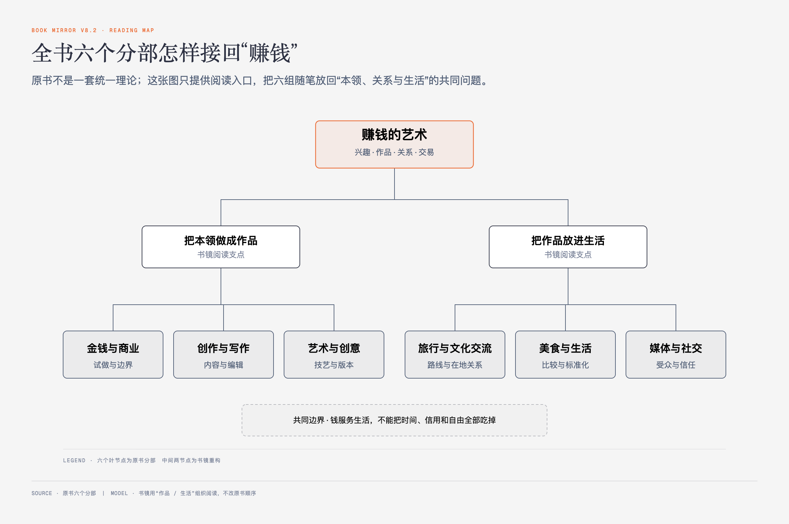
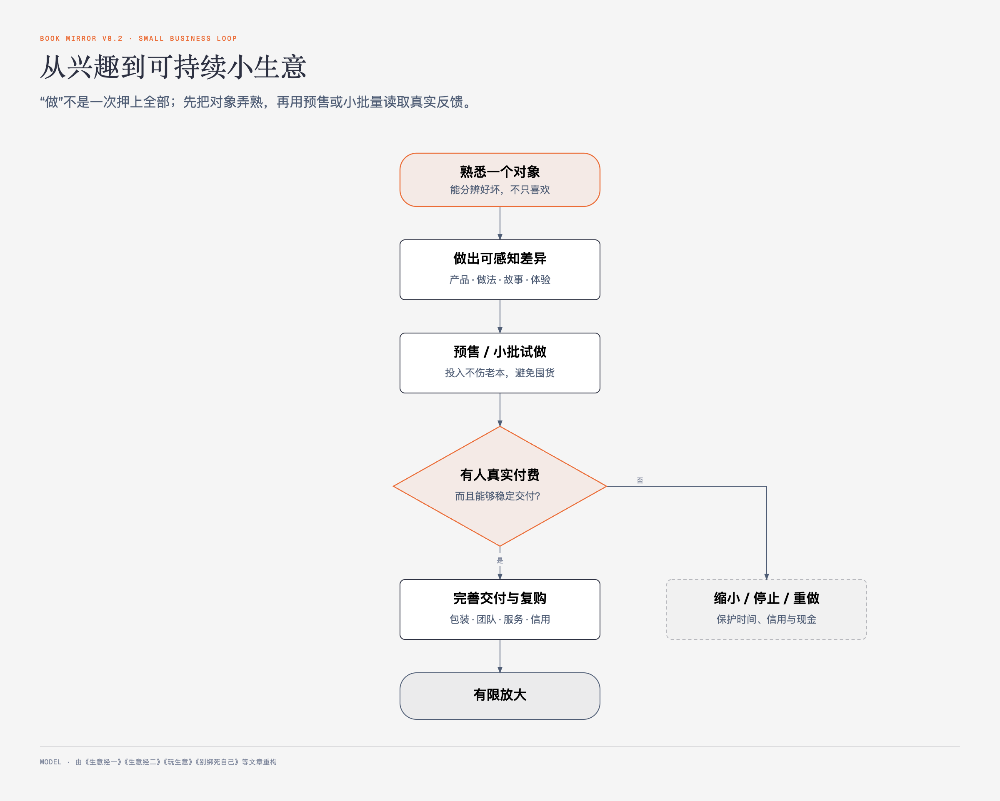

# 《赚钱的艺术》第一部｜金钱与商业 · 原书回顾与主题讲解

本章要回答：蔡澜谈赚钱时，反复守住的几条线是什么？他怎样把兴趣变成小生意，又怎样防止生意反过来绑住生活？

这不是一本按理论递进写成的商业教科书，而是一组跨年代的问答与随笔。下面先按原书18篇文章的顺序回顾，再把反复出现的判断连起来。

图1-1｜全书六个分部怎样接回“赚钱”。六个分部与顺序来自原书；连接句是书镜阅读地图。

## 一、原书回顾：18篇文章怎样展开

### 金钱重要吗？

开篇用问答把金钱放回香港社会与个人生活。蔡澜承认金钱重要，也讽刺社会会因财富改变道德评价；他谈楼市负资产、失业和养老时，强调愿赌服输、社会应变与福利制度。落到自己，他把“有钱”定义为够用，主张钱应当像奴隶一样被使用，不能反过来支配人。

文章最后把“充实生活”与赚钱连接起来：先学书法、认识树木、积累一门本领；技能今天未必变现，处境变化时却可能成为工具。它同时包含尖刻的性别和贫困评价，也有特定年代的楼市、福利与物价判断，不能离开语境当作普遍事实。

### 赚钱

作者从女性化妆品、儿童糖果和男性壮阳产品谈“欲望好卖”，举日本企业用稀缺品类、香味、功效和包装提高价格的例子。他还回忆一双有草药功效却又丑又臭的布鞋：有用不等于有人买，产品必须让功效、外观和使用感一起过关。

文中的“赚女人和小孩子的钱最容易”是作者的性别化概括；更可迁移的观察是，用户愿意为明确欲望、差异化体验和可信证明付费。

### 生意经一

蔡澜从“生意不够清高”的旧看法转向“生意也是创作”。他重新解释“不熟不做”：不是永远守着老本行，而是先对要卖的东西理解到足够深。玉石、古表、钢笔、金鱼、辣椒酱和水饺等例子，都用兴趣与长期辨识力连接商品。

接着，他把注册商标、设计、摄影分色、制罐、说明书、宣传和销售渠道逐项列出，说明生意会迫使人不断学习。餐饮还要处理大厨、服务员和质量控制。作者建议先小本、亲力亲为，把可能亏损控制在可承受范围，再从地摊或流动商店开始。

### 生意经二

作者准备开网店，先去淘宝总部学习，提炼出三个条件：商品要有个性、背后有故事、要在多个渠道宣传。他又从别人库存积压、借款失败的教训出发，选择预售，等订单出现再生产，以降低囤货风险。

“蔡澜花花世界”用作者已有的微博读者做渠道，刘绚强及团队提供印刷、运营和客户服务，顺丰承担配送；产品则从茶、酱料延伸到粽子、月饼、年糕等“童年记忆”系列。年糕一节把原料、传统做法、真空包装、运输和保存都写得很细，显示“故事”仍要由真实产品过程承托。书中食品保存说法属于作者当时经验，使用时应以现行食品安全要求为准。

### 玩生意

问答把作家卖稿、艺术家卖作品也纳入生意。蔡澜回忆自己因茶的独特配方进入商业，强调“自己的产品”要在味道或做法上不同。他赞成学习成功商人的奋斗，也认为财富最终应回到文化与公益。

他又承认自己只投经济允许的数目，不愿在晚年承担大风险；做生意更多是验证想法和享受过程，所以称为“玩生意”。这里的“玩”不是随意，而是给投入设上限。

### 开心生意

旅行团最初会亏，后来与日本旅馆谈到折扣；汇率变化带来额外收益时，作者和旅行社把差额做成红包退给团友。他认为正常利润可以赚，但顾客觉得物有所值、团队也开心，才是这门生意的完成标准。

### 满足

在仙台旅馆的早市，员工亲属卖当地土产。作者估算周末营业额后，小贩只说“大家分，也没多少，不过我们乡下人已经很满足”。文章用这一句对照城市人不断放大的欲望，把“够用”再次放回商业判断。

### 玩出版

疫情期间，蔡澜决定用英文把自己的故事写给不会中文的干女儿和朋友。他英文有限，先自己写以保留口气，再请插图师苏美璐转交英文作家贾尼丝润饰；遇到西方读者难以理解的段落，他宁可删除。

他先把内容做好，再比较KDP、传统出版社、法兰克福书展和小批量自印。最后选择等内容够丰富后先印一两百本送朋友，把“完成心愿”放在规模和名利之前。这篇把创作、编辑、受众、渠道与最小批次连成一个实际项目。

### 商业概念

作者带旅行团到北海道渔业联盟直销店，看见新鲜海产、可靠包装、邮寄服务、免费昆布饮料和当地便宜部位被做成好产品。他认为，把这种“货源可靠、处理方便、价格实在”的直销体验搬到香港，就是可做的商业概念。

### 长不大的商人

作者用波希米亚人、垮掉的一代、嬉皮士与雅皮士串起一段个人化商业史，赞赏不循规蹈矩、旅行学习、阅读历史和保持童真的商人；也批评只学外形、不能吃苦的人。他建议从小众但真实的需求切入，例如宠物餐厅或高胆固醇食物店，先服务一个足够小的群体。

这篇混有对女性、青年、阶层和代际的刻板评价，也把复杂历史压成作者随笔式判断。可保留的是“独立判断—小众需求—实际执行—有限规模”，不应把贬损性标签当作商业分析。

### 开间什么餐厅？

蔡澜设想一家国际餐厅，从云吞面、三明治、意大利面、海南鸡饭、叻沙、越南河粉、日式咖喱到散寿司逐项讲正宗做法。他要求原产地的人也觉得好：关键食材不能随便替换，做法要有质量标准。

经营上，他主张把一部分利润还给食材，装修保持干净明亮，制作步骤用照片贴在厨房，进货数量准确，不合格不能上桌。他把标准压成“平、靓、正”：物有所值、东西实在、吃后满足；即便计算充分，仍承认开店有风险。

### 赚电影钱

一个年轻人只喜欢看电影，蔡澜便把兴趣转成收藏电影海报的路线：从低成本宣传品开始，学习真伪、年代、版本、品相和修复，参考拍卖成交价，再通过专业市场交易。他列出《卡萨布兰卡》《金刚》《教父》《007》等海报的历史价格与等级。

这些价格属于文章写作时的市场信息，不能当作当前报价或收益保证。文章真正要说明的是：兴趣要变成收入，必须增加辨识、估值、保存和渠道知识，而且早期上当也可能成为学习成本。

### “任性”这两个字

作者回忆自己从小不服管、逃课、恶作剧，又把这种性格连接到书法练习、创作和餐厅产品。他把“任性”解释为不合群、跳出框框、愿意在喜欢的事上大量练习；越南河粉店铺满和牛，追求顾客“哇”的一声，就是商业中的个性化选择。

这篇也暴露了任性的代价：对老师和体型的贬损、恶作剧及过度饮酒都被轻描淡写。独立判断要与责任、事实和他人边界一起存在，不能把伤害包装成创意。

### 当小贩去吧！

作者把麦当劳工作视为进入社会、学习规矩和餐饮基本功的入口，再鼓励有经验、精力和小额本钱的人从小店或夫妻店开始。选品要从熟悉和真正喜欢的食物出发，守住“平、靓、正”，在正宗细节上胜过跟风。

扩店要等基础、经验和资本足够；店越多，照顾不到时风险越大。文章的租金判断和具体市场机会属于当时香港语境，不是当前开店结论。

### 别绑死自己

蔡澜不愿提前数月约定，因为承诺后就必须守时守诺；他更想把时间留给真正想见的人、学习、草书、旅行和已经全心投入的项目。他用意大利司机“明天的事明天烦”、海边老人“我钓的是早餐”和父亲关于孝顺、守时、友情的话，说明放松不是失信，而是少接承诺。

文章也承认这会给需要提前安排的人带来不便。它适合表达个人时间边界，不是所有合作都能临时决定。

### 可不可以和你拍一张照片？

作者把合照当作互相尊重：态度诚恳就尽量答应，无礼、勾肩搭背、自拍靠得过近则拒绝。他还逐步改进流程：签书时边签边拍，全体照先排好再入座；餐厅合照要等吃完，避免照片被误当作背书，真正好吃时才主动与团队合影。

这篇把时间、身体边界、名人责任和商业背书放在同一场景。作者对外貌、年龄和礼仪有不少尖刻判断，不必沿用；可用原则是请求清楚、尊重拒绝，并防止自己的形象被错误商业化。

### 赚到的钱是曾曾曾祖父

北海道旅行团让作者持续认识不同职业的人，也形成丝巾等合作机会。他欣赏当地商家记住老客、送行、主动优惠的做法；即使一部分是职业礼仪，反复做好后也会形成可靠体验。

作者一面把客人称作“米饭班主”和“曾曾曾祖父”，一面也会把抱怨过多的团友列入黑名单。客户重要不等于没有边界，长期关系建立在双方都愿意继续。

### 身价

蔡澜列出广告、题字、合照和餐厅资料的“润例”构想，强调姓名、肖像和长期使用期限都应定价。他拒绝楼盘和戒烟膏广告，因为不愿为交付风险或自己做不到的主张背书；又设想把长期免费的餐厅推荐整理成可购买的数据服务。

文章最后用被柬埔寨官兵索要两千港元赎金自嘲“只值两千”。价格可以为服务、时间和授权设边界，却不能等同人的价值。

## 二、主题讲解：蔡澜式小生意是一轮有上限的试做

把这一部放在一起，作者反复做的不是追逐“规模最大”，而是先把一件喜欢的东西弄懂，再做一个小而有个性的版本。有人愿意付钱后，才继续处理包装、交付、团队和复购；若投入会伤到老本或绑住生活，他宁可缩小或不做。

图1-2｜从兴趣到可持续小生意。流程由本部多个案例重构；“停止/缩小”是作者反复出现的风险边界。

这条路径有五个检查点：

1. **熟**：是否真的懂对象，能分辨好坏，而不只是“喜欢”。
2. **异**：产品、做法、故事或体验是否有可感知的差异。
3. **小**：能否预售、小批量或用经济许可的投入试做。
4. **真**：宣传是否由产品过程、质量和本人愿意承担的背书支持。
5. **松**：赚钱之后，是否仍保住时间、人格、信用和生活的满足感。

作者的优势来自长期名气、人脉、旅行和媒体渠道，普通读者不能忽略这些起点差异。可迁移的是试做方法，不是照抄产品或收益。

## 检验理解

**情形**：你喜欢咖啡，准备借钱开一家大店；还没做过产品测试，只觉得“精品咖啡有故事就会有人买”。

**问题**：按这一部反复出现的做法，开店前至少要补哪三步？

### 核对思路（先作答再看）

先把“熟”做实：能说明豆、烘焙、出品和目标顾客；再用小摊、预售或短期合作测试真实付费；最后算清库存、租金、交付和最坏损失，把投入限制在能承受的范围。故事只能放大真实差异，不能替代产品。

## 来源、范围与阅读连接

- 原书定位：PDF 7—64页，“金钱与商业”分部，完整覆盖18篇文章。
- 源文件 SHA-256：`3da69c326afcf7724a4bd413577f3c9f2175ad7109fa6d1e21cf979634247613`。
- 原书是跨年代随笔合集，人物评价、社会判断、价格、平台数据和市场机会均保留作者语境；未做当前行情验证。
- 本卡没有把作者经验改写成普遍商业规律；性别、阶层、心理状态和年龄的贬损性概括未被采纳为主题讲解原则。
- 下一部转向创作与写作，继续追问：内容怎样形成产品，日更、编辑和渠道之间怎样配合。
