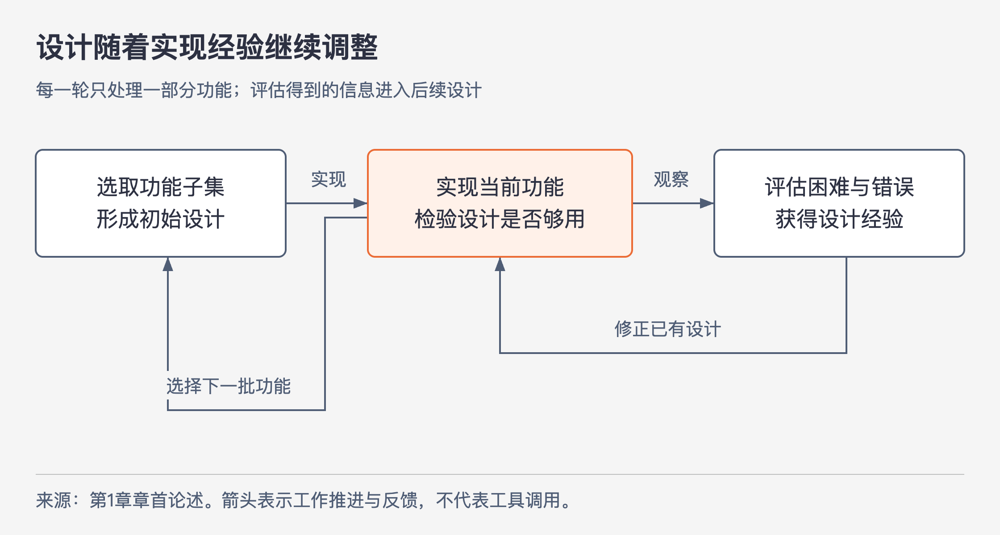

# 《软件设计的哲学》第1章｜导言 · 书镜8.2

软件能够不断增加功能，也因此容易长到没有人能放心修改的程度。本章把全书的问题定为：怎样在持续开发中控制复杂性，让下一次改动仍然容易理解、容易完成？章标题另有副题“一切皆因复杂性”。

## 一、原书回顾：为什么设计要贯穿软件的一生

### 章首论述：一切皆因复杂性（原书未编号）

作者先从编程的创造性谈起。与桥梁、船舶等物理对象相比，程序能表达更自由的规则，也不要求编写者具备某种身体技能。这段开场要引出的约束是人的理解能力：程序的组成部分越多，彼此需要配合的细节越多，修改时就越难把所有相关因素同时记住。遗漏会造成错误，修错又占用开发时间。随着程序演进、功能增加和参与者增多，管理复杂性会越来越困难。

工具可以帮助查找、编写和检查代码，但作者认为工具的作用有限。还必须让软件本身更简单，才能在人的理解能力有限的条件下，继续构建更大、更强的系统。他给出两条路径。第一条是直接减少复杂性，例如消除不必要的特例，让同一标识符的用法保持一致。第二条是把复杂性封装在模块内，让处理其他部分的人不必了解这些细节。这就是模块化设计：可以按类、子系统等单位划分软件，使开发者处理一个模块时，只需掌握与当前任务有关的有限信息。

随后作者把问题从“设计成什么样”推进到“什么时候设计”。早期开发常把设计集中在项目开始阶段。瀑布模型把工作分成需求定义、设计、编码、测试和维护，前一阶段结束才进入下一阶段；不同阶段还可能由不同人员负责。整个系统的设计在设计阶段完成并冻结，后续工作主要负责实现它。

这个安排依赖一个很强的前提：构建之前已经能看清设计的后果。作者认为，大型软件很难满足这个前提，许多隐藏的问题必须到实现时才会显现。此时若原设计人员已经转到别处，或流程不允许大幅调整设计，开发者就只能在原有结构上修补。局部补丁不断增多，会使后续修改更困难。

图1-1｜依据章首论述绘制的增量设计循环。箭头表示工作推进和经验反馈；图中没有规定每轮的时间长度。

增量式开发先选取整体功能的一小部分，完成设计、实现和评估；在加入下一批功能前，利用这次实现暴露的问题改进设计。这样，错误能在系统还小时得到处理，后续设计也有了实际经验。作者用桥梁施工中难以改变塔楼数量作对照：软件的可塑性，使开发过程中继续调整结构成为可能。

这条推理带来两个要求。设计必须持续到软件生命周期结束；已经做出的设计也应允许重做。最初方案通常不是最佳方案，开发者应寻找改进机会，并安排一部分时间落实改进。持续开发中要一直思考设计，而本书以降低复杂性为设计的核心尺度，因此复杂性也应成为每次改动都要考虑的问题。

作者据此确定全书的两个目标：先说明复杂性是什么、怎样识别，再介绍降低复杂性的设计技术。后者无法写成保证正确的秘方。“类应该深”“定义错误不存在”等原则，是比较备选设计、继续探索的依据；它们不会自动给出唯一答案。

### 1.1 如何使用本书

这本书的原则较抽象，小到适合印在书里的代码，又往往不足以显出大型系统的问题。因此，仅理解书中文字还不足以熟练应用这些原则。作者建议把阅读与代码评审结合：看一段实际代码怎样满足或违反原则，再解释这与理解和修改代码的难度有什么关系。读别人的代码时，我们没有作者头脑中的背景信息，更容易发现设计给读者留下的困难；评审也能带来新的实现方法。

练习的起点是“警示信号”。一个信号表示某处可能存在不必要的复杂性。发现之后，应停下来比较替代设计，寻找能消除问题的方案。第一种替代方案未必够好，多尝试几种也是学习的一部分。随着经验增加，开发者既能减少已有信号，也可能识别出书中没有列出的信号。

作者紧接着限制这些原则的用法：每条规则都有例外，任何理念推到极端都可能得到糟糕设计。书中“过犹不及”各节专门讨论这种情况。设计需要平衡互相竞争的要求，不能把警示信号当成无条件判错的规则。

虽然书中主要使用 Java、C++ 和类的例子，作者说明相关思想还能用于 C 语言的函数，以及子系统、网络服务等其他模块。可迁移的是怎样减少理解和修改的负担，具体做法仍要服从所处理对象的特点。

## 二、主题讲解：把一次改功能变成一次设计学习

### 从一个能运行的提醒功能开始

以下是为本章构造的假设案例。一个后端程序在订单超过约定时间未付款时发送提醒。最初只有短信渠道，代码把“找出待提醒订单、判断能否提醒、拼接短信、发送”写在一起，团队仍能看懂。

后来加入站内通知。开发者复制原流程，调整发送部分。功能可以完成，但同一条“取消订单不提醒”的规则现在要在两处维护。再加入渠道后，修改者必须记住更多位置。问题已经不只在发送代码长短，而在于一个业务判断需要多少地方共同遵守，以及后来的人能否找到这些地方。

这时第 1 章的两种方法各自有了具体对象。可以删掉无意义的渠道差异，让相同状态使用同一套判断，从源头减少需要记住的规则；也可以让订单筛选集中处理，让发送模块只接收已经选好的订单，将筛选细节封装起来。是否真的更简单，要看使用模块的人还需要知道什么。若调用发送模块前，仍须牢记多条隐含的状态约束，换一个类名并没有完成封装。

### 为什么“小步交付”还需要主动评估

团队把短信、站内通知和第三种渠道分三次上线，并不会自然得到好设计。如果每次只确认通知能发出去，重复的规则仍会增加。增量式开发给了我们较早发现问题的机会；要利用这个机会，还要在继续扩展前检查这轮开发暴露了什么。

例如加入第二个渠道时，可以比较两个具体方案：继续复制筛选逻辑，或者把共同筛选留在一处、让各渠道只处理自己的发送差异。比较时跟着一次真实变更走：“如果取消状态增加一种情况，要改哪些代码？需要阅读哪些模块？会不会忘记一个渠道？”这些问题能把“设计好不好”转成可讨论的差别。

这也解释了为什么持续设计允许修改原方案。第一次只有短信时，把几步写在一起未必难以理解；第二次扩展让重复开始承担维护成本，就有理由调整边界。判断依据来自当前代码和已经出现的变化，无需预先实现所有可能的渠道。

### 让评审揭示作者没有看见的困难

把这次改动交给一位没有参与实现的同事，请他指出“新增一种不应提醒的订单状态，应当修改哪里”。如果他必须来回搜索，或者需要作者口头补充“还有一个渠道用了旧判断”，这些反应就提供了设计问题的证据。

可以先把共同判断集中，再让同事回答同一个问题。若现在能定位到一处，理解它对所有渠道的影响，且无需知道各渠道如何拼消息，这项改进就有明确作用。仍应检查具体业务差别：某个渠道若有独立的提醒条件，就要明确表达差异，不能为了统一而悄悄改变行为。

本章没有提供一个通用的类划分算法。它先建立一种工作习惯：用实现和评审获得信息，比较设计，再在后续改动中检验。第 2 章将进一步说明，这些困难可以怎样命名和区分。

## 检验理解：同样按周交付，差别在哪里

两个团队都按周增加功能。甲团队每周只检查新增功能是否通过测试；乙团队还会请未参与实现的人解释改动范围，并处理本轮暴露的重复规则。为什么不能仅凭两队都“迭代开发”，就判断它们同样遵循本章主张？乙团队是否因此应重写整套系统？

核对思路：本章强调的是实现经验能否反过来修正设计。周期相同，只能说明交付频率相同。乙团队的评审更可能发现作者脑中的隐含知识，但改进仍需围绕已识别的问题，并比较成本和效果；持续重新设计没有推出每轮都大规模重写。

## 来源、范围与阅读连接

依据 John Ousterhout《软件设计的哲学》第 1 章，PDF 物理页 26—31；主要正文位于 26—30 页。原书只有“1.1 如何使用本书”一个编号小节，“章首论述”为方便定位添加的说明。已核对 PDF 第 26、29 页的章题、副题和小节标题。

提醒服务为本文假设案例，图1-1为依据本章论述绘制的关系图，均非原书项目实例。没有使用外部事实补充。下一章接着回答：修改时感到的困难，怎样区分为复杂性的不同表现与原因？

<!-- source_sha256: c751f0fc575096584dcdb5a365ae558a71b32a6aa241d90d7bc248f21fbdbbf7 -->
