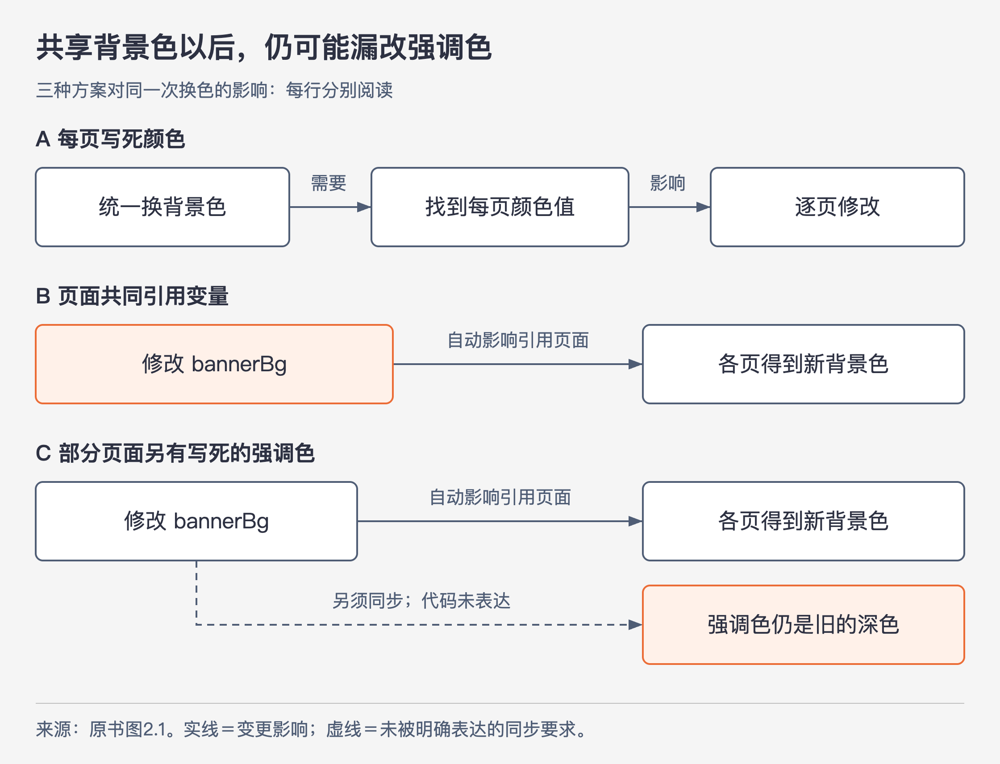
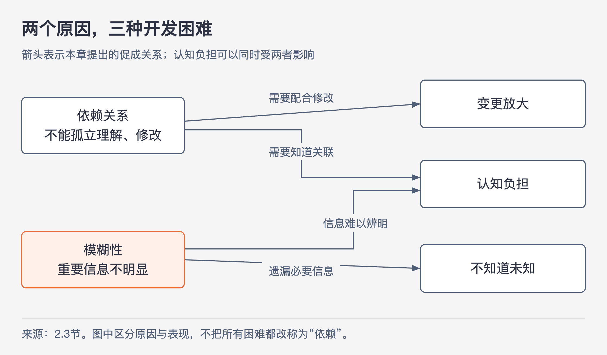

# 《软件设计的哲学》第2章｜复杂性的本质 · 书镜8.2

第 1 章提出持续降低复杂性。本章给出判断的起点：开发者完成一次改动时，究竟被什么难住？作者先定义复杂性，再区分它的三种表现和两个原因，最后解释为什么许多看起来无伤大雅的小问题会让系统越来越难改。

## 一、原书回顾：从修改的困难追到结构中的原因

章首强调，能识别复杂性本身就是设计能力。创造简单方案很难，但比较两个方案哪个更难理解、哪个需要更多配合，通常更容易。发现复杂后换一种设计继续比较，能逐渐形成判断经验。以下定义也是后续各章推理的共同前提。

### 2.1 复杂性的定义

作者把复杂性定义为：与软件系统结构有关、使人难以理解和修改系统的所有因素。它包括看不懂代码怎样运行、一个小改动要投入大量精力、找不全应改位置，以及修复一处错误又引入另一处错误。这个定义把注意力放在开发任务的困难和成本上。

复杂性要结合具体目标和时间来看。功能很多、规模很大，并不逻辑必然地等于复杂；只要开发者容易理解和修改，按本书的定义，它仍可算简单。反过来，一个很小的系统也可能充满隐藏约定，使一次小改动很费劲。大型成熟系统在实践中经常难以修改，是作者的观察，不能因此把代码规模当成定义。

哪些部分经常被接触，也会影响整体复杂性。作者给出一个粗略表达：

**C = Σₚ(cₚ × tₚ)**

其中，cₚ 表示系统部分 p 的复杂度，tₚ 表示开发者花在该部分的时间比例，C 表示系统总体复杂度。它提醒读者：很复杂但几乎不需要接触的内部实现，对日常开发的影响可能较小；把复杂性隔离到使用者看不见的地方，可能接近于消除它的效果。本章没有提供可直接测量 cₚ 的单位或评分程序，这是一种帮助思考的加权关系。

复杂性还应从读代码者的体验判断。作者已经熟悉背景，自然会觉得自己的代码简单；其他开发者看不懂，说明这些信息并没有被代码有效表达。作者建议认真询问他们卡在哪里，从双方认知的差别中找设计问题。软件还必须让别人容易使用。

### 2.2 复杂性的表现

图2-1｜根据原书图2.1的三个方案重新绘制。实线箭头表示变更影响；虚线表示代码没有明确表达、但维护者必须知道的同步要求。保留“强调色是背景色的深色阴影”这一前提。

第一种表现是**变更放大**：一个看似简单的修改，需要在许多地方改代码。原书的网站案例中，每页都各自写着横幅背景色。要统一换颜色，便要修改每一页；页面达到数千个时，工作量很难接受。把背景色放在共享的 `bannerBg` 中，各页引用它后，改变这一值即可改变各页横幅。这个方案减少了一个设计决策散落的范围。

第二种表现是**认知负担**：为正确完成任务，开发者需要掌握多少信息。原书用 C 函数的内存管理说明它。某函数分配内存、返回指针，并约定由调用者释放。调用者即使能很快写出调用，也必须知道并记住释放义务，否则会泄露内存。若能调整结构，让分配内存的模块同时负责释放，调用者需要记住的内容就少了。这里还包括方法众多的 API、全局变量、不一致的用法和模块间依赖带来的学习负担。

因此，代码短不能直接证明简单。某个框架只需几行代码就能完成工作，但理解这几行的含义可能很难；另一种写法行数更多，却把含义清楚地摆出来，使用成本反而更低。认知负担补上了单纯统计代码行数看不到的成本。

第三种表现是**不知道未知**：开发者连必须掌握哪些信息、修改哪些代码都不清楚。在配色案例的第三个版本中，背景色虽然集中管理，少数页面却把强调色直接写成某个深色。强调色必须随背景色变化，但修改 `bannerBg` 的人未必知道这种要求；即使听说了，也不知道哪些页面用了它。于是，改动表面上已经完成，错误却可能直到上线后才暴露。

作者认为这是最棘手的表现。变更位置很多，只要位置已知，仍有机会逐项完成；需要学很多，只要知道要学什么，也可以投入时间。而不知道未知让人无法判断信息是否已经找全，甚至不知道自己有遗漏。逐行通读系统通常不可行，也未必找得到从未被记录的设计决定。

因此，良好设计应让系统的工作方式和更改条件显而易见：读者能迅速形成判断，并有理由相信判断可靠。这是后面“使代码显而易见”一章要继续解决的问题。

### 2.3 复杂性的原因

图2-2｜依据 2.3 节绘制的原因与表现关系。箭头表示本章明确提出的促成关系；没有画出的关系不表示现实中绝不可能发生。

**依赖关系**指一段代码不能被孤立理解和修改：改它时必须考虑其他相关代码，必要时一同修改。各页颜色需要一致，意味着各页的颜色决策相互牵连；网络协议的发送方和接收方必须对格式达成一致；一个方法增加参数，调用它的位置也必须相应调整。这些例子共同说明，依赖来自需要配合的决定，不要求代码之间一定有直接调用。

依赖关系无法全部消除。每创建一个类、让别人使用它的 API，就建立了新的依赖。设计要减少不必要的依赖，并使留下的依赖简单、明显。网站把颜色集中后，各页面之间“必须手动保持相同”的联系减少了，同时各页开始依赖 `bannerBg`。后者容易从引用中看见，也能通过搜索找到使用处；在由编译器检查引用的情形下，改名还能暴露旧引用。改进在于依赖更容易管理。

**模糊性**指重要信息没有清楚呈现。变量叫 `time` 却不说明是什么时间、采用什么单位，使用者就要追踪代码才能确认。新增错误状态时，还必须给另一处字符串表补一个条目；如果状态声明附近没有线索，表的存在就是隐藏信息。同名变量用于不同目的，也会让读者错误地套用旧理解。

模糊性常和依赖关系一起出现，但二者不是同一件事。“强调色需要跟着背景色变化”是依赖关系；“修改背景色的人看不出还要改强调色”是模糊性。依赖关系会导致变更放大和认知负担，模糊性会导致不知道未知，也会增加认知负担。

文档不足可以造成模糊性，但不能把所有困难都交给更多文档。作者认为，简洁的设计本身需要解释的东西较少；如果必须写很多文档才能让人勉强使用，应检查是否存在不必要的设计负担。文档仍有作用，第 13 章会展开；本章强调，简化设计是减少模糊性的优先途径。

### 2.4 复杂性是增量的

复杂性通常来自大量小问题的积累。单个依赖或一处不清楚的说明，似乎不足以影响整个系统；数百、数千个这样的问题叠加后，每次改动都可能碰到其中几个，日常工作便持续受阻。

这也解释了控制复杂性为什么困难。开发者容易接受“这一次只增加一点”；但每个人、每次都这样做，增长就会持续。一旦积累很多，修掉一两处又看不出整体改善，于是更难下决心。作者因此提出对不必要复杂性采取“零容忍”的态度，第 3 章将用持续设计投入说明如何落实。这里的对象是不必要的复杂性，并没有取消软件协作所必需的依赖关系。

### 2.5 结论

依赖关系和模糊性不断累积，使一次特性开发需要修改更多代码、学习更多信息，并冒着信息未找全的风险。复杂性的代价最终落在修改现有系统的困难和不确定性上。后续设计方法是否有效，都应回到这些具体代价来判断。

## 二、主题讲解：用一次“新增订单状态”把三种困难分开

### 先还原修改者真正要做的事

以下为假设案例。一个订单系统新增“人工复核中”状态。你看到枚举后加上新值，以为工作结束。但系统还有显示文案、统计分类和允许付款的判断。如果规则要求这些地方也认识新状态，那么增加枚举只是任务的一部分。

假如团队清楚列出了四个修改位置，你能知道任务范围，但仍要逐处更新，这体现变更放大。假如四处逻辑都在同一文件中，你仍须理解各状态的业务区别、统计口径和允许操作，认知负担可能很高。假如有一个离线报表偷偷把“非终态”全部算成待付款，而你完全不知道报表存在，那就出现不知道未知。三个名称描述不同困难，可能同时发生。

不要急着给系统统一打一个“复杂”分数。先写下这次修改遇到的具体障碍，才知道应当减少修改位置、减少先学知识，还是补出隐藏联系。解决对象不同，设计动作也不同。

### 再判断困难来自什么

文案和枚举必须保持对应，这就是依赖关系；若这种联系已清楚表达，依赖仍然存在。文案表藏在难以发现的位置，则另有模糊性。把表写进文档可能使联系更明显，但仍要求每次同时维护两处，变更放大并没有自动消失。

一种可能的调整是，让“状态到显示文案”的对应关系集中在明确的位置，并让缺失对应关系容易被发现。另一些调整可能让统计代码直接询问某状态属于什么分类，从而减少重复判断。但这都是需要结合实际业务评估的方案：界面文案与统计分类可能分别变化，强行合到一个庞大枚举中，也可能增加每个使用者必须理解的内容。

判断时，可以沿同一次状态变更重新走一遍。现在还要改多少地方？每个地方需要理解什么？新增调用者能否找到必须遵守的规则？只把代码移动到一个文件中，无法回答这些问题。

### 最后检查复杂性是否只是被转移

假设一个专门的状态解释模块内部保留较复杂的分类规则，但付款、展示和统计各自只使用清楚的查询操作，日常开发者不必反复读内部判断，那么封装可能降低总体复杂性。这对应本章加权公式：复杂实现仍在，但多数任务接触它的时间减少了。

如果每次业务变化都必须钻进这个模块，或者一个调用者不得不理解所有其他调用者的规则，这种隔离就没有预想中有效。复杂性不是看不见便算解决；重要的是模块之外的实际任务，能否在不掌握内部细节的情况下正确完成。

让另一位开发者试着处理一个新增状态，比作者自己说“很简单”更有价值。他遗漏的条件、问的问题和搜索的位置，都能帮助判断当前设计究竟减少了什么困难。

## 检验理解：补文档后，三个问题都消失了吗

一个文件导入接口要求调用者先设置编码、再注册日期格式、最后导入。原来文档没有提到第二步；团队补全说明后，调用者不再漏掉它，但仍需理解多种格式组合，且每个导入入口都重复配置。请指出哪些问题得到改善、哪些还在。

核对思路：对已读到完整说明的调用者，隐藏步骤引起的模糊性得到缓解，不知道未知的风险相应降低。学习格式组合的认知负担还在，重复入口在共同配置变化时仍可能产生变更放大。若模块能提供合适的常见行为，或把共同配置集中管理，还可能继续减少这些成本，但必须保留确实不同的格式需求。

## 来源、范围与阅读连接

依据 John Ousterhout《软件设计的哲学》第 2 章，PDF 物理页 32—41，主要正文 32—40 页。小节定位：2.1 第 32 页，2.2 第 34 页，2.3 第 37 页，2.4 第 39 页，2.5 第 40 页。已实际查看第 33 页公式和第 36 页原书图2.1。

第 33 页解析文本给 tₚ 增加了无意义的矩阵排版；正文按页图恢复变量含义。图2-1重绘原书网站关系，图2-2按本章因果论述绘制。订单状态与文件导入均为本文假设案例，无外部事实补充。下一章将讨论：当小问题每次都似乎可以接受时，怎样安排开发投入来避免长期累积？

<!-- source_sha256: c751f0fc575096584dcdb5a365ae558a71b32a6aa241d90d7bc248f21fbdbbf7 -->
